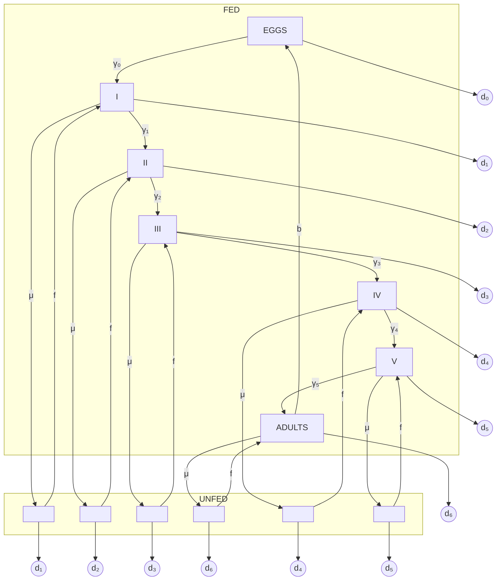
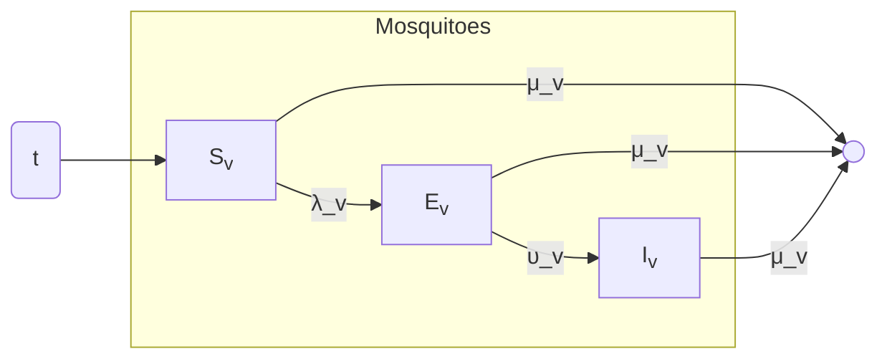
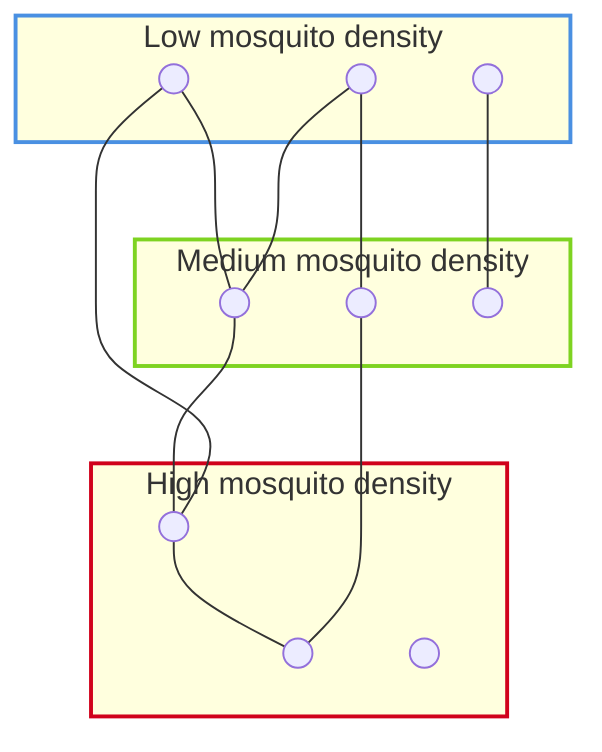
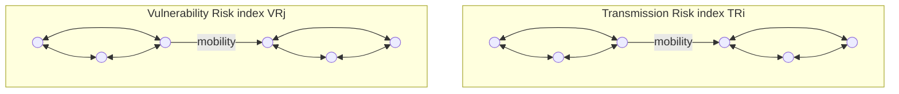
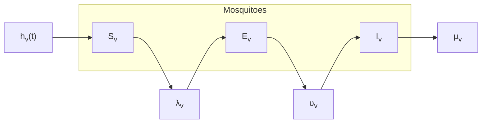

# Scholar 21: A mathematical model of dengue transmission with memory

**<u>Key Point Analysis of Human Behavior in the Model:</u>**

**1. Compartmental Model Variables:**

$M(t)$ is the total full-grown female mosquito population and is subdivided into susceptible female mosquitoes $M_s$ and infected female mosquitoes $M_I$. The total human population is represented by $H$ and split into susceptible humans $H_s$, infected humans $H_I$, and recovered humans $H_R$.

**2. Memory**

<mark>The memory is incorporated in</mark>

<mark>the model by using a fractional differential operator.</mark>

<mark>Recent entomological studies on Aedes aegypti revealed that mosquito did not feed randomly on host blood,</mark>

<mark>but they use their prior experience about a host location and a host defensiveness to select a host to feed on. Furthermore, on human population also, the memory plays a key role in dengue transmission. In epi-</mark>

<mark>demic and endemic area's awareness about dengue will lessen the contact rate between host and mosquitoes</mark>

<mark>The memory is incorporated in the model</mark>

<mark>by using fractional differential operator and order of the fractional derivative as an index of memory</mark>

**3. Assumptions of the model**

# <u>Terms in the Equations Affected by Human Behavior</u>

**ODE model**

$$
\begin{aligned}
\frac{dM_S}{dt} &= \Pi_V - \frac{b\beta_m}{H}M_SH_I - \mu_mM_S, \\
\frac{dM_I}{dt} &= \frac{b\beta_m}{H}M_SH_I - \mu_mM_I, \\
\frac{dH_S}{dt} &= \mu_h(H - H_S) - \frac{b\beta_h}{H}H_SM_I, \\
\frac{dH_I}{dt} &= \frac{b\beta_h}{H}H_SM_I - (\mu_h + \theta_h)H_I.
\end{aligned}
$$

$$ \frac{dM_S}{dt} = \Pi_V - \frac{b\beta_m}{H}M_SH_I - \mu_mM_S $$

$$ \frac{dM_I}{dt} = \frac{b\beta_m}{H}M_SH_I - \mu_mM_I, $$

$$ \frac{dM_S}{dt} = \Pi_V - \frac{b\beta_m}{H}M_SH_I - \mu_mM_S $$

Where:

**Table 1**
Description of the dengue model (2.1) parameters and their possible feasible ranges.

<table>
  <thead>
    <tr>
        <th>Parameter</th>
        <th>Biological meaning</th>
        <th>Range of values</th>
    </tr>
  </thead>
  <tbody>
    <tr>
        <td>$\Pi_V$</td>
        <td>Recruitment rate of adult female vector population</td>
        <td>(12,000–150,000) month−1a</td>
    </tr>
    <tr>
        <td>$b$</td>
        <td>Average bite per mosquito per month</td>
        <td>(9–30) month−1</td>
    </tr>
    <tr>
        <td>$\beta_m$</td>
        <td>Transmission probability from human to vector</td>
        <td>(0.5–1)</td>
    </tr>
    <tr>
        <td>$\mu_m$</td>
        <td>Death rate of vector population</td>
        <td>(0.6–7.5) month−1</td>
    </tr>
    <tr>
        <td>$\mu_h^{-1}$</td>
        <td>Average host life expectancy = host recruitment rate−1</td>
        <td>(50–75) (year)</td>
    </tr>
    <tr>
        <td>$\beta_h$</td>
        <td>Transmission probability from vector to human</td>
        <td>(0.1–1)</td>
    </tr>
    <tr>
        <td>$\theta_h$</td>
        <td>Dengue recovery rate in human population</td>
        <td>(2.14–10) month−1</td>
    </tr>
  </tbody>
</table>

a The range for the vector recruitment rate ($\Pi_V$) was used in most of the modeling studies.

# Scholar 27: A generic model for a single strain mosquito-transmitted disease with memory on the host and the vector

# Scopus 5 Optimal control strategies of a fractional order model for Zika virus infection involving various transmissions

A fractional dynamical system that describes the transmission of Zika virus infection is proposed. This system involves a combination of four control efforts in order to reduce the spread of this disease: reduce the rate of vectors of the disease with susceptible humans, reduce the chance of infection by increasing immunity, and the use of insecticides.

<u>Key Point Analysis of Human Behavior in the Model:</u>

1. **Compartmental Model Variables**

The total population of humans $N_h$ is divided into three compartments: Susceptible ($S_h$), Infected ($I_h$), and recovered ($R_h$).

The vector population is divided into two classes: Susceptible ($S_m$), and infected mosquitoes ($I_m$).

2. **FDEs Model**

$$ {}_0^C D_t^\alpha S_h(t) = \Lambda_h^\alpha - \beta_1^\alpha \delta_1^\alpha (1 - u_1)(1 - u_2) S_h(t) I_m(t) $$
$$ \qquad \qquad \quad - \delta_1^\alpha \rho^\alpha (1 - u_3) S_h(t) I_h(t) - \gamma_h^\alpha S_h(t), $$

$$ {}_0^C D_t^\alpha I_h(t) = \beta_1^\alpha \delta_1^\alpha (1 - u_1)(1 - u_2) S_h(t) I_m(t) $$
$$ \qquad \qquad \quad + \delta_1^\alpha \rho^\alpha (1 - u_3) S_h(t) I_h(t) - (\gamma_h^\alpha + \beta^\alpha) I_h(t), $$

$$ {}_0^C D_t^\alpha R_h(t) = (\beta^\alpha + \delta^\alpha) I_h(t) - \gamma_h^\alpha R_h(t), $$

$$ {}_0^C D_t^\alpha S_m(t) = \Lambda_m^\alpha - \beta_2^\alpha \delta_2^\alpha S_m(t) I_h(t) - (\gamma_m^\alpha + d^\alpha u_4) S_m(t), $$

$$ {}_0^C D_t^\alpha I_m(t) = \beta_2^\alpha \delta_2^\alpha S_m(t) I_h(t) - (\gamma_m^\alpha + d^\alpha u_4) I_m(t), $$

with non-negative initial conditions (ICs) (see [[56]](https://example.com/56))

$S_h(0) = 200, \quad I_h(0) = 10, \quad R_h(0) = 0, \quad S_m(0) = 200,$
$I_m(0) = 20.$

where,

*   $u_1$ represent measures for reducing contacts among humans and mosquitoes by wearing full clothes, stay in places with a screen window to keep the mosquitoes outside and sleep under a bed.

*   $u_2$ represent the measures to increase the autoimmunity of susceptible individuals in order to reduce the transmission rate of infection.

*   $u_3$ represents the efforts for changing sexual habits among a susceptible and infected human by using a condom at the period of Zika virus outbreak.

*   $u_4$ represent the efforts for increasing the death rate of mosquitoes by using the insecticide spraying.

# 3. Assumptions of the model

*   Transmission between human to human is considered

# 4. Terms in the equations that affect by human behavior

**Control strategies:**

*   $u_1$ represent measures for reducing contacts among humans and **mosquitoes** by wearing full clothes, stay in places with a screen window to keep the mosquitoes outside and sleep under a bed.

*   $u_2$ represent the measures to **increase the autoimmunity** of susceptible individuals in order to reduce the transmission rate of infection.

*   $u_3$ represents the efforts for **changing sexual habits** among a susceptible and infected human by using a condom at the period of Zika virus outbreak.

*   $u_4$ represent the efforts for **increasing the death rate of mosquitoes** by using the insecticide spraying.

**Simulations:**

Five strategies were compared in order to illustrate the effects of the controls on Zika virus transmission. In the first four simulations all the strategies were applied, except one. In the last simulation all the control strategies were implemented.

Each strategy was simulated by three different values of $\alpha$ (fractional derivative term): 0.09, 0.99 and 1.

# 5. Parameters

**Table 1**
Meaning and values of the parameters in the FOM (2.1).

<table>
  <thead>
    <tr>
        <th>Parameter</th>
        <th>Description</th>
        <th>Value</th>
        <th>Reference</th>
    </tr>
  </thead>
  <tbody>
    <tr>
        <td>Λhα</td>
        <td>Recruitment rate of humans</td>
        <td>(20)α</td>
        <td>[8]</td>
    </tr>
    <tr>
        <td>Λmα</td>
        <td>Recruitment rate of mosquitoes</td>
        <td>(40)α</td>
        <td>[8]</td>
    </tr>
    <tr>
        <td>γhα</td>
        <td>Natural death rate of humans</td>
        <td>(0.08)α</td>
        <td>[9]</td>
    </tr>
    <tr>
        <td>γmα</td>
        <td>Natural death rate of mosquitoes</td>
        <td>(0.1)α</td>
        <td>[9]</td>
    </tr>
    <tr>
        <td>βα</td>
        <td>Recovery rate of infected humans</td>
        <td>(0.04)α</td>
        <td>[9]</td>
    </tr>
    <tr>
        <td>β1α</td>
        <td>Contact rate between susceptible humans and infected mosquitoes</td>
        <td>(0.02)α</td>
        <td>Assumed</td>
    </tr>
    <tr>
        <td>β2α</td>
        <td>Contact rate between susceptible mosquitoes and infected humans</td>
        <td>(0.03)α</td>
        <td>Assumed</td>
    </tr>
    <tr>
        <td>δα</td>
        <td>Average infectious period for humans</td>
        <td>(0.2)α</td>
        <td>[19,24]</td>
    </tr>
    <tr>
        <td>δ1α</td>
        <td>Transmission of infections from human to human and from mosquito to human</td>
        <td>(0.02)α</td>
        <td>Assumed</td>
    </tr>
    <tr>
        <td>δ2α</td>
        <td>Transmission of infections from humans to mosquitoes</td>
        <td>(0.01)α</td>
        <td>Assumed</td>
    </tr>
    <tr>
        <td>ρα</td>
        <td>Transmission sexual rate</td>
        <td>(0.05)α</td>
        <td>[19]</td>
    </tr>
    <tr>
        <td>dα</td>
        <td>Measure the effectiveness of control u4</td>
        <td>(0.5)α</td>
        <td>Assumed</td>
    </tr>
  </tbody>
</table>

# Scopus 5 Optimal control strategies of a fractional order model for Zika virus infection involving various transmissions

A fractional dynamical system that describes the transmission of Zika virus infection is proposed. This system involves a combination of four control efforts in order to reduce the spread of this disease: reduce the rate of vectors of the disease with susceptible humans, reduce the chance of infection by increasing immunity, and the use of insecticides.

<u>**Key Point Analysis of Human Behavior in the Model:**</u>

1. **Compartmental Model Variables**

   The total population of humans $N_h$ is divided into three compartments: Susceptible ($S_h$), Infected ($I_h$), and recovered ($R_h$).

   The vector population is divided into two classes: Susceptible ($S_m$), and infected mosquitoes ($I_m$).

2. **FDEs Model**

   $$^C_0 D^\alpha_t S_h(t) = \Lambda^\alpha_h - \beta^\alpha_1 \delta^\alpha_1 (1 - u_1)(1 - u_2) S_h(t) I_m(t)$$
   $$\quad \quad \quad \quad \quad - \delta^\alpha_1 \rho^\alpha (1 - u_3) S_h(t) I_h(t) - \gamma^\alpha_h S_h(t),$$

   $$^C_0 D^\alpha_t I_h(t) = \beta^\alpha_1 \delta^\alpha_1 (1 - u_1)(1 - u_2) S_h(t) I_m(t)$$
   $$\quad \quad \quad \quad \quad + \delta^\alpha_1 \rho^\alpha (1 - u_3) S_h(t) I_h(t) - (\gamma^\alpha_h + \beta^\alpha) I_h(t),$$

   $$^C_0 D^\alpha_t R_h(t) = (\beta^\alpha + \delta^\alpha) I_h(t) - \gamma^\alpha_h R_h(t),$$

   $$^C_0 D^\alpha_t S_m(t) = \Lambda^\alpha_m - \beta^\alpha_2 \delta^\alpha_2 S_m(t) I_h(t) - (\gamma^\alpha_m + d^\alpha u_4) S_m(t),$$

   $$^C_0 D^\alpha_t I_m(t) = \beta^\alpha_2 \delta^\alpha_2 S_m(t) I_h(t) - (\gamma^\alpha_m + d^\alpha u_4) I_m(t),$$

   with non-negative initial conditions (ICs) (see [[56]]([56]))

   $S_h(0) = 200, \quad I_h(0) = 10, \quad R_h(0) = 0, \quad S_m(0) = 200,$
   $I_m(0) = 20.$

where,

*   $u_1$ represent measures for reducing contacts among humans and mosquitoes by wearing full clothes, stay in places with a screen window to keep the mosquitoes outside and sleep under a bed.

*   $u_2$ represent the measures to increase the autoimmunity of susceptible individuals in order to reduce the transmission rate of infection.

*   $u_3$ represents the efforts for changing sexual habits among a susceptible and infected human by using a condom at the period of Zika virus outbreak.

*   $u_4$ represent the efforts for increasing the death rate of mosquitoes by using the insecticide spraying.

# 3. Assumptions of the model

*   Transmission between human to human is considered

# 4. Terms in the equations that affect by human behavior

**Control strategies:**

*   $u_1$ represent measures for reducing contacts among humans and **mosquitoes** by wearing full clothes, stay in places with a screen window to keep the mosquitoes outside and sleep under a bed.

*   $u_2$ represent the measures to **increase the autoimmunity** of susceptible individuals in order to reduce the transmission rate of infection.

*   $u_3$ represents the efforts for **changing sexual habits** among a susceptible and infected human by using a condom at the period of Zika virus outbreak.

*   $u_4$ represent the efforts for **increasing the death rate of mosquitoes** by using the insecticide spraying.

**Simulations:**

Five strategies were compared in order to illustrate the effects of the controls on Zika virus transmission. In the first four simulations all the strategies were applied, except one. In the last simulation all the control strategies were implemented.

Each strategy was simulated by three different values of $\alpha$ (fractional derivative term): 0.09, 0.99 and 1.

# 5. Parameters

**Table 1**
Meaning and values of the parameters in the <mark>FOM</mark> (2.1).

<table>
  <thead>
    <tr>
        <th>Parameter</th>
        <th>Description</th>
        <th>Value</th>
        <th>Reference</th>
    </tr>
  </thead>
  <tbody>
    <tr>
        <td>$\Lambda_h^\alpha$</td>
        <td>Recruitment rate of humans</td>
        <td>$(20)^\alpha$</td>
        <td>[[8]]([8])</td>
    </tr>
    <tr>
        <td>$\Lambda_m^\alpha$</td>
        <td>Recruitment rate of mosquitoes</td>
        <td>$(40)^\alpha$</td>
        <td>[[8]]([8])</td>
    </tr>
    <tr>
        <td>$\gamma_h^\alpha$</td>
        <td>Natural death rate of humans</td>
        <td>$(0.08)^\alpha$</td>
        <td>[[9]]([9])</td>
    </tr>
    <tr>
        <td>$\gamma_m^\alpha$</td>
        <td>Natural death rate of mosquitoes</td>
        <td>$(0.1)^\alpha$</td>
        <td>[[9]]([9])</td>
    </tr>
    <tr>
        <td>$\beta^\alpha$</td>
        <td>Recovery rate of infected humans</td>
        <td>$(0.04)^\alpha$</td>
        <td>[[9]]([9])</td>
    </tr>
    <tr>
        <td>$\beta_1^\alpha$</td>
        <td>Contact rate between susceptible humans and infected mosquitoes</td>
        <td>$(0.02)^\alpha$</td>
        <td>Assum</td>
    </tr>
    <tr>
        <td>$\beta_2^\alpha$</td>
        <td>Contact rate between susceptible mosquitoes and infected humans</td>
        <td>$(0.03)^\alpha$</td>
        <td>Assum</td>
    </tr>
    <tr>
        <td>$\delta^\alpha$</td>
        <td>Average infectious period for humans</td>
        <td>$(0.2)^\alpha$</td>
        <td>[[19,24]]([19,24])</td>
    </tr>
    <tr>
        <td>$\delta_1^\alpha$</td>
        <td>Transmission of infections from human to human and from mosquito to human</td>
        <td>$(0.02)^\alpha$</td>
        <td>Assum</td>
    </tr>
    <tr>
        <td>$\delta_2^\alpha$</td>
        <td>Transmission of infections from humans to mosquitoes</td>
        <td>$(0.01)^\alpha$</td>
        <td>Assum</td>
    </tr>
    <tr>
        <td>$\rho^\alpha$</td>
        <td>Transmission sexual rate</td>
        <td>$(0.05)^\alpha$</td>
        <td>[[19]]([19])</td>
    </tr>
    <tr>
        <td>$d^\alpha$</td>
        <td>Measure the effectiveness of control $u_4$</td>
        <td>$(0.5)^\alpha$</td>
        <td>Assum</td>
    </tr>
  </tbody>
</table>

# Scopus 7 Atangana-Baleanu fractional dynamics of dengue fever with optimal control strategies

<u>**Key Point Analysis of Human Behavior in the Model:**</u>

1. **Compartmental Model VariablesFDEs model**

The total population of humans $\mathcal{P}(t)$,is divided into five compartments:

* Susceptible ($S_h$)

* Infected ($I_h$)

* Under treatment ($T_h$)

* Recovered ($R_h$)

* Protected travelers ($P_h$): free to move anywhere in the society without being afraid of becoming infected again.

The vector population is divided into two classes: Susceptible ($S_m$), and infected mosquitoes ($I_m$).

Flow diagram for the dengue fever model showing interactions between human and mosquito populations.

Figure 1. Flow diagram for the dengue fever model.

## 2. ODEs model

$$ \frac{dS_h}{dt} = \lambda_h - \alpha \beta_h S_h I_v - (\tau_h + \mu_h)S_h, $$
$$ \frac{dE_h}{dt} = \alpha \beta_h S_h I_v - (\zeta_h + \mu_h)E_h, $$
$$ \frac{dI_h}{dt} = \zeta_h E_h - (\nu_h + \mu_h + d_{h_1})I_h, $$
$$ \frac{dT_h}{dt} = \nu_h I_h - (\xi_h + \mu_h + d_{h_2})T_h, $$
$$ \frac{dR_h}{dt} = \xi_h T_h - (\delta_h + \mu_h)R_h, $$
$$ \frac{dP_h}{dt} = \tau_h S_h + \delta_h R_h - \mu_h P_h, $$
$$ \frac{dS_v}{dt} = \lambda_v - \alpha \beta_v S_v I_h - \mu_v S_v, $$
$$ \frac{dI_v}{dt} = \alpha \beta_v S_v I_h - \mu_v I_v, $$

## 3. FDEs model

$$
\begin{aligned}
{}_{0}^{ABC} D_{t}^{\rho} S_{h}(t) &= \lambda_{h} - \alpha \beta_{h} S_{h} I_{v} - (\tau_{h} + \mu_{h}) S_{h}, \\
{}_{0}^{ABC} D_{t}^{\rho} E_{h}(t) &= \alpha \beta_{h} S_{h} I_{v} - (\zeta_{h} + \mu_{h}) E_{h}, \\
{}_{0}^{ABC} D_{t}^{\rho} I_{h}(t) &= \zeta_{h} E_{h} - (u_{1}(t) + \mu_{h} + d_{h_{1}}) I_{h}, \\
{}_{0}^{ABC} D_{t}^{\rho} T_{h}(t) &= u_{1}(t) I_{h} - (\xi_{h} + \mu_{h} + d_{h_{2}}) T_{h}, \\
{}_{0}^{ABC} D_{t}^{\rho} R_{h}(t) &= \xi_{h} T_{h} - (\delta_{h} + \mu_{h}) R_{h}, \\
{}_{0}^{ABC} D_{t}^{\rho} P_{h}(t) &= \tau_{h} S_{h} + \delta_{h} R_{h} - \mu_{h} P_{h}, \\
{}_{0}^{ABC} D_{t}^{\rho} S_{v}(t) &= \lambda_{v} - \alpha \beta_{v} S_{v} I_{h} - \mu_{v} S_{v}, \\
{}_{0}^{ABC} D_{t}^{\rho} I_{v}(t) &= \alpha \beta_{v} S_{v} I_{h} - \mu_{v} I_{v},
\end{aligned}
$$

* This model is used for obtaining an optimal control problem.

* The inclusion of fractional derivatives allows the system to incorporate memory effects.

* The main purpose of introducing an optimal control problem is to optimally explore the effect of the treatment on the spread of dengue fever by implementing the best optimal control strategy.

## 4. Assumptions of the model

* Protected travelers have immunity

* Atangana-Baleanu operator have memory

* No climatic or seasonal variation is included.

## 5. Terms in the equations that affect by human behavior

**Control strategies:** The main objective of the study was to control the disease by minimizing the number of infected humans.

* Treatment rate $\nu_{h}$: is the primary human-behavior-related control in the optimal control model.

## 6. Parameters

**Table 1.** Model parameters along with their numerical values.

<table>
  <thead>
    <tr>
        <th>Parameter</th>
        <th>Description</th>
        <th>Values</th>
        <th>Source</th>
    </tr>
  </thead>
  <tbody>
    <tr>
        <td>$\lambda_h$</td>
        <td>Human population recruitment rate</td>
        <td>0.05</td>
        <td>[44]</td>
    </tr>
    <tr>
        <td>$\lambda_v$</td>
        <td>Vector population recruitment rate</td>
        <td>0.071</td>
        <td>[44]</td>
    </tr>
    <tr>
        <td>$\mu_h$</td>
        <td>Natural death rate of human population</td>
        <td>0.05</td>
        <td>Assumed</td>
    </tr>
    <tr>
        <td>$\beta_h$</td>
        <td>Probability for a susceptible human to be bitten by an infectious mosquito</td>
        <td>0.5</td>
        <td>[44]</td>
    </tr>
    <tr>
        <td>$\beta_v$</td>
        <td>Probability for an infectious human to be bitten by a susceptible mosquito</td>
        <td>0.57</td>
        <td>Assumed</td>
    </tr>
    <tr>
        <td>$\alpha$</td>
        <td>Rate at which susceptible humans are bitten by the mosquitoes</td>
        <td>0.4</td>
        <td>[44]</td>
    </tr>
    <tr>
        <td>$\zeta_h$</td>
        <td>Rate at which humans become infectious</td>
        <td>0.03</td>
        <td>[44]</td>
    </tr>
    <tr>
        <td>$\xi_h$</td>
        <td>Rate of becoming recovered</td>
        <td>0.02</td>
        <td>[44]</td>
    </tr>
    <tr>
        <td>$\tau_h$</td>
        <td>Rate of becoming protected from susceptible</td>
        <td>0.01</td>
        <td>Assumed</td>
    </tr>
    <tr>
        <td>$\delta_h$</td>
        <td>Rate of becoming protected from recovered</td>
        <td>0.06</td>
        <td>[44]</td>
    </tr>
    <tr>
        <td>$\nu_h$</td>
        <td>Rate of getting treatment</td>
        <td>0.03</td>
        <td>Assumed</td>
    </tr>
    <tr>
        <td>$d_{h1}$</td>
        <td>Disease-induced death rate of infectious humans</td>
        <td>0.01</td>
        <td>Assumed</td>
    </tr>
    <tr>
        <td>$d_{h2}$</td>
        <td>Disease-induced death rate of humans under treatment</td>
        <td>0.01</td>
        <td>Assumed</td>
    </tr>
    <tr>
        <td>$\mu_v$</td>
        <td>Natural death rate of vector population</td>
        <td>0.05</td>
        <td>Assumed</td>
    </tr>
  </tbody>
</table>

# Scopus 5 Optimal control strategies of a fractional order model for Zika virus infection involving various transmissions

this memory is mathematical rather than behavioral, and does not represent individual or population-level decision-making.

A fractional dynamical system that describes the transmission of Zika virus infection is proposed. This system involves a combination of four control efforts in order to reduce the spread of this disease: reduce the rate of vectors of the disease with susceptible humans, reduce the chance of infection by increasing immunity, and the use of insecticides.

<u>**Key Point Analysis of Human Behavior in the Model:**</u>

**1. Compartmental Model Variables**

The total population of humans $N_h$ is divided into three compartments: Susceptible ($S_h$), Infected ($I_h$), and recovered ($R_h$).

The vector population is divided into two classes: Susceptible ($S_m$), and infected mosquitoes ($I_m$).

**2. FDEs Model**

$$
\begin{aligned}
{^C_0 D^\alpha_t} S_h(t) = & \ \Lambda^\alpha_h - \beta^\alpha_1 \delta^\alpha_1 (1 - u_1)(1 - u_2) S_h(t) I_m(t) \\
& - \delta^\alpha_1 \rho^\alpha (1 - u_3) S_h(t) I_h(t) - \gamma^\alpha_h S_h(t),
\end{aligned}
$$

$$
\begin{aligned}
{^C_0 D^\alpha_t} I_h(t) = & \ \beta^\alpha_1 \delta^\alpha_1 (1 - u_1)(1 - u_2) S_h(t) I_m(t) \\
& + \delta^\alpha_1 \rho^\alpha (1 - u_3) S_h(t) I_h(t) - (\gamma^\alpha_h + \beta^\alpha) I_h(t),
\end{aligned}
$$

$$
{^C_0 D^\alpha_t} R_h(t) = (\beta^\alpha + \delta^\alpha) I_h(t) - \gamma^\alpha_h R_h(t),
$$

$$
{^C_0 D^\alpha_t} S_m(t) = \Lambda^\alpha_m - \beta^\alpha_2 \delta^\alpha_2 S_m(t) I_h(t) - (\gamma^\alpha_m + d^\alpha u_4) S_m(t),
$$

$$
{^C_0 D^\alpha_t} I_m(t) = \beta^\alpha_2 \delta^\alpha_2 S_m(t) I_h(t) - (\gamma^\alpha_m + d^\alpha u_4) I_m(t),
$$

with non-negative initial conditions (ICs) (see [[56]](https://example.com/56))

$S_h(0) = 200, \quad I_h(0) = 10, \quad R_h(0) = 0, \quad S_m(0) = 200,$
$I_m(0) = 20.$

where,

*   $u_1$ represent measures for reducing contacts among humans and mosquitoes by wearing full clothes, stay in places with a screen window to keep the mosquitoes outside and sleep under a bed.

*   $u_2$ represent the measures to increase the autoimmunity of susceptible individuals in order to reduce the transmission rate of infection.

*   $u_3$ represents the efforts for changing sexual habits among a susceptible and infected human by using a condom at the period of Zika virus outbreak.

*   $u_4$ represent the efforts for increasing the death rate of mosquitoes by using the insecticide spraying.

# 3. Assumptions of the model

*   Transmission between human to human is considered

# 4. Terms in the equations that affect by human behavior

**Control strategies:**

*   $u_1$ represent measures for **reducing contacts among humans and mosquitoes** by wearing full clothes, stay in places with a screen window to keep the mosquitoes outside and sleep under a bed.

*   $u_2$ represent the measures to **increase the autoimmunity** of susceptible individuals in order to reduce the transmission rate of infection.

*   $u_3$ represents the efforts for **changing sexual habits** among a susceptible and infected human by using a condom at the period of Zika virus outbreak.

*   $u_4$ represent the efforts for **increasing the death rate of mosquitoes** by using the insecticide spraying.

**Simulations:**

Five strategies were compared in order to illustrate the effects of the controls on Zika virus transmission. In the first four simulations all the strategies were applied, except one. In the last simulation all the control strategies were implemented.

Each strategy was simulated by three different values of $\alpha$ (fractional derivative term): 0.09, 0.99 and 1.

# 5. Parameters

**Table 1**
Meaning and values of the parameters in the FOM (2.1).

<table>
  <thead>
    <tr>
        <th>Parameter</th>
        <th>Description</th>
        <th>Value</th>
        <th>Reference</th>
    </tr>
  </thead>
  <tbody>
    <tr>
        <td>Λhα</td>
        <td>Recruitment rate of humans</td>
        <td>(20)α</td>
        <td>[8]</td>
    </tr>
    <tr>
        <td>Λmα</td>
        <td>Recruitment rate of mosquitoes</td>
        <td>(40)α</td>
        <td>[8]</td>
    </tr>
    <tr>
        <td>γhα</td>
        <td>Natural death rate of humans</td>
        <td>(0.08)α</td>
        <td>[9]</td>
    </tr>
    <tr>
        <td>γmα</td>
        <td>Natural death rate of mosquitoes</td>
        <td>(0.1)α</td>
        <td>[9]</td>
    </tr>
    <tr>
        <td>βα</td>
        <td>Recovery rate of infected humans</td>
        <td>(0.04)α</td>
        <td>[9]</td>
    </tr>
    <tr>
        <td>β1α</td>
        <td>Contact rate between susceptible humans and infected mosquitoes</td>
        <td>(0.02)α</td>
        <td>Assumed</td>
    </tr>
    <tr>
        <td>β2α</td>
        <td>Contact rate between susceptible mosquitoes and infected humans</td>
        <td>(0.03)α</td>
        <td>Assumed</td>
    </tr>
    <tr>
        <td>δα</td>
        <td>Average infectious period for humans</td>
        <td>(0.2)α</td>
        <td>[19,24]</td>
    </tr>
    <tr>
        <td>δ1α</td>
        <td>Transmission of infections from human to human and from mosquito to human</td>
        <td>(0.02)α</td>
        <td>Assumed</td>
    </tr>
    <tr>
        <td>δ2α</td>
        <td>Transmission of infections from humans to mosquitoes</td>
        <td>(0.01)α</td>
        <td>Assumed</td>
    </tr>
    <tr>
        <td>ρα</td>
        <td>Transmission sexual rate</td>
        <td>(0.05)α</td>
        <td>[19]</td>
    </tr>
    <tr>
        <td>dα</td>
        <td>Measure the effectiveness of control u4</td>
        <td>(0.5)α</td>
        <td>Assumed</td>
    </tr>
  </tbody>
</table>

# Scholar 5 A stage-structured stochastic model of the population dynamics of Triatoma infestans, the main vector of Chagas disease

The model proposed is a stochastic model in continuous time that considers discrete individuals of *T. infestans*. The model includes temperature and bloodintake-dependent insect developmental times and fecundity. Host irritability is insect density-dependent and limits the number of insect feedings per day.

<u>**Key Point Analysis of Human Behavior in the Model:**</u>

## 1. Compartmental Model Variables:

The host population is composed by humans H, dogs D, Chickens C. The effective host population is $N_{eh} = H + \pi_D D + \pi_C C$

Where $\pi_D$ and $\pi_C$ are the convector factors into human equivalents.

The vector population is divided into two classes:

* fed (those that have fully engorged)

* unfed (those that have not had a full blood meal and are actively searching for a host.

Fig. 1. Block diagram of the basic components and processes of the population-dynamics model of *T. infestans*. Blocks represent eggs, five immature instars (nymphs I to V) and the adult stage. Immature or adult insects may be in the fed or unfed class, $b$: per-capita female fecundity, $\gamma_i$: molting rate from stage $i$, $d_i$: per-capita mortality rate in stage $i$, $\mu = 1/\tau_\mu$: rate of loss of satiety, $f = 1/\tau_f$: rate at which insects actively search for hosts and feed on them. Here $i = 0$ (egg); $i = 1-5$ (nymphs I to V); $i = 6$ (adult).

## 2. Model

There are 13 state variables: number of eggs, five instarts and adults, divided into fed and unfed. The egg class is denoted by $n_o$ and $n_{ui}$ denote the unfed and feed classes in stage $i$.

There are 32 events in total. The interval between consecutive events in an exponentially distributed random variable with mean equal to the sum of all transition rates.

* **Feeding rate:**

$$\lambda_i = f \cdot n_{u,i}$$

where,
$f$ depends on host irritability
$n_{u,i}$ is the number of individuals in stage $i$

* **Mortality rate:**

$$d_i = d_i \cdot n_i$$

where,
$d$ is the per capita mortality rate per day
$n_i$ is the number of individuals in stage $i$

* **Satiety loss rate:**

$$satiety\ loss\ rate_i = \mu \cdot n_{f,i}$$

where,
$\mu = \frac{1}{\tau_u}$ and depends on temperature
$n_{f,i}$ is the number of feed individuals in stage $i$

Each event has a probability of:

$$P = \frac{Rate_{event}}{Rate_{total}}$$

# 3. Assumptions of the model

* No migration of *T. infestans* occurs at the household level.

* There is 1:1 sex ratio

* All demographic events occur in continuous time with exponentially distributed waiting times

* Developmental times, fecundity, feeding rates, and satiety periods vary seasonally as harmonic functions of temperature.

* Mortality rates are constant within each stage and do not depend on temperature or population density.

# <u>Terms in the Equations Affected by Human Behavior</u>

## 4. Irritability

The host irritability threshold depends on each specific host type and insect stage.

* $B_{th}$ is the threshold insect density (per effective host) for host irritability. Above this threshold value the increased host irritability decreases the probability of successful blood meal.

## 5. Terms depending on irritability

* $BR_{eff}$ is the effective number of bites per effective host per day

$$ \text{BR}_{\text{eff}} = \sum \sigma_i \text{BR}(i), $$

where,

* $i$ indicates the stage where $i=1$ corresponds to nymph and $i=6$ corresponds to adults.

* $\sigma$ is the host reaction produced by the bite of a nymph in stage $i$. Host irritability likely increases with insect stage.

* Mean searching time for a host:

$$ \tau_f = t_0 \quad \text{if } \text{BR}_{\text{eff}} < B_{\text{th}} $$
$$ \tau_f = (t_0 - 1) + \exp[\alpha(\text{BR}_{\text{eff}} - B_{\text{th}})] \quad \text{if } \text{BR}_{\text{eff}} > B_{\text{th}}, $$

# 6. Parameters

<table>
  <thead>
    <tr>
        <th>Parameter</th>
        <th>Definition</th>
        <th>Default value</th>
        <th>Explored range</th>
    </tr>
    <tr>
        <th colspan="4">Hosts (see expression 1)</th>
    </tr>
  </thead>
  <tbody>
    <tr>
        <td>H, D, C</td>
        <td>Number of humans, dogs and chickens, respectively</td>
        <td>H = 4</td>
        <td>H = 1, 2, 4, 8, 16; C = 0, 1</td>
    </tr>
    <tr>
        <td>$\pi_D$</td>
        <td>Dog selectivity, conversion factor for dogs</td>
        <td>2</td>
        <td>D = variable</td>
    </tr>
    <tr>
        <td>$\pi_C$</td>
        <td>Chicken selectivity, conversion factor for chickens</td>
        <td>4</td>
        <td>2; 4; 6</td>
    </tr>
    <tr>
        <th colspan="4">Mean searching time, $\tau_f$ (see expression 2)</th>
    </tr>
    <tr>
        <td>$\sigma_i$</td>
        <td>Conversion factor of host reaction induced by the bite of a nymph in stage $i$ in relation to the irritability induced by the bite of an adult insect</td>
        <td>$\sigma_{1,2,3} = 0.1$ $\sigma_{4,5} = 0.8$ $\sigma_6 = 1$</td>
        <td>$\sigma_{1,2,3} = 0, \sigma_{4,5} = 1; \sigma_{1,2,3} = 0.1, \sigma_{4,5} = 0.7; \sigma_{1,2,3} = 0.5, \sigma_{4,5} = 1; \sigma_{1,2,3} = 1, \sigma_{4,5} = 1$</td>
    </tr>
    <tr>
        <td>$\alpha$</td>
        <td>Strength of host irritability response</td>
        <td>5 days</td>
        <td>0.625; 1.25; 5; 10</td>
    </tr>
    <tr>
        <td>$B_{\text{th}}$</td>
        <td>Threshold insect density (per effective host) for host irritability</td>
        <td>2 per day</td>
        <td>2; 4; 6; 8; 10</td>
    </tr>
    <tr>
        <td>$t_0$</td>
        <td>Minimum mean searching time</td>
        <td>0.1 day</td>
        <td> </td>
    </tr>
    <tr>
        <th colspan="4">Satiety time, $\tau_\mu$ (see expression 3)</th>
    </tr>
    <tr>
        <td>$\tau'$</td>
        <td>Minimum satiety time</td>
        <td>2 days</td>
        <td> </td>
    </tr>
    <tr>
        <td>$\tau' + \tau''$</td>
        <td>Maximum satiety time</td>
        <td>60 days</td>
        <td> </td>
    </tr>
    <tr>
        <td>$n$</td>
        <td>Even number of cosine function</td>
        <td>6</td>
        <td> </td>
    </tr>
    <tr>
        <th colspan="4">Fecundity, $b_f$ (see expression 4)</th>
    </tr>
    <tr>
        <td>$b_0$</td>
        <td>Per-capita winter fecundity</td>
        <td>$b_0 = 1.1675$ (eggs per fed female per day)</td>
        <td> </td>
    </tr>
    <tr>
        <td>$b_0 + b_1$</td>
        <td>Per-capita summer fecundity</td>
        <td>$b_1 = 5$ (eggs per fed female per day)</td>
        <td>Mean fecundity, $(2b_0 + b_1)/2 = 1.83375$; 3.6675 (default value); 7.335; 14.67</td>
    </tr>
    <tr>
        <td>$\rho$</td>
        <td>Relative fecundity of unfed to fed females</td>
        <td>0.25</td>
        <td>0; 0.25; 0.5; 0.75; 1</td>
    </tr>
    <tr>
        <td>$n$</td>
        <td>Even number of sine function</td>
        <td>2</td>
        <td> </td>
    </tr>
    <tr>
        <th colspan="4">Developmental times in stage $i$, $\tau_i$ (see expression 6)</th>
    </tr>
    <tr>
        <td>$T_i$</td>
        <td>Minimum developmental time in stage $i$ (at 30 °C)</td>
        <td>From eggs to fifth instar nymphs (in days): 11.56; 13.7; 17.3; 17.8; 21.7; 41.2</td>
        <td>$T_i$ values chosen in two random ways from a normal distribution with mean equal $T_i$ and variance $0.20 T_i$</td>
    </tr>
    <tr>
        <td>$T_i + T_A$</td>
        <td>Maximum developmental time in stage $i$</td>
        <td>$T_A = 10 T_i$</td>
        <td>$T_A = 1.25 T_i; 2.5 T_i; 5 T_i; 10 T_i; 20 T_i$</td>
    </tr>
    <tr>
        <td>$n$</td>
        <td>Even number of cosine function</td>
        <td>2</td>
        <td> </td>
    </tr>
  </tbody>
</table>

# Scholar 16 Man Bites Mosquito: Understanding the Contribution of Human Movement to Vector-Borne Disease Dynamics

The article is based on a metapopulation model, where mobile humans connect static mosquito subpopulations.

<u>**Key Point Analysis of Human Behavior in the Model:**</u>

### 1. Compartmental Model Variables:

The mosquito population is divided into $n$ subpopulations $N_i^v$, and has a total size of $N^v$.

The human population is divided into $n$ subpopulations $N_j^H$ and, where $j = 1 \dots n$ is the usual destination patch of that group. Each subpopulation is subdivided into a further $n + 1$ subpopulations $N_{ij}^H$, where $i = 0 \dots n$ is the current patch of those individuals.

A SEIR model is integrated into the metapopulation structure. Each host subpopulation is subdivided into:

* Susceptible $S_{ij}^H$

* Exposed but not infectious $E_{ij}^H$

* Infectious $I_{ij}^H$

* Recovered $R_{ij}^H$

Each vector subpopulation is divided into susceptible $S_i^v$, exposed $E_i^v$ and infectious $I_i^v$.

### 2. Model

Diagram showing two network models (a and b) for human travel between a home patch and destination patches. Model a shows direct travel, while model b shows travel through a transit patch A.

**Figure 1. Network for models with 3 destination patches.** a: basic model, people travel directly from home patch to destination and back. b: transit patch model, all people pass through the same transit patch (A) en route to their destination. Solid lines indicate regular travel patterns to (rate $\rho$) and fro (rate $\tau$) patch 0 and patch $j$. For clarity the return route is only shown for patch 1. Dashed lines indicate irregular travel patterns, the frequency of which is controlled by $\delta$. For clarity these have been omitted for the subpopulations regularly travelling to patches 2 and 3. doi:10.1371/journal.pone.0006763.g001

Patch 0 is designated the 'home' patch for the entire human population. The evenness of the division of mosquito populations is controlled by the parameter $\lambda$. In which $\lambda = 0.0001$ is almost uniform, $\lambda = 0.0075$ is almost linear, and $\lambda = 0.03$ is highly skewed.

The analysis considers networks with 1, 3 and 50 destination patches.

## 3. Assumptions

* The human population lives in a home patch free of mosquitoes but moves to patches with immobile mosquito subpopulations.

* There is no explicit distance or spatial arrangement of the patches

* The total size of each subpopulation remains constant.

* Recovered hosts have a complete lifelong immunity.

* All hosts continue to move at the same rate regardless of their infection status.

<u>**Terms in the Equations Affected by Human Behavior**</u>

## 4. Movement and transmission

* $\delta$ **degree of human mixing between patches**

    - Host mixing has no impact when the vector distribution is uniform. For skewed vector distributions increased host mixing reduces all reproductive numbers.

    - As host mixing increases, transmission becomes less likely in the patch where infection originates and more likely in other patches.

* $\rho$ **transfer rate patch 0 to patch $j$**

    - $\rho = 1$, meaning the entire population leaves home once per day

* $\tau$ **transfer rate patch $j$ to patch 0**

    - As $\tau$ increases the number of infectious hosts increases in patch 0 and decreases in patch 1.

* ○ As $\tau$ increases, infectious hosts spend less time in mosquito patches and fewer mosquitoes are infected.

$\rho$ and $\tau$ determine the proportion of time spent in each patch.

Even if humans spend very little time in a destination patch, incidence barely changes. Because biting is frequency dependent and not density dependent.

# 5. Parameters

Table 1. Parameter values used throughout this paper.

<table>
  <thead>
    <tr>
        <th>Symbol</th>
        <th>Meaning</th>
        <th>Normal value</th>
        <th>Range</th>
    </tr>
  </thead>
  <tbody>
    <tr>
        <td>$N^h$</td>
        <td>Total human population</td>
        <td>100,000</td>
        <td>-</td>
    </tr>
    <tr>
        <td>$\mu_h$</td>
        <td>Human death rate</td>
        <td>0.0000457</td>
        <td>-</td>
    </tr>
    <tr>
        <td>$\varepsilon_h$</td>
        <td>Incubation rate in human</td>
        <td>0.2</td>
        <td>0-$\infty$</td>
    </tr>
    <tr>
        <td>$\gamma$</td>
        <td>Human recovery rate</td>
        <td>0.2</td>
        <td>-</td>
    </tr>
    <tr>
        <td>$N^v$</td>
        <td>Total mosquito population</td>
        <td>50,000</td>
        <td>50,000-250,000</td>
    </tr>
    <tr>
        <td>$\mu_v$</td>
        <td>Mosquito death rate</td>
        <td>0.143</td>
        <td>-</td>
    </tr>
    <tr>
        <td>$\varepsilon_v$</td>
        <td>Incubation rate in mosquito</td>
        <td>0.143</td>
        <td>-</td>
    </tr>
    <tr>
        <td>$\beta$</td>
        <td>Mosquito biting rate</td>
        <td>0.33</td>
        <td>-</td>
    </tr>
    <tr>
        <td>$n$</td>
        <td>Number active patches in addition to home patch</td>
        <td>50</td>
        <td>1-50</td>
    </tr>
    <tr>
        <td>$\rho$</td>
        <td>Transfer rate patch 0 to patch $j$</td>
        <td>1</td>
        <td>-</td>
    </tr>
    <tr>
        <td>$\tau$</td>
        <td>Transfer rate patch $j$ to patch 0</td>
        <td>1</td>
        <td>0-10</td>
    </tr>
    <tr>
        <td>$\delta$</td>
        <td>Degree of human mixing between patches</td>
        <td>0</td>
        <td>0-1</td>
    </tr>
    <tr>
        <td>$\lambda$</td>
        <td>Skew of mosquito population distribution</td>
        <td>0.0001</td>
        <td>0.0001-0.03</td>
    </tr>
  </tbody>
</table>

Where no range is given this parameter always takes the same value. All rates are per day.

doi:10.1371/journal.pone.0006763.t001

# Scholar 34: A network-patch methodology for adapting agent-based models for directly transmitted disease to mosquito-borne disease

<u>Key Point Analysis of Human Behavior in the Model:</u>

The authors combined an agent-based spatial model (ABM) for host movement on a network with a patch-based ordinary differential equation (ODE) model that captures environmental and mosquito dynamics in geographic habitat patches that cover the region modelled by the ABM.

## 1. Compartmental Model Variables:

In the female mosquito model, susceptible adults $S_v$ are infected at a rate $\lambda_v$ and pass through the exposed compartment, $E_v$, to the infectious compartment, $I_v$. All compartments contribute to reproduction, and we assume the death rate is independent of the infection status.

## 2. Role of Patch Heterogeneity

* The environment is divided into patches with different mosquito densities and human activities:

    - Patch 1 (Low Risk): Buildings with AC/screens, fewer breeding sites, lower mosquito density.

    - Patch 2 (Medium Risk): More breeding sites, moderate mosquito density.

    - Patch 3 (High Risk): Open-air dwellings, high mosquito density, and greater human-mosquito interaction.

* Human movement patterns determine how quickly and where the disease spreads.

## 3. Human Activity and Exposure Risk

* Infection risk is activity-dependent:

    - Outdoor activities have higher mosquito exposure than indoor activities.

    - Locations are assigned a relative mosquito exposure parameter ($\alpha \in [0,1]$), affecting bite probability.

* High-risk patches see higher transmission rates, especially when combined with frequent human movement.

## 4. Influence on Control Strategies

* Targeted interventions (e.g., insecticide spraying, bed nets) should focus on high-risk patches rather than uniformly across all regions.

* Travel restrictions in low-movement scenarios can delay or prevent outbreaks in other patches.

* In high-movement scenarios, widespread interventions may be necessary due to rapid disease mixing.

<u>**Terms in the Equations Affected by Human Behavior**</u>

**1. ODE model**

$$ \frac{dS_v}{dt} = h_v(N_v, t) - \lambda_v(t)S_v - \mu_vS_v $$
$$ \frac{dE_v}{dt} = \lambda_v(t)S_v - \nu_vE_v - \mu_vE_v $$
$$ \frac{dI_v}{dt} = \nu_vE_v - \mu_vI_v. $$

**Where:**

$$ N_v = S_v + E_v + I_v $$

$$ \frac{dN_v}{dt} = (\psi_v - r_v\frac{N_v}{K_v})N_v - \mu_vN_v = r_v\left(1 - \frac{N_v}{K_v}\right)N_v. $$

$h_v(N_v, t)$ is the per capita emergence function for adult female mosquitoes.
$\lambda_v(t)$ is the force of infection for mosquitoes.

**Parameters**

$\psi_v$: Per capita emergence rate of adult female mosquitoes (Time−1).

$\mu_v$: Per capita death rate of adult female mosquitoes (Time−1).

$K_v$: Maximum number of mosquitoes in the patch (Mosquitoes).

$\sigma_v$: Number of times one mosquito would want to bite a host per unit time, if hosts were freely available. This is a function of the mosquito's gonotrophic cycle (the amount of time a mosquito requires to produce eggs) (Time−1).

$\sigma_h$: The maximum number of mosquito bites an average host can sustain per unit time. This is a function of the host's exposed surface area, the efforts it takes to prevent mosquito bites, and any vector control interventions in place to kill mosquitoes or prevent bites (Time−1).

$\beta_{hv}$: Probability of transmission of infection from an infectious mosquito to a susceptible host given that a contact between the two occurs (Dimensionless).

$\beta_{vh}$: Probability of transmission of infection from an infectious host to a susceptible mosquito given that a contact between the two occurs (Dimensionless).

$\nu_v$: Per capita rate of progression of mosquitoes from the exposed state to the infectious state. $1/\nu_v$ is the average duration of the latent period (Time−1).

## 2. Force of Infection for Mosquitoes ($\lambda_v$)

The rate at which susceptible mosquitoes become infected depends on:

$$ \lambda_v = b_v \beta_{vh} \frac{\hat{I}_h}{N_h} $$

Where:

* $b_v$ = mosquito biting rate

* $\beta_{vh}$ = probability of infection transmission from humans to mosquitoes.

* $\hat{I}_h = \sum_j \alpha_j I_{h,j}$ weighted sum of infectious humans across activities (depends on human movement and activity patterns).

**Human Behavior Impact:**

* **Activity-dependent risk** ($\alpha_j$) means some environments (**markets, open spaces**) contribute more to mosquito infections than others (**homes with screens**).

* Changes in human density across patches affect the **local mosquito infection rate**.

## 3. Biting Rate and Patch Exposure Risk ($\sigma_h, \alpha_j$)

* The number of bites a person receives **per unit time** depends on **location type and behavior**.

* Exposure is scaled by an **activity-dependent risk factor** ($\alpha_j$):

* $\alpha_j = 1$ **for outdoor settings (high exposure)**
* $\alpha_j < 1$ **for indoor settings with screens (low exposure).**

**Human Behavior Impact:**

* People in **high-exposure activities** (outdoors, markets) face **higher infection risks** than those in **protected environments** (homes with AC/screens).

* Control measures (e.g., bed nets, repellents) **reduce effective exposure.**

## 4. Effective Reproduction Number ($R_0$)

The basic reproduction number is given by:

$$ R_0 = \sqrt{R_{vh}R_{hv}} $$

Where,

* $R_{hv}$ = Average number of mosquitoes infected by one human.

$$ R_{hv}^k(t) = \left( \frac{\nu_v}{\mu_v + \nu_v} \cdot \frac{\sigma_v}{\mu_v} \cdot \frac{\sigma_h \hat{N}_h^k}{\sigma_h \hat{N}_h^k + \sigma_v N_v^k} \cdot \beta_{hv} \right) \cdot \left( \frac{\hat{N}_h^k - \hat{I}_h^k}{\hat{N}_h^k} \right) . $$

* $R_{vh}$ = Average number of humans infected by one mosquito.

$$ R_{vh}^k(t) = \left( \frac{\nu_h}{\mu_h + \nu_h} \cdot \frac{\sigma_h}{\mu_h + \gamma_h} \cdot \frac{\sigma_v N_v^k}{\sigma_h \hat{N}_h^k + \sigma_v N_v^k} \cdot \beta_{vh} \right) \cdot \left( \frac{S_v^k}{N_v^k} \right) . $$

with

$\frac{\nu_v}{\mu_v + \nu_v}, \frac{\nu_h}{\mu_h + \nu_h}$ Survival probability before becoming infectious

High values = more infectious individuals

$\frac{\sigma_v}{\mu_v}$ Total bites by a mosquito over its lifetime. More bites = higher transmission

$\frac{\sigma_h}{\mu_h + \gamma_h}$ Total bites on a human over infectious period. More bites = higher transmission

$\frac{\sigma_h \hat{N}_h^k}{\sigma_h \hat{N}_h^k + \sigma_v N_v^k}$ Human availability for mosquito bites. More humans = lower transmission

$$\frac{\sigma_v N_v^k}{\sigma_h \hat{N}_h^k + \sigma_v N_v^k}$$ Mosquito availability for biting humans. More mosquitoes = higher transmission

$\beta_{hv}, \beta_{vh}$ Probability of successful transmission. High values = more infections per bite

**Human Behavior Impact:**

*   **High human mobility** $\rightarrow$ Increases **mosquito exposure** $\rightarrow$ Highers $R_0$, so speeds up disease spread.

*   **Restricted movement** $\rightarrow$ Lowers $R_0$, potentially containing the outbreak.

## 5. Network patch model

<table>
    <tr>
        <th>Mosquito Density</th>
        <th>Activities</th>
    </tr>
    <tr>
        <td>[white circle] low</td>
        <td>[blue star] home</td>
    </tr>
    <tr>
        <td>[grey circle] medium</td>
        <td>[green square] recreation</td>
    </tr>
    <tr>
        <td>[dark grey circle] high</td>
        <td>[yellow pentagon] work</td>
    </tr>
    <tr>
        <td></td>
        <td>[purple triangle] shopping</td>
    </tr>
</table>

Figure 1. The network-patch model combines the detailed host movement captured by an agent-based spatial network model with a habitat patch model for mosquitoes. The agents in the network model move between locations and activities (network nodes) determined by population, demographics, and host behaviour. We give examples of human activities here. Animal activities could include foraging, drinking, and sleeping locations. Each node is associated with an environmental patch where the local population of infected and uninfected mosquitoes determine the risk of an individual becoming infected while in the patch.

*   Geographic patches based on the environmental properties correlated with the mosquito’s life cycle on a connected host network were overlayed.

*   The location and size of the mosquito patches is determined by landscape, vegetation, weather, human socioeconomic factors, land use, and availability of mosquito breeding sites.

*   The agents move between connected location or activity nodes as determined by an underlying movement model.

# Scholar 42 Disease-driven reduction in human mobility influences human-mosquito contacts and dengue transmission dynamics

The modeling framework includes social structure, disease-driven mobility reductions, and heterogeneous transmissibility from different infectious groups, in order to determine how the mobility of asymptomatic and symptomatic individuals affect the transmission.

<u>Key Point Analysis of Human Behavior in the Model:</u>

1. **Compartmental Model Variables:**

The initial framework consists of a set of houses {f} and larval development site {l}, in which mosquitoes breed and move with specific daily probabilities. These are connected by:

* matrix F that represents the mobility of the mosquito from the breeding site to the household

* Matrix L that represents the mobility of the mosquito from the household to the breeding site.

* Matrix H represents the proportion of time each host spent at each household and it changes depending on the infectious stage.

* Matrix U describes the distribution of bites of all hosts at a single household and

* Each column represents the bites distributed on a single individual across all households.

The stochastic SEIR model was layered on top of this framework.

* Hosts transitioned through a maximum of five infectious stages ($I_1 - I_5$) where:

    - $I_1$ is the pre-symptomatic period

    - $I_2 - I_5$ are the symptomatic periods

Diagram with setup of model framework for each scenario and simulation run. (A) For each scenario, this model includes houses and larval sites in which mosquitoes breed and move with specific daily probabilities. (B) For each of 200 simulation runs, a random social network (SN) is generated for humans, defining their contacts at home and at other houses and further determining the human movement matrix (HM). (C) Diagram of our stochastic compartmental transmission model in which mosquitoes at the household level were modeled as SEI (with M subscripts) and humans as an individual-based SEIR (with H subscripts).

Fig 1. Diagram with setup of model framework for each scenario and simulation run. (A) For each scenario, this model includes houses and larval sites in which mosquitoes breed and move with specific daily probabilities. (B) For each of 200 simulation runs, a random social network (SN) is generated for humans, defining their contacts at home and at other houses and further determining the human movement matrix (HM). (C) Diagram of our stochastic compartmental transmission model in which mosquitoes at the household level were modeled as SEI (with M subscripts) and humans as an individual-based SEIR (with H subscripts). The I (infectious) stage for humans was divided into five sub-stages, each with their infectiousness value, shown here with weighted arrows. Individuals can either progress to the next (IHi) infectious sub-stage or move straight to the (RH) recovered stage based on a probability function. The probability of moving to the recovered stage is shown with weighted arrows (thicker arrows indicate higher weights).

## 2. Movement analysis

Two scenarios were considered:

1. No symptomatic movement change

2. Movement changes throughout symptomatic infection. In which host mobility changed at each 3-day time step.

## <u>Terms in the Equations Affected by Human Behavior</u>

### 3. Mobility parameters affected by infectious stage

Table 2. Parameters that vary by infectiousness stage.

<table>
  <thead>
    <tr>
        <th>Stage of infectiousness</th>
        <th>S</th>
        <th>I1</th>
        <th>I2</th>
        <th>I3</th>
        <th>I4</th>
        <th>I5</th>
    </tr>
  </thead>
  <tbody>
    <tr>
        <td>Day of Symptoms</td>
        <td>---</td>
        <td>Pre-symptomatic</td>
        <td>Days 1–3</td>
        <td>Days 4–6</td>
        <td>Days 7–9</td>
        <td>Days 10–12</td>
    </tr>
    <tr>
        <td>Infectiousness</td>
        <td>---</td>
        <td>0.4</td>
        <td>0.7</td>
        <td>0.4</td>
        <td>0.1</td>
        <td>0.01</td>
    </tr>
    <tr>
        <td>Time at home (%)</td>
        <td>50%</td>
        <td>50%</td>
        <td>100%</td>
        <td>80%</td>
        <td>70%</td>
        <td>50%</td>
    </tr>
    <tr>
        <td>Fraction of original houses being visited</td>
        <td>1</td>
        <td>1</td>
        <td>0/3</td>
        <td>1/3</td>
        <td>2/3</td>
        <td>1</td>
    </tr>
  </tbody>
</table>

Values calculated for individuals when susceptible, and at each sub-stage of infectiousness based on data from [[31,38]](https://doi.org/10.1371/journal.pcbi.1006560).

### 4. Parameters that depends on human mobility

* **HM -human mobility matrix**: it indicates if the individual *i* visits the household *f*.

*   **Matrix H**: proportion of time the individual *i* stays at the household *f*.

*   **Matrix SN Social network**: Represents the households an individual can visit.

*   **Matrix U**: describes the distribution of bites of all hosts at a single household. Depends on H.

# 5. Parameters

Table 1. Definitions of parameters mentioned in text.

<table>
  <thead>
    <tr>
        <th>Symbol</th>
        <th>Type: Size</th>
        <th>Definition</th>
    </tr>
  </thead>
  <tbody>
    <tr>
        <td>{f}</td>
        <td>Vector: |f|</td>
        <td>Number of houses</td>
    </tr>
    <tr>
        <td>{l}</td>
        <td>Vector: |l|</td>
        <td>Number of larval sites</td>
    </tr>
    <tr>
        <td>{h}</td>
        <td>Vector: |h|</td>
        <td>Number of hosts</td>
    </tr>
    <tr>
        <td>ci</td>
        <td>Vector: 5</td>
        <td>Host-to-mosquito transmission efficiency for infectiousness stage Ii</td>
    </tr>
    <tr>
        <td>L</td>
        <td>Matrix: |f| x |l|</td>
        <td>Probability of mosquito movement from house to larval site</td>
    </tr>
    <tr>
        <td>F</td>
        <td>Matrix: |l| x |f|</td>
        <td>Probability of mosquito movement from larval site to house</td>
    </tr>
    <tr>
        <td>SN</td>
        <td>Matrix: |h| x |h|</td>
        <td>Random presence/absence social network</td>
    </tr>
    <tr>
        <td>Homes</td>
        <td>Matrix: |h| x |f|</td>
        <td>Presence/absence matrix denoting where each host lives</td>
    </tr>
    <tr>
        <td>HM</td>
        <td>Matrix: |h| x |f|</td>
        <td>Houses each host will visit based on SN</td>
    </tr>
    <tr>
        <td>H</td>
        <td>Matrix: |h| x |f|</td>
        <td>Proportion of time each host spends at each house, based on <em>SN</em> and <em>HM</em></td>
    </tr>
    <tr>
        <td>U</td>
        <td>Matrix: |f| x |h|</td>
        <td>Distribution of mosquito bites on each host at each house</td>
    </tr>
    <tr>
        <td>Bnorm</td>
        <td>Matrix: |h| x |f|</td>
        <td>Expected number of mosquito bites on each host at each house pre-epidemic</td>
    </tr>
    <tr>
        <td>Bi</td>
        <td>Matrix: |h| x |f|</td>
        <td>Expected number of mosquito bites on each host at each house for each infectiousness stage, i (I1 - I5)</td>
    </tr>
    <tr>
        <td>V</td>
        <td>Matrix: |h| x |h|</td>
        <td>Expected secondary bites on each host arising from primary bites on all other hosts over one time step</td>
    </tr>
    <tr>
        <td>Vi</td>
        <td>Matrix: |h| x |h|</td>
        <td>Expected secondary bites on each host arising from primary bites on all other hosts at each time step of infectiousness, i (I1 - I5), accounting for mobility change</td>
    </tr>
    <tr>
        <td>Rnorm</td>
        <td>Matrix: |h| x |h|</td>
        <td>Expected probability of a host receiving 1+ secondary infectious bites arising from primary infection of any other host</td>
    </tr>
    <tr>
        <td>Rmovement</td>
        <td>Matrix: |h| x |h|</td>
        <td>Expected probability of a host receiving 1+ secondary infectious bites arising from primary infection of any other host, accounting for mobility changes</td>
    </tr>
    <tr>
        <td>Rx(home)</td>
        <td>Matrix: |h| x |h|</td>
        <td>Subset of Rx accounting for secondary cases that arise only from primary infectious bites at the primary host's home (x = norm, movement)</td>
    </tr>
    <tr>
        <td>Rx(other houses)</td>
        <td>Matrix: |h| x |h|</td>
        <td>Subset of Rx accounting for secondary cases that arise from primary infectious bites that occur anywhere but at the primary host's home (x = norm, movement)</td>
    </tr>
  </tbody>
</table>

# Scholar 7 Contrasting the value of targeted versus areawide mosquito control scenarios to limit arbovirus transmission with human mobility patterns based on different tropical urban population centers

An stochastic spatial compartmental vector borne transmission model was proposed to analyze if the distribution of humans over the landscape and their movement might affect vector control strategies.

The paper modeled four different scenarios to explore the relative efficacy and effort involved in vector control implementation

1. Focal control implementation (individual neighborhood)

2. Two types of area wide control

3. Control implementation in both an individual neighborhood and in the neighborhood most strongly connected to it via a priori knowledge of human movement patterns.

<u>**Key Point Analysis of Human Behavior in the Model:**</u>

1. **Compartmental Model Variables:**

The humans and mosquito population were divided by infection status and life stage. Each neighborhood or district of a particular location was indicated by subscript *k*.

Human population (Nh,k) consists of:

* Susceptible (Sh,k)

* Exposed or latent (Eh,k)

* Infectious (Ih,k)

* Recovered or immune(Rh,k)

Mosquito population (Nv,k) consists of:

* Immature (Lv,k)

* Susceptible (Sv,k)

* Exposed (Ev,k)

* Infectious (Iv,k)

2. **Spatial configuration**

The spatial configuration of three areas where dengue and Zika virus epidemics have been known in recent years were used for the model.

Spatial distribution of patches and connectivity for San Juan, Recife, and Jakarta, with histograms of neighborhood size and distance to neighbors.

**Fig 1.** An overview of the spatial distribution of patches (located at the centroid of their respective neighborhoods), their relative size, and the connectivity between neighborhoods based on a gravity model for San Juan (A), Recife (B), and Jakarta (C). Histograms show the distributions of population sizes per neighborhood and the mean distance to other neighborhoods per neighborhood, for the three cities.

Each host has a specific home patch (k), but can potentially be exposed to infected bites in other patches (j), with a probability of $\delta$.

## <u>Terms in the Equations Affected by Human Behavior</u>

3. **Human mobility:** The distribution of hosts that commute to other neighborhoods depends on the distance and the population size of the neighborhood. This follows the gravity-type model:

$$ F_{j,k} = \frac{|j| \cdot |k| \cdot |j|}{|k| + |j| \cdot d_{j,k}^2} $$

Where,

* $|j|$ and $|k|$ are the respective number of humans residing in neighborhood j and k.

* $d_{j,k}$ is the distance between neighborhoods that was calculated using the centroid and the *distm* function in R.

4. **Mobility matrix W:** The probabilities of commuting are normalized over all neighborhoods, and each patch has a matrix W.

5. **Probability of mobility** $\delta$

6. **Assumptions of the model**

* Movement of mosquitoes is not included

* Neighborhood is the smallest spatial unit

# WofS 3: Vector-borne disease risk indexes in spatially structured populations

A mathematical epidemiological model which takes specifically into account these spatial factors (mobility, density), and proposes a set of new risk indexes which give information about how the epidemic spread could occur, and where the out-breaks could take place.

The model includes a meta population framework to include human intra urban mobility.

<u>**Key Point Analysis of Human Behavior in the Model:**</u>

Fig 1. Schematic draw of a metapopulation network with human mobility. At the right we represent the measure of the Transmission Risk index (2) and, at the left, we represent the Vulnerability Risk index (4).

## 1. Compartmental Model Variables

The compartmental model divides the human population into Susceptible ($S_h$), Infected ($I_h$), and Recovered ($R_h$) groups, while the vector (mosquito) population consists of Susceptible ($S_v$) and Infected ($I_v$) groups

**2. Human Mobility and Disease Spread** – The model considers human movement between different patches (neighborhoods), which plays a crucial role in spreading the disease. Infected individuals can introduce the virus to new areas, increasing transmission risks.

**3. Contact with Vectors** – The likelihood of infection depends on the time humans spend in mosquito-infested areas. Patches with high human density and mosquito

populations are hotspots for disease transmission.

**4. Behavioral Interventions** – Human actions such as using repellents, mosquito nets, and seeking early medical care impact disease dynamics. These behaviors influence the **Transmission Risk Index (TRi)** and can help reduce secondary infections.

**5. Role of Surveillance and Health-Seeking Behavior** – The **Vulnerability Risk Index (VRi)** highlights areas where people are at higher risk of infection. Increased awareness, early symptom recognition, and rapid medical response can mitigate outbreaks.

**6. Impact of Prevention Measures** – Targeted human-focused interventions (e.g., public health campaigns, isolation of infected individuals) in high **TRi** areas can significantly reduce the overall disease burden, demonstrating how human decision-making affects epidemic control.

## <u>Terms in the Equations Affected by Human Behavior</u>

The -city- is divided into patches. In each patch hosts and vectors coexist, and every one has its particular social and ecological features. Hosts travel among patches, connecting them.

1. **Model for multiple connected patches i:1, ..., N**

$$ \frac{dS_{hi}}{dt} = -\sum_{j=1}^{N} \beta I_{vj} \frac{p_{ij}S_{hi}}{w_j} $$

$$ \frac{dI_{hi}}{dt} = \sum_{j=1}^{N} \beta I_{vj} \frac{p_{ij}S_{hi}}{w_j} - \gamma I_{hi} $$

$$ \frac{dR_{hi}}{dt} = \gamma I_{hi} $$

$$ \frac{dS_{vi}}{dt} = \alpha_i N_{vi} \left( 1 - \frac{N_{vi}}{C_i} \right) - \sum_{j=1}^{N} \beta' S_{vi} \frac{p_{ji}I_{hj}}{w_i} - \mu_i S_{vi} $$

$$ \frac{dI_{vi}}{dt} = \sum_{j=1}^{N} \beta' S_{vi} \frac{p_{ji}I_{hj}}{w_i} - \mu_i I_{vi} $$

Where,

* $p_{ij}$ is the number of individuals from patch i who are in patch j.

* $w_j$ is the number of individuals in patch j.
*

<table>
  <thead>
    <tr>
        <th>Parameter</th>
        <th>Description</th>
        <th>Value</th>
    </tr>
  </thead>
  <tbody>
    <tr>
        <td>$\beta$</td>
        <td>Effective infectious vector biting rate (global successfully number of bites, per day, per mosquito)</td>
        <td>[0.2, 0.67]</td>
    </tr>
    <tr>
        <td>$\beta'$</td>
        <td>Effective susceptible vector biting rate (global successfully number of bites, per day, per mosquito)</td>
        <td>[0.2, 0.67]</td>
    </tr>
    <tr>
        <td>$\gamma$</td>
        <td>Recovery rate of hosts (per day, per capita)</td>
        <td>1/7</td>
    </tr>
    <tr>
        <td>$\alpha_i$</td>
        <td>Number of eggs laid per day for every female mosquito in the $i$-th patch</td>
        <td>5</td>
    </tr>
    <tr>
        <td>$C_i$</td>
        <td>Carrying capacity of hatcheries for adult female mosquitoes in the $i$-th patch</td>
        <td>[100, 10000]</td>
    </tr>
    <tr>
        <td>$\mu_i$</td>
        <td>Per-capita mortality rate of adult female mosquitoes in the $i$-th patch</td>
        <td>1/8</td>
    </tr>
  </tbody>
</table>

## 2. Total Individuals from all Patches Present in Patch j ($w_j$)

$$ w_j = \sum_{i=1}^{N} p_{ij} N_{hi} $$

Influenced by human presence in mosquito-prone areas, affecting how often humans are bitten.

## 3. Human Mobility ($p_{ij}$)

$$ \frac{dS_{hi}}{dt} = - \sum_{j=1}^{N} \beta I_{vj} \frac{p_{ij} S_{hi}}{w_j} $$

Determines how people move between different patches, influencing the spread of infections across locations.

## 4. Infection Rate ($\beta$)

$$ \frac{dI_{hi}}{dt} = \sum_{j=1}^{N} \beta I_{vj} \frac{p_{ij} S_{hi}}{w_j} - \gamma I_{hi} $$

Influenced by behaviors such as using mosquito repellents, wearing protective clothing, and avoiding high-risk areas.

## 5. Recovery Rate ($\gamma$)

$$ \frac{dR_{hi}}{dt} = \gamma I_{hi} $$

Affected by health-seeking behavior, medical treatment, and hospitalization, which speed up recovery and reduce transmission.

# Scopus 21 Stochastic resonance effect observed in a vaccination game with effectiveness framework obeying the SIR process on a scale-free network

The paper proposed a vaccination game presuming the repeated-season framework, which obeys the SIR process, and human decision-making as regards whether or not to get vaccinated at the beginning of each season with reference to the evolutionary game theory.

<u>**Key Point Analysis of Human Behavior in the Model:**</u>

**1. Compartmental Model Variables:**

A population of N agents is considered. Every member adaptively undertakes a vaccination behavior in the midst of a seasonal flu-like disease.

The $N = 10^4$ agents were assigned to an underlying scale-free network.

Each agent decides if they will get vaccinated (V) or not (NV). In evolutionary game theory, the state V represents the strategy of cooperation (C), whereas the NV is the strategy of defection (D).

Diagram showing the vaccination game process across seasons, including vaccination states (V/NV) and infection states (I/R) within a network, with strategy updates leading to equilibrium.

In the very first vaccination campaign, which is the initial situation in a simulation episode, half of the population N was randomly selected as vaccine-takers.

In which, the former state V represents the strategy of cooperation C, and the NV is the strategy of defection D.

**<u>Terms in the Equations Affected by Human Behavior</u>**

* Cost of vaccination $C_v$

* Disease cost $C_i$

If a vaccine taker fails to obtain immunity and gets infected, the individual must pay both vaccination and disease costs.

# Scholar 25 MATHEMATICAL ANALYSIS OF A HYBRID MODEL: IMPACTS OF INDIVIDUAL BEHAVIORS ON THE SPREADING OF AN EPIDEMIC

<u>Key Point Analysis of Human Behavior in the Model:</u>

A general hybrid model is constructed by coupling a system of differential equations and an agent-based model. This aims to integrate the microscopic dynamics of individual behaviors into the macroscopic evolution of various population dynamics models. In this case, the model is applied to COVID-19 pandemic.

## 1. Compartmental Model Variables:

For the abstract hybrid model, it is assumed that the population can be divided into several disjoint groups $x_1 \dots, x_n$ and introduce the notation $X =$

$$ (X = x_1 \dots, x_n)^T $$

The macroscopic part of the hybrid framework is a *SEIRP* model for the transmission of SARS-CoV-2 with opposition behaviors. In this model the population is divided in five classes:

- Susceptible individual $S(t)$

- Asymptomatic individual $A(t)$

- Active infected individual $I(t)$

- Removed individuals (recovered and COVID-19 induced death) $R(t)$

- Protected individuals $P(t)$

## 2. AHP model (Abstract hybrid model)

$$ \begin{cases} (\mathfrak{IC}) & X(t_0) = X_0, \quad \lambda_0 \in J, \\ (\mathfrak{M}_s) & \dot{X}(t) = F(X(t), \lambda_s), \quad t_s < t \le t_{s+1}, \quad\quad\quad\quad \text{(AHP)} \\ (\mathfrak{m}_s) & \lambda_{s+1} = G(X(t_{s+1}), \lambda_s), \end{cases} $$

for $s \ge 0$. Here, $F$ is a function defined in $E \times J$ with values in $\mathbb{R}^n$, where $E$ is an open subset of $\mathbb{R}^n$ and $J$ is an open subset of $\mathbb{R}^d$; $G$ is a function defined in $E \times J$ with values in $J$. The first line $(\mathfrak{IC})$ in system (AHP) determines the initial condition $(X_0, \lambda_0) \in E \times J$; the second line $(\mathfrak{M}_s)$ is an ordinary differential equation which determines the macroscopic part of the hybrid problem, whereas the third line $(\mathfrak{m}_s)$ is a discrete mapping which determines the microscopic part of the hybrid problem.

## 3. ODE model (macroscopic model)

$$
\begin{cases}
\dot{S}(t) = \Lambda - \beta(1 - p(1 - u)) \frac{(\theta A(t) + I(t))}{N(t)} S(t) - \phi p(1 - u)S(t) + \omega P(t) - \mu S(t), \\
\dot{A}(t) = \beta(1 - p(1 - u)) \frac{(\theta A(t) + I(t))}{N(t)} S(t) - \nu A(t) - \mu A(t), \\
\dot{I}(t) = \nu A(t) - \delta I(t) - \mu I(t), \\
\dot{R}(t) = \delta I(t) - \mu R(t), \\
\dot{P}(t) = \phi p(1 - u)S(t) - \omega P(t) - \mu P(t).
\end{cases}
$$

(3)

## 4. Agent-based model (microscopic model)

This model is performed at each time step $t_s$ of the time line.

**Action 1:**

- If the infection rate exceed a threshold $T_1$ the value of $p_i$ increased (stronger protection measures)

- If it exceeds a higher threshold $T_2$, mobility is prohibited ($\sigma = 0$)

- If neither threshold is exceeded, the parameters values are maintained.

**Action 2:**

- Each agent observes the number of infected neighbors, if the number of infected neighbors surpasses $T_3$, the opposition $u$ level increases.

<table>
  <thead>
    <tr>
        <th colspan="6">Timeline of the hybrid model (AHP)</th>
    </tr>
  </thead>
  <tbody>
    <tr>
        <td>Intervals</td>
        <td>$\mathfrak{M}_0$</td>
        <td>$\mathfrak{M}_1$</td>
        <td>$\mathfrak{M}_2$</td>
        <td>$\mathfrak{M}_3$</td>
        <td>$\mathfrak{M}_4$</td>
    </tr>
    <tr>
        <td>Time Points</td>
        <td>$t_0$</td>
        <td>$t_1$</td>
        <td>$t_2$</td>
        <td>$t_3$</td>
        <td>$t_4$</td>
    </tr>
    <tr>
        <td>States</td>
        <td>$\mathfrak{IC}$</td>
        <td>$m_0$</td>
        <td>$m_1$</td>
        <td>$m_2$</td>
        <td>$m_3$</td>
    </tr>
  </tbody>
</table>

FIGURE 1. Timeline of the hybrid model <mark> (AHP)</mark>. At $t = t_0$, the initial condition ($\mathfrak{IC}$) gives $(X_0, \lambda_0) \in E \times J$. On each interval $[t_s, t_{s+1}]$, the macroscopic part ($\mathfrak{M}_s$) is determined by an ordinary differential equation. At each time step $t = t_s$, the microscopic part ($m_s$) follows from a discrete mapping which is derived from an <mark>agent</mark>-based model.

## 5. Geographical network modeling the spatial distribution of the population.

The *SEIRP* model is embedded into a complex network structure of $m$ regions, interconnected by a matrix of geographical connectivity $L$. It is assumed that the individuals are spatially distributed into a finite number of regions $D_1, \dots, D_m$.

$$ L = (L_{i,k})_{1 \le i,k \le m} $$

The population is divided into a finite number of regional sub-populations, the dynamics of the epidemic is modeled at the macroscopic scale by a complex network of ordinary differential equations:

$$ \frac{dx_{i,j}}{dt}(t) = f_j(x_i(t), \alpha_i) + \sigma_j \sum_{k=1}^n L_{i,k}x_{j,k}(t), \quad 1 \le j \le 5, \quad 1 \le i \le m, \quad t \ge 0. $$

Here, $f = (f_j)_{1 \le j \le 5}$ is the function defined by (5) in $\mathbb{R}^5 \times \mathbb{R}^{10}$, with $1 \le j \le 5$, and $\alpha_i \in \mathbb{R}^{10}$ is the vector parameter given by (4). The vector-valued function $f = (f_j)_{1 \le j \le 5}$ models the dynamic of the epidemic in each region. Since the dynamic is likely to differ from one region to another, the parameters $\alpha_i$ can be distinct for two different regions. The parameters $\sigma_j$ are non-negative coefficients and model the rate of mobility of the regional sub-populations $x_{i,j}$ of type $j$, $1 \le i \le m$.

The problem (7) can be rewritten into the short form

$$ \dot{X} = F(X, \lambda), \tag{8} $$

with $X = (x_i)_{1 \le i \le m} \in \mathbb{R}^{5m}$, $F$ is defined by

$$ F(X, \lambda) = \left( f_j(x_i, \alpha_i) + \sigma_j \sum_{k=1}^n L_{i,k}x_{j,k} \right)_{1 \le j \le m}^\top, \tag{9} $$

and

$$ \lambda = ((\alpha_i)_{1 \le i \le m}, (\sigma_j)_{1 \le j \le 5}, (L_{i,k})_{1 \le i,k \le m}) \in \mathbb{R}^{10m+5+m^2}, $$

thus, it is an instance of the macroscopic part ($\mathfrak{M}_s$) of the hybrid problem (**AHP**) (see Section 2), with $n = 5m$ and $d = 10m + 5 + m^2$.

# <u>Terms in the Equations Affected by Human Behavior</u>

## 6. Protection strategies

In the *SEIRP* model, there is a $p$ fraction ($0 < p < 1$), which indicates a fraction of the population that is protected from infection by the application of non-pharmaceutical interventions, such as:

* physical distancing

* limited size of indoor

* outdoor gatherings

* teleworking

* regular cleaning of frequently-touched surfaces

* appropriate ventilation of indoor spaces

* mask use and hand washing.

## 7. Behavioral parameters

* $p_i$: Fraction of individuals in region $D_i$ who is protected from infection by the application of non-pharmaceutical intervention. It increased when authorities observed a high infection rate.

* $u_i$: Fraction of individuals expressing opposition or refusal toward protective measures. It reduces the effective protection from $p_i$ to $p_i(1 - u_i)$.

* $\sigma_i$: Mobility parameter, indicating the rate at which individuals of class $j$ (in the *SAIRP* model), more between regions. It represents the regional lockdown and mobility restrictions.

* **Information:**

The active infected population increases by $\beta(1 - p(1 - u))\frac{(\theta A(t) + I(t))}{N(t)}S(t)$ and $u$ represents the individuals that have adopted opposition behaviors to the protection strategy.

**A. Protected individuals ($P$)**

$$\underline{P}(t) = \phi p(1 - u)S(t) - \omega P(t) - \mu P(t)$$

* **Policies:**

The protected population increases by $\phi p(1 - u)S(t)$ and $u$ represents the individuals that have adopted opposition behaviors to the protection strategy

# 8. Parameters

TABLE 1. Piecewise parameter values $\beta_i$, $p_i$, $m_i$, for $i = 1, \dots, 9$, of the *SAIRP* model.

<table>
  <thead>
    <tr>
        <th rowspan="2">Time sub-interval</th>
        <th>$\beta_i$</th>
        <th>$p_i$</th>
        <th>$f_i$</th>
    </tr>
    <tr>
        <th>(transmission rate)</th>
        <th>(transfer from S to P)</th>
        <th>(transfer from P to S)</th>
    </tr>
  </thead>
  <tbody>
    <tr>
        <td>[0, 73]</td>
        <td>$\beta_1 = 1.502$</td>
        <td>$p_1 = 0.675$</td>
        <td>$f_1 = 0.066$</td>
    </tr>
    <tr>
        <td>[73, 90]</td>
        <td>$\beta_2 = 0.600$</td>
        <td>$p_2 = 0.650$</td>
        <td>$f_2 = 0.090$</td>
    </tr>
    <tr>
        <td>[90, 130]</td>
        <td>$\beta_3 = 1.240$</td>
        <td>$p_3 = 0.580$</td>
        <td>$f_3 = 0.180$</td>
    </tr>
    <tr>
        <td>[130, 163]</td>
        <td>$\beta_4 = 0.936$</td>
        <td>$p_4 = 0.610$</td>
        <td>$f_4 = 0.160$</td>
    </tr>
    <tr>
        <td>[163, 200]</td>
        <td>$\beta_5 = 1.531$</td>
        <td>$p_5 = 0.580$</td>
        <td>$f_5 = 0.170$</td>
    </tr>
    <tr>
        <td>[200, 253]</td>
        <td>$\beta_6 = 0.886$</td>
        <td>$p_6 = 0.290$</td>
        <td>$f_6 = 0.140$</td>
    </tr>
    <tr>
        <td>[253, 304]</td>
        <td>$\beta_7 = 0.250$</td>
        <td>$p_7 = 0.370$</td>
        <td>$f_7 = 0.379$</td>
    </tr>
    <tr>
        <td>[304, 329]</td>
        <td>$\beta_8 = 0.793$</td>
        <td>$p_8 = 0.370$</td>
        <td>$f_8 = 0.090$</td>
    </tr>
    <tr>
        <td>[329, 410]</td>
        <td>$\beta_9 = 0.100$</td>
        <td>$p_9 = 0.550$</td>
        <td>$f_9 = 0.090$</td>
    </tr>
  </tbody>
</table>

TABLE 2. Constant parameter values and initial conditions for *SAIRP* model, see [34].

<table>
  <thead>
    <tr>
        <th>Parameter</th>
        <th>Description</th>
        <th>Value</th>
    </tr>
  </thead>
  <tbody>
    <tr>
        <td>$\Lambda$</td>
        <td>Recruitment rate</td>
        <td>$\frac{0.19\% \times N_0}{365}$</td>
    </tr>
    <tr>
        <td>$\mu$</td>
        <td>Natural death rate</td>
        <td>$\frac{1}{81 \times 365}$</td>
    </tr>
    <tr>
        <td>$\theta$</td>
        <td>Modification parameter</td>
        <td>1</td>
    </tr>
    <tr>
        <td>$v$</td>
        <td>Transfer rate from $A$ to $I$</td>
        <td>1</td>
    </tr>
    <tr>
        <td>$q$</td>
        <td>Fraction of $A$ individuals confirmed as infected</td>
        <td>0.15</td>
    </tr>
    <tr>
        <td>$\phi$</td>
        <td>Transfer rate from $S$ to $P$</td>
        <td>$\frac{1}{12}$</td>
    </tr>
    <tr>
        <td>$\delta$</td>
        <td>Transfer rate from $I$ to $R$</td>
        <td>$\frac{1}{27}$</td>
    </tr>
    <tr>
        <td>$w$</td>
        <td>Transfer rate from $P$ to $S$</td>
        <td>$\frac{1}{45}$</td>
    </tr>
    <tr>
        <th>Class of individuals</th>
        <th colspan="2">Initial condition value</th>
    </tr>
    <tr>
        <td>Susceptible</td>
        <td colspan="2">$S(0) = 10295894$</td>
    </tr>
    <tr>
        <td>Asymptomatic</td>
        <td colspan="2">$A(0) = \frac{2}{0.15}$</td>
    </tr>
    <tr>
        <td>Active infected</td>
        <td colspan="2">$I(0) = 2$</td>
    </tr>
    <tr>
        <td>Removed</td>
        <td colspan="2">$R(0) = 0$</td>
    </tr>
    <tr>
        <td>Protected</td>
        <td colspan="2">$P(0) = 0$</td>
    </tr>
  </tbody>
</table>

# 9. Network implementation

A complex network is implemented to add the geographical distribution of the population. It is assumed that the individuals are spatially distributed into a finite number of regions $D_1, \dots D_m$.

The matrix of geographical connectivity is $L = (L_{i,k})_{1 \le i,k \le m}$. Where, $L_{k,i} = 1$ if the region $D_k$ is connected to the region $D_i$.

Social network graph generated using the Newman-Watts-Strogatz algorithm, showing vertices as agents and edges as social connections, with nodes colored by epidemic sub-class.

FIGURE 2. Social <mark>network</mark> generated over a finite set of agents, by running a Newman–Watts–Strogatz graph generation algorithm: each vertex represents an agent, and each edge models a social connection between two agents. Different colors correspond to the different epidemic sub-classes of the population. In such a social <mark>network</mark>, each agent can observe the types and the behaviors of its neighbors and can make decisions with respect to its observations.

# Scholar 34: A network-patch methodology for adapting agent-based models for directly transmitted disease to mosquito-borne disease

<u>Key Point Analysis of Human Behavior in the Model:</u>

The authors combined an agent-based spatial model (ABM) for host movement on a network with a patch-based ordinary differential equation (ODE) model that captures environmental and mosquito dynamics in geographic habitat patches that cover the region modelled by the ABM.

Diagram showing the network-patch model with three patches of varying mosquito density (low, medium, high) and nodes representing different human activities (home, recreation, work, shopping) connected by movement paths.

Figure 1. The network-patch model combines the detailed host movement captured by an agent-based spatial network model with a habitat patch model for mosquitoes. The agents in the network model move between locations and activities (network nodes) determined by population, demographics, and host behaviour. We give examples of human activities here. Animal activities could include foraging, drinking, and sleeping locations. Each node is associated with an environmental patch where the local population of infected and uninfected mosquitoes determine the risk of an individual becoming infected while in the patch.

## 1. Compartmental Model Variables:

In the female mosquito model, susceptible adults $S_v$ are infected at a rate $\lambda_v$ and pass through the exposed compartment, $E_v$, to the infectious compartment, $I_v$. All compartments contribute to reproduction, and we assume the death rate is independent of the infection status.

## 2. Role of Patch Heterogeneity

* The environment is divided into patches with different mosquito densities and human activities:
    

    - Patch 1 (Low Risk): Buildings with AC/screens, fewer breeding sites, lower mosquito density.
    

    - Patch 2 (Medium Risk): More breeding sites, moderate mosquito density.
    

    - Patch 3 (High Risk): Open-air dwellings, high mosquito density, and greater human-mosquito interaction.

* Human movement patterns determine how quickly and where the disease spreads.

## 3. Human Activity and Exposure Risk

* Infection risk is activity-dependent:
    

    - Outdoor activities have higher mosquito exposure than indoor activities.
    

    - Locations are assigned a relative mosquito exposure parameter (α ∈ [0,1]), affecting bite probability.

* High-risk patches see higher transmission rates, especially when combined with frequent human movement.

## 4. Influence on Control Strategies

* Targeted interventions (e.g., insecticide spraying, bed nets) should focus on high-risk patches rather than uniformly across all regions.

* Travel restrictions in low-movement scenarios can delay or prevent outbreaks in other patches.

* In high-movement scenarios, widespread interventions may be necessary due to rapid disease mixing.

<u>**Terms in the Equations Affected by Human Behavior**</u>

# 1. ODE model

$$
\begin{aligned}
\frac{dS_v}{dt} &= h_v(N_v, t) - \lambda_v(t)S_v - \mu_v S_v \\
\frac{dE_v}{dt} &= \lambda_v(t)S_v - \nu_v E_v - \mu_v E_v \\
\frac{dI_v}{dt} &= \nu_v E_v - \mu_v I_v.
\end{aligned}
$$

Where:

$N_v = S_v + E_v + I_v$

$$ \frac{dN_v}{dt} = (\psi_v - r_v \frac{N_v}{K_v})N_v - \mu_v N_v = r_v \left( 1 - \frac{N_v}{K_v} \right) N_v. $$

$h_v(N_v, t)$ is the per capita emergence function for adult female mosquitoes.

$\lambda_v(t)$ is the force of infection for mosquitoes.

## Parameters

**$\psi_v$**: Per capita emergence rate of adult female mosquitoes (Time-1).

**$\mu_v$**: Per capita death rate of adult female mosquitoes (Time-1).

**$K_v$**: Maximum number of mosquitoes in the patch (Mosquitoes).

**$\sigma_v$**: Number of times one mosquito would want to bite a host per unit time, if hosts were freely available. This is a function of the mosquito's gonotrophic cycle (the amount of time a mosquito requires to produce eggs) (Time-1).

**$\sigma_h$**: The maximum number of mosquito bites an average host can sustain per unit time. This is a function of the host's exposed surface area, the efforts it takes to prevent mosquito bites, and any vector control interventions in place to kill mosquitoes or prevent bites (Time-1).

**$\beta_{hv}$**: Probability of transmission of infection from an infectious mosquito to a susceptible host given that a contact between the two occurs (Dimensionless).

**$\beta_{vh}$**: Probability of transmission of infection from an infectious host to a susceptible mosquito given that a contact between the two occurs (Dimensionless).

**$\nu_v$**: Per capita rate of progression of mosquitoes from the exposed state to the infectious state. 1/ $\nu_v$ is the average duration of the latent period (Time-1).

# 2. Force of Infection for Mosquitoes ($\lambda_v$)

The rate at which susceptible mosquitoes become infected depends on:

$$ \lambda_v = b_v \beta_{vh} \frac{\hat{I}_h}{N_h} $$

Where:

* $b_i$ = mosquito biting rate

* $\beta_{vh}$ = probability of infection transmission from humans to mosquitoes.

* $\hat{I}_h = \sum_j \alpha_j I_{h,j}$ weighted sum of infectious humans across activities (depends on human movement and activity patterns).

**Human Behavior Impact:**

* **Activity-dependent risk** ($\alpha_j$) means some environments (**markets, open spaces**) contribute more to mosquito infections than others (**homes with screens**).

* **Changes in human density** across patches affect the **local mosquito infection rate**.

### 3. Biting Rate and Patch Exposure Risk ($\sigma_h, \alpha_j$)

* The number of bites a person receives **per unit time** depends on **location type and behavior**.

* Exposure is scaled by an **activity-dependent risk factor** ($\alpha_j$):

    - $\alpha_j = 1$ **for outdoor settings (high exposure)**

    - $\alpha_j < 1$ **for indoor settings with screens (low exposure).**

**Human Behavior Impact:**

* People in **high-exposure activities** (outdoors, markets) face **higher infection risks** than those in **protected environments** (homes with AC/screens).

* Control measures (e.g., bed nets, repellents) **reduce effective exposure**.

### 4. Effective Reproduction Number ($R_0$)

The basic reproduction number is given by:

$$ R_0 = \sqrt{R_{vh} R_{hv}} $$

Where,

* $R_{hv}$ = Average number of mosquitoes infected by one human.

$$ R_{hv}^k(t) = \left( \frac{\nu_v}{\mu_v + \nu_v} \cdot \frac{\sigma_v}{\mu_v} \cdot \frac{\sigma_h \hat{N}_h^k}{\sigma_h \hat{N}_h^k + \sigma_v N_v^k} \cdot \beta_{hv} \right) \cdot \left( \frac{\hat{N}_h^k - \hat{I}_h^k}{\hat{N}_h^k} \right) . $$

* $R_{vh}$ = Average number of humans infected by one mosquito.

$$ R_{vh}^k(t) = \left( \frac{\nu_h}{\mu_h + \nu_h} \cdot \frac{\sigma_h}{\mu_h + \gamma_h} \cdot \frac{\sigma_v N_v^k}{\sigma_h \hat{N}_h^k + \sigma_v N_v^k} \cdot \beta_{vh} \right) \cdot \left( \frac{S_v^k}{N_v^k} \right) . $$

**with**

$\frac{\nu_v}{\mu_v + \nu_v}, \frac{\nu_h}{\mu_h + \nu_h}$ Survival probability before becoming infectious
High values = more infectious individuals

$\frac{\sigma_v}{\mu_v}$ Total bites by a mosquito over its lifetime. More bites = higher transmission

$\frac{\sigma_h}{\mu_h + \gamma_h}$ Total bites on a human over infectious period. More bites = higher transmission

$\frac{\sigma_h \hat{N}_h^k}{\sigma_h \hat{N}_h^k + \sigma_v N_v^k}$ Human availability for mosquito bites. More humans = lower transmission

$\frac{\sigma_v N_v^k}{\sigma_h \hat{N}_h^k + \sigma_v N_v^k}$ Mosquito availability for biting humans. More mosquitoes = higher transmission

$\beta_{hv}, \beta_{vh}$ Probability of successful transmission. High values = more infections per bite

**Human Behavior Impact:**

* **High human mobility** $\rightarrow$ Increases **mosquito exposure** $\rightarrow$ Highers $R_0$, so speeds up disease spread.

* **Restricted movement** $\rightarrow$ Lowers $R_0$, potentially containing the outbreak.

**Agent based model:**

* Different host movement scenarios for heterogeneous habitat patches were simulate:

    * Scenario 1 was high host movement between nodes

    * scenario 2 medium movement

    * scenario 3 low movement

    * scenario 4 very low host movement

* It simulated the baseline scenario 100 times to approximate the distribution of possible solutions created by the inherent stochasticity of the ABM.

* The simulations capture inherent stochasticity in the ABM.

* Stochasticity in placement of initial infectious humans and agent movement between patches is much more visible for the heterogeneous scenarios.

* Mosquito parameter values, human density, and mosquito density varied between the three patches

* These simulation results show that heterogeneity in host movement and spatial heterogeneity in mosquito density can play an important role in the spread, timing and size of mosquito-borne pathogen epidemics.
