# ODEs

# Scholar 15: Stability Analysis and Optimal Control of a Vector-Borne Disease with Nonlinear Incidence

<u>Key Point Analysis of Human Behavior in the Model:</u>

## 1. Compartmental Model Variables:

$N_h$ represents the total human population and is divided into $S_h$ (**susceptible individuals**) and $I_h$ (**infected individuals**). The total vector population is denoted by $N_v$, and is split into $S_v$ (**susceptible vectors**) and $I_v$ (**infectious vectors**).

## 2. Control Strategies

The model includes functions of three different types of control strategies:

* Preventive measures to minimize vector human contacts such as the use of drugs or vaccine ($u_1$).

* The treatment supplied to infected humans ($u_2$).

* The level of larvacide and adulticide used for vector control applied where vector breeding occurs.

## 3. Assumptions of the model

* $\varphi$ is the number of bites per vector per host per unit time.

* $r$ is the proportion of infected bites that gives rise to the infection.

* $\xi$ is the ratio of vector numbers to host numbers.

* Infected individuals do not acquire permanent immunity and become susceptible again by the rate $\gamma_h$.

* Incidence terms for human population and vector population that transmit disease are saturation interactions and are given by $\frac{b \beta_1 S_h I_v}{1 + \alpha_1 I_v}, \frac{\beta_3 S_h I_h}{1 + \alpha_2 I_h}, \frac{b \beta_2 I_h S_v}{1 + \alpha_3 I_h}$ where $\alpha_1, \alpha_2,$ and $\alpha_3$ determine the level at which the force of infection saturates.

# <u>Terms in the Equations Affected by Human Behavior</u>

## ODE model

$$ \frac{dS_h}{dt} = \Lambda_h - (1 - u_1) \frac{b \beta_1 S_h I_v}{1 + \alpha_1 I_v} - \frac{\beta_3 S_h I_h}{1 + \alpha_2 I_h} - \mu_h S_h + \gamma_h I_h, $$

$$ \frac{dI_h}{dt} = (1 - u_1) \frac{b \beta_1 S_h I_v}{1 + \alpha_1 I_v} + \frac{\beta_3 S_h I_h}{1 + \alpha_2 I_h} - (\mu_h + \gamma_h + r u_2) I_h, $$

$$ \frac{dS_v}{dt} = \Lambda_v (1 - u_3) - (1 - u_1) \frac{b \beta_2 I_h S_v}{1 + \alpha_3 I_v} - \mu_v S_v - c u_3 S_v, $$

$$ \frac{dI_v}{dt} = (1 - u_1) \frac{b \beta_2 I_h S_v}{1 + \alpha_3 I_v} - \mu_v I_v - c u_3 I_v. $$

$$ \frac{dS_h}{dt} = \Lambda_h - (1 - u_1) \frac{b \beta_1 S_h I_v}{1 + \alpha_1 I_v} - \frac{\beta_3 S_h I_h}{1 + \alpha_2 I_h} - \mu_h S_h + \gamma_h I_h $$

$$ \frac{dI_h}{dt} = (1 - u_1) \frac{b \beta_1 S_h I_v}{1 + \alpha_1 I_v} + \frac{\beta_3 S_h I_h}{1 + \alpha_2 I_h} - (\mu_h + \gamma_h + r u_2) I_h $$

$$ \frac{dS_v}{dt} = \Lambda_v (1 - u_3) - (1 - u_1) \frac{b \beta_2 I_h S_v}{1 + \alpha_3 I_v} - \mu_v S_v - c u_3 S_v $$

$$ \frac{dI_v}{dt} = (1 - u_1) \frac{b \beta_2 I_h S_v}{1 + \alpha_3 I_v} - \mu_v I_v - c u_3 I_v $$

Where:

$$ N_h = S_h + I_h $$
$$ N_v = S_v + I_v $$
$$ b = \varphi r \xi $$

$\varphi$ is the number of bites per vector per host per unit time.

$r$ is the proportion of infected bites that gives rise to the infection.

$\xi$ is the ratio of vector numbers to host numbers.

$\alpha_1$, $\alpha_2$, and $\alpha_3$ determine the level at which the force of infection saturates.

$u_1$ represents the use of drugs or vaccines (preventive measures).

$u_2$ represents the treatment supplied to the infected humans.

$u_3$ represents the level of larvicide and adulticide used for vector control applied at those places at which vector breeding occurs.

<table>
  <thead>
    <tr>
        <th>Parameter</th>
        <th>Description</th>
    </tr>
  </thead>
  <tbody>
    <tr>
        <td>$b$</td>
        <td>Rate of biting of a host by mosquito</td>
    </tr>
    <tr>
        <td>$\gamma_h$</td>
        <td>Loss of immunity</td>
    </tr>
    <tr>
        <td>$\beta_1$</td>
        <td>Probability of transmission from mosquitoes to host</td>
    </tr>
    <tr>
        <td>$\beta_2$</td>
        <td>Probability of transmission from host to mosquitoes</td>
    </tr>
    <tr>
        <td>$\beta_3$</td>
        <td>Probability of transmission from infectious human to susceptible human</td>
    </tr>
    <tr>
        <td>$\Lambda_h$</td>
        <td>Recruitment rate of susceptible hosts</td>
    </tr>
    <tr>
        <td>$\Lambda_v$</td>
        <td>Recruitment rate of susceptible mosquitoes</td>
    </tr>
    <tr>
        <td>$\mu_v$</td>
        <td>Death rate of mosquitoes</td>
    </tr>
    <tr>
        <td>$\mu_h$</td>
        <td>Death rate of hosts</td>
    </tr>
  </tbody>
</table>
<table>
  <thead>
    <tr>
        <th>Parameter</th>
        <th>Value</th>
    </tr>
  </thead>
  <tbody>
    <tr>
        <td>$\Lambda_h$</td>
        <td>0.00011</td>
    </tr>
    <tr>
        <td>$\Lambda_v$</td>
        <td>0.13</td>
    </tr>
    <tr>
        <td>$b$</td>
        <td>0.5</td>
    </tr>
    <tr>
        <td>$\gamma_h$</td>
        <td>0.7</td>
    </tr>
    <tr>
        <td>$\beta_1$</td>
        <td>0.022</td>
    </tr>
    <tr>
        <td>$\beta_2$</td>
        <td>0.48</td>
    </tr>
    <tr>
        <td>$\beta_3$</td>
        <td>0.004</td>
    </tr>
    <tr>
        <td>$\alpha$</td>
        <td>5</td>
    </tr>
    <tr>
        <td>$\mu_h$</td>
        <td>0.000016</td>
    </tr>
    <tr>
        <td>$\mu_v$</td>
        <td>0.033</td>
    </tr>
  </tbody>
</table>

**A. Susceptible individuals ($S_h$)**

$$\frac{dS_h}{dt} = \Lambda_h - (1 - u_1) \frac{b \beta_1 S_h I_v}{1 + \alpha_1 I_v} - \frac{\beta_3 S_h I_h}{1 + \alpha_2 I_h} - \mu_h S_h + \gamma_h I_h$$

* **Control Strategies:**

The associated force of infection is reduced by a factor of $(1 - u_1)$ and $u_1$ represents the use of drugs or vaccines.

**B. Infected individuals ($I_h$)**

$$ \frac{dI_h}{dt} = (1 - u_1) \frac{b \beta_1 S_h I_v}{1 + \alpha_1 I_v} + \frac{\beta_3 S_h I_h}{1 + \alpha_2 I_h} - (\mu_h + \gamma_h + r u_2) I_h $$

* **Control Strategies:**

The associated force of infection is reduced by a factor of $(1 - u_1)$ and $u_1$ represents the use of drugs or vaccines. Additionally, $u_2$ represents the treatment supplied and the per capita recovery rate is proportional to $u_2$, where r > 0 is a rate constant.

## C. Susceptible vectors ($S_v$)

$$ \frac{dS_v}{dt} = \Lambda_v (1 - u_3) - (1 - u_1) \frac{b \beta_2 I_h S_v}{1 + \alpha_3 I_v} - \mu_v S_v - c u_3 S_v $$

* **Control Strategies:**

The reproduction rate of mosquito population is reduced by a factor of $(1 - u_3)$ and $u_3$ represents the level of larvicide and adulticide used. The associated force of infection is reduced by a factor of $(1 - u_1)$ and $u_1$ represents the use of drugs or vaccines. It is assumed that under the successful control efforts the mortality rate of mosquito population increases at a rate proportional to $u_3$, where c > 0 is a rate constant.

## D. Infected vectors ($I_v$)

$$ \frac{dI_v}{dt} = (1 - u_1) \frac{b \beta_2 I_h S_v}{1 + \alpha_3 I_v} - \mu_v I_v - c u_3 I_v $$

* **Control Strategies:**

The associated force of infection is reduced by a factor of $(1 - u_1)$ and $u_1$ represents the use of drugs or vaccines. $u_3$ represents the level of larvicide and adulticide used. It is assumed that under the successful control efforts the mortality rate of mosquito population increases at a rate proportional to $u_3$, where c > 0 is a rate constant.

# Scholar 28: Mathematical modeling of malaria transmission dynamics in humans with mobility and control states (Includes data)

<u>Key Point Analysis of Human Behavior in the Model:</u>

**1. Compartmental Model Variables:**

The compartmental model for malaria transmission consists of several key variables: **Traveller population** ($T$) representing incoming individuals, $S$ is the **susceptible human population**, $I$ is the **infected human population**, $R$ is the **recovered human population**, $D$ is the **human death population** comprising individuals who have died due to malaria, **vigilant human population** ($V$) representing individuals using control measures and the **exposed human population** is denoted by $E$.. The *Anopheles* mosquito population is divided into **susceptible adult female** ($A$) mosquitoes capable of carrying malaria and **infected adult female** ($B$) mosquitoes transmitting the disease.

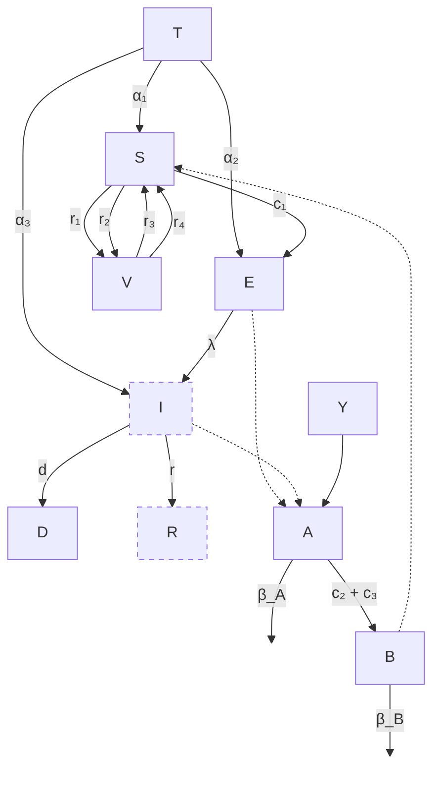

Flowchart showing the compartmental model of malaria transmission between human states (T, S, E, I, R, D, V) and mosquito states (A, B) with various transition rates.

## 2. Control Strategies

The model includes parameters representing different types of control strategies:

* Rate of use of Long Lasting Insecticide-treated Net (LLIN) ($r_1$).

* Rate of use of Indoor Residual Spray (IRS) ($r_2$).

* Rate of use of traditional malaria control strategies such as lotion, air conditioner, protective clothing and house net ($r_3$).

* Rate of non-adherence to the use of the LLIN, IRS and traditional malaria control strategies ($r_4$).

$r_4V$ accounts for individuals discontinuing protection, increasing risk of infection and $r_1S$, $r_2S$ y $r_3S$ represent the adherence to control measures, reducing susceptibility.

## 3. Assumptions of the model

* Every human host has the same tendency to be exposed to malaria.

* Every human host has the same tendency to be infected with malaria.

<u>**Terms in the Equations Affected by Human Behavior**</u>

**ODE model**

$$
\left.
\begin{aligned}
\frac{dT}{dt} &= -\alpha_1 T - \alpha_2 T - \alpha_3 T \\
\frac{dS}{dt} &= -r_1 S - r_2 S - r_3 S + \alpha_1 T + r_4 V - c_1 SB \\
\frac{dE}{dt} &= c_1 SB + \alpha_2 T - \lambda E \\
\frac{dI}{dt} &= \lambda E - Ir - Id + \alpha_3 T \\
\frac{dR}{dt} &= Ir \\
\frac{dD}{dt} &= Id \\
\frac{dV}{dt} &= r_1 S + r_2 S + r_3 S - r_4 V \\
\frac{dA}{dt} &= \gamma - \beta_A A - c_2 AE - c_3 AI \\
\frac{dB}{dt} &= c_2 AE + c_3 AI - \beta_B B
\end{aligned}
\right\}
$$

$$
\begin{aligned}
\frac{dT}{dt} &= -\alpha_1 T - \alpha_2 T - \alpha_3 T \\
\frac{dS}{dt} = -r_1 S - r_2 S - r_3 S &+ \alpha_1 T + r_4 V - c_1 SB \\
\frac{dE}{dt} &= c_1 SB + \alpha_2 T - \lambda E \\
\frac{dI}{dt} &= \lambda E - Ir - Id + \alpha_3 T \\
\frac{dR}{dt} &= Ir \\
\frac{dD}{dt} &= Id \\
\frac{dV}{dt} &= r_1 S + r_2 S + r_3 S - r_4 V \\
\frac{dA}{dt} &= \gamma - \beta_A A - c_2 AE - c_3 AI \\
\frac{dB}{dt} &= c_2 AE + c_3 AI - \beta_B B
\end{aligned}
$$

Where:

<table>
  <thead>
    <tr>
        <th>Parameters</th>
        <th>Definition</th>
        <th>Values</th>
        <th>Sources</th>
    </tr>
  </thead>
  <tbody>
    <tr>
        <td>α<sub>1</sub></td>
        <td>rate of influx of human Travellers into the Susceptible human Population.</td>
        <td>0.965</td>
        <td>Field data</td>
    </tr>
    <tr>
        <td>α<sub>2</sub></td>
        <td>rate of influx of the human Travellers into the human Exposed Population.</td>
        <td>0.03</td>
        <td>Field data</td>
    </tr>
    <tr>
        <td>α<sub>3</sub></td>
        <td>rate of influx of human Travellers into the human Infected Population.</td>
        <td>0</td>
        <td>Assumed</td>
    </tr>
    <tr>
        <td>r<sub>1</sub></td>
        <td>rate of use of LLIN.</td>
        <td>0.320</td>
        <td>Field data</td>
    </tr>
    <tr>
        <td>r<sub>2</sub></td>
        <td>rate of use of IRS.</td>
        <td>0.1577</td>
        <td>Field data</td>
    </tr>
    <tr>
        <td>r<sub>3</sub></td>
        <td>rate of use of traditional malaria control strategies such as lotion, air conditioner, protective clothing and house net.</td>
        <td>0.099</td>
        <td>Field data</td>
    </tr>
    <tr>
        <td>r<sub>4</sub></td>
        <td>rate of non-adherence to the use of LLIN, IRS, lotion, air conditioner, protective clothing and house net.</td>
        <td>1.7326</td>
        <td>Field data</td>
    </tr>
    <tr>
        <td>c<sub>1</sub></td>
        <td>contact rate between the Susceptible human (S) and Infected Anopheles mosquitoes (B).</td>
        <td>0.0044</td>
        <td>Okuneye &amp; Gumel, 2017, Herdicho et al., 2021, Collins &amp; Duffy, 2022</td>
    </tr>
    <tr>
        <td>d</td>
        <td>rate at which human dies as a result of infection.</td>
        <td>0.00023</td>
        <td>WHO, 2020</td>
    </tr>
    <tr>
        <td>λ</td>
        <td>rate at which the exposed becomes infectious.</td>
        <td>1</td>
        <td>Assumed</td>
    </tr>
    <tr>
        <td>r</td>
        <td>rate at which the infected recovers from the malaria disease after treatment.</td>
        <td>0.99977</td>
        <td>WHO, 2020</td>
    </tr>
  </tbody>
</table>
<table>
  <thead>
    <tr>
        <th>Parameters</th>
        <th>Definition</th>
        <th>Values</th>
        <th>Sources</th>
    </tr>
  </thead>
  <tbody>
    <tr>
        <td>c<sub>2</sub></td>
        <td>contact rate between the female Susceptible mosquito (A) and Exposed human (E).</td>
        <td>0.0044</td>
        <td>Okuneye &amp; Gumel, 2017, Herdicho et al., 2021, Collins &amp; Duffy, 2022</td>
    </tr>
    <tr>
        <td>c<sub>3</sub></td>
        <td>contact rate between the Susceptible mosquito (A) and Infected human (I).</td>
        <td>0.0044</td>
        <td>Okuneye &amp; Gumel, 2017, Herdicho et al., 2021, Collins &amp; Duffy, 2022</td>
    </tr>
    <tr>
        <td>γ (dynamic based on seasons)</td>
        <td>recruitment rate of the female Anopheles mosquitoes during high rain.</td>
        <td>3500</td>
        <td>Arambepola et al., 2022, Ahkrizal et al., 2023</td>
    </tr>
    <tr>
        <td>γ (dynamic based on seasons)</td>
        <td>recruitment rate of the female Anopheles mosquitoes during low rain.</td>
        <td>875</td>
        <td>Arambepola et al., 2022, Ahkrizal et al., 2023</td>
    </tr>
    <tr>
        <td>β<sub>A</sub></td>
        <td>mortality rate of the Susceptible female Anopheles mosquito (A) as a result of exposure to traditional and conventional vector control tools.</td>
        <td>0.01</td>
        <td>Ahkrizal et al. (2023)</td>
    </tr>
    <tr>
        <td>β<sub>B</sub></td>
        <td>mortality rate of the Infected mosquito as a result of exposure to traditional and conventional vector control tools.</td>
        <td>0.01</td>
        <td>Ahkrizal et al. (2023)</td>
    </tr>
  </tbody>
</table>

## A. Susceptible human population ($S$)

$$ \frac{dS}{dt} = -r_1 S - r_2 S - r_3 S + \alpha_1 T + r_4 V - c_1 SB $$

* **Control Strategies:**

The susceptible human population is reduced by $r_1 S$, $r_2 S$, $r_3 S$, where these parameters represent the rates of use of LLIN, IRS and traditional control strategies, respectively, by the susceptible population. Additionally, the susceptible human population increases by $r_4 V$, this parameter represents the rate of non-adherence to control strategies among the vigilant population.

## B. Vigilant human population ($V$)

$$ \frac{dV}{dt} = r_1 S + r_2 S + r_3 S - r_4 V $$

* **Control Strategies:**

The vigilant human population increases by $r_1 S$, $r_2 S$, $r_3 S$, where these parameters represent the rates of use of LLIN, IRS and traditional control strategies, respectively, by the susceptible population. Additionally, the vigilant

human population is reduced by $r_4 V$, this parameter represents the rate of non-adherence to control strategies among the vigilant population.

# Scholar 8 ASSESSING THE IMPACT OF CONTROL INTERVENTIONS AND AWARENESS ON MALARIA: A MATHEMATICAL MODELING APPROACH

The model describes the transmission dynamics of malaria between mosquito and human populations and examines the impacts of control interventions with their level of awareness on its control.

<u>Key Point Analysis of Human Behavior in the Model:</u>

## 1. Compartmental Model Variables

Human population is divided into susceptible SH, exposed EH , infectious IH, and recovered RH.

The mosquito population is divided into immature and mature stages. The mature stage is subdivided into susceptible Sm, exposed Em and infectious Im.

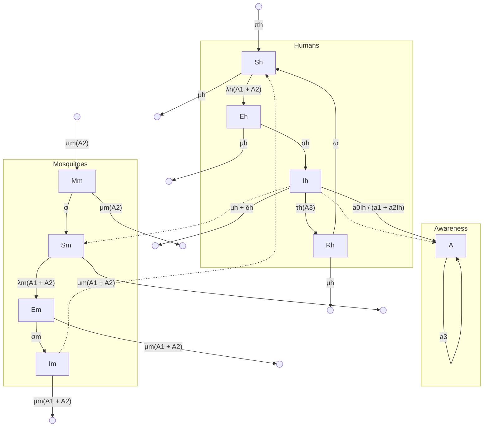

Figure 1: The schematic illustration of the malaria model (3).

The awareness compartment A is populated by a saturated function F(Ih). This function depends on the infectious human population density, since the awareness

about the disease and the need to protect individuals is proportional to the number of infected humans.

$$ F(I_h) = \frac{a_0 I_h}{a_1 + a_2 I_h} $$

Where,

*   a<sub>0</sub>, a<sub>1</sub>, a<sub>2</sub> are information growth rates.

The awareness is reduced by a<sub>3</sub>, which is the fading of awareness memory.

## 2. ODEs model

$$ \frac{dS_h}{dt} = \pi_h + \omega R_h - \lambda_h(A_1 + A_2)S_h - \mu_h S_h $$

$$ \frac{dE_h}{dt} = \lambda_h(A_1 + A_2)S_h - (\mu_h + \sigma_h)E_h $$

$$ \frac{dI_h}{dt} = \sigma_h E_h - (\tau_h(A_3) + \mu_h + \delta_h)I_h $$

$$ \frac{dR_h}{dt} = \tau_h(A_3)I_h - (\mu_h + \omega)R_h $$

$$ \frac{dM_m}{dt} = \pi_m(A_2) - (\phi + \mu_m(A_2))M_m $$

$$ \frac{dS_m}{dt} = \phi M_m - \lambda_m(A_1 + A_2)S_m - \mu_m(A_1 + A_2)S_m $$

$$ \frac{dE_m}{dt} = \lambda_m(A_1 + A_2)S_m - \sigma_m E_m - \mu_m(A_1 + A_2)E_m $$

$$ \frac{dI_m}{dt} = \sigma_m E_m - \mu_m(A_1 + A_2)I_m $$

$$ \frac{dA}{dt} = \frac{a_0 I_h}{a_1 + a_2 I_h} - a_3 A $$

## 3. Protection strategies:

*   Bed-net usage

*   Use of outdoor or indoor residual spray

## 4. Behavioral variables:

* Awareness about bed-net usage **A1**

* Awareness about residual spray **A2**

* Awareness about the mode of treatment for malaria disease **A3**

## <u>Terms in the Equations Affected by Human Behavior</u>

**5.** **Parameters depending on human awareness:**

* **Mosquito biting rate/Contact rate associated with bed-net usage (A1):**

$$ \varepsilon(A_1) \equiv \varepsilon(b) = \varepsilon_{max} - \frac{(\varepsilon_{max} - \varepsilon_{min}) bA_1}{1 + A_1}, \quad 0 \le b \le 1, \quad 0 \le A_1 \le 1 $$

Where b represents the proportion of bed-net usage and min and max are the minimum and maximum mosquito biting rate respectively. If b=0, the transmission would be at its maximum value max

* **Mosquito biting rate/Contact rate associated with awareness on the use of outdoor or indoor residual spray (A2):**

$$ \varepsilon(A_2) \equiv \varepsilon(p) = \varepsilon_{max} - \frac{(\varepsilon_{max} - \varepsilon_{min}) pA_2}{1 + A_2}, \quad 0 \le p \le 1, \quad 0 \le A_2 \le 1 $$

Where p is the proportion of residual spray. If p=0, the transmission would be at its maximum value max

**Forces of infection (A1+A2)h , M(A1+A2):**

$$ \lambda_h(A_1 + A_2) = \frac{\beta_{hm}\varepsilon(A_1 + A_2)I_m}{N_h}, \quad \lambda_m(A_1 + A_2) = \frac{\beta_{mh}\varepsilon(A_1 + A_2)(\eta E_h + I_h)}{N_h} $$

Where:

* hm is the probability of effective transmission from human to mosquito

* mh is the probability of effective transmission from mosquito to human

* (A1 + A2) is the contact rate of humans and mosquitoes, which is dependent on awareness about bed-net usage and residual spray respectively.

* **Mosquito mortality rate m(A1) ,m(A2)**

the mosquito's death rate as a result of bed-net usage as

$$ (5) \quad \mu_m(A_1) \equiv \mu_m(b) = \mu_m + \frac{\mu_{max} b A_1}{1 + A_1}, \quad 0 \le b \le 1 $$

Similarly, the mosquito's death rate as a result of residual spray is given as

$$ (6) \quad \mu_m(A_2) \equiv \mu_m(p) = \mu_m + \frac{\mu_{max} p A_2}{1 + A_2}, \quad 0 \le p \le 1 $$

**Egg deposition rate m(A2) :**

$$ (2) \quad \pi_m(A_2) \equiv \pi_m(p) = \pi_{max} - \frac{(\pi_{max} - \pi_{min}) p A_2}{1 + A_2}, \quad 0 \le p \le 1, \quad 0 \le A_2 \le 1 $$

Residual spraying is expected to reduce the recruitment of mosquitoes to its minimum rate such that if p = 0 , the egg deposition rate of mosquito will remain in it maximum value **max**.

* **Human recovery rate due to treatment awareness h(A3):**

$$ \tau_h(A_3) \equiv \tau_h(q) = \tau_h + \frac{\tau_{max} q A_3}{1 + A_3}, \quad 0 \le q \le 1, \quad 0 \le A_3 \le 1 $$

## 6. Assumptions of the model

* SIS disease structure: No long-term immunity is assumed

* Constant population size and homogeneous mixing.

* The proportion of control interventions usage is equivalent to their level of awareness

## 7. Parameters

<table>
  <thead>
    <tr>
        <th>Parameter</th>
        <th>Description</th>
    </tr>
  </thead>
  <tbody>
    <tr>
        <td>$\pi_h$</td>
        <td>Recruitment rate of humans</td>
    </tr>
    <tr>
        <td>$\omega$</td>
        <td>Immunity waning rate of humans</td>
    </tr>
    <tr>
        <td>$\sigma_h$</td>
        <td>Disease progression rate from exposed to infectious human</td>
    </tr>
    <tr>
        <td>$\sigma_m$</td>
        <td>Disease progression rate from exposed to infectious mosquito</td>
    </tr>
    <tr>
        <td>$\tau_h$</td>
        <td>Recovery rate of infectious humans</td>
    </tr>
    <tr>
        <td>$\tau_{maxq}$</td>
        <td>Recovery rate of infectious humans due to awareness on treatment care</td>
    </tr>
    <tr>
        <td>$\eta$</td>
        <td>Disease modification parameter</td>
    </tr>
    <tr>
        <td>$\mu_h$</td>
        <td>Natural death rate of humans</td>
    </tr>
    <tr>
        <td>$\delta_h$</td>
        <td>Death rate due to disease for humans</td>
    </tr>
    <tr>
        <td>$\beta_{hm}$</td>
        <td>Probability of effective transmission from human to mosquito</td>
    </tr>
    <tr>
        <td>$\beta_{mh}$</td>
        <td>Probability of effective transmission from mosquito to human</td>
    </tr>
    <tr>
        <td>$\varepsilon_{max}$</td>
        <td>Maximum mosquito biting rate</td>
    </tr>
    <tr>
        <td>$\varepsilon_{min}$</td>
        <td>Minimum mosquito biting rate</td>
    </tr>
    <tr>
        <td>$b$</td>
        <td>Proportion of bed-net usage</td>
    </tr>
    <tr>
        <td>$p$</td>
        <td>Proportion of residual spray indoor or outdoor</td>
    </tr>
    <tr>
        <td>$\pi_{max}$</td>
        <td>Maximum egg deposition rate</td>
    </tr>
    <tr>
        <td>$\pi_{min}$</td>
        <td>Minimum egg deposition rate</td>
    </tr>
    <tr>
        <td>$\phi$</td>
        <td>Maturation rate of immature mosquitoes</td>
    </tr>
    <tr>
        <td>$\mu_m$</td>
        <td>Natural death rate of mosquitoes</td>
    </tr>
    <tr>
        <td>$\mu_{maxb}$</td>
        <td>Mosquitoes death rate as a result of bed-net usage</td>
    </tr>
    <tr>
        <td>$\mu_{maxq}$</td>
        <td>Mosquitoes death rate as a result of residual spray</td>
    </tr>
    <tr>
        <td>$a_0, a_1, a_2$</td>
        <td>Awareness information growth rate</td>
    </tr>
    <tr>
        <td>$a_3$</td>
        <td>Fading of awareness memory</td>
    </tr>
  </tbody>
</table>

Table 2: Description of the parameters of the model (3).

**Scholar 31: The influence of gender and temephos exposure on community participation in dengue prevention: a compartmental mathematical model (Includes data)**

<u>**Key Point Analysis of Human Behavior in the Model:**</u>

**1. Compartmental Model Variables:**

$N_h$ represents the constant total human population and is divided into **susceptible** ($\underline{S}_h$), individuals on risk of being infected, **infected** ($\underline{I}_h$), humans with the disease, and **recovered** ($R_h$) individuals that recover from the disease and have permanent immunity. The adult female mosquitoes ($M$) is split into **susceptible** ($\underline{S}_v$) and **infected** ($\underline{I}_v$). The vector population dynamic includes three stages, **egg** ($E$), **larva** ($L$) and **pupa** ($P$) and the breeding sites were divided in targeted by themephos household containers (**thc**) and nontarget household containers (**nthc**).

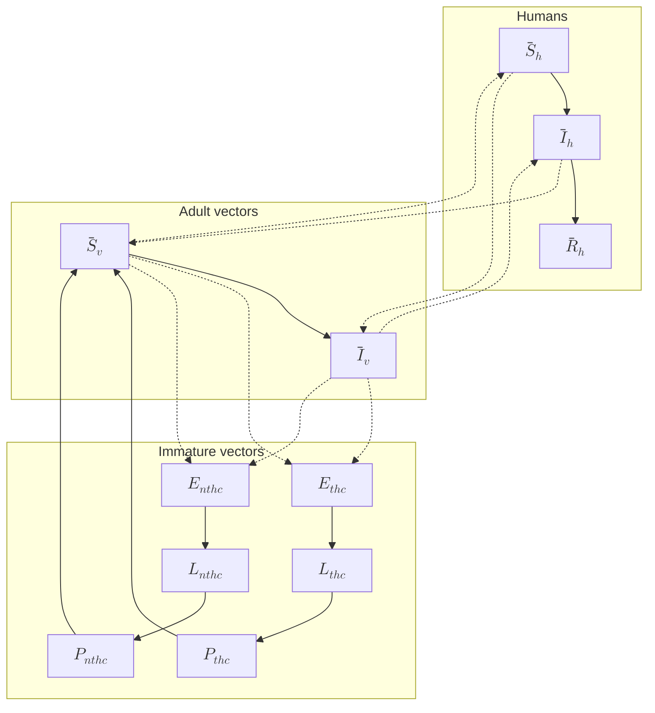

**2. Control Strategies**

There is a differentiation between eggs and aquatic stages, because they respond differently to the control measures.

The model includes functions of two types of control strategies:

* Target tanks, drums, water tanks and cisterns with themephos (*thc*).

Temephos efficacy depends on different factors related to temephos doses, water turnover rate, type of water, and environmental factors around water storage such as organic debris presence, temperature and exposure to sunlight.

* Community participation

As a critical mass of interest, knowledge and confidence accumulates, the quality of participation changes and its effect is more noticeable. After people gain proficiency with a particular control strategy, implementing it fully, the biological potential of the specific activity to control reproduction reaches a peak, before adaptation of the vector mosquito.

$C(t)$ represents the maximum effectiveness of community participation at time $t \in [0, T]$ of 13%, according to superior value of 95%CI for risk difference of pupae per person index calculated.

## 3. Assumptions of the model

* The infection is produced by only one serotype of dengue virus.

* The human population is assumed to be constant.

* The average number of eggs is proportional to the number of female mosquitoes that will result.

* The availability of nutrients and space is different in each type of container (*thc* and *nthc*).

* The number of eggs is proportional to the number of larvae and pupae.

* Human and mosquito populations are mixed homogeneously.

* Community participation affects all stages of the mosquito life cycle, both types of containers, with and without temephos, reduces the load of infection by reducing the probability of human-mosquito transmission.

* Temephos only acts in the larval stage.

* a constant temephos effect of 3%, as an average of the values found in the literature

* We consider that the maturation rates from pupae to adult in the different type of container, $\gamma_{thc}(t)$ and $\gamma_{nthc}(t)$ are modelled for a sinusoidal function with 1-year period.

<u>Terms in the Equations Affected by Human Behavior</u>

# 1. ODE model

$$
\begin{aligned}
\frac{d\overline{S}_h}{dt} &= \mu_h(N_h - \overline{S}_h) - \tau_h\overline{S}_h \\
\frac{d\overline{I}_h}{dt} &= \tau_h\overline{S}_h - (\rho + \mu_h)\overline{I}_h \\
\frac{d\overline{R}_h}{dt} &= \rho\overline{I}_h - \mu_h\overline{R}_h \\
\frac{d\overline{S}_v}{dt} &= \gamma_{thc}(t)P_{thc} + \gamma_{nthc}(t)P_{nthc} - \tau_v\overline{S}_v - (\mu_v + C(t))\overline{S}_v \\
\frac{d\overline{I}_v}{dt} &= \tau_v\overline{S}_v - (\mu_v + C(t))\overline{I}_v \\
\frac{dE_{thc}}{dt} &= \theta_{thc}\left(1 - \frac{E_{thc}}{E_{thc}^{max}}\right)(\overline{S}_v + \overline{I}_v) - \varepsilon_{thc}E_{thc} - (\mu_E + C(t))E_{thc} \\
\frac{dE_{nthc}}{dt} &= \theta_{nthc}\left(1 - \frac{E_{nthc}}{E_{nthc}^{max}}\right)(\overline{S}_v + \overline{I}_v) - \varepsilon_{nthc}E_{nthc} - (\mu_E + C(t))E_{nthc} \\
\frac{dL_{thc}}{dt} &= \varepsilon_{thc}\left(1 - \frac{L_{thc}}{L_{thc}^{max}}\right)E_{thc} - \lambda_{thc}L_{thc} - (\mu_L + A + C(t))L_{thc} \\
\frac{dL_{nthc}}{dt} &= \varepsilon_{nthc}\left(1 - \frac{L_{nthc}}{L_{nthc}^{max}}\right)E_{nthc} - \lambda_{nthc}L_{nthc} - (\mu_L + C(t))L_{nthc} \\
\frac{dP_{thc}}{dt} &= \lambda_{thc}L_{thc} - \gamma_{thc}(t)P_{thc} - (\mu_P + C(t))P_{thc} \\
\frac{dP_{nthc}}{dt} &= \lambda_{nthc}L_{nthc} - \gamma_{nthc}(t)P_{nthc} - (\mu_P + C(t))P_{nthc}
\end{aligned}
$$
(3)

$$
\begin{aligned}
\frac{d S_h}{dt} &= \mu_h(N_h - S_h) - \tau_h S_h \\
\frac{d I_h}{dt} &= \tau_h S_h - (\rho + \mu_h) I_h \\
\frac{d R_h}{dt} &= \rho I_h - \mu_h R_h \\
\frac{d S_v}{dt} = \gamma_{thc}(t)P_{thc} &+ \gamma_{nthc}(t)P_{nthc} - \tau_v S_v - (\mu_v + C(t)) S_v \\
\frac{d I_v}{dt} &= \tau_v S_v - (\mu_v + C(t)) I_v \\
\frac{dE_{thc}}{dt} = \theta_{thc}(1 &- \frac{E_{thc}}{E_{thc}^{max}})(S_v + I_v) - \varepsilon_{thc}E_{thc} - (\mu_E + C(t))E_{thc} \\
\frac{dE_{nthc}}{dt} = \theta_{nthc}(1 &- \frac{E_{nthc}}{E_{nthc}^{max}})(S_v + I_v) - \varepsilon_{nthc}E_{nthc} - (\mu_E + C(t))E_{nthc} \\
\frac{dL_{thc}}{dt} = \varepsilon_{thc}(1 &- \frac{L_{thc}}{L_{thc}^{max}})E_{thc} - \lambda_{thc}L_{thc} - (\mu_L + A + C(t))L_{thc} \\
\frac{dL_{nthc}}{dt} = \varepsilon_{nthc}(1 &- \frac{L_{nthc}}{L_{nthc}^{max}})E_{nthc} - \lambda_{nthc}L_{nthc} - (\mu_L + C(t))L_{nthc} \\
\frac{dP_{thc}}{dt} &= \lambda_{thc}L_{thc} - \gamma_{thc}(t)P_{thc} - (\mu_P + C(t))P_{thc} \\
\frac{dP_{nthc}}{dt} &= \lambda_{nthc}L_{nthc} - \gamma_{nthc}(t)P_{nthc} - (\mu_P + C(t))P_{nthc}
\end{aligned}
$$

Where:

$$ \tau_h = \alpha \beta_{vh} (1 - C(t)) \frac{I_v}{N_h} $$
$$ \tau_v = \alpha \beta_{hv} (1 - C(t)) \frac{I_h}{N_h} $$
$$ \gamma_{thc}(t) = \gamma_{nthc}(t) = \gamma_0 (1 + \zeta \cos(\frac{2\pi}{365}t + \varphi)) $$
$$ C(t) = C_F(t) + C_M(t) $$
$$ C_F(t) = \frac{K_F C_0 e^{rt}}{K_F + C_0 (e^{rt} - 1)} $$
$$ C_M(t) = \frac{(K_{max} - K_F) C_0 e^{rt}}{(K_{max} - K_F) + C_0 (e^{rt} - 1)} $$
$$ K_F = \frac{P_F}{P_F + P_M} K_{max} $$

$K_{max} - K_F$ is the men’s contribution capacity

<table>
  <thead>
    <tr>
        <th>Parameter</th>
        <th>Description</th>
        <th>Baseline value/range</th>
    </tr>
  </thead>
  <tbody>
    <tr>
        <td>$\mu_h$</td>
        <td>Natural birth and mortality rate in humans</td>
        <td>$\frac{1}{(73 \times 365)} day^{-1}$</td>
    </tr>
    <tr>
        <td>$a$</td>
        <td>Average number of mosquito bites</td>
        <td>$[0.3, 1] day^{-1}$</td>
    </tr>
    <tr>
        <td>$\beta_{vh}$</td>
        <td>Probability of transmission of infection from an infective vector to a susceptible human</td>
        <td>$[0.1, 0.75] day^{-1}$</td>
    </tr>
    <tr>
        <td>$\beta_{hv}$</td>
        <td>Probability of transmission of infection from an infected human to a susceptible vector</td>
        <td>$[0.1, 0.75] day^{-1}$</td>
    </tr>
    <tr>
        <td>$\rho$</td>
        <td>Recover rate for human</td>
        <td>$[0.10, 0.25] day^{-1}$</td>
    </tr>
    <tr>
        <td>$\mu_v$</td>
        <td>Natural mortality rate of vectors</td>
        <td>$[0.03, 0.125] day^{-1}$</td>
    </tr>
    <tr>
        <td>$\theta_{thc}$</td>
        <td>Numbers of eggs in target household containers</td>
        <td>$[1, 6] day^{-1}$</td>
    </tr>
    <tr>
        <td>$\theta_{nthc}$</td>
        <td>Numbers of eggs in no-target household containers</td>
        <td>$[1, 6] day^{-1}$</td>
    </tr>
    <tr>
        <td>$E_{thc}^{max}$</td>
        <td>Carrying capacity for eggs in target household containers</td>
        <td>$[10^3, 10^6] day^{-1}$</td>
    </tr>
    <tr>
        <td>$E_{nthc}^{max}$</td>
        <td>Carrying capacity for eggs in non-target household containers</td>
        <td>$[10^3, 10^6] day^{-1}$</td>
    </tr>
    <tr>
        <td>$\varepsilon_{thc}$</td>
        <td>Transfer rate from eggs to larvae in target household containers</td>
        <td>$0.7 day^{-1}$</td>
    </tr>
    <tr>
        <td>$\varepsilon_{nthc}$</td>
        <td>Transfer rate from eggs to larvae in non-target household containers</td>
        <td>$0.7 day^{-1}$</td>
    </tr>
    <tr>
        <td>$\mu_E$</td>
        <td>Eggs death rate per day</td>
        <td>$[0.2, 0.4] day^{-1}$</td>
    </tr>
    <tr>
        <td>$L_{thc}^{max}$</td>
        <td>Carrying capacity for larvae in target household containers</td>
        <td>$[5 \times 10^2, 5 \times 10^5] day^{-1}$</td>
    </tr>
    <tr>
        <td>$L_{nthc}^{max}$</td>
        <td>Carrying capacity for larvae in no-target household containers</td>
        <td>$[5 \times 10^2, 5 \times 10^5] day^{-1}$</td>
    </tr>
    <tr>
        <td>$\lambda_{thc}$</td>
        <td>Transfer rate from larvae to pupae in target household containers</td>
        <td>$0.5 day^{-1}$</td>
    </tr>
    <tr>
        <td>$\lambda_{nthc}$</td>
        <td>Transfer rate from larvae to pupae in no-target household containers</td>
        <td>$0.5 day^{-1}$</td>
    </tr>
    <tr>
        <td>$\mu_L$</td>
        <td>Larvae death rate</td>
        <td>$[0.2, 0.4] day^{-1}$</td>
    </tr>
    <tr>
        <td>$\mu_P$</td>
        <td>Pupae death rate</td>
        <td>$0.4 day^{-1}$</td>
    </tr>
    <tr>
        <td>$Y_0$</td>
        <td>Average reproduction maturation rate from pupae to adult in different containers</td>
        <td>$[0.08, 0.15] day^{-1}$</td>
    </tr>
    <tr>
        <td>$\zeta$</td>
        <td>Amplitude of the seasonal variation in the reproduction rate of vectors</td>
        <td>$[0, 0.9]$</td>
    </tr>
    <tr>
        <td>$A$</td>
        <td>Effect produced by temephos in the target household containers</td>
        <td>$0.03$</td>
    </tr>
    <tr>
        <td>$k_{max}$</td>
        <td>Total maximum capacity of community participation effectiveness for the control of the dengue vector</td>
        <td>$0.13$</td>
    </tr>
    <tr>
        <td>$P_F$</td>
        <td>Proportion of participation of women in control mosquito activities</td>
        <td>$0.25$</td>
    </tr>
    <tr>
        <td>$P_M$</td>
        <td>Proportion of participation of men in control mosquito activities</td>
        <td>$0.02$</td>
    </tr>
    <tr>
        <td>$C_0$</td>
        <td>Effectiveness of pre-existing community participation</td>
        <td>$0.001$</td>
    </tr>
    <tr>
        <td>$r$</td>
        <td>Incremental rate of community participation effectiveness</td>
        <td>$0.015$</td>
    </tr>
  </tbody>
</table>

## A. Susceptible individuals ($S_h$)

$$ \frac{dS_h}{dt} = \mu_h(N_h - S_h) - \tau_h S_h $$

$$\tau_h = a\beta_{vh}(1 - C(t))\frac{I_v}{N_h}$$

*   **Control Strategies:**

The human susceptible population is decreased following the infection force rate which is reduced by $1 - C(t)$, and $C(t)$ represent control of the disease through community participation.

## B. Infected individuals ($I_h$)

$$\frac{d\ I_h}{dt} = \tau_h\ \underline{S}_h - (\rho + \mu_h)\ \underline{I}_h$$
$$\tau_h = a\beta_{vh}(1 - C(t))\frac{I_v}{N_h}$$

*   **Control Strategies:**

The human infected population increases following the infection force rate which is reduced by $1 - C(t)$, and $C(t)$ represent control of the disease through community participation.

## C. Susceptible vectors ($\underline{S}_v$)

$$\frac{d\ \underline{S}_v}{dt} = \gamma_{thc}(t)P_{thc} + \gamma_{nthc}(t)P_{nthc} - \tau_v\ \underline{S}_v - (\mu_v + C(t))\ \underline{S}_v$$
$$\tau_v = a\beta_{hv}(1 - C(t))\frac{\underline{I}_h}{N_h}$$

*   **Control Strategies:**

$1 - C(t)$ describes the reduction in contacts between infected mosquitos and susceptible humans, reflecting the reduced mosquito population, $(\mu_v + C(t))\ \underline{S}_v$

represents the natural mortality and additional mortality attributed to community participation in control efforts ($C(t)$).

## D. Infected vectors ($I_v$)
$$ \frac{d\ I_v}{dt} = \tau_v \underline{S}_v - (\mu_v + C(t)) \ \underline{I}_v $$
$$ \tau_v = \alpha \beta_{hv} (1 - C(t)) \frac{\underline{I}_h}{N_h} $$

● **Control Strategies:**

$1 - C(t)$ describes the reduction in contacts between infected mosquitos and susceptible humans, $(\mu_v + C(t)) \ \underline{I}_v$ represents the natural mortality and additional mortality attributed to community participation in control efforts ($C(t)$).

## E. Eggs in targeted household containers ($E_{thc}$)

$$ \frac{dE_{thc}}{dt} = \theta_{thc} (1 - \frac{E_{thc}}{E_{thc}^{max}}) (\ \underline{S}_v + \ \underline{I}_v \ ) - \varepsilon_{thc} E_{thc} - (\mu_E + C(t)) E_{thc} $$

● **Control Strategies:**

$(\mu_E + C(t)) E_{thc}$ represents the natural mortality and additional mortality attributed to community participation in control efforts ($C(t)$).

## F. Eggs in non targeted household containers ($E_{nthc}$)

$$ \frac{dE_{nthc}}{dt} = \theta_{nthc} (1 - \frac{E_{nthc}}{E_{nthc}^{max}}) (\ \underline{S}_v + \ \underline{I}_v \ ) - \varepsilon_{nthc} E_{nthc} - (\mu_E + C(t)) E_{nthc} $$

*   **Control Strategies:**

$(\mu_E + C(t))E_{nthc}$ represents the natural mortality and additional mortality attributed to community participation in control efforts ($C(t)$).

# G. Larvae in targeted household containers ($L_{thc}$)

$$ \frac{dL_{thc}}{dt} = \varepsilon_{thc}(1 - \frac{L_{thc}}{L_{thc}^{max}})E_{thc} - \lambda_{thc}L_{thc} - (\mu_L + A + C(t))L_{thc} $$

*   **Control Strategies:**

$(\mu_L + A + C(t))L_{thc}$ represents the natural mortality and additional mortality attributed to community participation in control efforts ($C(t)$) and the effect produced by temephos ($A$).

# H. Larvae in non targeted household containers ($L_{nthc}$)

$$ \frac{dL_{nthc}}{dt} = \varepsilon_{nthc}(1 - \frac{L_{nthc}}{L_{nthc}^{max}})E_{nthc} - \lambda_{nthc}L_{nthc} - (\mu_L + C(t))L_{nthc} $$

*   **Control Strategies:**

$(\mu_L + C(t))L_{nthc}$ represents the natural mortality and additional mortality attributed to community participation in control efforts ($C(t)$).

# I. Pupae in targeted household containers ($P_{thc}$)

$$ \frac{dP_{thc}}{dt} = \lambda_{thc}L_{thc} - \gamma_{thc}(t)P_{thc} - (\mu_P + C(t))P_{thc} $$

*   **Control Strategies:**

$(\mu_P + C(t))P_{thc}$ represents the natural mortality and additional mortality attributed to community participation in control efforts ($C(t)$).

**J. Pupae in non targeted household containers ($P_{nthc}$)**

$$ \frac{dP_{nthc}}{dt} = \lambda_{nthc}L_{nthc} - \gamma_{nthc}(t)P_{nthc} - (\mu_P + C(t))P_{nthc} $$

*   **Control Strategies:**

$(\mu_P + C(t))P_{nthc}$ represents the natural mortality and additional mortality attributed to community participation in control efforts ($C(t)$).

# Scopus 16: Dynamic insights into malaria–onchocerciasis co-disease transmission: mathematical modeling, basic reproduction number and sensitivity analysis

# <u>Key Point Analysis of Human Behavior in the Model:</u>

## 1. **Compartmental Model Variables:**

The total human population and is divided into individuals susceptible to the co-disease those with mild onchocerciasis infection , individuals with acute onchocerciasis infection individuals in the irreversible blinding stage of onchocerciasis individuals with uncomplicated malaria infection , individuals with acute or complicated malaria infection individuals dually infected with onchocerciasis and malaria , individuals who have recovered from onchocerciasis individuals who have recovered from malaria , and individuals who have recovered from onchocerciasis-malaria coinfection

**Vector Populations:**

Total female Anopheles mosquito population is divided into susceptible and infected sub-populations denoted by and respectively. Furthermore, the total blackfly population is divided into susceptible and infected sub-populations denoted by and respectively.

## 2. **Control Strategies and Human Behavior**

The model highlights how human behavior and interventions influence disease dynamics:

### A. Prevention and Treatment Adherence

* Recovery rates ():

    - Represent treatment effectiveness (e.g., ivermectin for onchocerciasis, antimalarials for malaria).

    - Higher recovery rates reduce disease prevalence but are offset by loss of immunity (which increases re-infection risk.

* Biting rates

    - Reduced by insecticide-treated nets (ITNs), indoor residual spraying (IRS), and protective clothing.

    - Sensitivity analysis shows biting rates significantly impact transmission ()

### B. Vector Control Measures

* Larviciding and adulticide use:

    - Not explicitly modeled as control parameters but implied via mosquito/blackfly mortality

    - Natural death rates alone are insufficient for disease elimination (low sensitivity in.

**C. Compliance with Interventions**

* Loss of immunity (

    * Reflects non-adherence to long-term prophylaxis (e.g., missed ivermectin doses).

    * Leads to re-susceptibility, sustaining transmission.

<u>Terms in the Equations Affected by Human Behavior</u>

**A. Susceptible Humans**

* **Control Strategies:**

    Reduction in Lowered by vector control (ITNs, IRS) and reduced human-vector contact.

    Loss of immunity (): Increases due to waning protection.

**B. Infected Humans**

* Progression to severe stages ():

    Delayed treatment-seeking behavior worsens outcomes (e.g., blindness, malaria mortality).

* Treatment impact (

    Higher treatment rates reduce but require sustained compliance.

**C. Vectors**

* **Control Strategies:**

* Biting rate () reduction via ITNs/IRS lowers and

* Larviciding (implied via ) reduces mosquito/blackfly populations.

# Scopus 6 Human behaviors: A threat to mosquito control?

<u>Key Point Analysis of Human Behavior in the Model:</u>

A mosquito model is proposed in order to determine if human activity influences the positive effects of the control strategies, such as the physical elimination of breeding sites. In this model human behavior is modeled as a feedback loop:

*   When infections increase, people react by increasing control measures.

*   When infections decrease, effort diminishes (relaxation or social fatigue).

## 1. Compartmental Model Variables

The mosquito population is divided in two main stages: aquatic stage $A_v$ (eggs, larvae and pupae) and adult stage $L_v$

## 2. ODEs Mosquitoes model

$$
\begin{cases}
\frac{dL_v}{dt} = rbA_v \left( 1 - \frac{L_v}{K_v} \right) - (\nu_L + \mu_L)L_v, \\
\frac{dA_v}{dt} = \nu_L L_v - \mu_v A_v, \\
L_v(0) = L_0, \\
A_v(0) = A_0,
\end{cases}
$$

## 3. Entomological model with protection

The model includes a human behavior variable $H(t)$, representing the proportion of people participating in mechanical control at a given time. H is related to the proportion of people who agree to mechanical control. As more people agree on this control, K (carrying capacity) decreases. It is assumed that mechanical control is instant in time.

$$
\begin{cases}
\frac{dL_v}{dt} = rbA_v \left( 1 - \frac{L_v}{K_{v,per}(t)} \right) - (\nu_L + \mu_L)L_v, \\
\frac{dA_v}{dt} = \nu_L L_v - \mu_v A_v.
\end{cases}
$$

$$ \Delta K_v(t_i) = -\gamma(H)K_v(t_i), $$

Where, if the whole population participates H=1 and $\gamma$ is the efficacy that depends on environmental parameters or the quality of the control.

## 4. Control strategies

Mechanical control: the paper focuses on the physical elimination of breeding sites, and how human activity affects its effectiveness.

## 5. Parameters depending on humans behaviour:

* **Larvae carrying capacity** $K$

$$\Delta K_v(t_i) = -\gamma(H)K_v(t_i),$$

Where,

* $H$ is a proportion of people agree to consider mechanical;

* $\gamma$ is the efficacy of the control that depends on environmental parameters such as rainfall of the quality of the mechanical control.

$$\gamma(x) = ax, \quad \text{with } a \in ]0, 1[$$

or as a non-linear function, like, for instance

$$\gamma(x) = \frac{ax}{1 + ax}, \quad \text{with } a > 0,$$

In which $a$ is a parameter that can be related to the rate of efficacy.

The efficiency of the mechanical control is related to $H$ such that, the decrease in $K$ becomes more important as more people practice mechanical control. It is assumed that the control occurs instantaneously in time.

## 6. Parameters

Table 1
Values of temperature-varying parameters.

<table>
  <thead>
    <tr>
        <th>Parameter</th>
        <th>10°C</th>
        <th>15 °C</th>
        <th>20 °C</th>
        <th>25 °C</th>
        <th>30 °C</th>
        <th>35 °C</th>
        <th>40 °C</th>
        <th>Source</th>
    </tr>
  </thead>
  <tbody>
    <tr>
        <td>\mu_L</td>
        <td>1</td>
        <td>0.96</td>
        <td>0.48</td>
        <td>0.62</td>
        <td>0.65</td>
        <td>0.99</td>
        <td>1</td>
        <td>[19] Table 1</td>
    </tr>
    <tr>
        <td>\nu_L</td>
        <td>0</td>
        <td>1/42.4</td>
        <td>1/17.3</td>
        <td>1/14.9</td>
        <td>1/15.5</td>
        <td>1/19.4</td>
        <td>0</td>
        <td>[19] Table 2</td>
    </tr>
    <tr>
        <td>\mu_v</td>
        <td>-</td>
        <td>1/35</td>
        <td>1/25</td>
        <td>1/25</td>
        <td>1/26</td>
        <td>1/18</td>
        <td>-</td>
        <td>[19]</td>
    </tr>
  </tbody>
</table>

$rL$: **oviposition rate of adult females (rate of egg-laying).**

$K$: **carrying capacity (maximum larval habitat available).**

$\mu L, A$: **natural mortality of larvae and adults.**

$\theta, \cdot$: **maturation rate from larvae to adults.**

# SCOPUS 12 Modeling and stability analysis of the transmission dynamics of Monkeypox with control intervention

<u>Key Point Analysis of Human Behavior in the Model:</u>

### 1. Compartmental Model Variables:

Human population is divided into eight classes:

* Susceptible humans $S_h(t)$

* Exposed humans $E_h(t)$

* Infected humans $I_h(t)$

* Quarantine humans $Q_h(t)$

* Hospitalized humans $H(t)$

* Patients who experienced severe consequences after the infection $I_c(t)$

* Recovered humans $R_h(t)$

* Vaccinated humans $V_h(t)$

Rodents are distinguished by susceptible rodents $S_r(t)$ and infected rodents $I_r(t)$

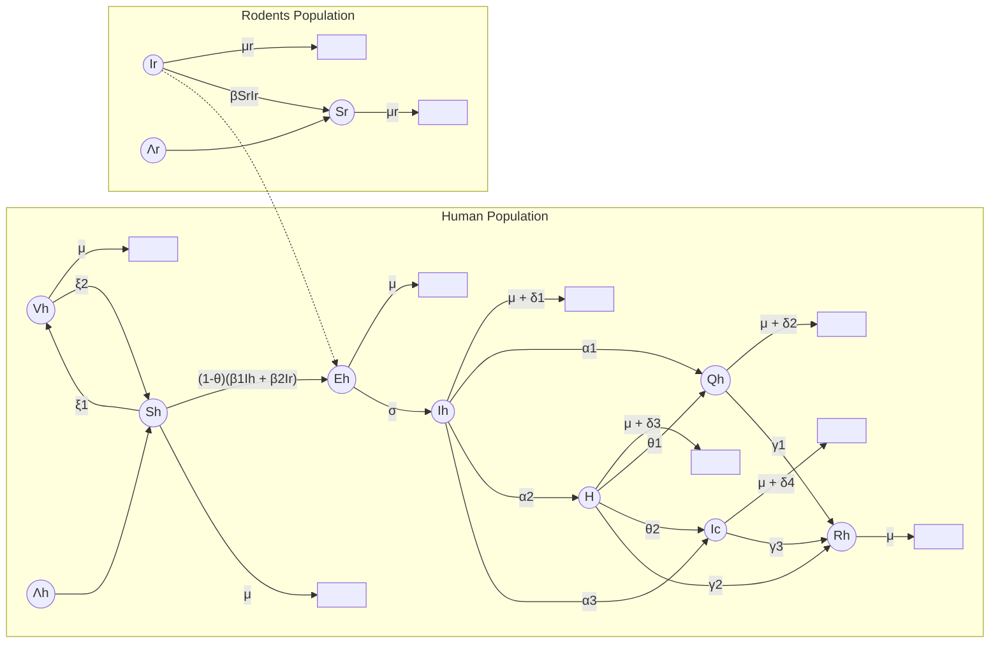

### 2. Control strategies

Numerical simulations were displayed to demonstrate the dynamical behaviour of the population.

* **Vaccination:** increasing the vaccination rate, decreases the number of infected humans. Likely, as the vaccination failure rate increases, the

number of infected humans and humans suffering severe complications also increases accordingly.

*   **Awareness**: infected individuals decrease accordingly as levels of awareness increase.

*   **Quarantine**: as the quarantine rate increases, the number of infected humans and humans suffering severe complications decreases.

*   **Treatment**

## 3. Analysis of the model

*   A comprehensive theoretical analysis of the model was presented.

*   It determined the existence and uniqueness of the solutions.

*   The basic reproduction number was calculated by the next-generation matrix approach.

*   The global stability of endemic equilibrium was calculated using Dulac’s function technique.

# <u>Terms in the Equations Affected by Human Behavior</u>

## 4. ODE MODEL

$$
\begin{aligned}
\frac{dS_h}{dt} &= p_1 &&= \Lambda_h - (1 - \theta)(\beta_1 I_h + \beta_2 I_r)S_h - \hat{\chi}_1 S_h + \xi_2 V_h, \\
\frac{dE_h}{dt} &= p_2 &&= (1 - \theta)(\beta_1 I_h + \beta_2 I_r)S_h - \hat{\chi}_2 E_h, \\
\frac{dI_h}{dt} &= p_3 &&= \sigma E_h - \hat{\chi}_3 I_h, \\
\frac{dQ_h}{dt} &= p_4 &&= \alpha_1 I_h - \hat{\chi}_4 Q_h, \\
\frac{dH}{dt} &= p_5 &&= \alpha_2 I_h + \theta_1 Q_h - \hat{\chi}_5 H, \\
\frac{dI_c}{dt} &= p_6 &&= \alpha_3 I_h + \theta_2 H - \hat{\chi}_6 I_c, && \hat{\chi}_1 &&= \mu + \xi_1, \\
\frac{dR_h}{dt} &= p_7 &&= \gamma_1 Q_h + \gamma_2 H + \gamma_3 I_c - \mu R_h, && \hat{\chi}_2 &&= \mu + \sigma, \\
\frac{dV_h}{dt} &= p_8 &&= \xi_1 S_h - \hat{\chi}_7 V_h, && \hat{\chi}_3 &&= \alpha_1 + \alpha_2 + \alpha_3 + \delta_1 + \mu, \\
\frac{dS_r}{dt} &= p_9 &&= \Lambda_r - \beta S_r I_r - \mu_r S_r, && \hat{\chi}_4 &&= \theta_1 + \gamma_1 + \mu + \delta_2, \\
\frac{dI_r}{dt} &= p_{10} &&= \beta S_r I_r - \mu_r I_r, && \hat{\chi}_5 &&= \theta_2 + \mu + \delta_3 + \gamma_2, \\
& && && \hat{\chi}_6 &&= \gamma_3 + \mu + \delta_4, \\
& && && \hat{\chi}_7 &&= \mu + \xi_2.
\end{aligned}
$$

## 5. Parameters affected by human behavior

*   **Level of awareness $\theta$** : reduces exposure to infection via behaviors such as hygiene, avoiding rodents, using protective measures, etc. If $\theta$ increases, humans become less infected.

*   **Vaccination rate $\xi_1$ and Vaccine failure $\xi_2$** : increase or decrease, respectively, the level of protection

# 6. Assumptions of the model

* Infected humans do not spread the infection to rodents

* Infected rodents spread the infection to the human population

* Vaccinated humans are assumed never to contract the disease for the rest of their lifetime

* Some individuals with unsuccessful vaccinations return to susceptible

# 7. Parameters

**Table 1**
Description of parameters in model (1).

<table>
  <thead>
    <tr>
        <th>Parameters</th>
        <th>Description</th>
    </tr>
  </thead>
  <tbody>
    <tr>
        <td>$\Lambda_h$</td>
        <td>Recruitment rate of susceptible humans.</td>
    </tr>
    <tr>
        <td>$\theta$</td>
        <td>Level of awareness.</td>
    </tr>
    <tr>
        <td>$\theta_1$</td>
        <td>Rate of quarantine humans placed in the hospital.</td>
    </tr>
    <tr>
        <td>$\beta_1$</td>
        <td>Transmission rate of monkeypox from human to human.</td>
    </tr>
    <tr>
        <td>$\beta_2$</td>
        <td>Transmission rate of monkeypox from human to rodent.</td>
    </tr>
    <tr>
        <td>$\delta_1$</td>
        <td>Mortality rate of infected humans due to monkeypox.</td>
    </tr>
    <tr>
        <td>$\delta_2$</td>
        <td>Mortality rate of quarantine humans due to monkeypox.</td>
    </tr>
    <tr>
        <td>$\delta_3$</td>
        <td>Mortality rate of hospitalized humans due to monkeypox.</td>
    </tr>
    <tr>
        <td>$\delta_4$</td>
        <td>Mortality rate of people with health problems.</td>
    </tr>
    <tr>
        <td>$\alpha_1$</td>
        <td>Rate of infected humans placed in quarantine.</td>
    </tr>
    <tr>
        <td>$\alpha_2$</td>
        <td>Rate of infected humans placed in the hospital.</td>
    </tr>
    <tr>
        <td>$\alpha_3$</td>
        <td>Rate of humans suffering severe complications after<br/>the virus has destroyed a large part of their lung.</td>
    </tr>
    <tr>
        <td>$\sigma$</td>
        <td>Rate of infected humans with the symptom.</td>
    </tr>
    <tr>
        <td>$\gamma_1$</td>
        <td>Rate of recovered humans from quarantine.</td>
    </tr>
    <tr>
        <td>$\gamma_2$</td>
        <td>Rate of recovered humans from hospital.</td>
    </tr>
    <tr>
        <td>$\gamma_3$</td>
        <td>Rate of infected individuals who recovered from the virus with complications.</td>
    </tr>
    <tr>
        <td>$\beta$</td>
        <td>Transmission rate of monkeypox from rodent to rodent.</td>
    </tr>
    <tr>
        <td>$\theta_2$</td>
        <td>The proportion of persons in the hospital who<br/>develop major difficulties after the infection has largely destroyed their lungs.</td>
    </tr>
    <tr>
        <td>$\xi_1$</td>
        <td>Vaccination rate .</td>
    </tr>
    <tr>
        <td>$\xi_2$</td>
        <td>Unsuccessful vaccine rate.</td>
    </tr>
    <tr>
        <td>$\mu$</td>
        <td>Natural mortality rate of humans.</td>
    </tr>
    <tr>
        <td>$\Lambda_r$</td>
        <td>Recruitment rate of rodents.</td>
    </tr>
    <tr>
        <td>$\mu_r$</td>
        <td>Natural mortality rate of rodents.</td>
    </tr>
  </tbody>
</table>

**Table 3**
Model parameters and their values.

<table>
  <thead>
    <tr><th>Parameter</th><th>Value</th><th>Source</th></tr>
  </thead>
  <tbody>
    <tr><td>$\Lambda_h$</td><td>321 204</td><td>Assumed</td></tr>
    <tr><td>$\theta_1$</td><td>0.02</td><td>Assumed</td></tr>
    <tr><td>$\beta_2$</td><td>0.0027</td><td>Ref. 44</td></tr>
    <tr><td>$\delta_2$</td><td>0.05</td><td>Ref. 49</td></tr>
    <tr><td>$\delta_4$</td><td>0.01</td><td>Assumed</td></tr>
    <tr><td>$\alpha_2$</td><td>0.5</td><td>Ref. 43</td></tr>
    <tr><td>$\sigma$</td><td>0.52</td><td>Ref. 14</td></tr>
    <tr><td>$\gamma_2$</td><td>0.036246</td><td>Ref. 14</td></tr>
    <tr><td>$\beta$</td><td>0.012</td><td>Ref. 43</td></tr>
    <tr><td>$\xi_1$</td><td>0.1</td><td>Estimated</td></tr>
    <tr><td>$\mu$</td><td>0.01794</td><td>Ref. 50</td></tr>
    <tr><td>$\mu_r$</td><td>0.002</td><td>Assumed</td></tr>
  </tbody>
</table>
<table>
  <thead>
    <tr><th>Parameter</th><th>Value</th><th>Source</th></tr>
  </thead>
  <tbody>
    <tr><td>$\theta$</td><td>0.2</td><td>Assumed</td></tr>
    <tr><td>$\beta_1$</td><td>0.00006</td><td>Ref. 44</td></tr>
    <tr><td>$\delta_1$</td><td>0.2</td><td>Ref. 48</td></tr>
    <tr><td>$\delta_3$</td><td>0.055487</td><td>Assumed</td></tr>
    <tr><td>$\alpha_1$</td><td>0.75</td><td>Ref. 14</td></tr>
    <tr><td>$\alpha_3$</td><td>0.3</td><td>Fitted</td></tr>
    <tr><td>$\gamma_1$</td><td>0.52</td><td>Ref. 24</td></tr>
    <tr><td>$\gamma_3$</td><td>0.004</td><td>Fitted</td></tr>
    <tr><td>$\theta_2$</td><td>0.4</td><td>Assumed</td></tr>
    <tr><td>$\xi_2$</td><td>0.2</td><td>Estimated</td></tr>
    <tr><td>$\Lambda_r$</td><td>0.05</td><td>Assumed</td></tr>
  </tbody>
</table>

# Scholar 44 Global Dynamics and Optimal Control of Multi-Age Structured Vector Disease Model with Vaccination, Relapse and General Incidence

<u>Key Point Analysis of Human Behavior in the Model:</u>

**1. Compartmental Model Variables:**

The host population is divided into susceptible individuals $S_h(t)$, vaccinated immune individuals $V_h(t,a)$, infected individuals $I_h(t,b)$, and recovered individuals $R_h(t,c)$.

In which $a$ represents the time since vaccination, $b$ denotes the time since infection, and $c$ represents the time since recovered.

As the model presented is a vector-borne with multi age structures, the total numbers of each group of humans at $t$ is:

**Vaccinated humans**

$$ \int_{0}^{\infty} V_h(t,a)da $$

**Infected humans**

$$ \int_{0}^{\infty} I_h(t,b)db $$

**Recovered humans**

$$ \int_{0}^{\infty} R_h(t,c)dc $$

The vector population is divided into $S_v$ and infected $I_v$, which infected vectors carry parasites or bacteria their whole life. The infectivity from infected hosts to susceptible vectors is defined by $\beta_v(b) = q_v\beta_{v1}(b)$, where $q_v$ denotes the average biting rate of vectors, and $\beta_{v1}(b)$ denotes the probability of virus transmission from infected hosts with infectious $b$ to vectors after a successful bite.

**2. ODEs-PDEs model with vaccination**

$$ \begin{cases} \frac{\mathrm{d}S_h(t)}{\mathrm{d}t} = \Lambda_h - \mu_h S_h(t) - f(S_h(t), I_v(t)) - \frac{1}{\alpha} \psi_h S_h(t) + \int_0^\infty \omega_h(a) V_h(t, a) \mathrm{d}a, \\ \left( \frac{\partial}{\partial t} + \alpha \frac{\partial}{\partial a} \right) V_h(t, a) = -(\mu_h + \omega_h(a)) V_h(t, a), \ V_h(t, 0) = \frac{1}{\alpha} \psi_h S_h(t), \\ \left( \frac{\partial}{\partial t} + \alpha \frac{\partial}{\partial b} \right) I_h(t, b) = -(\mu_h + k_h(b) + \nu_h(b)) I_h(t, b), \\ I_h(t, 0) = f(S_h(t), I_v(t)) + \int_0^\infty r_h(c) R_h(t, c) \mathrm{d}c, \\ \left( \frac{\partial}{\partial t} + \alpha \frac{\partial}{\partial c} \right) R_h(t, c) = -(\mu_h + r_h(c)) R_h(t, c), \ R_h(t, 0) = \int_0^\infty k_h(b) I_h(t, b) \mathrm{d}b, \\ \frac{\mathrm{d}S_v(t)}{\mathrm{d}t} = \Lambda_v - \int_0^\infty \beta_v(b) S_v(t) I_h(t, b) \mathrm{d}b - \mu_v S_v(t), \\ \frac{\mathrm{d}I_v(t)}{\mathrm{d}t} = \int_0^\infty \beta_v(b) S_v(t) I_h(t, b) \mathrm{d}b - \mu_v I_v(t), \end{cases} $$

Parameter $\alpha$ is introduced to balance the difference in units of age and time. In this case, the units of age and time are both day, so $\alpha = 1$

$S_h, S_v, I_v$ are ODEs, since those are not structured by age.

Partial equations permit the evaluation of the risk of infection, recuperation rate and loss of immunity depending on the time past since a certain event.

**Control model:**

$$ \begin{aligned} \frac{\mathrm{d}S_h}{\mathrm{d}t} &= \Lambda_h - \mu_h S_h - f(S_h, I_v) - (\psi_h + u_1) S_h + \int_0^\infty \omega_h(a) V_h(t, a) \mathrm{d}a, \\ \left( \frac{\partial}{\partial t} + \frac{\partial}{\partial a} \right) V_h(t, a) &= -(\mu_h + \omega_h(a)) V_h(t, a), \ V_h(t, 0) = (\psi_h + u_1) S_h, \\ \left( \frac{\partial}{\partial t} + \frac{\partial}{\partial b} \right) I_h(t, b) &= -(\mu_h + k_h(b) + \nu_h(b)) I_h(t, b), \\ \left( \frac{\partial}{\partial t} + \frac{\partial}{\partial c} \right) R_h(t, c) &= -(\mu_h + r_h(c)) R_h(t, c), \ R_h(t, 0) = \int_0^\infty k_h(b) I_h(t, b) \mathrm{d}b, \\ \frac{\mathrm{d}S_v}{\mathrm{d}t} &= \Lambda_v - \int_0^\infty \beta_v(b) S_v I_h(t, b) \mathrm{d}b - (\mu_v + u_2) S_v, \\ \frac{\mathrm{d}I_v}{\mathrm{d}t} &= \int_0^\infty \beta_v(b) S_v I_h(t, b) \mathrm{d}b - (\mu_v + u_2) I_v, \end{aligned} \tag{31} $$

## 3. Terms in the equations that affect by human behavior

Two control functions $u_1$ and $u_2$ are introduced to understand the

impact of controlling the transmission of mosquito-borne infectious diseases.

* $u_1$ represents the additional vaccination rate at time $t$

* $u_2$ indicates the level of larvicides and adulticides to be used in mosquito concentration sites in order to minimize the size of mosquitoes.

# 4. Assumption of the model

* Infected hosts will carry the parasites/bacteria until it dies due to its short life cycle.

* The population size is relatively fixed

* The host population and vector population have a stable recruitment rate and ignore the intra-regional or inter-regional population flow

* The physiological age of the population is not considered

# 5. Parameters

<table>
  <thead>
    <tr>
        <th>Param.</th>
        <th>The biological meanings</th>
        <th>Units</th>
    </tr>
  </thead>
  <tbody>
    <tr>
        <td>$\Lambda_h$</td>
        <td>The total birth/recruitment rate of host population</td>
        <td>$day^{-1}$</td>
    </tr>
    <tr>
        <td>$\Lambda_v$</td>
        <td>The total birth/recruitment rate of vector population</td>
        <td>$day^{-1}$</td>
    </tr>
    <tr>
        <td>$\mu_h, \mu_v$</td>
        <td>Natural mortality rate of hosts and vectors, respectively</td>
        <td>$day^{-1}$</td>
    </tr>
    <tr>
        <td>$\psi_h$</td>
        <td>Vaccination rate of susceptible individuals</td>
        <td>$day^{-1}$</td>
    </tr>
    <tr>
        <td>$k_h(b)$</td>
        <td>Age-dependent recovery rate of infected individuals</td>
        <td>$day^{-1}$</td>
    </tr>
    <tr>
        <td>$\nu_h(b)$</td>
        <td>Age-dependent death rate of infected individuals due to disease</td>
        <td>$day^{-1}$</td>
    </tr>
    <tr>
        <td>$\omega_h(a)$</td>
        <td>Immunity loss rate of vaccinated individuals</td>
        <td>$day^{-1}$</td>
    </tr>
    <tr>
        <td>$r_h(c)$</td>
        <td>From recovery class to infected class age-dependent relapse rate</td>
        <td>$day^{-1}$</td>
    </tr>
  </tbody>
</table>

In addition, the age-related parameters fulfill the following assumptions.

(H<sub>1</sub>) Functions $\omega_h(a), \beta_v(b), k_h(b), \nu_h(b), r_h(c) \in L^1_+(\mathbb{R}^+)$ are Lipschitz continuous and $\beta_v(b) > 0$.

(H<sub>2</sub>) There is a constant $\mu_0 \in (0, \mu_h]$ such that $\omega_h(\tau), k_h(\tau), \nu_h(\tau), r_h(\tau) \geq \mu_0$ for $\tau > 0$.

(H<sub>3</sub>) $f(S_h, I_v)$ is locally Lipschitz continuous on $S_h, I_v$, that is, for every $K > 0$, there exists some $C_h(K) > 0$ and $C_v(K) > 0$ such that $\|f(S_h, I_v) - f(\tilde{S}_h, I_v)\| \leq C_h(K)|S_h - \tilde{S}_h|, \|f(S_h, I_v) - f(S_h, \tilde{I}_v)\| \leq C_v(K)|I_v - \tilde{I}_v|$, whenever $0 \leq S_h, \tilde{S}_h, I_v, \tilde{I}_v \leq K$.

(H<sub>4</sub>) Function $f$ satisfies $f(0, I_v) = f(S_h, 0) = 0$, and $f(S_h, I_v)$ is differentiable such that $\frac{\partial f(S_h, I_v)}{\partial I_v} > 0, \frac{\partial f(S_h, I_v)}{\partial S_h} > 0$ and $\frac{\partial^2 f(S_h, I_v)}{\partial I_v^2} \leq 0$, for $S_h > 0, I_v > 0$.

# ODEs

# Scholar 19: Personal protective strategies for dengue disease: Simulations in two coexisting virus serotypes scenarios

<u>**Key Point Analysis of Human Behavior in the Model:**</u>

## 1. Compartmental Model Variables:

The human population ($N_h$) is divided into compartments, and each compartment is further split into unprotected ($u$) and protected ($p$) individuals. The main compartments are Susceptible ($S$), Infected ($I$), and Recovered ($R$). The infected and recovered populations are subdivided into individuals infected with serotype DENV-1 (denoted as 1) and those infected with serotypes DENV-2, DENV-3, or DENV-4 (denoted as $j$). The vector population is modeled using an SI model, where $S_m$ represents susceptible mosquitoes and $I_m$ represents infected vectors.

Flowchart of a compartmental model for dengue fever transmission involving human and mosquito populations with various states (S, I, R) and transition parameters (beta, mu, eta, kappa, sigma).

## 2. Information

The model includes a parameter ($k$) that describes the effort to lead people to use personal protection to prevent mosquito bites. This effort may involve advertising campaigns promoting protective measures, such as applying insecticides or introducing predators to outdoor water containers, as well as using personal and household protection methods, e.g., insecticide spraying during dengue outbreaks.

* A well-implemented health promotion will motivate people to use or acquire access to personal protection.

* Public awareness should be promoted for the prevention and control of dengue fever.

## 3. Assumptions of the model

* Humans and mosquitoes are assumed to be born susceptible.

* It is assumed the homogeneity of the population, meaning that every individual of a compartment is homogeneously mixed with the other individuals.

* Immigration and emigration were ignored, as well as seasonality.

* It was considered that an individual cannot be infected, at the same time, with both strains of the virus.

<u>**Terms in the Equations Affected by Human Behavior**</u>

**ODE model**

$$ \begin{cases} \frac{dS_u}{dt} = -\kappa S_u + \gamma S_p + \mu_h N_h - \left( B\beta_{1mh} \frac{I_{1m}}{N_h} + B\beta_{jmh} \frac{I_{jm}}{N_h} + \mu_h \right) S_u \\ \frac{dS_p}{dt} = \kappa S_u - \gamma S_p - \left( B_p\beta_{1mh} \frac{I_{1m}}{N_h} + B_p\beta_{jmh} \frac{I_{jm}}{N_h} + \mu_h \right) S_p \\ \frac{dI_{1u}}{dt} = -\kappa I_{1u} + \gamma I_{1p} + B\beta_{1mh} \frac{I_{1m}}{N_h} S_u - (\eta_{1h} + \mu_h) I_{1u} \\ \frac{dI_{1p}}{dt} = \kappa I_{1u} - \gamma I_{1p} + B_p\beta_{1mh} \frac{I_{1m}}{N_h} S_p - (\eta_{1h} + \mu_h) I_{1p} \\ \frac{dI_{ju}}{dt} = -\kappa I_{ju} + \gamma I_{jp} + B\beta_{jmh} \frac{I_{jm}}{N_h} S_u - (\eta_{jh} + \mu_h) I_{ju} \\ \frac{dI_{jp}}{dt} = \kappa I_{ju} - \gamma I_{jp} + B_p\beta_{jmh} \frac{I_{jm}}{N_h} S_p - (\eta_{jh} + \mu_h) I_{jp} \\ \frac{dR_{1u}}{dt} = -\kappa R_{1u} + \gamma R_{1p} + \eta_{1h} I_{1u} - \left( \sigma B\beta_{jmh} \frac{I_{jm}}{N_h} + \mu_h \right) R_{1u} \\ \frac{dR_{1p}}{dt} = \kappa R_{1u} - \gamma R_{1p} + \eta_{1h} I_{1p} - \left( \sigma B_p\beta_{jmh} \frac{I_{jm}}{N_h} + \mu_h \right) R_{1p} \\ \frac{dR_{ju}}{dt} = -\kappa R_{ju} + \gamma R_{jp} + \eta_{jh} I_{ju} - \left( \sigma B\beta_{1mh} \frac{I_{1m}}{N_h} + \mu_h \right) R_{ju} \\ \frac{dR_{jp}}{dt} = \kappa R_{ju} - \gamma R_{jp} + \eta_{jh} I_{jp} - \left( \sigma B_p\beta_{1mh} \frac{I_{1m}}{N_h} + \mu_h \right) R_{jp} \\ \frac{dI_{1ju}}{dt} = -\kappa I_{1ju} + \gamma I_{1jp} + \sigma B\beta_{jmh} \frac{I_{jm}}{N_h} R_{1u} - (\mu_h + \mu_{dhf} + \eta_{jh}) I_{1ju} \\ \frac{dI_{1jp}}{dt} = \kappa I_{1ju} - \gamma I_{1jp} + \sigma B_p\beta_{jmh} \frac{I_{jm}}{N_h} R_{1p} - (\mu_h + \mu_{dhf} + \eta_{jh}) I_{1jp} \\ \frac{dI_{j1u}}{dt} = -\kappa I_{j1u} + \gamma I_{j1p} + \sigma B\beta_{1mh} \frac{I_{1m}}{N_h} R_{ju} - (\mu_h + \mu_{dhf} + \eta_{1h}) I_{j1u} \\ \frac{dI_{j1p}}{dt} = \kappa I_{j1u} - \gamma I_{j1p} + \sigma B_p\beta_{1mh} \frac{I_{1m}}{N_h} R_{jp} - (\mu_h + \mu_{dhf} + \eta_{1h}) I_{j1p} \\ \frac{dR_u}{dt} = -\kappa R_u + \gamma R_p + \eta_{jh} I_{1ju} + \eta_{1h} I_{j1u} - \mu_h R_u \\ \frac{dR_p}{dt} = \kappa R_u - \gamma R_p + \eta_{jh} I_{1jp} + \eta_{1h} I_{j1p} - \mu_h R_p \end{cases} $$

$$ \frac{dS_u}{dt} = -kS_u + \gamma S_p + \mu_h N_h - (B\beta_{1mh} \frac{I_{1m}}{N_h} + B\beta_{jmh} \frac{I_{jm}}{N_h} + \mu_h) S_u $$

$$ \frac{dS_p}{dt} = kS_u - \gamma S_p - (B_p\beta_{1mh} \frac{I_{1m}}{N_h} + B_p\beta_{jmh} \frac{I_{jm}}{N_h} + \mu_h) S_p $$

$$ \frac{dI_{1u}}{dt} = -kI_{1u} + \gamma I_{1p} + B\beta_{1mh} \frac{I_{1m}}{N_h} S_u - (\eta_{1h} + \mu_h) I_{1u} $$

$$ \frac{dI_{1p}}{dt} = kI_{1u} - \gamma I_{1p} + B_p \beta_{1mh} \frac{I_{1m}}{N_h} S_p - (\eta_{1h} + \mu_h)I_{1p} $$

$$ \frac{dI_{ju}}{dt} = -kI_{ju} + \gamma I_{jp} + B \beta_{jmh} \frac{I_{jm}}{N_h} S_u - (\eta_{jh} + \mu_h)I_{ju} $$

$$ \frac{dI_{jp}}{dt} = kI_{ju} - \gamma I_{jp} + B_p \beta_{jmh} \frac{I_{jm}}{N_h} S_p - (\eta_{jh} + \mu_h)I_{jp} $$

$$ \frac{dR_{1u}}{dt} = -kR_{1u} + \gamma R_{1p} + \eta_{1h} I_{1u} - (\sigma B \beta_{jmh} \frac{I_{jm}}{N_h} + \mu_h)R_{1u} $$

$$ \frac{dR_{1p}}{dt} = kR_{1u} - \gamma R_{1p} + \eta_{1h} I_{1p} - (\sigma B_p \beta_{jmh} \frac{I_{jm}}{N_h} + \mu_h)R_{1p} $$

$$ \frac{dR_{ju}}{dt} = -kR_{ju} + \gamma R_{jp} + \eta_{jh} I_{ju} - (\sigma B \beta_{1mh} \frac{I_{1m}}{N_h} + \mu_h)R_{ju} $$

$$ \frac{dR_{jp}}{dt} = kR_{ju} - \gamma R_{jp} + \eta_{jh} I_{jp} - (\sigma B_p \beta_{1mh} \frac{I_{1m}}{N_h} + \mu_h)R_{jp} $$

$$ \frac{dI_{1ju}}{dt} = -kI_{1ju} + \gamma I_{1jp} + \sigma B \beta_{jmh} \frac{I_{jm}}{N_h} R_{1u} - (\mu_h + \mu_{dhf} + \eta_{jh})I_{1ju} $$

$$ \frac{dI_{1jp}}{dt} = kI_{1ju} - \gamma I_{1jp} + \sigma B_p \beta_{jmh} \frac{I_{jm}}{N_h} R_{1p} - (\mu_h + \mu_{dhf} + \eta_{jh})I_{1jp} $$

$$ \frac{dI_{j1u}}{dt} = -kI_{j1u} + \gamma I_{j1p} + \sigma B \beta_{1mh} \frac{I_{1m}}{N_h} R_{ju} - (\mu_h + \mu_{dhf} + \eta_{1h})I_{j1u} $$

$$ \frac{dI_{j1p}}{dt} = kI_{j1u} - \gamma I_{j1p} + \sigma B_p \beta_{1mh} \frac{I_{1m}}{N_h} R_{jp} - (\mu_h + \mu_{dhf} + \eta_{1h})I_{j1p} $$

$$ \frac{dR_u}{dt} = -kR_u + \gamma R_p + \eta_{jh} I_{1ju} + \eta_{1h} I_{j1u} - \mu_h R_u $$

$$ \frac{dR_p}{dt} = kR_u - \gamma R_p + \eta_{jh} I_{1jp} + \eta_{1h} I_{j1p} - \mu_h R_p $$

$$
\begin{cases}
\frac{dS_m}{dt} = & \mu_m N_m - \left( \frac{+B\beta_{jhm}(I_{ju}+I_{1ju})+B_p\beta_{jhm}(I_{jp}+I_{1jp})}{N_h} \right) S_m \\
& - \left( \frac{B\beta_{jhm}(I_{ju}+I_{1ju})+B_p\beta_{jhm}(I_{jp}+I_{1jp})}{N_h} + \mu_m \right) S_m \\
\frac{dI_{1m}}{dt} = & \left( B\beta_{1hm} \frac{I_{1u}+I_{j1u}}{N_h} + B_p\beta_{1hm} \frac{I_{1p}+I_{j1p}}{N_h} \right) S_m - \mu_m I_{1m} \\
\frac{dI_{jm}}{dt} = & \left( B\beta_{jhm} \frac{I_{ju}+I_{1ju}}{N_h} + B_p\beta_{jhm} \frac{I_{jp}+I_{1jp}}{N_h} \right) S_m - \mu_m I_{jm}
\end{cases}
$$

$$
\begin{aligned}
\frac{dS_m}{dt} \\
= \mu_m N_m - (\frac{B\beta_{jhm}(I_{ju} + I_{1ju}) + B_p\beta_{jhm}(I_{jp} + I_{1jp})}{N_h})S_m \\
- (\frac{B\beta_{jhm}(I_{ju} + I_{1ju}) + B_p\beta_{jhm}(I_{jp} + I_{1jp})}{N_h} + \mu_m)S_m
\end{aligned}
$$

$$
\frac{dI_{1m}}{dt} = (B\beta_{1hm} \frac{I_{1u} + I_{j1u}}{N_h} + B_p\beta_{1hm} \frac{I_{1p} + I_{j1p}}{N_h})S_m - \mu_m I_{1m}
$$

$$
\frac{dI_{jm}}{dt} = (B\beta_{jhm} \frac{I_{ju} + I_{1ju}}{N_h} + B_p\beta_{jhm} \frac{I_{jp} + I_{1jp}}{N_h})S_m - \mu_m I_{jm}
$$

Where:

$\gamma$ describes the protection according to the product lifetime and used correctly (different values of $\gamma$ are used to predict short, medium, and long term protection).

$k$ describes the effort to lead people to use personal protection to prevent mosquito bites.

**Table 1**
Human variables.

<table>
  <tbody>
    <tr>
        <td>S</td>
        <td>—</td>
        <td>Susceptible humans;</td>
    </tr>
    <tr>
        <td>I<sub>1</sub></td>
        <td>—</td>
        <td>Infected humans with DENV-1;</td>
    </tr>
    <tr>
        <td>I<sub>j</sub></td>
        <td>—</td>
        <td>Infected humans with DENV-j, with j = 2, 3, or 4;</td>
    </tr>
    <tr>
        <td>R<sub>1</sub></td>
        <td>—</td>
        <td>Recovered humans from DENV-1;</td>
    </tr>
    <tr>
        <td>R<sub>j</sub></td>
        <td>—</td>
        <td>Recovered humans from DEVN-j, with j = 2, 3, or 4;</td>
    </tr>
    <tr>
        <td>I<sub>1j</sub></td>
        <td>—</td>
        <td>Infected humans with DEVN-j (with j = 2, 3, or 4;) after being infected with DEVN-1;</td>
    </tr>
    <tr>
        <td>I<sub>j1</sub></td>
        <td>—</td>
        <td>Infected humans with DEVN-1 after being infected with DEVN-j, with j = 2, 3, or 4;</td>
    </tr>
    <tr>
        <td>R</td>
        <td>—</td>
        <td>Recovered humans, after both infections.</td>
    </tr>
  </tbody>
</table>

**Table 2**
Mosquito variables.

<table>
  <tbody>
    <tr>
        <td>S<sub>m</sub></td>
        <td>—</td>
        <td>Susceptible mosquitoes;</td>
    </tr>
    <tr>
        <td>I<sub>1m</sub></td>
        <td>—</td>
        <td>Infected mosquitoes with DENV-1;</td>
    </tr>
    <tr>
        <td>I<sub>jm</sub></td>
        <td>—</td>
        <td>Infected mosquitoes with DENV-j, with j = 2, 3, or 4.</td>
    </tr>
  </tbody>
</table>

**Table 3**
Parameters of the epidemiological model.

<table>
  <thead>
    <tr>
        <th>Parameter</th>
        <th>Description</th>
        <th>Range</th>
        <th>Used values</th>
    </tr>
  </thead>
  <tbody>
    <tr>
        <td>N<sub>h</sub></td>
        <td>Human population</td>
        <td> </td>
        <td>112 000</td>
    </tr>
    <tr>
        <td>$\frac{1}{\kappa}$</td>
        <td>Average time an unprotected individual remains unprotected (efficacy of an awareness campaign) (per day)</td>
        <td>[0, 365]</td>
        <td>15, 30, 90</td>
    </tr>
    <tr>
        <td>$\frac{1}{\gamma}$</td>
        <td>Average time that a person remains protected for a specific product (per day)</td>
        <td>[0, 365]</td>
        <td>15, 30, 90</td>
    </tr>
    <tr>
        <td>$\frac{1}{\mu_h}$</td>
        <td>Average lifespan of humans (in days)</td>
        <td> </td>
        <td>79 × 365</td>
    </tr>
    <tr>
        <td>B</td>
        <td>Average number of bites on an unprotected person (per day)</td>
        <td>$\frac{1}{3}$</td>
        <td>$\frac{1}{3}$</td>
    </tr>
    <tr>
        <td>B<sub>p</sub></td>
        <td>Average number of bites on a protected person (per day)</td>
        <td>$\frac{1}{27}$</td>
        <td>$\frac{1}{27}$</td>
    </tr>
    <tr>
        <td>$\beta_{1mh}, \beta_{jmh}$</td>
        <td>Transmission probability from I<sub>1m</sub>, I<sub>jm</sub> (per bite)</td>
        <td>[0.25, 0.33]</td>
        <td>0.25</td>
    </tr>
    <tr>
        <td>$\frac{1}{\eta_{1h}}, \frac{1}{\eta_{jh}}$</td>
        <td>Average infection period on humans (per day)</td>
        <td>[4, 15]</td>
        <td>7</td>
    </tr>
    <tr>
        <td>$\sigma$</td>
        <td>ADF phenomenon index</td>
        <td>[0, 5]</td>
        <td>1.1</td>
    </tr>
    <tr>
        <td>$\mu_{dhf}$</td>
        <td>DHF probability of death</td>
        <td>[0.001, 0.1]</td>
        <td>0.02</td>
    </tr>
    <tr>
        <td>$\frac{1}{\mu_m}$</td>
        <td>Average lifespan of adult mosquitoes (in days)</td>
        <td>[8, 45]</td>
        <td>15</td>
    </tr>
    <tr>
        <td>N<sub>m</sub></td>
        <td>Mosquito population</td>
        <td>6 × N<sub>h</sub></td>
        <td>672 000</td>
    </tr>
    <tr>
        <td>$\beta_{1hm}, \beta_{jhm}$</td>
        <td>Transmission probability from I<sub>1</sub>, I<sub>j</sub> (per bite)</td>
        <td>[0.25, 0.33]</td>
        <td>0.25</td>
    </tr>
  </tbody>
</table>

## A. Susceptible unprotected individuals ($S_u$)

$$\frac{dS_u}{dt} = -kS_u + \gamma S_p + \mu_h N_h - (B\beta_{1mh} \frac{I_{1m}}{N_h} + B\beta_{jmh} \frac{I_{jm}}{N_h} + \mu_h) S_u$$

* **Information:**

The susceptible unprotected population is reduced by $kS_u$ where $k$ is the parameter that describes the efficacy to lead people to use personal protection to prevent mosquito bites.

**B. Susceptible protected individuals ($S_p$)**

$$ \frac{dS_p}{dt} = kS_u - \gamma S_p - (B_p \beta_{1mh} \frac{I_{1m}}{N_h} + B_p \beta_{jmh} \frac{I_{jm}}{N_h} + \mu_h) S_p $$

* **Information:**

The susceptible protected population increases by $kS_u$ where $k$ is the parameter that describes the efficacy to lead people to use personal protection to prevent mosquito bites.

**C. Infected with DENV-1 unprotected individual ($I_{1u}$)**

$$ \frac{dI_{1u}}{dt} = -kI_{1u} + \gamma I_{1p} + B \beta_{1mh} \frac{I_{1m}}{N_h} S_u - (\eta_{1h} + \mu_h) I_{1u} $$

* **Information:**

The infected (DENV-1) unprotected population is reduced by $kI_{1u}$ where $k$ is the parameter that describes the efficacy to lead people to use personal protection to prevent mosquito bites.

**D. Infected with DENV-1 protected individuals ($I_{1p}$)**

$$ \frac{dI_{1p}}{dt} = kI_{1u} - \gamma I_{1p} + B_p \beta_{1mh} \frac{I_{1m}}{N_h} S_p - (\eta_{1h} + \mu_h) I_{1p} $$

* **Information:**

The infected (DENV-1) protected population increases by $kI_{1u}$ where $k$ is the parameter that describes the efficacy to lead people to use personal protection to prevent mosquito bites.

**E. Infected with DENV-2,3 or 4 unprotected individual ($I_{ju}$)**

$$\frac{dI_{ju}}{dt} = -kI_{ju} + \gamma I_{jp} + B\beta_{jmh} \frac{I_{jm}}{N_h} S_u - (\eta_{jh} + \mu_h)I_{ju}$$

* **Information:**

The infected (DENV-2, 3 or 4) unprotected population is reduced by $kI_{1u}$ where $k$ is the parameter that describes the efficacy to lead people to use personal protection to prevent mosquito bites.

## F. Infected with DENV-2,3 or 4 protected individual ($I_{jp}$)

$$\frac{dI_{jp}}{dt} = kI_{ju} - \gamma I_{jp} + B_p\beta_{jmh} \frac{I_{jm}}{N_h} S_p - (\eta_{jh} + \mu_h)I_{jp}$$

* **Information:**

The infected (DENV-2, 3 or 4) protected population increases by $kI_{ju}$ where $k$ is the parameter that describes the efficacy to lead people to use personal protection to prevent mosquito bites.

## G. Recovered from DENV-1 unprotected individuals ($R_{1u}$)

$$\frac{dR_{1u}}{dt} = -kR_{1u} + \gamma R_{1p} + \eta_{1h}I_{1u} - (\sigma B\beta_{jmh} \frac{I_{jm}}{N_h} + \mu_h)R_{1u}$$

* **Information:**

The recovered (DENV-1) unprotected population is reduced by $kR_{1u}$ where $k$ is the parameter that describes the efficacy to lead people to use personal protection to prevent mosquito bites.

## H. Recovered from DENV-1 protected individuals ($R_{1p}$)

$$\frac{dR_{1p}}{dt} = kR_{1u} - \gamma R_{1p} + \eta_{1h}I_{1p} - (\sigma B_p\beta_{jmh} \frac{I_{jm}}{N_h} + \mu_h)R_{1p}$$

* **Information:**

The recovered (DENV-1) protected population increases by $kR_{1u}$ where $k$ is the parameter that describes the efficacy to lead people to use personal protection to prevent mosquito bites.

**I. Recovered from DENV-2, 3 or 4 unprotected individual ($R_{ju}$)**

$$\frac{dR_{ju}}{dt} = -kR_{ju} + \gamma R_{jp} + \eta_{jh}I_{ju} - (\sigma B \beta_{1mh} \frac{I_{1m}}{N_h} + \mu_h)R_{ju}$$

* **Information:**

The recovered (DENV-2, 3 or 4) unprotected population is reduced by $kR_{ju}$ where $k$ is the parameter that describes the efficacy to lead people to use personal protection to prevent mosquito bites.

**J. Recovered from DENV-2, 3 or 4 protected individual ($R_{jp}$)**

$$\frac{dR_{jp}}{dt} = kR_{ju} - \gamma R_{jp} + \eta_{jh}I_{jp} - (\sigma B_p \beta_{1mh} \frac{I_{1m}}{N_h} + \mu_h)R_{jp}$$

* **Information:**

The recovered (DENV-2, 3 or 4) protected population increases by $kR_{ju}$ where $k$ is the parameter that describes the efficacy to lead people to use personal protection to prevent mosquito bites.

**K. Infected unprotected humans with DEVN-2, 3 or 4 after being infected with DEVN-1 ($I_{1ju}$)**

$$\frac{dI_{1ju}}{dt} = -kI_{1ju} + \gamma I_{1jp} + \sigma B \beta_{jmh} \frac{I_{jm}}{N_h} R_{1u} - (\mu_h + \mu_{dhf} + \eta_{jh})I_{1ju}$$

* **Information:**

The infected unprotected population with DEVN-2, 3 or 4 after being infected with DEVN-1 is reduced by $kI_{1ju}$ where $k$ is the parameter that describes the efficacy to lead people to use personal protection to prevent mosquito bites.

**L. Infected protected humans with DEVN-1 after being infected with DEVN-2, 3 or 4 ($I_{1jp}$)**

$$\frac{dI_{1jp}}{dt} = kI_{1ju} - \gamma I_{1jp} + \sigma B_p \beta_{jmh} \frac{I_{jm}}{N_h} R_{1p} - (\mu_h + \mu_{dhf} + \eta_{jh}) I_{1jp}$$

* **Information:**

The infected protected population with DEVN-2, 3 or 4 after being infected with DEVN-1 increases by $kI_{1jp}$ where $k$ is the parameter that describes the efficacy to lead people to use personal protection to prevent mosquito bites.

**M. Infected unprotected humans with DEVN-1 after being infected with DEVN-2, 3 or 4 ($R_{j1u}$)**

$$\frac{dI_{j1u}}{dt} = -kI_{j1u} + \gamma I_{j1p} + \sigma B \beta_{1mh} \frac{I_{1m}}{N_h} R_{ju} - (\mu_h + \mu_{dhf} + \eta_{1h}) I_{j1u}$$

* **Information:**

The infected unprotected population with DEVN-1 after being infected with DEVN-2, 3 or 4 is decreased by $kI_{j1u}$ where $k$ is the parameter that describes the efficacy to lead people to use personal protection to prevent mosquito bites.

**N. Infected protected humans with DEVN-1 after being infected with DEVN-2, 3 or 4 ($I_{j1p}$)**

$$\frac{dI_{j1p}}{dt} = kI_{j1u} - \gamma I_{j1p} + \sigma B_p \beta_{1mh} \frac{I_{1m}}{N_h} R_{jp} - (\mu_h + \mu_{dhf} + \eta_{1h}) I_{j1p}$$

* **Information:**

The infected protected population with DEVN-1 after being infected with DEVN-2, 3 or 4 iNCREASES by $kI_{j1u}$ where $k$ is the parameter that describes the efficacy to lead people to use personal protection to prevent mosquito bites.

**O. Recovered unprotected individuals ($R_u$)**

$$\frac{dR_u}{dt} = -kR_u + \gamma R_p + \eta_{jh}I_{1ju} + \eta_{1h}I_{j1u} - \mu_h R_u$$

* **Information:**

The recovered protected population is decreased by $kR_u$ where $k$ is the parameter that describes the efficacy to lead people to use personal protection to prevent mosquito bites.

**P. Recovered protected individuals ($R_p$)**

$$\frac{dR_p}{dt} = kR_u - \gamma R_p + \eta_{jh}I_{1jp} + \eta_{1h}I_{j1p} - \mu_h R_p$$

* **Information:**

The recovered protected population increases by $kR_u$ where $k$ is the parameter that describes the efficacy to lead people to use personal protection to prevent mosquito bites.

# Scholar 8: ASSESSING THE IMPACT OF CONTROL INTERVENTIONS AND AWARENESS ON MALARIA: A MATHEMATICAL MODELING APPROACH

<u>Key Point Analysis of Human Behavior in the Model:</u>

**1. Compartmental Model Variables:**

$N_h$ represents the total human population and is divided into $S_h$ **(susceptible individuals)**, $E_h$ **(exposed individuals)**, $I_h$ **(infectious individuals)** and $R_h$ **(recovered individuals)**. The total vector population is denoted by $N_m$ and is classified as immature mosquito population (egg, larva and pupa) denoted by $M_m$ and mature mosquito population (adult stage). The last one is subdivided into $S_m$ **(susceptible**

**vectors),** $E_m$ **(exposed vectors) and** $I_m$ **(infectious vectors). There is an additional compartment** $A$ **representing awareness.**

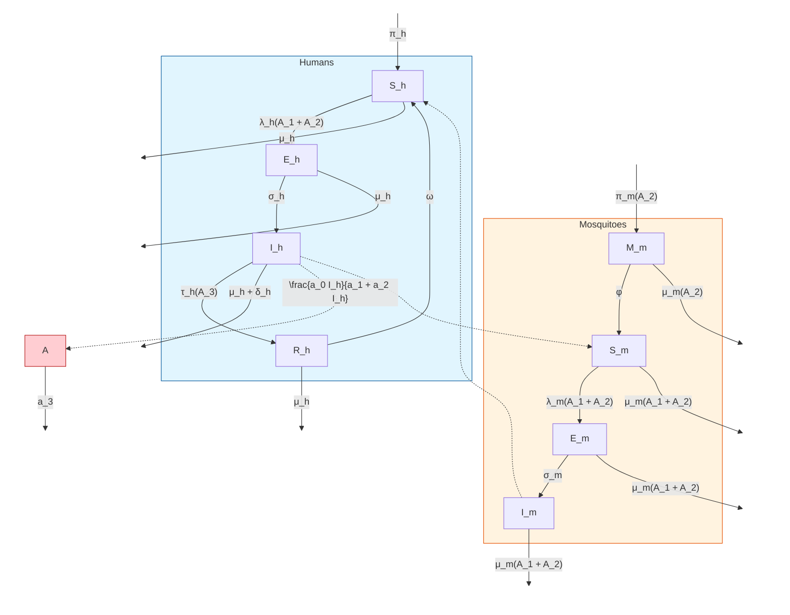

## 2. Information Strategies

* Individuals’ awareness about malaria and its mode of transmission will allow the human population to take precautionary measures such as personal prevention against mosquito bites, and control of mosquito population. As a result of this awareness, it is expected that the human population embraces prevention and treatment of malaria, thus leading to a decrease in the cases of malaria.

* In this study, it was incorporated a saturated function for the level of awareness on bed- nets usage, residual spray, and treatment of infected humans in the model to study the outcome of preventive and treatment measures enhanced by awareness on the dynamic transmission of malaria among humans.

## 3. Assumptions of the model

* The proportion of control interventions usage is equivalent to their level of awareness since realistically the proportion of control intervention usage is dependent on the level of awareness.

<u>**Terms in the Equations Affected by Human Behavior**</u>

**ODE model**

$$
\begin{aligned}
\frac{dS_h}{dt} &= \pi_h + \omega R_h - \lambda_h(A_1 + A_2)S_h - \mu_h S_h \\
\frac{dE_h}{dt} &= \lambda_h(A_1 + A_2)S_h - (\mu_h + \sigma_h)E_h \\
\frac{dI_h}{dt} &= \sigma_h E_h - (\tau_h(A_3) + \mu_h + \delta_h)I_h \\
\frac{dR_h}{dt} &= \tau_h(A_3)I_h - (\mu_h + \omega)R_h \\
\frac{dM_m}{dt} &= \pi_m(A_2) - (\phi + \mu_m(A_2))M_m \\
\frac{dS_m}{dt} &= \phi M_m - \lambda_m(A_1 + A_2)S_m - \mu_m(A_1 + A_2)S_m \\
\frac{dE_m}{dt} &= \lambda_m(A_1 + A_2)S_m - \sigma_m E_m - \mu_m(A_1 + A_2)E_m \\
\frac{dI_m}{dt} &= \sigma_m E_m - \mu_m(A_1 + A_2)I_m \\
\frac{dA}{dt} &= \frac{a_0 I_h}{a_1 + a_2 I_h} - a_3 A
\end{aligned}
$$

Where

$$ \tau_h(A_3) \equiv \tau_h(q) = \tau_h + \frac{\tau_{max} q A_3}{1 + A_3}, \quad 0 \le q \le 1, \enspace 0 \le A_3 \le 1 $$

$$ \pi_m(A_2) \equiv \pi_m(p) = \pi_{max} - \frac{(\pi_{max} - \pi_{min}) p A_2}{1 + A_2}, \quad 0 \le p \le 1, \enspace 0 \le A_2 \le 1 $$

<table>
  <thead>
    <tr>
        <th>Parameter</th>
        <th>Description</th>
    </tr>
  </thead>
  <tbody>
    <tr>
        <td>$\pi_h$</td>
        <td>Recruitment rate of humans</td>
    </tr>
    <tr>
        <td>$\omega$</td>
        <td>Immunity waning rate of humans</td>
    </tr>
    <tr>
        <td>$\sigma_h$</td>
        <td>Disease progression rate from exposed to infectious human</td>
    </tr>
    <tr>
        <td>$\sigma_m$</td>
        <td>Disease progression rate from exposed to infectious mosquito</td>
    </tr>
    <tr>
        <td>$\tau_h$</td>
        <td>Recovery rate of infectious humans</td>
    </tr>
    <tr>
        <td>$\tau_{maxq}$</td>
        <td>Recovery rate of infectious humans due to awareness on treatment care</td>
    </tr>
    <tr>
        <td>$\eta$</td>
        <td>Disease modification parameter</td>
    </tr>
    <tr>
        <td>$\mu_h$</td>
        <td>Natural death rate of humans</td>
    </tr>
    <tr>
        <td>$\delta_h$</td>
        <td>Death rate due to disease for humans</td>
    </tr>
    <tr>
        <td>$\beta_{hm}$</td>
        <td>Probability of effective transmission from human to mosquito</td>
    </tr>
    <tr>
        <td>$\beta_{mh}$</td>
        <td>Probability of effective transmission from mosquito to human</td>
    </tr>
    <tr>
        <td>$\varepsilon_{max}$</td>
        <td>Maximum mosquito biting rate</td>
    </tr>
    <tr>
        <td>$\varepsilon_{min}$</td>
        <td>Minimum mosquito biting rate</td>
    </tr>
    <tr>
        <td>$b$</td>
        <td>Proportion of bed-net usage</td>
    </tr>
    <tr>
        <td>$p$</td>
        <td>Proportion of residual spray indoor or outdoor</td>
    </tr>
    <tr>
        <td>$\pi_{max}$</td>
        <td>Maximum egg deposition rate</td>
    </tr>
    <tr>
        <td>$\pi_{min}$</td>
        <td>Minimum egg deposition rate</td>
    </tr>
    <tr>
        <td>$\phi$</td>
        <td>Maturation rate of immature mosquitoes</td>
    </tr>
    <tr>
        <td>$\mu_m$</td>
        <td>Natural death rate of mosquitoes</td>
    </tr>
    <tr>
        <td>$\mu_{maxb}$</td>
        <td>Mosquitoes death rate as a result of bed-net usage</td>
    </tr>
    <tr>
        <td>$\mu_{maxq}$</td>
        <td>Mosquitoes death rate as a result of residual spray</td>
    </tr>
    <tr>
        <td>$a_0, a_1, a_2$</td>
        <td>Awareness information growth rate</td>
    </tr>
    <tr>
        <td>$a_3$</td>
        <td>Fading of awareness memory</td>
    </tr>
  </tbody>
</table>

<table>
  <thead>
    <tr>
        <th>Variable</th>
        <th>Description</th>
    </tr>
  </thead>
  <tbody>
    <tr>
        <td>$S_h$</td>
        <td>Susceptible humans</td>
    </tr>
    <tr>
        <td>$E_h$</td>
        <td>Exposed humans</td>
    </tr>
    <tr>
        <td>$I_h$</td>
        <td>Infectious humans</td>
    </tr>
    <tr>
        <td>$R_h$</td>
        <td>Recovered humans</td>
    </tr>
    <tr>
        <td>$M_m$</td>
        <td>Immature mosquitoes</td>
    </tr>
    <tr>
        <td>$S_m$</td>
        <td>Susceptible mosquitoes</td>
    </tr>
    <tr>
        <td>$E_m$</td>
        <td>Exposed mosquitoes</td>
    </tr>
    <tr>
        <td>$I_m$</td>
        <td>Infectious mosquitoes</td>
    </tr>
    <tr>
        <td>$\{A_1, A_2, A_3\} \in A$</td>
        <td>Level of awareness (Bed-nets, Residual Spray, and Treatment respectively)</td>
    </tr>
  </tbody>
</table>

<table>
  <thead>
    <tr>
        <th>Parameters</th>
        <th>Baseline value</th>
        <th>Range</th>
        <th>Dimension</th>
        <th>Reference</th>
    </tr>
  </thead>
  <tbody>
    <tr>
        <td>$\pi_h$</td>
        <td>$\left(\frac{10^3}{65 \times 365}\right)$</td>
        <td>$\left(\frac{10^3}{80 \times 365} - \frac{10^3}{58 \times 365}\right)$</td>
        <td>Day$^{-1}$</td>
        <td>[41, 26]</td>
    </tr>
    <tr>
        <td>$\omega$</td>
        <td>0.0005275</td>
        <td>$(5.5 \times 10^{-5} - 1.1 \times 10^{-2})$</td>
        <td>Day$^{-1}$</td>
        <td>[41, 26]</td>
    </tr>
    <tr>
        <td>$\sigma_h$</td>
        <td>0.058824</td>
        <td>$\left(\frac{67}{10^3} - \frac{2}{10}\right)$</td>
        <td>Day$^{-1}$</td>
        <td>[57, 11, 2]</td>
    </tr>
    <tr>
        <td>$\sigma_m$</td>
        <td>0.05555</td>
        <td>$\left(\frac{29}{10^3} - \frac{33}{10^2}\right)$</td>
        <td>Day$^{-1}$</td>
        <td>[57, 11, 2]</td>
    </tr>
    <tr>
        <td>$\tau_h$</td>
        <td>0.0092</td>
        <td>$\left(\frac{14}{10^4} - \frac{17}{10^3}\right)$</td>
        <td>Day$^{-1}$</td>
        <td>[41, 26]</td>
    </tr>
    <tr>
        <td>$\tau_{maxq}$</td>
        <td>$\tau_h \times q$</td>
        <td>$\left(\frac{14}{10^4} - \frac{17}{10^3}\right) \times q$</td>
        <td>Day$^{-1}$</td>
        <td>Estimated</td>
    </tr>
    <tr>
        <td>$\eta$</td>
        <td>0.5</td>
        <td>$(0.1 - 1)$</td>
        <td>Dimensionless</td>
        <td>[41]</td>
    </tr>
    <tr>
        <td>$\mu_h$</td>
        <td>$\left(\frac{1}{65 \times 365}\right)$</td>
        <td>$\left(\frac{1}{80 \times 365} - \frac{1}{58 \times 365}\right)$</td>
        <td>Day$^{-1}$</td>
        <td>[41, 26]</td>
    </tr>
    <tr>
        <td>$\delta_h$</td>
        <td>0.0003454</td>
        <td>$(1 \times 10^{-15} - 4.1 \times 10^{-4})$</td>
        <td>Day$^{-1}$</td>
        <td>[41, 26]</td>
    </tr>
    <tr>
        <td>$\beta_{hm}$</td>
        <td>$\frac{22}{10^3}$</td>
        <td>$\left(\frac{1}{10^2} - \frac{27}{10^2}\right)$</td>
        <td>Dimensionless</td>
        <td>[58, 57]</td>
    </tr>
    <tr>
        <td>$\beta_{mh}$</td>
        <td>$\frac{48}{10^2}$</td>
        <td>$\left(\frac{72}{10^3} - \frac{64}{10^2}\right)$</td>
        <td>Dimensionless</td>
        <td>[58, 57]</td>
    </tr>
    <tr>
        <td>$\varepsilon_{max}$</td>
        <td>0.5</td>
        <td>$(0.1 - 1)$</td>
        <td>Day$^{-1}$</td>
        <td>[58, 57]</td>
    </tr>
    <tr>
        <td>$\varepsilon_{min}$</td>
        <td>$1 \times 10^{-2}$</td>
        <td>$(0 - 0.1)$</td>
        <td>Day$^{-1}$</td>
        <td>[58, 57]</td>
    </tr>
    <tr>
        <td>$b$</td>
        <td>0.250</td>
        <td>$(0 \le b \le 1)$</td>
        <td>Dimensionless</td>
        <td>Variable</td>
    </tr>
    <tr>
        <td>$p$</td>
        <td>0.250</td>
        <td>$(0 \le p \le 1)$</td>
        <td>Dimensionless</td>
        <td>Variable</td>
    </tr>
    <tr>
        <td>$q$</td>
        <td>0.250</td>
        <td>$(0 \le q \le 1)$</td>
        <td>Dimensionless</td>
        <td>Variable</td>
    </tr>
    <tr>
        <td>$\pi_{max}$</td>
        <td>$\frac{10^4}{14}$</td>
        <td>$\left(\frac{10^4}{21} - \frac{10^4}{14}\right)$</td>
        <td>Day$^{-1}$</td>
        <td>[57, 58]</td>
    </tr>
    <tr>
        <td>$\pi_{min}$</td>
        <td>$\frac{10}{14}$</td>
        <td>$\left(\frac{10}{21} - \frac{10}{14}\right)$</td>
        <td>Day$^{-1}$</td>
        <td>[57, 58]</td>
    </tr>
    <tr>
        <td>$\phi$</td>
        <td>0.343</td>
        <td>$(0.333 - 1)$</td>
        <td>Day$^{-1}$</td>
        <td>[41]</td>
    </tr>
    <tr>
        <td>$\mu_m$</td>
        <td>$\frac{1}{18}$</td>
        <td>$\left(\frac{1}{21} - \frac{1}{3}\right)$</td>
        <td>Day$^{-1}$</td>
        <td>[41, 26]</td>
    </tr>
    <tr>
        <td>$\mu_{maxb}$</td>
        <td>$\mu_m \times b$</td>
        <td>$\left(\frac{1}{21} - \frac{1}{3}\right) \times b$</td>
        <td>Day$^{-1}$</td>
        <td>Estimated</td>
    </tr>
    <tr>
        <td>$\mu_{maxp}$</td>
        <td>$\mu_m \times p$</td>
        <td>$\left(\frac{1}{21} - \frac{1}{3}\right) \times p$</td>
        <td>Day$^{-1}$</td>
        <td>Estimated</td>
    </tr>
    <tr>
        <td>$a_0, a_1, a_2$</td>
        <td>0.03</td>
        <td>0.01 – 0.05</td>
        <td>Dimensionless</td>
        <td>Assumed</td>
    </tr>
    <tr>
        <td>$a_3$</td>
        <td>0.01</td>
        <td>0.00 – 0.02</td>
        <td>Dimensionless</td>
        <td>Assumed</td>
    </tr>
    <tr>
        <td>$\{A_1, A_2, A_3\} \in A$</td>
        <td>0.25</td>
        <td>$(0 \le A \le 1)$</td>
        <td>Dimensionless</td>
        <td>Variable</td>
    </tr>
  </tbody>
</table>

**A. Susceptible humans ($S_h$)**

$$\frac{dS_h}{dt} = \pi_h + \omega R_h - \lambda_h(A_1 + A_2)S_h - \mu_h S_h$$

* **Information:**

The susceptible human population is reduced by the force of infection $\lambda_h(A_1 + A_2)S_h$ and $A_1$, $A_2$ represent the awareness about the use of bed-nets and residual spray respectively.

## B. Exposed humans ($E_h$)

$$\frac{dE_h}{dt} = \lambda_h(A_1 + A_2)S_h - (\mu_h + \sigma_h)E_h$$

* **Information:**

The exposed human population increases by the force of infection $\lambda_h(A_1 + A_2)S_h$ and $A_1$, $A_2$ represent the awareness about the use of bed-nets and residual spray respectively.

## C. Infectious humans ($I_h$)

$$\frac{dI_h}{dt} = \sigma_h E_h - (\tau_h(A_3) + \mu_h + \delta_h)I_h$$

* **Information:**

The infectious human population decreases by $\tau_h(A_3)$ that represents the rate of recovery of infectious individuals and $A_3$ is the level of awareness about treatment.

## D. Recovered humans ($R_h$)

$$\frac{dR_h}{dt} = \tau_h(A_3)I_h - (\mu_h + \omega)R_h$$

* **Information:**

The recovered human population increases by $\tau_h(A_3)$ that represents the rate of recovery of infectious individuals and $A_3$ is the level of awareness about treatment.

**E. Immature mosquitoes ($M_m$)**

$$\frac{dM_m}{dt} = \pi_m(A_2) - (\phi + \mu_m(A_2))M_m$$

* **Information:**

The mature mosquito population increases by the rate of mosquito egg deposition $\pi_m(A_2)$, is reduced by $(\phi + \mu_m(A_2))M_m$ where $\mu_m(A_2)$ is the mosquito death rate and $A_2$ is awareness about residual spray.

**F. Susceptible mosquitoes ($S_m$)**

$$\frac{dS_m}{dt} = \phi M_m - \lambda_m(A_1 + A_2)S_m - \mu_m(A_1 + A_2)S_m$$

* **Information:**

The susceptible mosquito population is reduced by $\mu_m(A_1 + A_2)S_m$ and $\mu_m(A_1 + A_2)S_m$, where $\lambda_m(A_1 + A_2)$ is the force of infection and $\mu_m(A_1 + A_2)$ is mosquito mortality, $A_1$ is the awareness about the use of bed-nets and $A_2$ is awareness about residual spray.

**G. Exposed mosquitoes ($E_m$)**

$$\frac{dE_m}{dt} = \lambda_m(A_1 + A_2)S_m - \sigma_m E_m - \mu_m(A_1 + A_2)E_m$$

* **Information:**

The exposed mosquito population increases by $\lambda_m(A_1 + A_2)S_m$, where $\lambda_m(A_1 + A_2)$ is the force of infection and is reduced by $\mu_m(A_1 + A_2)E_m$, where $\mu_m(A_1 + A_2)$ is mosquito mortality, $A_1$ is the awareness about the use of bed-nets and $A_2$ is awareness about residual spray.

**H. Infectious mosquitoes ($I_m$)**

$$\frac{dI_m}{dt} = \sigma_m E_m - \mu_m(A_1 + A_2)I_m$$

*   **Information:**

The infectious mosquito population decreases by $\mu_m(A_1 + A_2)I_m$, where $\mu_m(A_1 + A_2)$ represents mosquito mortality, $A_1$ is the awareness about the use of bed-nets and $A_2$ is awareness about residual spray.

## I. Level of awareness ($A$)

$$\frac{dA}{dt} = \frac{a_0 I_h}{a_1 + a_2 I_h} - a_3 A$$

*   **Information:**

The awareness compartment is populated by the saturated function $F(I_h) = \frac{a_0 I_h}{a_1 + a_2 I_h}$, where $a_0$, $a_1$, and $a_2$ are information growth rate. This class is reduced by fading of memory about awareness, or human sentiment about awareness information at a rate $a_3$.

# Scholar 31: The influence of gender and temephos exposure on community participation in dengue prevention: a compartmental mathematical model (Includes data)

<u>Key Point Analysis of Human Behavior in the Model:</u>

### 1. Compartmental Model Variables:

$N_h$ represents the constant total human population and is divided into **susceptible** ($\underline{S}_h$), individuals on risk of being infected, **infected** ($\underline{I}_h$), humans with the disease, and **recovered** ($R_h$) individuals that recover from the disease and have permanent immunity. The adult female mosquitoes ($M$) is split into **susceptible** ($\underline{S}_v$) and **infected** ($\underline{I}_v$). The vector population dynamic includes three stages, **egg** ($E$), **larva**

(L) and **pupa** (*P*) and the breeding sites were divided in targeted by themephos household containers (**thc**) and nontarget household containers (**nthc**).

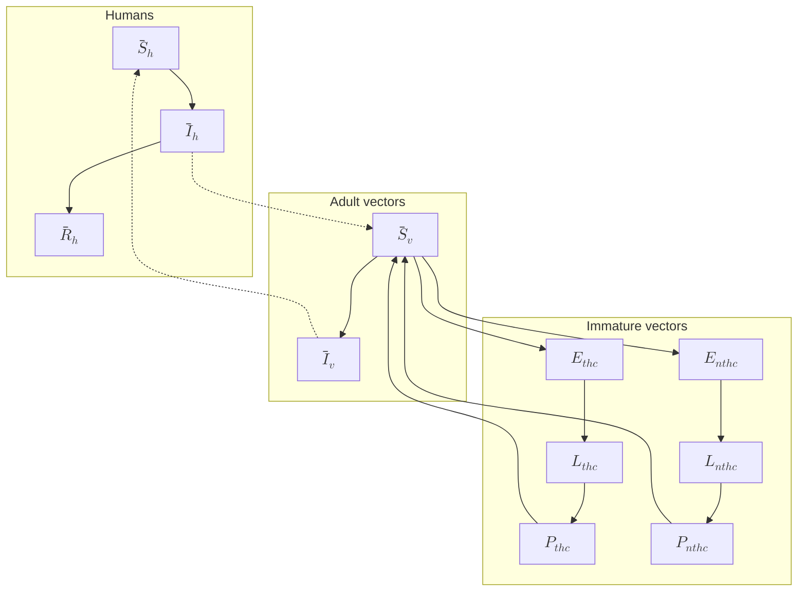

## 2. Control Strategies

There is a differentiation between eggs and aquatic stages, because they respond differently to the control measures.

The model includes functions of two types of control strategies:

* Target tanks, drums, water tanks and cisterns with themephos (*thc*).

Temephos efficacy depends on different factors related to temephos doses, water turnover rate, type of water, and environmental factors around water storage such as organic debris presence, temperature and exposure to sunlight.

* Community participation

As a critical mass of interest, knowledge and confidence accumulates, the quality of participation changes and its effect is more noticeable. After people gain proficiency with a particular control strategy, implementing it fully, the biological potential of the specific activity to control reproduction reaches a peak, before adaptation of the vector mosquito.

$C(t)$ represents the maximum effectiveness of community participation at time $t \in [0, T]$ of 13%, according to superior value of 95%CI for risk difference of pupae per person index calculated.

**3. Assumptions of the model**

* The infection is produced by only one serotype of dengue virus.

* The human population is assumed to be constant.

* The average number of eggs is proportional to the number of female mosquitoes that will result.

* The availability of nutrients and space is different in each type of container (*thc* and *nthc*).

* The number of eggs is proportional to the number of larvae and pupae.

* Human and mosquito populations are mixed homogeneously.

* Community participation affects all stages of the mosquito life cycle, both types of containers, with and without temephos, reduces the load of infection by reducing the probability of human-mosquito transmission.

* Temephos only acts in the larval stage.

* a constant temephos effect of 3%, as an average of the values found in the literature

* We consider that the maturation rates from pupae to adult in the different type of container, $\gamma_{thc}(t)$ and $\gamma_{nthc}(t)$ are modelled for a sinusoidal function with 1-year period.

<u>**Terms in the Equations Affected by Human Behavior**</u>

**1. ODE model**

$$
\begin{aligned}
\frac{d\overline{S}_h}{dt} &= \mu_h(N_h - \overline{S}_h) - \tau_h\overline{S}_h \\
\frac{d\overline{I}_h}{dt} &= \tau_h\overline{S}_h - (\rho + \mu_h)\overline{I}_h \\
\frac{d\overline{R}_h}{dt} &= \rho\overline{I}_h - \mu_h\overline{R}_h \\
\frac{d\overline{S}_v}{dt} &= \gamma_{thc}(t)P_{thc} + \gamma_{nthc}(t)P_{nthc} - \tau_v\overline{S}_v - (\mu_v + C(t))\overline{S}_v \\
\frac{d\overline{I}_v}{dt} &= \tau_v\overline{S}_v - (\mu_v + C(t))\overline{I}_v \\
\frac{dE_{thc}}{dt} &= \theta_{thc}\left(1 - \frac{E_{thc}}{E_{thc}^{max}}\right)(\overline{S}_v + \overline{I}_v) - \varepsilon_{thc}E_{thc} - (\mu_E + C(t))E_{thc} \\
\frac{dE_{nthc}}{dt} &= \theta_{nthc}\left(1 - \frac{E_{nthc}}{E_{nthc}^{max}}\right)(\overline{S}_v + \overline{I}_v) - \varepsilon_{nthc}E_{nthc} - (\mu_E + C(t))E_{nthc} \\
\frac{dL_{thc}}{dt} &= \varepsilon_{thc}\left(1 - \frac{L_{thc}}{L_{thc}^{max}}\right)E_{thc} - \lambda_{thc}L_{thc} - (\mu_L + A + C(t))L_{thc} \\
\frac{dL_{nthc}}{dt} &= \varepsilon_{nthc}\left(1 - \frac{L_{nthc}}{L_{nthc}^{max}}\right)E_{nthc} - \lambda_{nthc}L_{nthc} - (\mu_L + C(t))L_{nthc} \\
\frac{dP_{thc}}{dt} &= \lambda_{thc}L_{thc} - \gamma_{thc}(t)P_{thc} - (\mu_P + C(t))P_{thc} \\
\frac{dP_{nthc}}{dt} &= \lambda_{nthc}L_{nthc} - \gamma_{nthc}(t)P_{nthc} - (\mu_P + C(t))P_{nthc}
\end{aligned}
$$

(3)

$$
\begin{aligned}
\frac{d\overline{S}_h}{dt} &= \mu_h(N_h - \overline{S}_h) - \tau_h\overline{S}_h \\
\frac{d\overline{I}_h}{dt} &= \tau_h\overline{S}_h - (\rho + \mu_h)\overline{I}_h \\
\frac{d\overline{R}_h}{dt} &= \rho\overline{I}_h - \mu_h\overline{R}_h \\
\frac{d\overline{S}_v}{dt} = \gamma_{thc}(t)P_{thc} &+ \gamma_{nthc}(t)P_{nthc} - \tau_v\overline{S}_v - (\mu_v + C(t))\overline{S}_v \\
\frac{d\overline{I}_v}{dt} &= \tau_v\overline{S}_v - (\mu_v + C(t))\overline{I}_v \\
\frac{dE_{thc}}{dt} = \theta_{thc}(1 - &\frac{E_{thc}}{E_{thc}^{max}})(\overline{S}_v + \overline{I}_v) - \varepsilon_{thc}E_{thc} - (\mu_E + C(t))E_{thc} \\
\frac{dE_{nthc}}{dt} = \theta_{nthc}(1 - &\frac{E_{nthc}}{E_{nthc}^{max}})(\overline{S}_v + \overline{I}_v) - \varepsilon_{nthc}E_{nthc} - (\mu_E + C(t))E_{nthc} \\
\frac{dL_{thc}}{dt} = \varepsilon_{thc}(1 - &\frac{L_{thc}}{L_{thc}^{max}})E_{thc} - \lambda_{thc}L_{thc} - (\mu_L + A + C(t))L_{thc} \\
\frac{dL_{nthc}}{dt} = \varepsilon_{nthc}(1 - &\frac{L_{nthc}}{L_{nthc}^{max}})E_{nthc} - \lambda_{nthc}L_{nthc} - (\mu_L + C(t))L_{nthc} \\
\frac{dP_{thc}}{dt} &= \lambda_{thc}L_{thc} - \gamma_{thc}(t)P_{thc} - (\mu_P + C(t))P_{thc} \\
\frac{dP_{nthc}}{dt} &= \lambda_{nthc}L_{nthc} - \gamma_{nthc}(t)P_{nthc} - (\mu_P + C(t))P_{nthc}
\end{aligned}
$$

Where:

$$ \tau_h = \alpha \beta_{vh} (1 - C(t)) \frac{I_v}{N_h} $$

$$ \tau_v = \alpha \beta_{hv} (1 - C(t)) \frac{I_h}{N_h} $$

$$ \gamma_{thc}(t) = \gamma_{nthc}(t) = \gamma_0 (1 + \zeta \cos(\frac{2\pi}{365}t + \varphi)) $$

$$ C(t) = C_F(t) + C_M(t) $$

$$ C_F(t) = \frac{K_F C_0 e^{rt}}{K_F + C_0 (e^{rt} - 1)} $$

$$ C_M(t) = \frac{(K_{max} - K_F) C_0 e^{rt}}{(K_{max} - K_F) + C_0 (e^{rt} - 1)} $$

$$ K_F = \frac{P_F}{P_F + P_M} K_{max} $$

$K_{max} - K_F$ is the men’s contribution capacity

<table>
  <thead>
    <tr>
        <th>Parameter</th>
        <th>Description</th>
        <th>Baseline value/range</th>
    </tr>
  </thead>
  <tbody>
    <tr>
        <td>$\mu_h$</td>
        <td>Natural birth and mortality rate in humans</td>
        <td>$\frac{1}{(73 \times 365)} day^{-1}$</td>
    </tr>
    <tr>
        <td>$a$</td>
        <td>Average number of mosquito bites</td>
        <td>$[0.3, 1] day^{-1}$</td>
    </tr>
    <tr>
        <td>$\beta_{vh}$</td>
        <td>Probability of transmission of infection from an infective vector to a susceptible human</td>
        <td>$[0.1, 0.75] day^{-1}$</td>
    </tr>
    <tr>
        <td>$\beta_{hv}$</td>
        <td>Probability of transmission of infection from an infected human to a susceptible vector</td>
        <td>$[0.1, 0.75] day^{-1}$</td>
    </tr>
    <tr>
        <td>$\rho$</td>
        <td>Recover rate for human</td>
        <td>$[0.10, 0.25] day^{-1}$</td>
    </tr>
    <tr>
        <td>$\mu_v$</td>
        <td>Natural mortality rate of vectors</td>
        <td>$[0.03, 0.125] day^{-1}$</td>
    </tr>
    <tr>
        <td>$\theta_{thc}$</td>
        <td>Numbers of eggs in target household containers</td>
        <td>$[1, 6] day^{-1}$</td>
    </tr>
    <tr>
        <td>$\theta_{nthc}$</td>
        <td>Numbers of eggs in no-target household containers</td>
        <td>$[1, 6] day^{-1}$</td>
    </tr>
    <tr>
        <td>$E_{thc}^{max}$</td>
        <td>Carrying capacity for eggs in target household containers</td>
        <td>$[10^3, 10^6] day^{-1}$</td>
    </tr>
    <tr>
        <td>$E_{nthc}^{max}$</td>
        <td>Carrying capacity for eggs in non-target household containers</td>
        <td>$[10^3, 10^6] day^{-1}$</td>
    </tr>
    <tr>
        <td>$\varepsilon_{thc}$</td>
        <td>Transfer rate from eggs to larvae in target household containers</td>
        <td>$0.7 day^{-1}$</td>
    </tr>
    <tr>
        <td>$\varepsilon_{nthc}$</td>
        <td>Transfer rate from eggs to larvae in non-target household containers</td>
        <td>$0.7 day^{-1}$</td>
    </tr>
    <tr>
        <td>$\mu_E$</td>
        <td>Eggs death rate per day</td>
        <td>$[0.2, 0.4] day^{-1}$</td>
    </tr>
    <tr>
        <td>$L_{thc}^{max}$</td>
        <td>Carrying capacity for larvae in target household containers</td>
        <td>$[5 \times 10^2, 5 \times 10^5] day^{-1}$</td>
    </tr>
    <tr>
        <td>$L_{nthc}^{max}$</td>
        <td>Carrying capacity for larvae in no-target household containers</td>
        <td>$[5 \times 10^2, 5 \times 10^5] day^{-1}$</td>
    </tr>
    <tr>
        <td>$\lambda_{thc}$</td>
        <td>Transfer rate from larvae to pupae in target household containers</td>
        <td>$0.5 day^{-1}$</td>
    </tr>
    <tr>
        <td>$\lambda_{nthc}$</td>
        <td>Transfer rate from larvae to pupae in no-target household containers</td>
        <td>$0.5 day^{-1}$</td>
    </tr>
    <tr>
        <td>$\mu_L$</td>
        <td>Larvae death rate</td>
        <td>$[0.2, 0.4] day^{-1}$</td>
    </tr>
    <tr>
        <td>$\mu_P$</td>
        <td>Pupae death rate</td>
        <td>$0.4 day^{-1}$</td>
    </tr>
    <tr>
        <td>$Y_0$</td>
        <td>Average reproduction maturation rate from pupae to adult in different containers</td>
        <td>$[0.08, 0.15] day^{-1}$</td>
    </tr>
    <tr>
        <td>$\zeta$</td>
        <td>Amplitude of the seasonal variation in the reproduction rate of vectors</td>
        <td>$[0, 0.9]$</td>
    </tr>
    <tr>
        <td>$A$</td>
        <td>Effect produced by temephos in the target household containers</td>
        <td>$0.03$</td>
    </tr>
    <tr>
        <td>$k_{max}$</td>
        <td>Total maximum capacity of community participation effectiveness for the control of the dengue vector</td>
        <td>$0.13$</td>
    </tr>
    <tr>
        <td>$P_F$</td>
        <td>Proportion of participation of women in control mosquito activities</td>
        <td>$0.25$</td>
    </tr>
    <tr>
        <td>$P_M$</td>
        <td>Proportion of participation of men in control mosquito activities</td>
        <td>$0.02$</td>
    </tr>
    <tr>
        <td>$C_0$</td>
        <td>Effectiveness of pre-existing community participation</td>
        <td>$0.001$</td>
    </tr>
    <tr>
        <td>$r$</td>
        <td>Incremental rate of community participation effectiveness</td>
        <td>$0.015$</td>
    </tr>
  </tbody>
</table>

## A. Susceptible individuals ($S_h$)

$$ \frac{dS_h}{dt} = \mu_h(N_h - S_h) - \tau_h S_h $$

$$\tau_h = a\beta_{vh}(1 - C(t))\frac{I_v}{N_h}$$

* **Control Strategies:**

The human susceptible population is decreased following the infection force rate which is reduced by $1 - C(t)$, and $C(t)$ represent control of the disease through community participation.

## B. Infected individuals ($I_h$)

$$\frac{d\ I_h}{dt} = \tau_h\ \underline{S}_h - (\rho + \mu_h)\ \underline{I}_h$$
$$\tau_h = a\beta_{vh}(1 - C(t))\frac{I_v}{N_h}$$

* **Control Strategies:**

The human infected population increases following the infection force rate which is reduced by $1 - C(t)$, and $C(t)$ represent control of the disease through community participation.

## C. Susceptible vectors ($\underline{S}_v$)

$$\frac{d\ \underline{S}_v}{dt} = \gamma_{thc}(t)P_{thc} + \gamma_{nthc}(t)P_{nthc} - \tau_v\ \underline{S}_v - (\mu_v + C(t))\ \underline{S}_v$$
$$\tau_v = a\beta_{hv}(1 - C(t))\frac{I_h}{N_h}$$

* **Control Strategies:**

$1 - C(t)$ describes the reduction in contacts between infected mosquitos and susceptible humans, reflecting the reduced mosquito population, $(\mu_v + C(t))\ \underline{S}_v$

represents the natural mortality and additional mortality attributed to community participation in control efforts ($C(t)$).

## D. Infected vectors ($I_v$)
$$ \frac{d\ I_v}{dt} = \tau_v \underline{S}_v - (\mu_v + C(t)) \ \underline{I}_v $$
$$ \tau_v = \alpha \beta_{hv} (1 - C(t)) \frac{\underline{I}_h}{N_h} $$

● **Control Strategies:**

$1 - C(t)$ describes the reduction in contacts between infected mosquitos and susceptible humans, $(\mu_v + C(t)) \ \underline{I}_v$ represents the natural mortality and additional mortality attributed to community participation in control efforts ($C(t)$).

## E. Eggs in targeted household containers ($E_{thc}$)

$$ \frac{dE_{thc}}{dt} = \theta_{thc} (1 - \frac{E_{thc}}{E_{thc}^{max}}) (\ \underline{S}_v + \ \underline{I}_v \ ) - \varepsilon_{thc} E_{thc} - (\mu_E + C(t)) E_{thc} $$

● **Control Strategies:**

$(\mu_E + C(t)) E_{thc}$ represents the natural mortality and additional mortality attributed to community participation in control efforts ($C(t)$).

## F. Eggs in non targeted household containers ($E_{nthc}$)

$$ \frac{dE_{nthc}}{dt} = \theta_{nthc} (1 - \frac{E_{nthc}}{E_{nthc}^{max}}) (\ \underline{S}_v + \ \underline{I}_v \ ) - \varepsilon_{nthc} E_{nthc} - (\mu_E + C(t)) E_{nthc} $$

*   **Control Strategies:**

$(\mu_E + C(t))E_{nthc}$ represents the natural mortality and additional mortality attributed to community participation in control efforts ($C(t)$).

# G. Larvae in targeted household containers ($L_{thc}$)

$$ \frac{dL_{thc}}{dt} = \varepsilon_{thc}(1 - \frac{L_{thc}}{L_{thc}^{max}})E_{thc} - \lambda_{thc}L_{thc} - (\mu_L + A + C(t))L_{thc} $$

*   **Control Strategies:**

$(\mu_L + A + C(t))L_{thc}$ represents the natural mortality and additional mortality attributed to community participation in control efforts ($C(t)$) and the effect produced by temephos ($A$).

# H. Larvae in non targeted household containers ($L_{nthc}$)

$$ \frac{dL_{nthc}}{dt} = \varepsilon_{nthc}(1 - \frac{L_{nthc}}{L_{nthc}^{max}})E_{nthc} - \lambda_{nthc}L_{nthc} - (\mu_L + C(t))L_{nthc} $$

*   **Control Strategies:**

$(\mu_L + C(t))L_{nthc}$ represents the natural mortality and additional mortality attributed to community participation in control efforts ($C(t)$).

# I. Pupae in targeted household containers ($P_{thc}$)

$$ \frac{dP_{thc}}{dt} = \lambda_{thc}L_{thc} - \gamma_{thc}(t)P_{thc} - (\mu_P + C(t))P_{thc} $$

*   **Control Strategies:**

$(\mu_P + C(t))P_{thc}$ represents the natural mortality and additional mortality attributed to community participation in control efforts ($C(t)$).

**J. Pupae in non targeted household containers ($P_{nthc}$)**

$$ \frac{dP_{nthc}}{dt} = \lambda_{nthc}L_{nthc} - \gamma_{nthc}(t)P_{nthc} - (\mu_P + C(t))P_{nthc} $$

*   **Control Strategies:**

$(\mu_P + C(t))P_{nthc}$ represents the natural mortality and additional mortality attributed to community participation in control efforts ($C(t)$).

# Scopus 15 IMPACT OF HUMAN BEHAVIOR ON ITNS CONTROL STRATEGIES TO PREVENT THE SPREAD OF VECTOR BORNE DISEASES

**Key Point Analysis of Human Behavior in the Model:**

**1. Compartmental Model Variables:**

The population is divided into 4 compartments: Susceptible host (human) $S_h$, Infected host (Human) $I_h$, Susceptible vector $S_v$, Infected vector $I_v$

**1. Behavioral Change Model (BCM) Influence**

The **BCM** was introduced to assess how human behavior affects ITN use. This aligns with behavioral epidemiology, which examines how behavior impacts disease spread.

**2. Reasons for Not Using ITNs**

Several behavioral factors discourage ITN use, including:

*   Hot weather and discomfort.

*   Fear or disturbance during sleep.

*   Misinformation about ITNs' safety, including concerns over chemical exposure.

**3. Imitation Game Dynamics in Behavioral Shifts**

* The model applies an **imitation-game approach**, where individuals switch ITN usage habits based on persuasion from pro-ITN and anti-ITN groups.

* Persuasion strength from either group impacts disease control efforts.

**4. Public Health (PH) Interventions as External Influence**

* PH efforts act as an external force influencing ITN adoption. The model suggests that when anti-ITN persuasion is strong, increased PH intervention is necessary to maintain disease control.

**5. Mathematical Analysis of Human Behavior in Disease Spread**

* Stability analysis shows that a **disease-free equilibrium is stable if R0<1**, but persuasion dynamics can lead to a **transcritical bifurcation**, where disease persistence depends on human behavior.

**6. Optimal Control Strategies for Behavior Modification**

* Public health interventions need to be **time-sensitive**:

    - Early, strong interventions are more effective.

    - Delayed or weak interventions lead to **higher disease prevalence and increased costs**.

<u>**Terms in the Equations Affected by Human Behavior**</u>

**ODEs model**

$$
\begin{aligned}
\frac{dS_h}{dt} &= \Lambda_h - \lambda_h(w)S_h - \mu S_h + \delta I_h \\
\frac{dI_h}{dt} &= \lambda_h(w)S_h - (\alpha_d + \mu + \delta)I_h \\
\frac{dS_v}{dt} &= \Lambda_v - \lambda_v(w)S_v - \eta S_v \\
\frac{dI_v}{dt} &= \lambda_v(w)S_v - \eta I_v
\end{aligned}
$$

<table>
  <thead>
    <tr>
        <th>Parameter</th>
        <th>Description</th>
        <th>Baseline value</th>
    </tr>
  </thead>
  <tbody>
    <tr>
        <td>$\Lambda_h$</td>
        <td>Immigration rate in humans</td>
        <td>$10^3/(70 \times 365)$</td>
    </tr>
    <tr>
        <td>$\Lambda_v$</td>
        <td>Immigration rate in mosquitoes</td>
        <td>$10^4/21$</td>
    </tr>
    <tr>
        <td>$\mu$</td>
        <td>Natural mortality rate in humans</td>
        <td>$1/(70 \times 365)$</td>
    </tr>
    <tr>
        <td>$\eta$</td>
        <td>Natural mortality rate in mosquitoes</td>
        <td>$1/21$</td>
    </tr>
    <tr>
        <td>$\eta_{bn}$</td>
        <td>Maximum ITN-induced death rate in mosquitoes</td>
        <td>$1/21$</td>
    </tr>
    <tr>
        <td>$\alpha_d$</td>
        <td>Disease-induced death rate in humans</td>
        <td>$10^{-3}$</td>
    </tr>
    <tr>
        <td>$p_1$</td>
        <td>Prob. of disease transm. from mosquito to human</td>
        <td>variable</td>
    </tr>
    <tr>
        <td>$p_2$</td>
        <td>Prob. of disease transm. from human to mosquito</td>
        <td>variable</td>
    </tr>
    <tr>
        <td>$\beta_{\text{max}}$</td>
        <td>Maximum host-vector contact rate</td>
        <td>0.6</td>
    </tr>
    <tr>
        <td>$\beta_{\text{min}}$</td>
        <td>Minimum host-vector contact rate</td>
        <td>0.005</td>
    </tr>
    <tr>
        <td>$\delta$</td>
        <td>Recovery rate of infectious humans to be susceptible</td>
        <td>1/4</td>
    </tr>
    <tr>
        <td>$\alpha$</td>
        <td>Rate of persuasion by the anti-ITNs groups</td>
        <td>variable</td>
    </tr>
    <tr>
        <td>$\theta$</td>
        <td>Rate of persuasion by the pro-ITNs groups</td>
        <td>variable</td>
    </tr>
  </tbody>
</table>

2. Contact Rate ($\beta(w)$) – Affected by ITN Usage

The human-mosquito contact rate affected by ITN usage:

$$ \beta(w) = \beta_{\text{max}} - w(\beta_{\text{max}} - \beta_{\text{min}}) $$

Where:

*   $\beta_{\text{max}}$: Maximum contact rate (without ITN use).

*   $\beta_{\text{min}}$: Minimum contact rate (if everyone uses ITNs).

*   w: Fraction of the population using ITNs.

**Higher w** (more people using ITNs) **decreases the human-mosquito contact rate** $\beta(w)$, because ITNs act as a barrier between humans and mosquitoes, reducing the likelihood of bites.

3. Human and Mosquito Force of Infection ($\lambda_h(w), \lambda_v(w)$)

The human force of infection is:

$$ \lambda_h(w) = p_1 \beta(w) \frac{I_v}{N_h} $$

The mosquito force of infection is:

$$ \lambda_v(w) = p_2 \beta(w) \frac{I_h}{N_h} $$

Where:

* $p_1$: Probability of transmission from mosquito to human.

* $I_v$: Number of infectious mosquitoes.

* $N_h$: Total human population.

* $p_2$: Probability of transmission from human to mosquito.

* $I_h$: Number of infectious humans.

* $N_h$: Total human population.

So, **Increased ITN usage** (higher w) **reduces** the human-mosquito contact rate $\beta(w)$, thus decreasing the force of infection $\lambda_h(w)$ and $\lambda_v(w)$.

## 4. Mosquito Death Rate ($\eta(w)$) – Affected by ITN Usage

The mosquito death rate with ITN usage is:

$$\eta(w) = \eta + \eta_{bn}w$$

Where:

* $\eta$: Natural mosquito death rate.

* $\eta_{bn}$: Additional mosquito death rate due to Insecticide(ITNs) on treated net bed which can control by human

**So, Higher w** (more people using ITNs) **increases the mosquito death rate**, as more mosquitoes come into contact with insecticide-treated nets, causing them to die more frequently.

## 5. ITN Usage Rate

$$\frac{dw}{dt} = (\theta - \alpha)w(1 - w) + \gamma(1 - w)$$

Where:

* $\theta$: Persuasion rate of the **pro-ITN** group.

* $\alpha$: Persuasion rate of the **anti-ITN** group.

* $\gamma$: External **public health intervention** efforts.

**Pro-ITN group influence** ($\theta$) increases ITN adoption, encouraging people to use ITNs.

**Anti-ITN group influence** ($\alpha$) decreases ITN adoption, discouraging the use of ITNs.

**Public health interventions** ($\gamma$) can promote ITN usage by providing information, education, and access to ITNs, which can shift the population's behavior towards greater adoption of ITNs.

## 6. Basic Reproduction Number

$$ R_0(w) = \frac{p_1 p_2 \left[ \beta^*(w) \right]^2 \Lambda_v \mu}{\eta^2 \Lambda_h \alpha_o} $$

**ITN Usage and Contact Rate** ($\beta^*(w)$):

*   The **human-mosquito contact rate** $\beta^*(w)$ **is decreased** as more people use ITNs. This reduces the frequency of mosquito bites, lowering the probability of transmission. Therefore, **higher ITN usage (higher w) leads to a lower** $R_0(w)$.

# ODEs

# Scholar 21: A mathematical model of dengue transmission with memory

<u>**Key Point Analysis of Human Behavior in the Model:**</u>

## 1. Compartmental Model Variables:

$M(t)$ is the total full-grown female mosquito population and is subdivided into susceptible female mosquitoes $M_s$ and infected female mosquitoes $M_I$. The total human population is represented by $H$ and split into susceptible humans $H_S$, infected humans $H_I$, and recovered humans $H_R$.

## 2. Memory

<mark>The memory is incorporated in</mark>

<mark>the model by using a fractional differential operator.</mark>

<mark>Recent entomological studies on Aedes aegypti revealed that mosquito did not feed randomly on host blood,</mark>

<mark>but they use their prior experience about a host location and a host defensiveness to select a host to feed on. Furthermore, on human population also, the memory plays a key role in dengue transmission. In epi-</mark>

<mark>demic and endemic area's awareness about dengue will lessen the contact rate between host and mosquitoes</mark>

<mark>The memory is incorporated in the model</mark>

<mark>by using fractional differential operator and order of the fractional derivative as an index of memory</mark>

# 3. Assumptions of the model

**<u>Terms in the Equations Affected by Human Behavior</u>**

**ODE model**

$$ \frac{dM_S}{dt} = \Pi_V - \frac{b\beta_m}{H}M_SH_I - \mu_mM_S, $$
$$ \frac{dM_I}{dt} = \frac{b\beta_m}{H}M_SH_I - \mu_mM_I, $$
$$ \frac{dH_S}{dt} = \mu_h(H - H_S) - \frac{b\beta_h}{H}H_SM_I, $$
$$ \frac{dH_I}{dt} = \frac{b\beta_h}{H}H_SM_I - (\mu_h + \theta_h)H_I. $$

$$ \frac{dM_S}{dt} = \Pi_V - \frac{b\beta_m}{H}M_SH_I - \mu_mM_S $$

$$ \frac{dM_I}{dt} = \frac{b\beta_m}{H}M_SH_I - \mu_mM_I, $$

$$ \frac{dM_S}{dt} = \Pi_V - \frac{b\beta_m}{H}M_SH_I - \mu_mM_S $$

Where:

**Table 1**
Description of the dengue model (2.1) parameters and their possible feasible ranges.

<table>
  <thead>
    <tr>
        <th>Parameter</th>
        <th>Biological meaning</th>
        <th>Range of values</th>
    </tr>
  </thead>
  <tbody>
    <tr>
        <td>Π<sub>V</sub></td>
        <td>Recruitment rate of adult female vector population</td>
        <td>(12,000–150,000) month<sup>−1a</sup></td>
    </tr>
    <tr>
        <td>$b$</td>
        <td>Average bite per mosquito per month</td>
        <td>(9–30) month<sup>−1</sup></td>
    </tr>
    <tr>
        <td>$\beta_m$</td>
        <td>Transmission probability from human to vector</td>
        <td>(0.5–1)</td>
    </tr>
    <tr>
        <td>$\mu_m$</td>
        <td>Death rate of vector population</td>
        <td>(0.6–7.5) month<sup>−1</sup></td>
    </tr>
    <tr>
        <td>$\mu_h^{-1}$</td>
        <td>Average host life expectancy = host recruitment rate<sup>−1</sup></td>
        <td>(50–75) (year)</td>
    </tr>
    <tr>
        <td>$\beta_h$</td>
        <td>Transmission probability from vector to human</td>
        <td>(0.1–1)</td>
    </tr>
    <tr>
        <td>$\theta_h$</td>
        <td>Dengue recovery rate in human population</td>
        <td>(2.14–10) month<sup>−1</sup></td>
    </tr>
  </tbody>
</table>

<sup>a</sup> The range for the vector recruitment rate (Π<sub>V</sub>) was used in most of the modeling studies.

# Scholar 27: A generic model for a single strain mosquito-transmitted disease with memory on the host and the vector

# SD 1: Correlations between stochastic endemic infection in multiple interacting subpopulations

The paper shows an approximation for the correlation between the level of infection in two subpopulations as a function of the coupling between them.

<u>Key Point Analysis of Human Behavior in the Model:</u>

## 1. Simple stochastic SIR model

At any time, individuals are in one of three states: susceptible, infected or recovered.

* A given susceptible individual meets others individuals at a rate $m$

* If the other individual is infected, then transmission of infection occurs with probability $\tau$ and the susceptible individual immediately becomes infected and infectious to others

* Transmission rate: $\beta = m\tau$

This model is extended to $P$ identical populations of size $N$.

**Matrix of coupling:**

$$ \mathbf{\Sigma} = (\sigma_{ij}) $$

describes the interaction or ‘coupling’ between all possible pairs of populations, and the force of infection in each subpopulation depends on the number of infected individuals in all other sub-populations.

$$ \sum_j \sigma_{ij} = 1 \text{ and so } \sigma_{ii} = 1 - \sum_j \sigma_{ij}. $$

Where,

$$ S_i(t), I_i(t), R_i(t) \in \{0, 1, 2, \dots\} $$

denote the number of susceptible and recovered individuals, respectively in populations $i = 1, 2, \dots P$.

## 2. Transmission rates for Markov chain

### Table 1

A summary of the transition rates of the $2P$-dimensional Markov chain endemic infection model $\{(S_j(t), I_j(t))_{j=1}^P : t \ge 0\}$ from state $(s_1, i_1, s_2, i_2, \dots, s_P, i_P)$ with birth/death rate $\mu > 0$, contact rate $\beta > 0$, external import rate $\epsilon > 0$, recovery rate $\gamma > 0$ and coupling matrix $\mathbf{\Sigma}$.

<table>
  <thead>
    <tr>
        <th>Population</th>
        <th>Event</th>
        <th>Transition</th>
        <th>Rate</th>
    </tr>
  </thead>
  <tbody>
    <tr>
        <td rowspan="4">j = 1, 2, ..., P</td>
        <td>Infection</td>
        <td>s_j → s_j - 1, i_j → i_j + 1</td>
        <td>\beta s_j \sum_l \sigma_{jl} i_l / N + \epsilon s_j</td>
    </tr>
    <tr>
        <td>Recovery</td>
        <td>i_j → i_j - 1, r_j → r_j + 1</td>
        <td>\gamma i_j</td>
    </tr>
    <tr>
        <td>Death of infected</td>
        <td>s_j → s_j + 1, i_j → i_j - 1</td>
        <td>\mu i_j</td>
    </tr>
    <tr>
        <td>Death of recovered</td>
        <td>s_j → s_j + 1, r_j → r_j - 1</td>
        <td>\mu(N - s_j - i_j)</td>
    </tr>
  </tbody>
</table>

Diagrams of complete networks for P=3 and P=5 populations. (a) shows a triangle of three nodes (1, 2, 3) with bidirectional arrows between all pairs and self-loops. (b) shows a pentagon of five nodes (1, 2, 3, 4, 5) with bidirectional arrows between all pairs and self-loops. Labels include coupling strengths like σ, 1-2σ, and 1-4σ.

**Fig. 1.** The complete network on (a) $P = 3$ and (b) $P = 5$ populations. The coupling between any pair of populations coupling is $\sigma \in [0, 1/(P - 1)]$ and so the within-population coupling is $1 - (P - 1)\sigma$.

## 3. Movement

* The model incorporates **spatial heterogeneity** by considering different interaction structures (complete network, tree network, and star network).

* Human mobility is abstracted as a **coupling between subpopulations**, where individuals interact more within their local population and to a lesser extent with others.

* The model acknowledges that real-world human mobility patterns (commuting, migration) influence disease transmission.

<u>**Terms in the Equations Affected by Human Behavior**</u>

### 1. Coupling Parameter ($\sigma_{ij}$) – Interaction Between Subpopulations

* **Definition**: Represents the fraction of an individual's contacts that occur with individuals in another subpopulation.

* **Human Behavior Impact**:
    

    * Travel patterns, commuting, and migration influence $\sigma_{ij}$.
    

    * Social distancing, lockdowns, and mobility restrictions lower $\sigma_{ij}$.
    

    * Higher social connectivity (e.g., urban environments) increases $\sigma_{ij}$.

### 2. Transmission Rate ($\beta$) – Rate of Disease Spread

* **Definition**: $\beta = m\tau$, where:
    

    * $m$ = contact rate (frequency of interactions)
    

    * $\tau$ = probability of transmission per contact

* **Human Behavior Impact**:
    

    * Changes in hygiene practices (e.g., mask-wearing, handwashing) reduce $\tau$.

* Behavioral interventions (e.g., reducing large gatherings) lower m, decreasing $E$.

* Cultural and occupational factors (e.g., essential workers, high-contact professions) affect m.

## 3. External Infection Import Rate ($\epsilon$) – Introduction of Infection

* **Definition**: Represents infection introduced from outside the modeled population.

* **Human Behavior Impact**:

    * International and regional travel increases $\epsilon$.

    * Quarantine policies reduce $\epsilon$.

    * Seasonal human mobility patterns (e.g., holidays, festivals) create temporal fluctuations in $\epsilon$.

## 4. Recovery Rate ($\gamma$) – Duration of Infection

* **Definition**: The rate at which infected individuals recover.

* **Human Behavior Impact**:

    * Access to healthcare and treatment adherence affect $\gamma$.

    * Self-isolation and seeking early treatment can influence disease duration.

    * Variability in personal immune responses (e.g., vaccination status) impacts $\gamma$.

## 5. Death Rate ($\mu$) – Natural Population Turnover

* **Definition**: Represents the rate of death (independent of infection).

* **Human Behavior Impact**:

    * Healthcare access, socioeconomic conditions, and lifestyle factors affect mortality rates.

    * High-risk behaviors (e.g., smoking, poor nutrition) may indirectly alter $\mu$.

## 6. Basic Reproduction Number ($R_0$) – Expected Secondary Cases per Infection

* **Definition**: $R_0 = \frac{\beta}{\gamma + \mu}$, representing the potential spread of the disease in a fully susceptible population.

* **Human Behavior Impact**:

    * If people change their contact patterns (e.g., reducing interactions), $R_0$ decreases.

    * Widespread vaccination effectively reduces $\beta$, lowering $R_0$.

    * Behavioral compliance with public health measures significantly affects epidemic outcomes.

# 7. Correlation Between Subpopulations ($\rho$) – Strength of Disease Synchronization

* **Definition**: Measures how infection levels in different subpopulations are related.

    * $\rho_{ij} = \frac{Cov(I_i, I_j)}{\sqrt{Var(I_i)Var(I_j)}}$

* **Human Behavior Impact**:

    * Increased travel and interaction between populations strengthen $\rho$.

    * Travel restrictions and isolation reduce correlation.

    * Behavioral heterogeneity (different adherence levels to interventions) can cause $\rho$ to vary across regions.

# WofS 13: Comparing metapopulation dynamics of infectious diseases under different models of human movement

<u>Key Point Analysis of Human Behavior in the Model:</u>

## 1. Importance of Human Movement in Disease Spread

* **Key Point**: Human movement is a critical driver of infectious disease transmission across large geographical distances, as evidenced by real-world epidemics like SARS, Ebola, Zika, and COVID-19.

* **Behavioral Aspect**: Long-distance travel by infected individuals facilitates the spread of diseases between spatially separated populations. The study leverages newly available datasets (e.g., census data, mobile phone records, GPS logs) to quantify this behavior.

* **Modeling Implication**: The choice of movement model directly affects predictions of epidemic size, timing, and intervention effectiveness, highlighting the need to accurately represent human mobility patterns.

## 2. Two Movement Models Compared

The study contrasts two distinct approaches to modeling human movement:

a. **<u>Flux Model</u>**

* **Description**: An Eulerian approach where movement is represented as a continuous flow of individuals between locations, governed by symmetric rates (e.g., $f_{ij} = f_{ji}$).

* **Behavioral Representation**: Assumes a steady-state flow without explicitly tracking individual trips or return times. It focuses on the net movement volume between locations.

* **Key Characteristics**:

    - Requires fewer parameters (e.g., $K(K-1)/2$ for $K$ locations), making it simpler to parameterize with basic flux data (e.g., total travelers from $i$ to $j$).

    - Does not constrain the duration of time spent away, potentially overestimating exposure risk in high-transmission areas.

* **Outcome**: In some scenarios (e.g., Bioko Island malaria case), it produces nonsensical results (e.g., invalid $R_0$) due to its lack of temporal specificity.

b. **<u>Simple Trip Model</u>**

* **Description**: A Lagrangian approach that tracks individuals leaving their home location ($\phi_{ij}$) and returning ($\tau_{ij}$), explicitly modeling trip duration and distinguishing between residents and travelers.

* **Behavioral Representation**: Captures the discrete nature of travel—individuals leave, spend time at a destination, and return home—reflecting more realistic human mobility patterns.

* **Key Characteristics**:

    - Requires more parameters (e.g., $3K^2$ equations for SIR), needing detailed data on departure and return rates.

    - Constrains exposure risk by limiting time spent in different locations, making it sensitive to travel duration relative to infection duration.

* **Outcome**: Produces more interpretable results (e.g., coherent $R_0$ values in the Bioko Island case), aligning better with observed epidemiological outcomes when travel duration matters.

# 3. Impact on Disease Dynamics

* **Key Point**: The choice of movement model significantly alters epidemiological outcomes across all three disease models, especially under specific parameter regimes:

* ○ High Transmission Variability: When transmission intensity ($\beta_i$) differs greatly between locations, the models diverge in their predictions.
* ○ Short Travel Duration: When travel time is short compared to infection duration, the Simple Trip model's constraint on exposure time leads to different outcomes than the unconstrained Flux model.

* **Behavioral Insight**: Human decisions about where to travel and how long to stay influence exposure risks, which the Simple Trip model captures more effectively by accounting for return rates.

a. <u>**SIR Model**</u>

* **Flux Model**: Predicts disease spread based on continuous movement, potentially overestimating spread in high-transmission areas due to no return constraint.

* **Simple Trip Model**: Accounts for transmission at home and during travel, leading to different outbreak dynamics when travel is brief.

b. <u>**SIS Model**</u>

* **Flux Model**: Models persistent infections with movement as a flow, which may exaggerate reinfection rates in variable transmission settings.

* **Simple Trip Model**: Incorporates cycles of infection during trips, providing a more nuanced view of endemicity influenced by travel patterns.

c. <u>**Ross-Macdonald Model (Malaria)**</u>

* **Flux Model**: Fails to produce meaningful $R_0$ values in the Bioko Island case, as it doesn't limit vector exposure time.

* **Simple Trip Model**: Uses a time-at-risk matrix ($\psi_{ij}$) to reflect human movement's impact on malaria transmission, yielding realistic $R_0$ estimates aligned with prevalence data.

# 4. Real-World Application: Bioko Island Malaria

* **Key Point**: The study applies both models to malaria transmission on Bioko Island, Equatorial Guinea, using travel and prevalence data.

* **Behavioral Data**:

    * ○ Prevalence maps show parasitemia rates (e.g., $X_i/N_i$) across 1-km² areas.

    * ○ Travel "prevalence" maps indicate the probability of residents leaving home over 8 weeks.

* **Findings**:

*   ○ Flux Model: Produces unintelligible R0R_0R0 values, suggesting it's unsuitable when travel duration and return behavior matter.

*   ○ Simple Trip Model: Yields sensible predictions, highlighting how short trips limit exposure to malaria vectors elsewhere.

*   **Behavioral Insight:** Residents' travel frequency and duration directly affect importation risks, with the Simple Trip model better reflecting this dynamic.

## 5. Implications for Model Selection

*   **Key Point:** The study underscores that the structural choice of movement model—not just parameter fitting—shapes epidemiological predictions.

*   **Behavioral Consideration:**

    *   ○ Flux suits scenarios with coarse data (e.g., total fluxes) and less focus on trip duration.

    *   ○ Simple Trip is preferable when detailed travel behavior (e.g., departure/return rates) is available and critical to disease dynamics.

*   **Practical Challenge:** Datasets like mobile phone records (CDRs) provide flux volumes but lack return rate details, complicating Simple Trip parameterization.

# <u>Terms in the Equations Affected by Human Behavior</u>

## 1. SIR Model with Movement Models

The **SIR (Susceptible-Infected-Recovered) model** tracks disease outbreaks where individuals move through **susceptible (S), infected (I), and recovered (R) states.** Two movement models are compared:

### a. SIR with Flux Model (Eulerian Movement)

*   Individuals **move continuously** between locations as a flow.

*   There is **no memory of origin**—once an individual moves, they blend into the new population.

**Equations (For $(K) locations, (i = 1, \dots, K)$:**

$$ \frac{dS_i}{dt} = -\beta_i \frac{S_i I_i}{N_i} - \sum_{j=1}^{K} f_{ij} S_i + \sum_{j=1}^{K} f_{ji} S_j $$

$$\frac{dI_i}{dt} = \beta_i \frac{S_i I_i}{N_i} - \gamma I_i - \sum_{j=1}^{K} f_{ij} I_i + \sum_{j=1}^{K} f_{ji} I_j$$

$$\frac{dR_i}{dt} = \gamma I_i - \sum_{j=1}^{K} f_{ij} R_i + \sum_{j=1}^{K} f_{ji} R_j$$

**Key Variables:**

*   $\beta_i$: Transmission rate at location i.

*   $\gamma$: Recovery rate (assumed constant across locations).

*   $f_{ij}$: Movement rate from location i to j (assumed symmetric: $f_{ij} = f_{ji}$).

*   $N_i$: Total population at location i.

**Human Behavior Effect:**

*   **Representation:** Individuals move freely and continuously between locations.

*   **Impact on Disease:**

    *   Infected individuals $I$ spread the disease as they move.

    *   **No constraints** on how long individuals stay in high-transmission areas.

    *   Overestimates spread in cases where travel is structured (e.g., daily commuters).

## b. SIR with Simple Trip Model (Lagrangian Movement)

*   Individuals **retain memory** of their home location.

*   Movement occurs through **temporary trips**, after which individuals return home.

**Equations (for K locations, tracking both residents and travelers):**

$$\frac{dS_{ii}}{dt} = -\beta_i S_{ii} \frac{\sum_{k=1}^{K} I_{ki}}{\sum_{k=1}^{K} N_{ki}} - \sum_{j \neq i} \phi_{ij} S_{ii} + \sum_{j \neq i} \tau_{ji} S_{ji}$$

$$\frac{dI_{ii}}{dt} = \beta_i S_{ii} \frac{\sum_{k=1}^{K} I_{ki}}{\sum_{k=1}^{K} N_{ki}} - \gamma I_{ii} - \sum_{j \neq i} \phi_{ij} I_{ii} + \sum_{j \neq i} \tau_{ji} I_{ji}$$

$$\frac{dS_{ij}}{dt} = -\beta_j S_{ij} \frac{\sum_{k=1}^{K} I_{kj}}{\sum_{k=1}^{K} N_{kj}} + \phi_{ij} S_{ii} - \tau_{ij} S_{ij} \quad (j \neq i)$$

$$\frac{dI_{ij}}{dt} = \beta_j S_{ij} \frac{\sum_{k=1}^{K} I_{kj}}{\sum_{k=1}^{K} N_{kj}} - \gamma I_{ij} + \phi_{ij} I_{ii} - \tau_{ij} I_{ij} \quad (j \neq i)$$

**Key Variables:**

* $S_{ii}, I_{ii}$: Susceptible and infected residents of location i.

* $S_{ij}, I_{ij}$: Susceptible and infected travelers from i to j.

* $\phi_{ij}$: Rate of leaving i for j.

* $\tau_{ij}$: Rate of returning from j to i.

**Human Behavior Effect:**

* **Representation:** Models structured movement (e.g., short-term travel for work, tourism).

* **Impact on Disease:**

    - Disease transmission occurs at both home ($\beta_i$) and destination ($\beta_j$).

    - Shorter trips **reduce exposure** to high-transmission areas, limiting disease importation.

    - More **realistic** for structured travel scenarios.

# 2. SIS Model with Movement Models

* The SIS model describes endemic diseases where infected individuals recover but can be reinfected.

* Human mobility impacts disease persistence by facilitating repeated exposure across locations.

## a. SIS with Flux Model (Eulerian Movement)

$$ \frac{dI_i}{dt} = \beta_i \frac{(N_i - I_i)I_i}{N_i} - \gamma I_i - \sum_{j=1}^{K} f_{ij}I_i + \sum_{j=1}^{K} f_{ji}I_j $$

$$ S_i = N_i - I_i $$

**Human Behavior Effect:**

* **Movement Representation:**

    - Individuals move continuously between locations.

    - No distinction between residents and travelers—each location is treated as a mixed population.

    - Frequent migration results in infected individuals constantly exposing new areas to disease.

## b. SIS with Simple Trip Model (Lagrangian Movement)

$$ \frac{dI_{ii}}{dt} = \beta_i(N_{ii} - I_{ii}) \frac{\sum_{k=1}^K I_{ki}}{\sum_{k=1}^K N_{ki}} - \gamma I_{ii} - \sum_{j \neq i} \phi_{ij} I_{ii} + \sum_{j \neq i} \tau_{ji} I_{ji} $$

$$ \frac{dI_{ij}}{dt} = \beta_j(N_{ij} - I_{ij}) \frac{\sum_{k=1}^K I_{kj}}{\sum_{k=1}^K N_{kj}} - \gamma I_{ij} + \phi_{ij} I_{ii} - \tau_{ij} I_{ij} \quad (j \neq i) $$

**Human Behavior Effect:**

* **Movement Representation:**

    * Individuals retain their home location and only travel temporarily before returning.

    * Disease spread is moderated by trip duration: shorter trips reduce exposure to high-risk areas.

    * Distinguishes between residents and travelers, creating structured transmission patterns.

# 3. Ross–Macdonald Model with Movement Models

* The Ross–Macdonald model describes vector-borne diseases like malaria.

* Human movement affects exposure to mosquito bites, impacting R<sub>0</sub> and malaria transmission.

## a. Ross–Macdonald with Flux Model (Eulerian Movement)

$$ \frac{dX_i}{dt} = b_i(N_i - X_i) \frac{Z_i}{N_i} - rX_i - \sum_{j=1}^K f_{ij} X_i + \sum_{j=1}^K f_{ji} X_j $$

$$ \frac{dZ_i}{dt} = ac(M_i - Z_i) \frac{X_i}{N_i} - qZ_i $$

**Human Behavior Effect:**

* **Movement Representation:**

    * Individuals move freely and continuously between locations, spending equal time in all regions.

    * No distinction between short trips and long-term stays.

    * Infected individuals spread malaria indiscriminately, interacting with mosquitoes at all locations.

# b. Ross–Macdonald with Simple Trip Model (Lagrangian Movement)

$$ \frac{dX_i}{dt} = (N_i - X_i) \sum_{j=1}^{K} \psi_{ij} b_j \frac{Z_j}{\sum_{k=1}^{K} \psi_{kj} N_k} - rX_i $$
$$ \frac{dZ_i}{dt} = ac(M_i e^{-\Phi_i} - Z_i) \kappa_i - qZ_i $$

**Human Behavior Effect:**

* **Movement Representation:**

    - Humans travel for limited time, meaning exposure to malaria vectors depends on trip duration.

    - Uses a "time-at-risk" matrix ($\psi_{ij}$), meaning individuals spend a fraction of time in different locations.

    - Better captures real-world malaria exposure.

# WofS15: Stochasticity of disease spreading derived from the microscopic simulation approach for various physical contact networks

<u>**Key Point Analysis of Human Behavior in the Model:**</u>

A SIR process using multi-agent simulation (MAS), where N agents are placed at nodes (vertices) on an underlying network, was adapted. Agents are connected via links. The underlying network demonstrates physical contacts among individuals.

$$ \text{I} + \underline{\text{S}} \xrightarrow{\beta_{eq}} \text{I} + \underline{\text{I}} $$

$$ \underline{\text{I}} \xrightarrow{\gamma} \underline{\text{R}} $$

**1. Impact of Network Structure on Disease Spread**

* Human interactions are modeled as networks where individuals (agents) interact based on predefined topologies (e.g., ring, lattice, random, and scale-free networks).

* The spread of disease depends on the structure of these networks, with more localized structures (like a ring) showing more stochastic variation than well-mixed networks

## 2. Role of Initial Conditions and Stochasticity

* The placement of initially infected individuals affects the spread.

* Smaller initial infected populations lead to higher variability in outcomes, mimicking how real-world outbreaks may die out or expand unpredictably.

## 3. Behavioral Implications for Epidemic Control
The study suggests that controlling movement (such as lockdowns) can be seen as modifying network structures to more localized, lattice-like forms, which influences stochastic effects.

* Randomized social connections (such as in scale-free networks) reduce the variability in disease spread, making outcomes more predictable.

## 4. Comparisons with Mean-Field Approximations

* Traditional mathematical models assume a well-mixed population, but real-world human interactions are more structured.

* The MAS approach highlights deviations from standard epidemiological models due to stochastic human behavior and network effects.

### <u>Terms in the Equations Affected by Human Behavior</u>

**1. Basic Reproduction Number ($R_0$)**

* Defined as:
$$ R_0 = \frac{\beta}{\gamma} $$

* Human Behavior Influence:

    - $R_0$ depends on the transmission rate ($\beta$), which is affected by human actions such as hygiene, mask-wearing, and social distancing.

    - The recovery rate ($\gamma$) is influenced by healthcare behavior, treatment access, and vaccination rates.

**2. Transmission Rate ($\beta$) and Equivalent Transmission Probability ($\beta_{eq}$)**

* In network-based models, the equivalent transmission probability is given by:
$$ \beta_{eq} = \frac{R_0 \cdot \gamma}{\langle k \rangle} $$

* Human Behavior Influence:

    - The average degree ($\langle k \rangle$) represents the number of contacts per individual, which is directly linked to social behavior (e.g., gathering sizes, work environments).

    - Quarantine, movement restrictions, and personal protective measures can effectively reduce $\beta_{eq}$.

# 3. Degree Distribution (P(k)) and Contact Patterns

$$ R'_0 = \sum_{k=1}^{k_{\max}} \frac{k \cdot P(k)}{\langle k \rangle} \cdot (k - 1) \cdot \frac{\beta_{eq}}{\beta_{eq} + \gamma} $$

* Where:

k: The degree (number of connections) of a node.

P(k): The degree distribution, i.e., the probability that a randomly chosen node has degree k.

$\langle k \rangle$: The average degree of the network.

$k_{\max}$: The maximum degree in the network.

$\beta_{eq}$: The equivalent transmission probability per link per day, defined as
$$ \beta_{eq} = \frac{R_0 \cdot \gamma}{\langle k \rangle} $$

$\gamma$: The recovery rate per day.

$\frac{k \cdot P(k)}{\langle k \rangle}$ : Probability a link connects to a node with degree k.

$(k - 1)$ : Number of susceptible neighbors that node can infect.

$\frac{\beta_{eq}}{\beta_{eq} + \gamma}$: Probability of infecting each of those neighbors.

* The term $\frac{k \cdot P(k)}{\langle k \rangle}$ in the reproduction number for heterogeneous networks:

* Human Behavior Influence:

    - Different social structures (e.g., small communities vs. large cities) affect P(k), determining how individuals mix in the population.

    - Work-from-home policies, school closures, and network-based interventions alter contact patterns, shifting P(k) and influencing epidemic outcomes.

# 4. Final Epidemic Size (FES) and Stochastic Deviations

$$ FES = R(\infty) = 1 - S(\infty) = 1 - \left( 1 - \frac{R'_0}{k - 2 + R'_0} + \theta \cdot \frac{R'_0}{k - 2 + R'_0} \right)^k $$

Where:

$$1 - \frac{R'_0}{k - 2 + R'_0}$$: Base probability a node avoids infection from one neighbor without feedback.

$$\theta \cdot \frac{R'_0}{k - 2 + R'_0}$$: Adjustment for network-wide susceptibility effects.

* **Human Behavior Influence:**

    * The randomness in the epidemic trajectory is affected by individual decision-making, such as voluntary isolation, risk perception, and compliance with public health measures.

    * Variability in behaviors can lead to different outbreak scenarios, even under similar initial conditions.

# Science Direct 5: How and to what extent does the anti-social behavior of violating self-quarantine measures increase the spread of disease?

This study explores how individual incompliance with quarantine orders influences the spread of infectious diseases, using a multi-agent simulation (MAS) approach based on the SIR framework. The model captures scenarios where individuals either completely ignore or partially violate quarantine recommendations. Unlike classical ODE models, this simulation runs on a networked environment where agents are connected via physical links representing real-life social contacts. Two types of behavioral noncompliance are compared: agent-based (few individuals completely ignoring quarantine) and link-based (many individuals partially ignoring it by retaining some contacts). The model assesses the impact of these behaviors on final epidemic size (FES), peak infections, and quarantine effectiveness under varying testing frequencies and levels of quarantine enforcement.

## 1. Compartmental Model Variables:

The authors assume a SIR process, however, the infected and infectious agent is classified in two categories an asymptomatic agent is denoted by $I_A$ and a symptomatic agent is denoted by $I_S$. This SIR process divides a population into five compartments: susceptible (S), infectious ($I_A$ and $I_S$), recovered (R), and quarantined (Q) individuals.

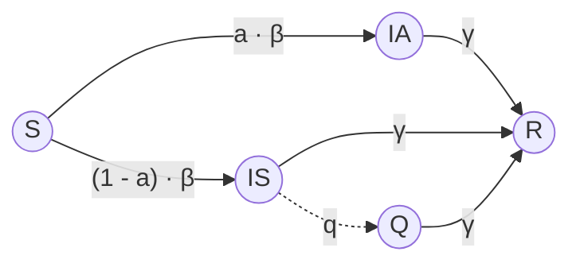

## 2. Information

* Individuals implicitly make compliance decisions based on their perceived burden of quarantine suach as inconvenience or economic cost, which creates a social dilemma between individual and collective interest.

* Testing frequency ($\tau$) acts as a proxy for information availability: more frequent testing leads to faster detection of infected individuals, indirectly increasing quarantine compliance.

* Quarantine effectiveness ($q$) represents how strongly information like test results or symptoms is acted upon. Higher $q$ values simulate societies that respond more efficiently to infection data.

* The degree of non-compliance ($fi$) reflects gaps in the translation of information into behavior, individuals may ignore quarantine requests despite being symptomatic and detected, especially when there are social or economic disincentives to comply.

* Widespread partial incompliance (Model 2) demonstrates how inadequate behavioral response, even when individuals are aware of their infection risk, can severely hinder disease control, emphasizing the need for clear policy communication and public trust in health measures.

* The study suggests that even with high levels of testing (more frequent information), behavioral compliance must follow; otherwise, information alone is insufficient to curb transmission.

## 3. Assumptions of the Model

* The network is well-mixed with a small-world structure representing realistic contact networks.

* Quarantine is modeled as the severing of social links.

* Testing is periodic, with effects depending on $\tau$ (testing interval).

* Behavior affects disease spread: non-compliance reduces quarantine effectiveness.

* Two types of incompliance behaviors are compared in terms of epidemiological impact. These are defined as:

    * **Model 1**: A small fraction of infected individuals completely ignore quarantine requests, maintaining all contacts (deep & narrow)

    * **Model 2**: A larger group of individuals only partially complies with quarantine, keeping some of their social links (shallow & wide)

# Terms in the Equations Affected by Human Behavior

## 1. ODE model

$$ \dot{S} = -\beta \cdot S \{ I_A + (I_S - \delta(t) \cdot q \cdot I_S) \} $$ (1.1)

$$ \dot{I}_A = \beta \cdot S \{ I_A + (I_S - \delta(t) \cdot q \cdot I_S) \} \cdot a - \gamma \cdot I_A $$ (1.2)

$$ \dot{I}_S = \beta \cdot S \{ I_A + (I_S - \delta(t) \cdot q \cdot I_S) \} \cdot (1 - a) - \gamma(I_S - \delta(t) \cdot q \cdot I_S) $$ (1.3)

$$ \dot{Q} = -\gamma(Q + \delta(t) \cdot q \cdot I_S) $$ (1.4)

$$ \dot{R} = \gamma \{ I_A + (I_S - \delta(t) \cdot q \cdot I_S) + (Q + \delta(t) \cdot q \cdot I_S) \} $$ (1.5)

$$ S + I_A + I_S + Q + R = 1 $$ (1.6)

$$ \delta(t) = \left[ \begin{array}{c} \text{if } t \bmod \tau = 0; 1 \\ \text{otherwise; } 0 \end{array} \right. $$ (1.7)

**A. Susceptible Individuals (S)**

$$ \dot{S} = -\beta \cdot S \cdot (I_A + I_s - \delta(t) \cdot q \cdot I_s) $$

**Information Effect:**

* A higher rate of testing ($\delta(t)$) followed by effective quarantine (high $q$) reduces contact with symptomatic individuals, lowering transmission. However, if quarantined individuals are incompliant (especially under deep & narrow behavior), the exposure risk remains, increasing the susceptibility of S.

**B. Asymptomatic Infected ($I_A$)**

$$ \dot{I}_A(t) = \beta \cdot S \cdot (I_A + I_s - \delta(t) \cdot q \cdot I_s) \cdot a - \gamma \cdot I_A $$

**Information Effect:**

* Since asymptomatic individuals are not quarantined, they always pose a hidden risk. The more the symptomatic cases are detected and isolated

(effective $q$ and testing $\tau$), the smaller the overall transmission, even from $I_A$. But non-compliant $Q$ individuals allow infection to linger, indirectly sustaining $I_A$ numbers.

**C. Symptomatic Infected ($I_s$)**

$$ \dot{I}_s(t) = \beta \cdot S \cdot (I_A + I_s - \delta(t) \cdot q \cdot I_s) \cdot (1 - a) - \gamma \cdot I_s - \delta(t) \cdot q \cdot I_s $$

**Information Effect:**

* Testing symptomatic individuals leads to potential quarantine. However, if a significant portion of them is incompliant (high $fi$), the effectiveness of removing $I_s$ from the transmission pool is compromised. In Model 2, partial isolation allows continued spread despite formal quarantine.

**D. Quarantined Individuals (Q)**

$$ \dot{Q}(t) = -\gamma \cdot Q + \delta(t) \cdot q \cdot I_s $$

**Information Effect:**

* $Q$ is ideally a sink, this means that infected individuals stop transmitting. But in behavior-driven models, incompliance reactivates $Q$ as a hidden transmission source. Particularly in deep & narrow incompliance, the spread becomes diffuse and harder to contain, even if testing rates are high.

**E. Recovered Individuals (R)**

$$ \dot{R}(t) = \gamma \cdot (I_A + I_s - \delta(t) \cdot q \cdot I_s + Q + \delta(t) \cdot q \cdot I_s) $$

**Information Effect:**

* Recovery reduces infectious agents. However, delayed or ineffective isolation (due to noncompliance or testing lag) inflates $I_A$ and $I_s$ pools, delaying $R$ transition. Effective behavior-based interventions would accelerate flow into $R$ by reducing transmission duration.

# ScienceDirect 4: Modeling the soft drug epidemic: Extinction, persistence and sensitivity analysis

This study investigates the dynamics of soft drug use (alcohol, tobacco, marijuana) and its potential to escalate into broader substance abuse, using a deterministic compartmental model based on the SIR framework. The model tracks individuals transitioning between susceptible (S), drug users not in treatment (U<sub>1</sub>), and drug users undergoing treatment (U<sub>2</sub>). Unlike epidemic models for hard drugs, this framework excludes drug-related deaths and incorporates an "escape" parameter for users abandoning treatment. The study derives a basic reproduction number (R<sub>0</sub>) to analyze extinction or persistence of drug use, emphasizing how behavioral factors like treatment adherence and relapse rates affect transmission.

## 1. Compartmental Model Variables

The model divides the population into three compartmnets. The first compartment $S(t)$ is the susceptible individuals in the population. The second compartment $U_1(t)$, are the active users who may transmit drug-use behavior to susceptibles, and the third compartment $U_2(t)$ is the number of the drug users undergoing the treatment, assumed non-infectious but may relapse.

Flow chart of the compartmental model showing transitions between S(t), U1(t), and U2(t) with parameters b, beta, epsilon, gamma, alpha, and delta.

## 2. Information

* Behavioral decisions are implicit in parameter choices:

    - Treatment entry rate ($\gamma$): Reflects willingness to seek help. Higher $\gamma$ indicates better access to or acceptance of treatment programs.

    - Escape rate ($\alpha$): Models relapse due to inadequate treatment adherence or social pressures.

    - Natural recovery rate ($\epsilon$): Represents individuals quitting without formal treatment, influenced by personal or community support.

    - Successful cure rate ($\delta$): Depends on treatment efficacy and individual compliance.

* Sensitivity analysis identifies $\beta$ (transmission rate) as the most influential parameter, suggesting that prevention (reducing $\beta$) is more effective than cure (increasing $\gamma$ or $\delta$).

* Threshold R<sub>0</sub>: Combines behavioral and biological factors. If R<sub>0</sub> < 1, drug use declines; if R<sub>0</sub> > 1, it persists. Public health strategies must target R<sub>0</sub> by addressing $\beta$ (education) and $\alpha$ (reducing relapse).

## 3. Assumptions of the Model

*   No drug-related deaths: Soft drugs are assumed less lethal than hard drugs, this means that this model assumes no deaths due to the use of soft drugs.

*   Homogeneous mixing: All susceptibles are equally likely to initiate drug use.

*   Treatment non-infectiousness: $U_2$ individuals do not transmit drug-use behavior.

*   Fixed parameters: Rates like $\beta$, $\gamma$ are constant over time, ignoring seasonal or social trends.

## Terms in the Equations Affected by Human Behavior

## ODE Model

$$
\begin{aligned}
\frac{dS(t)}{dt} &= b - \beta S(t)U_1(t) - dS(t) + \epsilon U_1(t) + \delta U_2(t), \\
\frac{dU_1(t)}{dt} &= \beta S(t)U_1(t) + \alpha U_2(t) - (\gamma + d + \epsilon)U_1(t), \\
\frac{dU_2(t)}{dt} &= \gamma U_1(t) - (\alpha + d + \delta)U_2(t).
\end{aligned}
$$

Description of parameters of the soft drug epidemic model.

<table>
  <thead>
    <tr>
        <th>Parameter</th>
        <th>Description</th>
    </tr>
  </thead>
  <tbody>
    <tr>
        <td>b</td>
        <td>Recruitment rate of the susceptible individuals.</td>
    </tr>
    <tr>
        <td>\beta</td>
        <td>Probability of becoming a soft drug user per unit time.</td>
    </tr>
    <tr>
        <td>d</td>
        <td>Natural death rate of individuals in the three compartments.</td>
    </tr>
    <tr>
        <td>\alpha</td>
        <td>The proportion of the soft drug users who escape treatment.</td>
    </tr>
    <tr>
        <td>\gamma</td>
        <td>Probability of a soft drug user entering treatment.</td>
    </tr>
    <tr>
        <td>\epsilon</td>
        <td>Natural recovery rate.</td>
    </tr>
    <tr>
        <td>\delta</td>
        <td>Rate of the successful cure.</td>
    </tr>
  </tbody>
</table>

### A. Susceptible (S)

$$ \frac{dS(t)}{dt} = b - \beta S(t) U_1(t) - dS(t) + \epsilon U_1(t) + \delta U_2(t) $$

**Information effect :**

Higher $\beta$, which could be induced by peer pressure or lax policies increases drug initiation. Public awareness campaigns could reduce $\beta$ which affects the $-\beta S U_1$ value .

### B. Drug users not in treatment ($U_1$)

$$ \frac{dU_1(t)}{dt} = \beta S(t) U_1(t) + \alpha U_2(t) - (\gamma + d + \epsilon) U_1(t) $$

**Information effect:**

Relapse (α) reflects treatment noncompliance. Support systems such as counseling could lower α

**C. Drug users in treatment (U<sub>2</sub>)**

$$ \frac{dU_2(t)}{dt} = \gamma U_1(t) - (\alpha + d + \delta)U_2(t). $$

**Information effect:**

Higher γ indicates better healthcare access or stigma reduction, if this value increases the $\gamma U_1(t)$ will do too.

**D. Recovery terms (εU<sub>1</sub>, δU<sub>2</sub>)**

**Information effect:**

Natural recovery (ε) and successful treatment (δ) depend on individual resilience and program quality.

# ScienceDirect 3: Social dilemma analysis on vaccination game accounting for the effect of immunity waning

This study investigates how individual vaccination decisions, influenced by immunity waning and the presence of asymptomatic carriers, impact disease dynamics using an SEIRS-based ODE model coupled with a game-theoretic behavior framework. The model evaluates vaccination uptake as a time-variable rate driven by perceived infection risk and vaccination costs, identifying social dilemmas through the Social Efficiency Deficit (SED). Key findings reveal that human behavior specifically under-vaccination in high-risk scenarios or over-vaccination in low-risk scenarios significantly alters epidemic outcomes and social efficiency.

## 1. Compartmental Model Variables

The model divides and extends the SEIRS framework and population into the following compartments: S; susceptible, E; exposed, $I_A$; asymptomatic infectious, $I_S$; symptomatic infectious, H; hospitalized, and IM; immune (also known as recovered; R). Vaccination rate x, is a dynamic variable governed by behavioral feedback

The total population is normalized which means that: $S + E + I_A + I_S + H + IM = 1$

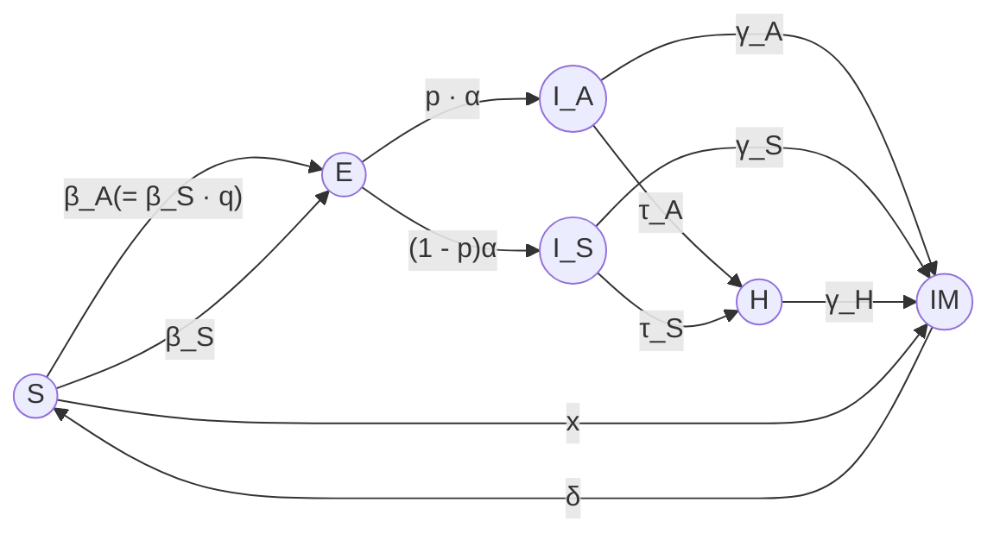

## 2. Information

* Vaccination decisions: depend on visible symptomatic infections ($I_S$) and vaccination costs ($C_v$) Individuals weigh the perceived risk of infection against the cost of vaccination.

* Immunity waning ($\delta$) introduces long-term uncertainty, requiring repeated vaccinations. This weakens herd immunity and amplifies social dilemmas.

* Asymptomatic transmission ($I_A$) reduces perceived risk, as asymptomatic cases are less visible ($\tau_A, \tau_S$), leading to under-vaccination despite high infectiousness ($q \approx 1$).

* Social Efficiency Deficit (SED) quantifies gaps between individual behavior (Nash equilibrium) and socially optimal vaccination rates. Higher SED indicates stronger dilemmas:
    

    * Conventional dilemma: Under-vaccination in high-risk regions (high p, q), where asymptomatic spread dominates.
    

    * Ironical dilemma: Over-vaccination in low-risk regions (low p, q), wasting resources despite minimal disease threat.

* Testing/hospitalization rates ($\tau_s$) act as indirect information proxies. Higher $\tau_s$ increases symptomatic case detection, improving vaccination compliance and reducing SED.

## 3. Assumptions of the Model

* Mean-field approximation: Homogeneous mixing with no network structure.

* Fixed recovery rates: $\gamma_H > \gamma_A \geq \gamma_S$, reflecting faster recovery for hospitalized individuals.

* Immunity waning: Immune individuals rejoin $S$ at rate $\delta$.

* Behavioral dynamics: Vaccination rate ($x$) follows a replicator equation where $x$ depends on $I_S$ (risk perception) and $C_v$ (cost sensitivity).

* Social optimality: Maximizes *ASP* (Average Social Payoff) via constant vaccination rates, contrasting with the dynamic Nash equilibrium.

### Terms in the Equations Affected by Human Behavior

$$\dot{S} = \delta \cdot IM - (\beta_s \cdot q \cdot I_A + \beta_s \cdot I_S + x) \cdot S,$$

$$\dot{E} = (\beta_s \cdot q \cdot I_A + \beta_s \cdot I_S) \cdot S - p \cdot a \cdot E - (1 - p) \cdot a \cdot E,$$

$$\dot{I^A} = p \cdot a \cdot E - \tau_A \cdot I_A - \gamma_A \cdot I_A,$$

$$\dot{I^S} = (1 - p) \cdot a \cdot E - \tau_S \cdot I_S - \gamma_S \cdot I_S,$$

$$\dot{H} = \tau_A \cdot I_A + \tau_S \cdot I_S - \gamma_H \cdot H,$$

$$\dot{IM} = \gamma_A \cdot I_A + \gamma_S \cdot I_S + \gamma_H \cdot H - \delta \cdot IM + x \cdot S,$$

$C_v$ Relative cost of vaccination to an infection.

$p$ Fraction of asymptomatic infectious state when an individual is infected ($\beta_A = p \cdot \beta_S$).

$q$ Discount ratio of infected force for asymptomatic state compared with that for symptomatic one.

$\alpha$ Transferring rate from E to infectious compartment; either $I^A$ or $I^S$.

$\beta_A$ Transmission rate of symptomatic case; transferring rate from S to $I^A$.

$\beta_S$ Transmission rate of symptomatic case; transferring rate from S to $I^S$.

$\gamma_A$ Recovering rate of asymptomatic case; transferring rate from $I^A$ to IM.

$\gamma_S$ Recovering rate of symptomatic case; transferring rate from $I^S$ to IM.

$\gamma_H$ Recovering rate of a hospitalized individual; transferring rate from H to IM.

$\delta$ Immunity waning rate; transferring rate from IM to S.

$\kappa$ Sensitivity of vaccination cost to visible infected and infectious people (denoted by $I^S$).

$\tau_A$ Tested and hospitalized rate of asymptomatic case; transferring rate from $I^A$ to H.

$\tau_S$ Tested and hospitalized rate of symptomatic case; transferring rate from $I^S$ to H.

## A. Vaccination Rate ($\dot{x}$)

$$\dot{x} = \omega \cdot x \cdot (1 - x) \cdot (I_S - \kappa \cdot C_v)$$

### Information Effect:

* Visible symptomatic cases ($I_S$): Acts as a risk signal. Higher $I_S$ increases vaccination uptake ($x$).

* Vaccination cost ($C_v$) and sensitivity ($\kappa$): Higher costs or hesitancy ($\kappa$) reduce vaccination, even if $I_S$ is high.

* Key Implication: If asymptomatic cases ($I_A$) dominate (high $p$, high $q$), $I_S$ remains low, leading to under-vaccination despite high transmission risk.

## B. Susceptible ($\dot{S}$)

$$\dot{S} = \delta \cdot IM - (\beta_S \cdot q \cdot I_A + \beta_S \cdot I_S + x) \cdot S$$

### Information Effect:

* Vaccination rate ($x$): Directly reduces S if people are informed/active vaccinators.

* Asymptomatic transmission ($I_A$): Hidden due to low testing ($\tau_A < \tau_S$) Lack of visible risk ($I_S$) sustains S pool.

* Symptomatic transmission ($I_S$): Only effective if detected (high $\tau_S$). Non-compliance like ignoring quarantine) indirectly sustains S.

## C. Asymptomatic Infectious ($I_A$)

$$\dot{I}_A = p \cdot \alpha \cdot E - \tau_A \cdot I_A - \gamma_A \cdot I_A$$

**Information Effect:**

* Testing rate ($\tau_A$): Low $\tau_A$ means $I_A$ is rarely detected, creating false security and reducing vaccination incentives.

* Fraction asymptomatic ($p$): High $p$ inflates $I_A$, but without visible $I_S$, behavior remains unchanged.

* Behavioral Gap: Even with high $I_A$, people under-vaccinate because they respond to observed ($I_S$), not actual, risk.

**D. Symptomatic Infectious ($I_S$):**

$$\dot{I}_S = (1 - p) \cdot \alpha \cdot E - \tau_S \cdot I_S - \gamma_S \cdot I_S$$

**Information Effect:**

* Testing/hospitalization rate ($\tau_S$): Higher $\tau_S$ removes $I_S$ faster, reducing visible risk and paradoxically lowering vaccination (if $I_S$ drops too quickly).

* Partial compliance: If symptomatic cases evade quarantine (low $\tau_S$), $I_S$ persists, increasing vaccination but also spread.

**E. Immune ($IM$)**

$$\dot{IM} = \gamma_A \cdot I_A + \gamma_S \cdot I_S + \gamma_H \cdot H - \delta \cdot IM + x \cdot S$$

**Information Effect:**

* Vaccination ($x \cdot S$): Informed individuals boost $IM$, but waning immunity ($\delta$) requires repeated awareness such as booster campaigns.

* Recovery rates ($\gamma_A, \gamma_S$): Faster recovery reduces $I_A / I_S$, but if $I_A$ is invisible, $IM$ growth may not incentivize vaccination.

# Science Direct 2: Accounting for super-spreader events and algebraic decay in SIR models

<u>Key Point Analysis of Human Behavior in the Vaccine Model:</u>

**1. Compartmental Model Variables:**

# Scopus 23: A behavioural modelling approach to assess the impact of COVID-19 vaccine hesitancy

This study investigates the impact of voluntary vaccination behavior, particularly vaccine hesitancy, on the spread of COVID-19 through an information-dependent SEIR-type model. Unlike classical SIR models, this approach incorporates behavioral responses to present and past information, allowing the vaccination rate to dynamically adjust based on a constructed “information index.” The model evaluates how vaccine uptake, driven by current and historical prevalence of symptomatic cases, affects disease transmission, epidemic peaks, and cumulative mortality.

**1. Compartmental Model Variables:**

The model follows an extended SEIRS framework, dividing the population into six compartments: $S$ (Susceptible), representing individuals at risk of infection; $E$ (Exposed), those infected but not yet infectious; $I_a$ (Asymptomatic Infectious), including both post-latent and persistently asymptomatic cases; $I_s$ (Symptomatic Infectious), individuals showing mild or severe symptoms; $V$ (Vaccinated), those who have received at least one vaccine dose; and $R$ (Recovered), individuals who have gained immunity after infection. The total population is normalized, ensuring that $S + E + I_a + I_s + V + R = 1$

A separate information index $M(t)$ governs the behavioral vaccination component.

```mermaid
graph LR
    Lambda(( )) -- Λ --> S
    S((S(t))) -- "βS(εaIa + εsIs)" --> E((E(t)))
    S -- "(φ0 + φ1(M))S" --> V((V(t)))
    E -- ρE --> Ia((Ia(t)))
    Ia -- ηIa --> Is((Is(t)))
    Ia -- νaIa --> R((R(t)))
    Is -- νsIs --> R
    V -- "σβV(εaIa + εsIs)" --> E
    
    S -- μS --> S_out(( ))
    E -- μE --> E_out(( ))
    Ia -- μIa --> Ia_out(( ))
    Is -- "(μ + δ)Is" --> Is_out(( ))
    V -- μV --> V_out(( ))
    R -- μR --> R_out(( ))

    style Lambda fill:none,stroke:none
    style S_out fill:none,stroke:none
    style E_out fill:none,stroke:none
    style Ia_out fill:none,stroke:none
    style Is_out fill:none,stroke:none
    style V_out fill:none,stroke:none
    style R_out fill:none,stroke:none
```
COVID-19 compartmental model flow diagram with behavioral vaccination component

**2. Information**

*   Information Index (M): Derived from the current and past prevalence of symptomatic individuals, modeled as an exponentially weighted moving average of $I_s(t)$.

*   Information Delay ($a^{-1}$): Reflects how slowly people integrate current data into decision-making; smaller $a$ means longer memory.

*   Information Coverage ($k$): Combines under-reporting and media amplification, controlling how representative the public information is of the real epidemic.

*   Vaccination Rate Function: Includes a constant term ($u_0$) and a variable term ($u_1(M)$) that increases with perceived risk (information index). This simulates social alarm or awareness effects.

*   Behavioral Insight: As people perceive higher risk (increased $M$), they become more willing to vaccinate. However, long memory or low coverage (*low k*) can delay or dampen response.

*   Simulation Results: High $k$ and low $a^{-1}$ like rapid and broad information flow are crucial for timely increases in vaccination and reductions in symptomatic cases and deaths.

## 3. Assumptions of the Model

*   Vaccination is voluntary and affected by information availability.

*   Demography is considered since it allows us to consider not only births but also immigration.

*   Immunity (post-infection or post-vaccination) is long-lasting and does not wane during the modeled period.

*   Vaccine is imperfect: some vaccinated individuals can still be infected, scaled by a factor $r$.

*   Mass-action transmission: the force of infection includes both asymptomatic and symptomatic transmission, modulated by reduction coefficients $ea$ and $es$ respectively.

*   Vaccination Function:
    

    - Constant rate $u_0$ reflects baseline behavior.
    

    - Variable term $u_1(M)$ is a Michaelis-Menten function of the information index $M$.

## 1. Terms in the Equations Affected by Human Behavior

$$ \dot{S} = \Lambda - (\varphi_0 + \varphi_1(M))S - \beta S(\varepsilon_a I_a + \varepsilon_s I_s) - \mu S $$
$$ \dot{E} = \beta S(\varepsilon_a I_a + \varepsilon_s I_s) + \sigma \beta V(\varepsilon_a I_a + \varepsilon_s I_s) - \rho E - \mu E $$
$$ \dot{I}_a = \rho E - \eta I_a - v_a I_a - \mu I_a $$
$$ \dot{I}_s = \eta I_a - v_s I_s - \delta I_s - \mu I_s $$
$$ \dot{V} = (\varphi_0 + \varphi_1(M))S - \sigma \beta V(\varepsilon_a I_a + \varepsilon_s I_s) - \mu V $$
$$ \dot{M} = a(k I_s - M) $$

<table>
  <thead>
    <tr>
        <th>Parameter</th>
        <th>Description</th>
        <th>Baseline value</th>
        <th>Source</th>
    </tr>
  </thead>
  <tbody>
    <tr>
        <td>$t_f$</td>
        <td>Time horizon</td>
        <td>365 – 395 days</td>
        <td>Assumed</td>
    </tr>
    <tr>
        <td>$N_0$</td>
        <td>Initial total population</td>
        <td>$6.036 \cdot 10^7$</td>
        <td>ISTAT (2020)</td>
    </tr>
    <tr>
        <td>$E(0)$</td>
        <td>Initial number of exposed individuals</td>
        <td>$I_a(0)(\eta + v_a + \mu)/\rho$</td>
        <td>Assumed</td>
    </tr>
    <tr>
        <td>$I_a(0)$</td>
        <td>Initial number of asymptomatic infectious individuals</td>
        <td>7,322</td>
        <td>Estimated from ISS (2020) and Italian Ministry of Health (2020b)</td>
    </tr>
    <tr>
        <td>$I_s(0)$</td>
        <td>Initial number of symptomatic infectious individuals</td>
        <td>7,545</td>
        <td>Estimated from ISS (2020) and Italian Ministry of Health (2020b)</td>
    </tr>
    <tr>
        <td>$V(0)$</td>
        <td>Initial number of vaccinated individuals</td>
        <td>0</td>
        <td>Italian Ministry of Health (2020b)</td>
    </tr>
    <tr>
        <td>$R(0)$</td>
        <td>Initial number of recovered individuals</td>
        <td>203,968</td>
        <td>Italian Ministry of Health (2020b)</td>
    </tr>
    <tr>
        <td>$M(0)$</td>
        <td>Initial value of the information index</td>
        <td>$kI_s(0)$</td>
        <td>Assumed</td>
    </tr>
    <tr>
        <td>$\mathcal{R}_0$</td>
        <td>Basic reproduction number</td>
        <td>1.428</td>
        <td>See (8)</td>
    </tr>
    <tr>
        <td>$\mathcal{R}_v$</td>
        <td>Control reproduction number</td>
        <td>0.302</td>
        <td>See (9)</td>
    </tr>
    <tr>
        <td>$\Lambda$</td>
        <td>Net inflow of susceptibles</td>
        <td>1,762 days<sup>-1</sup></td>
        <td>Estimated from ISTAT (2020) and Italian Ministry of Foreign Affairs and International Cooperation (2020)</td>
    </tr>
    <tr>
        <td>$\mu$</td>
        <td>Natural death rate</td>
        <td>$1.07 \cdot 10^{-2}$ years<sup>-1</sup></td>
        <td>ISTAT (2020)</td>
    </tr>
    <tr>
        <td>$\beta$</td>
        <td>Baseline transmission rate</td>
        <td>$2.699 \cdot 10^{-8}$ days<sup>-1</sup></td>
        <td>Estimated from Italian Ministry of Health (2020b)</td>
    </tr>
    <tr>
        <td>$q$</td>
        <td>Fraction of post-latent individuals that develop symptoms</td>
        <td>0.15</td>
        <td>Estimated from Italian Ministry of Health (2020c)</td>
    </tr>
    <tr>
        <td>$\varepsilon_a$</td>
        <td>Modification factor concerning transmission from $I_a$</td>
        <td>$q + (1 - q)0.033$</td>
        <td>Estimated from Gatto et al. (2020)</td>
    </tr>
    <tr>
        <td>$\varepsilon_s$</td>
        <td>Modification factor concerning transmission from $I_s$</td>
        <td>0.034</td>
        <td>Estimated from Gatto et al. (2020)</td>
    </tr>
    <tr>
        <td>$\varphi_0$</td>
        <td>Information-independent constant vaccination rate</td>
        <td>0.002 days<sup>-1</sup></td>
        <td>Assumed</td>
    </tr>
    <tr>
        <td>$\sigma$</td>
        <td>Factor of vaccine ineffectiveness</td>
        <td>0.2</td>
        <td>CDC (2021)</td>
    </tr>
    <tr>
        <td>$\rho$</td>
        <td>Latency rate</td>
        <td>1/5.25 days<sup>-1</sup></td>
        <td>Estimated from ECDC (2020) and WHO (2020)</td>
    </tr>
    <tr>
        <td>$\eta$</td>
        <td>Rate of onset of symptoms</td>
        <td>0.12 days<sup>-1</sup></td>
        <td>Estimated from ECDC (2020), Italian Ministry of Health (2020c) and WHO (2020)</td>
    </tr>
    <tr>
        <td>$v_a$</td>
        <td>Recovery rate of asymptomatic infectious individuals</td>
        <td>0.165 days<sup>-1</sup></td>
        <td>Estimated from ISS (2020) and Italian Ministry of Health (2020b)</td>
    </tr>
    <tr>
        <td>$v_s$</td>
        <td>Recovery rate of symptomatic infectious individuals</td>
        <td>0.055 days<sup>-1</sup></td>
        <td>Estimated from ISS (2020) and Italian Ministry of Health (2020b)</td>
    </tr>
    <tr>
        <td>$\delta$</td>
        <td>Disease-induced death rate</td>
        <td>$6.248 \cdot 10^{-4}$ days<sup>-1</sup></td>
        <td>Estimated from ISS (2020) and Italian Ministry of Health (2020b)</td>
    </tr>
    <tr>
        <td>$D$</td>
        <td>Reactivity factor of information-dependent vaccination</td>
        <td>$500\mu/\Lambda$</td>
        <td>Estimated from Buonomo (2020) and d'Onofrio et al. (2007)</td>
    </tr>
    <tr>
        <td>$\varphi_{max}$</td>
        <td>Upper bound of overall vaccination rate</td>
        <td>0.02 days<sup>-1</sup></td>
        <td>Estimated from ISS (2020), Shim (2019), Lee et al. (2012) and Fister et al. (2016)</td>
    </tr>
    <tr>
        <td>$a$</td>
        <td>Inverse of the average information delay $T_a$</td>
        <td>1/3 days<sup>-1</sup></td>
        <td>Buonomo and Della Marca (2020)</td>
    </tr>
    <tr>
        <td>$k$</td>
        <td>Information coverage</td>
        <td>0.8</td>
        <td>Buonomo and Della Marca (2020)</td>
    </tr>
  </tbody>
</table>

## A. Susceptible Individuals (S):

$$\dot{S} = \Lambda - (\varphi_0 + \varphi_1(M))S - \beta S(\varepsilon_a I_a + \varepsilon_s I_s) - \mu S$$

**Information Effect:**

* Higher $M$ leads to greater $u_1(M)$, increasing vaccination and reducing the susceptible pool.

* Low information coverage or long delay reduces the speed and intensity of behavior change.

## B. Exposed (E):

$$\dot{E} = \beta S(\varepsilon_a I_a + \varepsilon_s I_s) + \sigma \beta V(\varepsilon_a I_a + \varepsilon_s I_s) - \rho E - \mu E$$

**Information Effect:**

* Indirectly affected via S and V. Effective information-driven vaccination reduces both susceptible and infected vaccinated populations.

## C. Asymptomatic Infectious ($I_a$):

$$\dot{I}_a = \rho E - \eta I_a - v_a I_a - \mu I_a$$

**Information Effect:**

* Although asymptomatics don't alter behavior themselves, fewer exposed and more vaccinated reduce their numbers.

**D. Symptomatic Infectious ($I_s$):**

$$ \dot{I}_s = \eta I_a - v_s I_s - \delta I_s - \mu I_s $$

**Information Effect:**

* As $I_s$ rises, $M(t)$ increases, potentially boosting $u_1(M)$. However, delayed response ($a^{-1}$) or poor coverage ($k$) blunts this effect.

**E. Vaccinated Individuals (V):**

$$ \dot{V} = (\varphi_0 + \varphi_1(M))S - \sigma \beta V (\varepsilon_a I_a + \varepsilon_s I_s) - \mu V $$

**Information Effect:**

* Directly tied to M. Effective information flow boosts V, which buffers S and reduces the overall transmission rate.

**F. Recovered (R):**

$$ \dot{R} = v_a I_a + v_s I_s - \mu R. $$

**Information Effect:**

* Indirect; stronger behavioral response reduces infections and accelerates accumulation in R through faster epidemic control.

**Scopus 22: How disease risk awareness modulates transmission: coupling infectious disease models with behavioural dynamics**

This study develops a novel theoretical framework to couple an SIS (Susceptible-Infected-Susceptible) epidemiological model with dynamic behavioral responses driven by awareness of disease prevalence. Using evolutionary game theory (replicator dynamics), the model captures how individuals shift between cooperative (risk-reducing) and non-cooperative (risk-ignoring) behaviors based on information about the disease state, either globally (entire population) or locally (their network neighbors). The model is analyzed both in homogeneous settings via ODEs and in heterogeneous, structured populations via simulations on scale-free, grid, and small-world networks. The research shows that information availability and how it is accessed, globally or locally, modulates cooperation and disease spread, and that network structure plays a critical role in these dynamics.

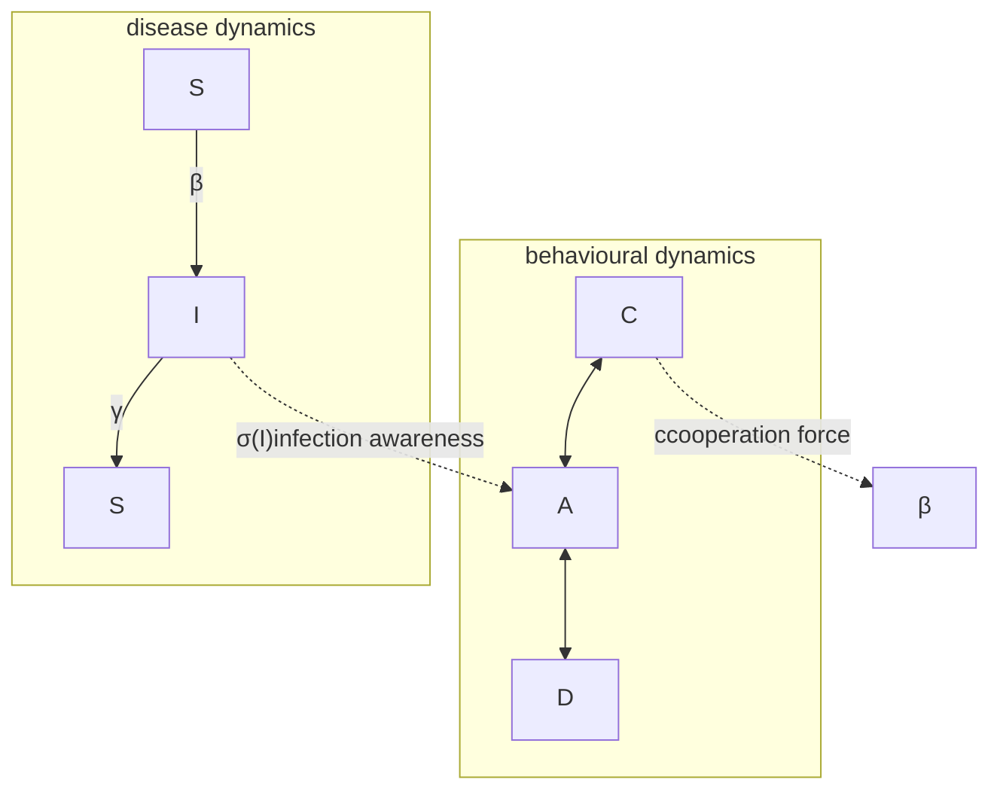

**1. Compartmental Model Variables:**

The authors use a Susceptible–Infected–Susceptible (SIS) model in which S (Susceptible) are individuals who can contract the disease and I (Infected) are Infectious individuals who can transmit the disease and later return to the susceptible state. However, they also propose a behavioral dynamics model which includes c (Cooperators) as the proportion of the population engaging in protective behaviors and n (Non-cooperators) which includes the proportion of individuals who are not engaging in such behaviors.

In network models, nodes represent individuals, and edges represent social contacts.

**2. Information**

*   Awareness Parameter ($\sigma$): Determines how sensitive individuals are to disease prevalence. Higher $\sigma$ means individuals are more responsive to increases in infection.

* Information Source:
    

    - Global Awareness: Individuals observe infection rates across the whole population.
    

    - Local Awareness: Individuals observe infection among their neighbors.

* Behavioral Strategy (Replicator Dynamics):
    

    - Individuals switch behaviors (cooperate or defect) based on payoffs affected by perceived infection risk.
    

    - Non-cooperators' payoff is discounted by a factor that increases with the infection rate and awareness.

* Game Theory Framework:
    

    - A 2×2 Prisoner's Dilemma is used, where cooperation has lower short-term payoff unless awareness of infection is high.
    

    - Awareness reduces the attractiveness of non-cooperative strategies.

* Imitation in Networks: Individuals copy more successful neighbors, with payoff shaped by infection prevalence and awareness.

* Elasticity of Behavior:
    

    - The model includes scenarios where a fixed proportion of the population never changes behavior (non-elastic).
    

    - Results show that having a core group of permanent cooperators can significantly reduce disease spread even when awareness is low.

## 3. Assumptions of the Model

Infection Rate ($\beta$): Depends inversely on the fraction of cooperators in the population or neighborhood.

Contact Patterns:

- ODEs assume homogeneous mixing.

- Network models simulate scale-free, grid, and small-world topologies to explore effects of heterogeneity.

Payoff Structure: Payoffs for strategies are shaped by:

- The fraction of cooperators.

- The proportion of infected individuals.

- The awareness level $\sigma$.

Behavioral Evolution: Modeled via replicator dynamics and imitation dynamics.

No Birth or Death: Model is designed for short epidemic scales.

Global vs. Local Awareness Schemes:

- Global: $\sigma \cdot (I/N)$

- Local: $\sigma \cdot (\text{average infection among neighbors})$

Transmission Functions: Multiple functional forms for $\beta(c)$ are explored like exponential decay, linear, concave

## Terms in the Equations Affected by Human Behavior

$$ \frac{dS}{dt} = -\beta(c) \frac{SI}{N} + \gamma I $$

$$ \frac{dI}{dt} = \beta(c) \frac{SI}{N} - \gamma I $$

$$ \frac{dc}{dt} = c(1 - c)(f_c - f_n) $$

**A. Susceptible Individuals (S):**

$$ \frac{dS}{dt} = -\beta(c) \cdot \frac{SI}{N} + \gamma I $$

**Information Effect:**

* More cooperators (higher $c$) reduce $\beta(c)$, lowering infection risk.

* Awareness ($\sigma$) drives more individuals to cooperate, indirectly decreasing S's exposure to I.

**B. Infected Individuals (I):**

$$ \frac{dI}{dt} = \beta(c) \cdot \frac{SI}{N} - \gamma I $$

**Information Effect:**

* As $c$ increases via awareness-driven cooperation, $\beta(c)$ decreases, reducing new infections.

* High awareness ($\sigma$) steepens this behavior-driven reduction in I.

**C. Cooperators (c):**

$$ \frac{dc}{dt} = c(1 - c)(f_c - f_n) $$

**Information Effect:**

* The fitness of non-cooperators ($f_n$) is penalized by awareness:

$$ f_n = c \cdot (T - g(\sigma, I)) + n \cdot -g(\sigma, I) $$

This makes cooperation more favorable as I or $\sigma$ increases.

* Network effects show that clustered cooperation in hubs sustains protective behavior better than in uniform networks.

# Scopus 19 :Effects of information- induced behavioural changes during the COVID-19 lockdowns: the case of Italy

This study examines how voluntary human behavioral changes, driven by circulating information and rumors about disease prevalence, influenced the spread of COVID-19 during the Italian lockdown. Using an extended SEIR model, the authors incorporate an information index that modulates both the transmission rate and the quarantine rate, representing voluntary social distancing and self-isolation.

## 1. Compartmental Model Variables:

The model divides the population into seven compartments to reflect different stages of infection and intervention. Susceptible individuals (S) are healthy and at risk of becoming infected. Once exposed (E), individuals have contracted the disease but are not yet infectious. They then progress to the post-latent stage ($I_p$), where they become infectious but have not yet developed symptoms. Depending on disease progression, individuals may become asymptomatic or mildly symptomatic ($I_m$), continuing to transmit the disease while showing few or no symptoms, or they may develop severe symptoms ($I_s$), requiring hospitalization and representing a highly infectious group. Some mildly symptomatic individuals may enter quarantine (Q), either voluntarily or through public health intervention, reducing their contact with others. Finally, individuals who recover from the infection enter the recovered class (R), assumed to have long-term immunity.

```mermaid
graph LR
    Lambda((&Lambda;)) --> S
    S((S(t))) -- "&beta;(M) S/(N-Q) (&epsilon;<sub>p</sub>I<sub>p</sub> + &epsilon;<sub>m</sub>I<sub>m</sub> + &epsilon;<sub>s</sub>I<sub>s</sub>)" --> E
    E((E(t))) -- "&rho;E" --> Ip
    Ip((I<sub>p</sub>(t))) -- "p&eta;I<sub>p</sub>" --> Im
    Ip -- "(1-p)&eta;I<sub>p</sub>" --> Is
    Im((I<sub>m</sub>(t))) -- "&gamma;(M)I<sub>m</sub>" --> Q
    Im -- "v<sub>m</sub>I<sub>m</sub>" --> R
    Im -- "&sigma;<sub>m</sub>I<sub>m</sub>" --> Is
    Is((I<sub>s</sub>(t))) -- "&sigma;<sub>s</sub>I<sub>s</sub>" --> Q
    Is -- "v<sub>s</sub>I<sub>s</sub>" --> R
    Q((Q(t))) -- "v<sub>q</sub>Q" --> R
    R((R(t)))

    S --> muS[mu<sub>S</sub>]
    E --> muE[mu<sub>E</sub>]
    Ip --> muIp[mu<sub>p</sub>]
    Im --> muIm[mu<sub>m</sub>]
    Is --> muIs["(&mu; + &delta;) I<sub>s</sub>"]
    Q --> muQ[mu<sub>Q</sub>]
    R --> muR[mu<sub>R</sub>]
```

## 2. Information

* Information Index ($M(t)$): A dynamic variable capturing cumulative information about disease prevalence. It is influenced by the number of quarantined and hospitalized individuals and decays over time (exponentially weighted memory).

* Information Coverage ($k$): Reflects how much of the real epidemiological data the public is aware of. Higher values indicate better media reporting or lower underreporting.

* Information Delay ($T_a = 1/a$): Time it takes for information to influence behavior. A short delay implies faster public response.

* Behavioral Effects:

    - Transmission rate $\beta(M)$: Decreases with $M$. Captures voluntary reduction in contact due to perceived risk.

    - Quarantine rate $\gamma(M)$: Increases with $M$. Models voluntary isolation driven by information.

    - Formulas:

        - $\beta(M) = \frac{\beta_b - \beta_0}{1 + \alpha M}$

        - $\gamma_1(M) = (1 - \gamma_0 - \zeta) \frac{DM}{1 + DM'}$

## 3. Assumptions of the Model

* Behavioral response is voluntary and based on information perceived (not mandated).

* Transmission and quarantine rates are information-dependent.

* Hospitalized individuals can still contribute to community spread, this could happen via hospital transmission.

* Quarantined individuals are fully isolated and do not transmit the virus.

* Information affects only two processes: contact reduction (social distancing) and self-isolation.

* The model excludes spatial heterogeneity and ICU capacity limitations.

* Epidemic severity indicators used for evaluation: cumulative infections, hospitalizations, quarantines, and deaths.

**Terms in the Equations Affected by Human Behavior**

$$ \dot{S} = \Lambda - \beta(M) \frac{S}{N - Q} (\varepsilon_p I_p + \varepsilon_m I_m + \varepsilon_s I_s) - \mu S, $$

$$ \dot{E} = \beta(M) \frac{S}{N - Q} (\varepsilon_p I_p + \varepsilon_m I_m + \varepsilon_s I_s) - \rho E - \mu E, $$

$$ \dot{I}_p = \rho E - \eta I_p - \mu I_p, $$

$$ \dot{I}_m = p \eta I_p - \gamma(M) I_m - \sigma_m I_m - \nu_m I_m - \mu I_m, $$

$$ \dot{I}_s = (1 - p) \eta I_p + \sigma_m I_m + \sigma_q Q - \nu_s I_s - \delta I_s - \mu I_s, $$

$$ \dot{Q} = \gamma(M) I_m - \sigma_q Q - \nu_q Q - \mu Q, $$

$$ \dot{R} = \nu_m I_m + \nu_s I_s + \nu_q Q - \mu R. $$

<table>
  <thead>
    <tr>
        <th>parameter</th>
        <th>description</th>
        <th>baseline value</th>
    </tr>
  </thead>
  <tbody>
    <tr>
        <td>$t_0$</td>
        <td>initial simulation time</td>
        <td>24 February 2020</td>
    </tr>
    <tr>
        <td>$t_f$</td>
        <td>final simulation time</td>
        <td>18 May 2020</td>
    </tr>
    <tr>
        <td>$S(t_0)$</td>
        <td>initial number of susceptible individuals</td>
        <td>$60.357 \times 10^6$</td>
    </tr>
    <tr>
        <td>$E(t_0)$</td>
        <td>initial number of exposed individuals</td>
        <td>$1.695 \times 10^3$</td>
    </tr>
    <tr>
        <td>$I_p(t_0)$</td>
        <td>initial number of post-latent individuals</td>
        <td>308.8</td>
    </tr>
    <tr>
        <td>$I_m(t_0)$</td>
        <td>initial number of asymptomatic/mildly symptomatic individuals</td>
        <td>462.4</td>
    </tr>
    <tr>
        <td>$I_s(t_0)$</td>
        <td>initial number of severely symptomatic (hospitalized) individuals</td>
        <td>127.4</td>
    </tr>
    <tr>
        <td>$Q(t_0)$</td>
        <td>initial number of quarantined individuals</td>
        <td>93.7</td>
    </tr>
    <tr>
        <td>$R(t_0)$</td>
        <td>initial number of recovered individuals</td>
        <td>311.1</td>
    </tr>
    <tr>
        <td>$M(t_0)$</td>
        <td>initial value of the information index</td>
        <td>101.9</td>
    </tr>
    <tr>
        <td>$\Lambda$</td>
        <td>net inflow of susceptibles</td>
        <td>$1.762 \times 10^3 \text{ d}^{-1}$</td>
    </tr>
    <tr>
        <td>$\mu$</td>
        <td>natural death rate</td>
        <td>$10.7/1000 \text{ yr}^{-1}$</td>
    </tr>
    <tr>
        <td>$\mathcal{R}_0$</td>
        <td>basic reproduction number</td>
        <td>3.49</td>
    </tr>
    <tr>
        <td>$\beta_b$</td>
        <td>baseline transmission rate</td>
        <td>$2.25 \text{ d}^{-1}$</td>
    </tr>
    <tr>
        <td>$\beta_0$</td>
        <td>mandatory social distancing transmission rate</td>
        <td>$0 - 0.74 \beta_b$</td>
    </tr>
    <tr>
        <td>$\varepsilon_p$</td>
        <td>modification factor w.r.t. transmission from $I_p$</td>
        <td>1</td>
    </tr>
    <tr>
        <td>$\varepsilon_m$</td>
        <td>modification factor w.r.t. transmission from $I_m$</td>
        <td>0.033</td>
    </tr>
    <tr>
        <td>$\varepsilon_s$</td>
        <td>modification factor w.r.t. transmission from $I_s$</td>
        <td>0.034</td>
    </tr>
    <tr>
        <td>$\rho$</td>
        <td>latency rate</td>
        <td>$1/5.25 \text{ d}^{-1}$</td>
    </tr>
    <tr>
        <td>$\eta$</td>
        <td>post-latency rate</td>
        <td>$1/1.25 \text{ d}^{-1}$</td>
    </tr>
    <tr>
        <td>$p$</td>
        <td>fraction of post-latent individuals developing no/mild symptoms</td>
        <td>0.92</td>
    </tr>
    <tr>
        <td>$\gamma_0$</td>
        <td>mandatory quarantine rate</td>
        <td>$0.057 \text{ d}^{-1}$</td>
    </tr>
    <tr>
        <td>$\sigma_m$</td>
        <td>rate at which members of $I_m$ class hospitalize</td>
        <td>$0.044 \text{ d}^{-1}$</td>
    </tr>
    <tr>
        <td>$\sigma_q$</td>
        <td>rate at which quarantined individuals hospitalize</td>
        <td>$0.001 \text{ d}^{-1}$</td>
    </tr>
    <tr>
        <td>$\delta$</td>
        <td>disease-induced death rate</td>
        <td>$0.022 \text{ d}^{-1}$</td>
    </tr>
    <tr>
        <td>$\nu_m$</td>
        <td>recovery rate for asymptomatic/mildly symptomatic individuals</td>
        <td>$0.145 \text{ d}^{-1}$</td>
    </tr>
    <tr>
        <td>$\nu_s$</td>
        <td>recovery rate for severely symptomatic (hospitalized) individuals</td>
        <td>$0.048 \text{ d}^{-1}$</td>
    </tr>
    <tr>
        <td>$\nu_q$</td>
        <td>recovery rate for quarantined individuals</td>
        <td>$0.035 \text{ d}^{-1}$</td>
    </tr>
  </tbody>
</table>

<table>
  <thead>
    <tr>
        <th>parameter</th>
        <th>description</th>
        <th>baseline value</th>
    </tr>
  </thead>
  <tbody>
    <tr>
        <td>$\alpha$</td>
        <td>reactivity factor of voluntary change in contact patterns</td>
        <td>$6 \times 10^{-7}$</td>
    </tr>
    <tr>
        <td>$D$</td>
        <td>reactivity factor of voluntary quarantine</td>
        <td>$9 \times 10^{-6}$</td>
    </tr>
    <tr>
        <td>$\zeta$</td>
        <td>$1 - \zeta$ is the ceiling of overall quarantine rate</td>
        <td>$0.01\text{ d}^{-1}$</td>
    </tr>
    <tr>
        <td>$a$</td>
        <td>inverse of the average information delay $T_a$</td>
        <td>$1/3\text{ d}^{-1}$</td>
    </tr>
    <tr>
        <td>$k$</td>
        <td>information coverage</td>
        <td>0.8</td>
    </tr>
  </tbody>
</table>

**A. Susceptible (S):**

$$\dot{S} = \Lambda - \beta(M) \frac{S}{N - Q} (\varepsilon_p I_p + \varepsilon_m I_m + \varepsilon_s I_s) - \mu S,$$

Information Effect:

* As $M$ increases, $\beta(M)$ decreases (voluntary distancing), reducing new infections.
* Poor awareness or slow information delays response, keeping S more exposed.

**B. Exposed (E):**

$$\dot{E} = \beta(M) \frac{S}{N - Q} (\varepsilon_p I_p + \varepsilon_m I_m + \varepsilon_s I_s) - \rho E - \mu E,$$

Information Effect:

* Indirect: Reduced $\beta(M)$ from better awareness slows flow into E.

**C. Post-latent ($I_p$):**

$$\dot{I}_p = \rho E - \eta I_p - \mu I_p,$$

Information Effect:

* Not directly affected, but depends on reduced infection pressure from $\beta(M)$.

**D. Mild/Asymptomatic Infectious ($I_m$):**

$$ \dot{I}_m = p\eta I_p - \gamma(M)I_m - \sigma_m I_m - \nu_m I_m - \mu I_m, $$

**Information Effect:**

* $\gamma(M)$ increases with $M$, prompting more people to quarantine voluntarily.

* High delay or low coverage means many mild cases stay active in the community.

**E. Severely Symptomatic ($I_s$):**

$$ \dot{I}_s = (1 - p)\eta I_p + \sigma_m I_m + \sigma_q Q - \nu_s I_s - \delta I_s - \mu I_s, $$

**Information Effect:**

* Indirect: Strong information effects on upstream compartments ($I_m$, Q) prevent overload of $I_s$.

**F. Quarantined (Q):**

$$ \dot{Q} = \gamma(M)I_m - \sigma_q Q - \nu_q Q - \mu Q, $$

**Information Effect:**

* $\gamma(M)$ directly increases as $M$ increases: more people voluntarily isolate.

* Higher information coverage ($k$) and low delay ($T_a$) accelerate Q buildup and reduce spread.

**G. Recovered (R):**

$$ \dot{R} = \nu_m I_m + \nu_s I_s + \nu_q Q - \mu R. $$

**Information Effect:**

* Faster quarantine and recovery flow promote earlier epidemic resolution.

# Scopus 23 A behavioural modelling approach to assess the impact of COVID-19 vaccine hesitancy

Analysis of how vaccination is implemented in the model:

* **Compartmental structure**: The model divides the population into six compartments: susceptible (<mark>S</mark>), exposed (<mark>E</mark>), asymptomatic infectious (<mark>Ia</mark>), symptomatic infectious (<mark>Is</mark>), vaccinated (<mark>V</mark>), and recovered (<mark>R</mark>). Vaccinated individuals move from the susceptible (<mark>S</mark>) compartment to the vaccinated (<mark>V</mark>) compartment.

* **Voluntary vaccination**: Vaccination is voluntary, and individuals base their decision on present and past information about the spread of the disease. The decision to vaccinate depends on an information index (<mark>M</mark>), which reflects disease prevalence and media coverage.

* **Vaccine efficacy**: The model assumes that vaccines are imperfect, meaning some vaccinated individuals can still get infected, represented by a factor of vaccine ineffectiveness (<mark>r</mark>). The vaccine reduces both susceptibility and disease severity.

* **Vaccination rate**: The vaccination rate is composed of two parts: a constant term (<mark>u0</mark>), representing those who vaccinate independently of disease information, and an information-dependent term (<mark>u1(M)</mark>), which increases with the perceived risk of the disease in the community.

* **Behavioral response**: The model includes a behavioral component where individuals respond to disease prevalence by adjusting their vaccination uptake. The function <mark>u1(M)</mark> increases as disease prevalence rises, reflecting heightened social alarm.

* **Seasonality**: The model also considers the potential impact of seasonality, with lower transmission and vaccination rates during warmer months.

## Terms in the equations that include vaccination:

1. **Vaccination in susceptible individuals (<mark>S</mark>):**

$$\frac{dS}{dt} = K - (u_0 + u_1(M))S - \beta S(e_a I_a + e_s I_s) - \mu S$$

- The term $(u_0 + u_1(M))S$ represents the rate at which susceptible individuals are vaccinated.

2. **Vaccination in vaccinated individuals (<mark>V</mark>):**

$$\frac{dV}{dt} = (u_0 + u_1(M))S - r\beta V(e_a I_a + e_s I_s) - \mu V$$

- The term $(u_0 + u_1(M))S$ adds individuals to the vaccinated compartment, while the term $r\beta V(e_a I_a + e_s I_s)$ accounts for infections among vaccinated individuals.

3. **Information index (<mark>M</mark>):**

$$ \frac{dM}{dt} = a \left( kI_s - M \right) $$

- This equation governs the evolution of the information index, which influences vaccination decisions through $u_1(M)$.

# Scholar 28: Mathematical modeling of malaria transmission dynamics in humans with mobility and control states

<u>Key Point Analysis of Human Behavior in the Model:</u>

**1. Compartmental Model Variables:**

The compartmental model for malaria transmission consists of several key variables: **T (Traveller Population)** representing incoming individuals, **S (Susceptible Population)**, **E (Exposed Population)**, **I (Infected Population)**, **R (Recovered Population)**, and **D (Death Population)** comprising individuals who have died due to malaria. Additionally, **V (Vigilant Population)** represents individuals using malaria control measures. The mosquito population is divided into **A (Susceptible Mosquitoes)** capable of carrying malaria and **B (Infected Mosquitoes)** transmitting the disease.

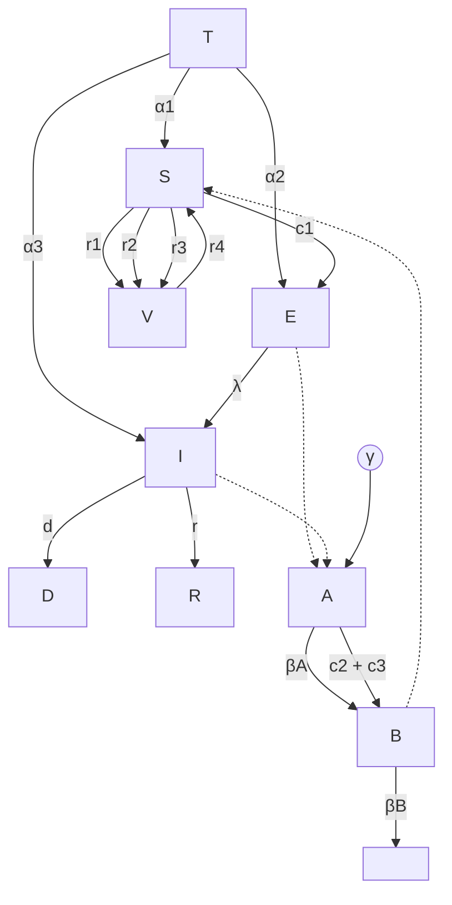

## 2. Influence of Travellers on Malaria Transmission

* The model incorporates **Traveller Population (T)** as a key factor in malaria transmission.

* The influx of infected or exposed travellers into a population can significantly affect malaria spread, especially in regions with low endemicity.

## 3. Vigilance and Malaria Control Strategies

* Human behavior regarding **adherence to malaria control measures** (e.g., insecticide-treated nets, indoor residual spraying, protective clothing) is explicitly modeled.

* The study found that an **80% vigilance rate** led to a notable reduction in malaria transmission, while **98% vigilance** provided the best model-fit scenario.

## 4. Behavioral Influence on Model Predictions

* The model was evaluated using **real-world data** from a controlled university setting, where student travel and control behaviors were tracked.
* Despite high vigilance, **imported malaria cases continued to influence transmission dynamics**, demonstrating the **need for border control interventions**.

## Terms in the Equations Affected by Human Behavior

**1. ODE model**

$$ \frac{dT}{dt} = -a_1T - a_2T - a_3T $$
$$ \frac{dS}{dt} = -r_1S - r_2S - r_3S + a_1T + r_4V - c_1SB $$
$$ \frac{dE}{dt} = c_1SB + a_2T - \lambda E $$
$$ \frac{dI}{dt} = \lambda E - rI - dI + a_3T $$
$$ \frac{dR}{dt} = rI $$
$$ \frac{dD}{dt} = dI $$
$$ \frac{dV}{dt} = r_1S + r_2S + r_3S - r_4V $$
$$ \frac{dA}{dt} = \gamma - b_AA - c_2AE - c_3AI $$
$$ \frac{dB}{dt} = c_2AE + c_3AI - b_BB. $$

**2. Traveller Population (T)**

$$ \frac{dT}{dt} = -a_1T - a_2T - a_3T $$

* **Human Mobility:** The parameters $a_1, a_2, a_3$ represent the rate at which travelers move between compartments (Susceptible, Exposed, and Infected).
* Affected by **travel patterns**, compliance with screening, and border control measures.

**3. Susceptible Population (S)**

$$\frac{dS}{dt} = -r_1S - r_2S - r_3S + a_1T + r_4V - c_1SB$$

* **Control Strategies:**
    

    * $r_1S, r_2S, r_3S$ represent the rates of adherence to **Long-Lasting Insecticide Nets (LLINs), Indoor Residual Spraying (IRS), and traditional malaria control (lotions, protective clothing, house nets, air conditioning).**
    

    * **Higher adherence (higher $r_1, r_2, r_3$) reduces susceptibility.**

* **Non-Adherence:** $r_4V$ represents non-adherence to control strategies.

* **Exposure to Infected Mosquitoes:** $c_1SB$ increases susceptibility based on contact with infected mosquitoes.

# 4. Exposed Population (E)

$$\frac{dE}{dt} = c_1SB + a_2T - \lambda E$$

* **Infection Behavior:** $c_1SB$ depends on exposure due to **failure to use preventive measures.**

* **Travel Influence:** $a_2T$ accounts for exposure among incoming travelers.

# 5. Infected Population (I)

$$\frac{dI}{dt} = \lambda E - rI - dI + a_3T$$

* **Treatment Seeking Behavior:**
    

    * $rI$ represents **recovery rate**, influenced by **early treatment adherence** and **medical access.**

* **Mortality Rate ($dI$):**
    

    * Influenced by **delayed treatment-seeking behavior** and **access to healthcare.**

# 6. Vigilant Population (V)

$$\frac{dV}{dt} = r_1S + r_2S + r_3S - r_4V$$

* **Protective Behaviors:**
    

    * $r_1, r_2, r_3$ reflect the effectiveness of **preventive measures.**

* Higher vigilance **reduces infection risk**.

* **Non-Adherence:**

    * $r_4V$ accounts for **individuals discontinuing protection**, increasing risk.

# Scholar 34: A network-patch methodology for adapting agent-based models for directly transmitted disease to mosquito-borne disease

<u>**Key Point Analysis of Human Behavior in the Model:**</u>

The authors combined an agent-based spatial model (ABM) for host movement on a network with a patch-based ordinary differential equation (ODE) model that captures environmental and mosquito dynamics in geographic habitat patches that cover the region modelled by the ABM.

**1. Compartmental Model Variables:**

In the female mosquito model, susceptible adults $S_v$ are infected at a rate $\lambda_v$ and pass through the exposed compartment, $E_v$, to the infectious compartment, $I_v$. All compartments contribute to reproduction, and we assume the death rate is independent of the infection status.

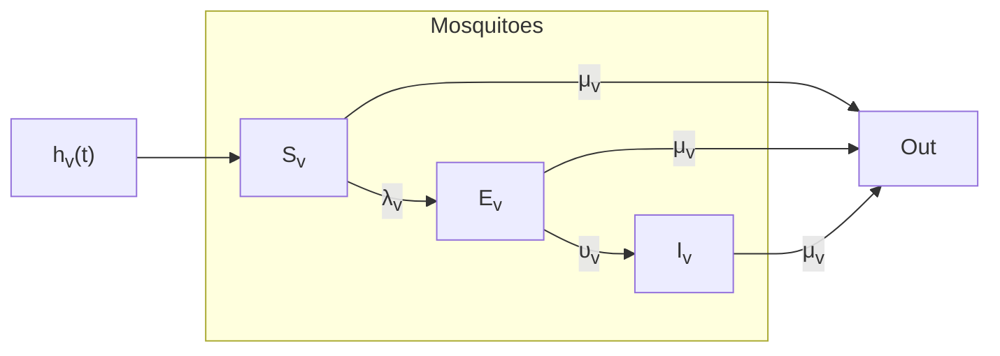
https://www.ncbi.nlm.nih.gov/core/lw/2.0/html/tileshop_pmc/tileshop_pmc_inline.html?title=Click%20on%20image%20to%20zoom&p=PMC3&id=5473441_nihms-667926-f0002.jpg

**2. Role of Patch Heterogeneity**

* The environment is divided into patches with different mosquito densities and human activities:

    * Patch 1 (Low Risk): Buildings with AC/screens, fewer breeding sites, lower mosquito density.

    * Patch 2 (Medium Risk): More breeding sites, moderate mosquito density.

* ○ Patch 3 (High Risk): Open-air dwellings, high mosquito density, and greater human-mosquito interaction.

* ● Human movement patterns determine how quickly and where the disease spreads.

### 3. Human Activity and Exposure Risk

* ● Infection risk is activity-dependent:

    * ○ Outdoor activities have higher mosquito exposure than indoor activities.

    * ○ Locations are assigned a relative mosquito exposure parameter ($\alpha \in [0,1]$), affecting bite probability.

* ● High-risk patches see higher transmission rates, especially when combined with frequent human movement.

### 4. Influence on Control Strategies

* ● Targeted interventions (e.g., insecticide spraying, bed nets) should focus on high-risk patches rather than uniformly across all regions.

* ● Travel restrictions in low-movement scenarios can delay or prevent outbreaks in other patches.

* ● In high-movement scenarios, widespread interventions may be necessary due to rapid disease mixing.

<u>**Terms in the Equations Affected by Human Behavior**</u>

**1. ODE model**

$$
\begin{aligned}
\frac{dS_v}{dt} &= h_v(N_v, t) - \lambda_v(t)S_v - \mu_v S_v \\
\frac{dE_v}{dt} &= \lambda_v(t)S_v - \nu_v E_v - \mu_v E_v \\
\frac{dI_v}{dt} &= \nu_v E_v - \mu_v I_v.
\end{aligned}
$$

Where:

$$ N_v = S_v + E_v + I_v $$

$$ \frac{dN_v}{dt} = (\psi_v - r_v \frac{N_v}{K_v})N_v - \mu_v N_v = r_v \left( 1 - \frac{N_v}{K_v} \right) N_v. $$

$h_v(N_v, t)$ is the per capita emergence function for adult female mosquitoes.
$\lambda_v(t)$ is the force of infection for mosquitoes.

## Parameters

<table>
    <tr>
        <td>$\psi_v$:</td>
        <td>Per capita emergence rate of adult female mosquitoes (Time<sup>-1</sup>).</td>
    </tr>
    <tr>
        <td>$\mu_v$:</td>
        <td>Per capita death rate of adult female mosquitoes (Time<sup>-1</sup>).</td>
    </tr>
    <tr>
        <td>$K_v$:</td>
        <td>Maximum number of mosquitoes in the patch (Mosquitoes).</td>
    </tr>
    <tr>
        <td>$\sigma_v$:</td>
        <td>Number of times one mosquito would want to bite a host per unit time, if hosts were freely available. This is a function of the mosquito's gonotrophic cycle (the amount of time a mosquito requires to produce eggs) (Time<sup>-1</sup>).</td>
    </tr>
    <tr>
        <td>$\sigma_h$:</td>
        <td>The maximum number of mosquito bites an average host can sustain per unit time. This is a function of the host's exposed surface area, the efforts it takes to prevent mosquito bites, and any vector control interventions in place to kill mosquitoes or prevent bites (Time<sup>-1</sup>).</td>
    </tr>
    <tr>
        <td>$\beta_{hv}$:</td>
        <td>Probability of transmission of infection from an infectious mosquito to a susceptible host given that a contact between the two occurs (Dimensionless).</td>
    </tr>
    <tr>
        <td>$\beta_{vh}$:</td>
        <td>Probability of transmission of infection from an infectious host to a susceptible mosquito given that a contact between the two occurs (Dimensionless).</td>
    </tr>
    <tr>
        <td>$\nu_v$:</td>
        <td>Per capita rate of progression of mosquitoes from the exposed state to the infectious state. 1/$\nu_v$ is the average duration of the latent period (Time<sup>-1</sup>).</td>
    </tr>
</table>

## 2. Force of Infection for Mosquitoes ($\lambda_v$)

The rate at which susceptible mosquitoes become infected depends on:

$$ \lambda_v = b_v \beta_{vh} \frac{\hat{I}_h}{N_h} $$

Where:

* $b_v$ = mosquito biting rate

* $\beta_{vh}$ = probability of infection transmission from humans to mosquitoes.

* $\hat{I}_h = \sum_j \alpha_j I_{h,j}$ weighted sum of infectious humans across activities (**depends on human movement and activity patterns**).

**Human Behavior Impact:**

*   **Activity-dependent risk** ($\alpha_j$) means some environments (**markets, open spaces**) contribute more to mosquito infections than others (**homes with screens**).

*   **Changes in human density** across patches affect the **local mosquito infection rate**.

## 3. Biting Rate and Patch Exposure Risk ($\sigma_h, \alpha_j$)

*   The number of bites a person receives **per unit time** depends on **location type and behavior**.

*   Exposure is scaled by an **activity-dependent risk factor** ($\alpha_j$):
    

    *   $\alpha_j = 1$ **for outdoor settings (high exposure)**
    

    *   $\alpha_j < 1$ **for indoor settings with screens (low exposure)**.

**Human Behavior Impact:**

*   People in **high-exposure activities** (outdoors, markets) face **higher infection risks** than those in **protected environments** (homes with AC/screens).

*   Control measures (e.g., bed nets, repellents) **reduce effective exposure**.

## 4. Effective Reproduction Number ($R_0$)

The basic reproduction number is given by:

$$R_0 = \sqrt{R_{vh} R_{hv}}$$

Where,

*   $R_{hv}$ = Average number of mosquitoes infected by one human.

$$R_{hv}^k(t) = \left( \frac{\nu_v}{\mu_v + \nu_v} \cdot \frac{\sigma_v}{\mu_v} \cdot \frac{\sigma_h \hat{N}_h^k}{\sigma_h \hat{N}_h^k + \sigma_v N_v^k} \cdot \beta_{hv} \right) \cdot \left( \frac{\hat{N}_h^k - \hat{I}_h^k}{\hat{N}_h^k} \right).$$

*   $R_{vh}$ = Average number of humans infected by one mosquito.

$$R_{vh}^k(t) = \left( \frac{\nu_h}{\mu_h + \nu_h} \cdot \frac{\sigma_h}{\mu_h + \gamma_h} \cdot \frac{\sigma_v N_v^k}{\sigma_h \hat{N}_h^k + \sigma_v N_v^k} \cdot \beta_{vh} \right) \cdot \left( \frac{S_v^k}{N_v^k} \right).$$

**with**

$$ \frac{\nu_v}{\mu_v + \nu_v}, \frac{\nu_h}{\mu_h + \nu_h} $$ Survival probability before becoming infectious High values = more infectious individuals

$$ \frac{\sigma_v}{\mu_v} $$ Total bites by a mosquito over its lifetime. More bites = higher transmission

$$ \frac{\sigma_h}{\mu_h + \gamma_h} $$ Total bites on a human over infectious period. More bites = higher transmission

$$ \frac{\sigma_h \hat{N}_h^k}{\sigma_h \hat{N}_h^k + \sigma_v N_v^k} $$ Human availability for mosquito bites. More humans = lower transmission

$$ \frac{\sigma_v N_v^k}{\sigma_h \hat{N}_h^k + \sigma_v N_v^k} $$ Mosquito availability for biting humans. More mosquitoes = higher transmission

$$ \beta_{hv}, \beta_{vh} $$ Probability of successful transmission. High values = more infections per bite

**Human Behavior Impact:**

*   **High human mobility** → Increases **mosquito exposure** → Highers $R_0$, so speeds up disease spread.

*   **Restricted movement** → Lowers $R_0$, potentially containing the outbreak.

# Scholar 6: Perspectives on the role of mobility, behavior, and time scales in the spread of diseases

<u>**Key Point Analysis of Human Behavior in the Model:**</u>

## 1. Mobility and Disease Spread

*   Mobility is modeled using a **metapopulation approach**, where individuals move between different "patches" (locations).

*   People move based on economic and social factors, **which alters exposure to disease risks.**

* The study highlights the **importance of tracking movement and residence time in different locations** to understand transmission patterns.

## 2. The Role of Information in Decision-Making

* People's responses depend on:

    - **Personal experience with past outbreaks**

    - **Media influence and public health messaging**

    - **Social networks and collective perception of risk**

* Effective communication can influence behavioral changes that either **reduce or amplify** disease spread.

## 3. Economic Decision-Making and Behavior (Economic Epidemiology)

* Individuals balance **economic activities and health risks** in a **cost-benefit analysis**.

* Economic models suggest that **infectious diseases spread faster in high-mobility, economically active populations**.

* Policies that incentivize **self-quarantine and vaccination** can alter disease dynamics.

## 4. Implications for Public Health and Policy

* **Targeted interventions** (e.g., travel restrictions, lockdowns, and quarantine measures) should consider behavioral responses.

* Economic incentives (such as financial support for self-isolation) can encourage **risk-mitigating behaviors**.

* Policy should **enhance risk communication** to ensure accurate public perception and responses.

<u>**Terms in the Equations Affected by Human Behavior**</u>

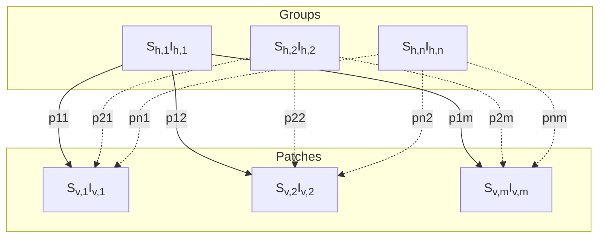

# <u>1. Susceptible-Infected-Susceptible (SIS) Model with Mobility</u>

$$ \dot{S}_i = b_i - d_i S_i + \gamma_i I_i - \sum_{j=1}^{n} [S_i \text{ infected in Patch } j] $$

$$ \dot{I}_i = \sum_{j=1}^{n} [S_i \text{ infected in Patch } j] - \gamma_i I_i - d_i I_i $$

Where

$b_i$ = birth rate (new susceptible individuals entering group i).

$d_i S_i$ = natural deaths among susceptibles.

$\gamma_i I_i$ = recovered individuals who become susceptible again (since there is no permanent immunity).

$$ [S_i \text{ infected in Patch } j] = \beta_j \cdot p_{ij} S_i \cdot \frac{\sum_{k=1}^{n} p_{kj} I_k}{\sum_{k=1}^{n} p_{kj} N_k} $$

**= total number of new infections** occurring in group i, based on interactions between susceptibles and infected individuals across patches.

**Terms Affected by Human Behavior**

1. $p_{ij}$ (Mobility Matrix) – Represents the proportion of time individuals from group i spend in patch j.

    - Behavioral Impact: Individuals may reduce travel to high-risk areas or increase travel due to economic necessity.

    - Example: Avoidance of cities during a pandemic leads to lower $p_{ij}$ for high-risk areas.

2. $\beta_j$ (Transmission Risk in Patch j) – Probability of infection per contact in patch j.

    - Behavioral Impact: This changes based on social distancing, mask usage, vaccination, and hygiene practices.

    - Example: Wearing masks lowers effective transmission rates ($\beta_j$).

Behavioral Impact:

- If individuals perceive risk, they reduce $p_{ij}$ (travel frequency).

- Public health measures can reduce $\beta_j$ (transmission probability).

- Herd immunity may decrease $I_k$ (infected population), lowering overall risk.

## <u>2. Vector-Borne Disease Model (Host-Vector Interactions)</u>

$$ \begin{cases} \dot{I}_h = \beta_{vh} \text{diag}(N_h - I_h) \mathbb{P} \text{diag}(a) \text{diag}(\mathbb{P}^t N_h)^{-1} I_v - \text{diag}(\mu + \gamma) I_h \\ \dot{I}_v = \beta_{hv} \text{diag}(a) \text{diag}(N_v - I_v) \text{diag}(\mathbb{P}^t N_h)^{-1} \mathbb{P}^t I_h - \text{diag}(\mu_v + \delta) I_v \end{cases} $$

Where: $\beta_{vh}$: The **transmission rate** from vectors to humans.

$\beta_{hv}$: The **transmission rate** from infected humans to vectors.

**Terms Affected by Human Behavior**

1. $p_{ij}$ (Human Movement Between Patches)

    - Behavioral Impact:

* Increased travel spreads the vector by carrying infected hosts into new areas.

* Quarantine measures reduce human movement, lowering transmission risks.

2. a (Biting Rate of Mosquitoes in Patch j)

* Behavioral Impact:

* Use of mosquito nets, insecticides, and repellents reduces exposure to mosquito bites.

* Behavioral change can lower $\beta_{vh}$ and $\beta_{hv}$, reducing disease transmission.

3. $\dot{c}$ (Vector Control Rate - Death Rate of Mosquitoes)

* Behavioral Impact:

* Community-based vector control efforts increase $\dot{c}$ by eliminating breeding sites.

* If people do not take preventive measures, mosquito populations grow, worsening the outbreak.

# <u>3. Basic Reproduction Number $R_0$ and Human Behavior</u>

$$R_0 = \rho(M_{vh}M_{hv})$$

Where

$M_{hv} = \beta_{hv}\text{diag}(a)\text{diag}(N_v)\text{diag}(P^T N_h)^{-1}P^T\text{diag}(\mu + \gamma)^{-1}$ Human-to-Vector

Transmission Matrix

$M_{vh} = \beta_{vh}\text{diag}(N_h)P\text{diag}(a)\text{diag}(P^T N_h)^{-1}\text{diag}(\mu_v + \delta)^{-1}$Vector-to-Human

Transmission Matrix

Terms Affected by Human Behavior

* Reducing social contact rates lowers $R_0$, slowing disease spread.

* Effective quarantine and vaccination can bring $R_0$ below 1, leading to disease elimination.

* Travel bans, mask mandates, and vector control modify the structure of $M_{vh}$ and $M_{hv}$, affecting long-term dynamics.

# Scopus 2: Modeling Approach Influences Dynamics of a Vector-Borne Pathogen System

This study compares Ordinary Differential Equation (ODE) models and Individual-Based Models (IBM) to analyze the spread of Barley Yellow Dwarf Virus (BYDV)

**1. Compartmental Model Variables:**

**Host Variables (Plants)**

*   $H$ – Number or fraction of **Healthy (Susceptible) Hosts**

*   $I$ – Number or fraction of **Infected Hosts**

**Vector Variables (Insects)**

*   $N_h$ – **Non-Viruliferous Vectors** on Healthy Hosts

*   $N_i$ – **Non-Viruliferous Vectors** on Infected Hosts

*   $V_h$ – **Viruliferous Vectors** on Healthy Hosts

*   $V_i$ – **Viruliferous Vectors** on Infected Hosts

**1. Decision-Making in Model Selection**

*   The study highlights that choosing a modeling approach significantly impacts the interpretation of results.

*   ODE models provide a **mean-field approximation**, which simplifies the system by averaging behavior across populations.

*   IBMs (Individual-Based Models) allow for **individual-level variations**, capturing stochasticity and emergent behaviors.

*   This reflects real-world human decision-making in epidemiology and ecology—whether to favor a broad, simplified understanding or a detailed, localized analysis.

**2. Human-Informed Control Strategies**

*   The study explores **two pathogen control strategies** that could be influenced by human decisions:

    *   **Removing virus-infected plants** (to reduce transmission).

    *   **Removing vector-infested plants** (to control vector population).

*   The IBM approach suggests that **removing infected plants is more effective in controlling the virus** than removing vector-infested plants.

* The results align with real-world agricultural management, where **early detection and removal of diseased crops** is often prioritized.

## 3. Influence of Human-Assisted Control on Spread Dynamics

* The paper’s findings could inform **human-driven interventions** in agricultural pest control.

* The IBM results show that **targeting plants with an intermediate level of vector infestation** is more effective than targeting highly infested plants.

* This suggests a need for **optimized surveillance programs**, where farmers or agricultural agencies **prioritize selective removal over widespread elimination**.

## 4. Understanding Behavioral Clustering and Spread

* The IBM model demonstrates **vector clustering**, where some plants have a disproportionately high number of vectors.

* If applied to human behavior, this could parallel the **spread of infectious diseases in densely populated areas**.

* The study implies that **targeted interventions in clustered hotspots** (similar to quarantine measures in human disease outbreaks) could be more effective than uniform interventions.

## 5. The Role of Stochasticity in Decision-Making

* Unlike the deterministic ODE model, the IBM incorporates **stochastic (random) elements** that better mimic real-world unpredictability.

* Human responses to disease spread (such as vaccination or quarantine measures) often involve **uncertainty and adaptation**, making stochastic modeling relevant to **public health policy**.

<u>**Terms in the Equations Affected by Human Behavior**</u>

# 1. ODE mode

$$ \frac{dN_h}{dt} = \underbrace{r_h[N_h + V_h]\left[1 - \frac{N_h + V_h}{K_hHF}\right]}_{\text{growth}} - \underbrace{\alpha_{nh}N_h[1 - \mu]I^\delta}_{\text{move to I}} - \underbrace{\alpha_{nh}N_h\mu}_{\substack{\text{dispersal} \\ \text{loss}}} \tag{1a} $$
$$ + \underbrace{\alpha_{ni}N_i[1 - \mu][1 - I^\delta]}_{\text{move to H}} - \underbrace{\beta_i\rho_{vh}N_h}_{\substack{\text{infect} \\ \text{host}}} $$

$$ \frac{dN_i}{dt} = \underbrace{\alpha_{nh}N_h[1 - \mu]I^\delta}_{\text{move to I}} - \underbrace{\alpha_{ni}N_i\mu}_{\substack{\text{dispersal} \\ \text{loss}}} - \underbrace{\alpha_{ni}N_i[1 - I^\delta][1 - \mu]}_{\text{move to H}} + \underbrace{\beta_i\rho_{vh}N_h}_{\substack{\text{infect} \\ \text{host}}} \tag{1b} $$
$$ - \underbrace{\beta_vN_i}_{\substack{\text{infect} \\ \text{vector}}} $$

$$ \frac{dV_i}{dt} = \underbrace{r_i[N_i + V_i]\left[1 - \frac{N_i + V_i}{K_iIF}\right]}_{\text{growth}} - \underbrace{\alpha_{vi}V_i[1 - \mu]H^\epsilon}_{\text{move to H}} - \underbrace{\alpha_{vi}V_i\mu}_{\substack{\text{dispersal} \\ \text{loss}}} \tag{1c} $$
$$ + \underbrace{\alpha_{vh}V_h[1 - \mu][1 - H^\epsilon]}_{\text{move to I}} + \underbrace{\beta_i\rho_{vh}V_h}_{\substack{\text{infect} \\ \text{host}}} + \underbrace{\beta_vN_i}_{\substack{\text{infect} \\ \text{vector}}} $$

$$ \frac{dV_h}{dt} = \underbrace{\alpha_{vi}V_i[1 - \mu]H^\epsilon}_{\text{move to H}} - \underbrace{\alpha_{vh}V_h\mu}_{\text{dispersal loss}} - \underbrace{\alpha_{vh}V_h[1 - \mu][1 - H^\epsilon]}_{\text{move to I}} \tag{1d} $$
$$ - \underbrace{\beta_i\rho_{vh}V_h}_{\substack{\text{infect} \\ \text{host}}} $$

and the host dynamics are given by

$$ \frac{dH}{dt} = - \underbrace{\beta_i \rho_{vh}}_{\text{infect host}} $$ (2a)

$$ \frac{dI}{dt} = \underbrace{\beta_i \rho_{vh}}_{\text{infect host}} $$ (2b)

where

$$ \alpha_{nh} = \frac{a_h \rho_h}{c_1 + \rho_h}, \quad \alpha_{vh} = \frac{a_h \rho_h}{c_2 + \rho_h}, \quad \alpha_{ni} = \frac{a_i \rho_i}{c_2 + \rho_i}, \quad \alpha_{vi} = \frac{a_i \rho_i}{c_1 + \rho_i} $$ (3)

and

$$ \rho_h = \frac{V_h + N_h}{HF + \xi}, \quad \rho_i = \frac{V_i + N_i}{IF + \xi}, \quad \rho_{vh} = \frac{V_h}{HF + \xi} $$ (4)

where

$\dot{\zeta}$ is the preference of a non-viruliferous vector and $\varsigma$ is the preference of a viruliferous vector

The probability of a non-viruliferous vector landing on an infected host
Is $I^\delta$; otherwise, it lands on a healthy host. The probability of a viruliferous vector
landing on a healthy host is $H^\varsigma$; otherwise, it lands on an infected host.

<table>
  <thead>
    <tr>
        <th> </th>
        <th>Parameters</th>
        <th>Units</th>
        <th>Value</th>
        <th>Range</th>
    </tr>
  </thead>
  <tbody>
    <tr>
        <td>$r_h$</td>
        <td>Intrinsic vector growth on healthy hosts</td>
        <td>1/day</td>
        <td>0.186<sup>a</sup></td>
        <td>(0.01–0.6)</td>
    </tr>
    <tr>
        <td>$r_i$</td>
        <td>Intrinsic vector growth on infected hosts</td>
        <td>1/day</td>
        <td>0.263<sup>a</sup></td>
        <td>(0.01–0.6)</td>
    </tr>
    <tr>
        <td>$K_h$</td>
        <td>Carrying capacity of vectors on healthy hosts</td>
        <td>Vectors/host</td>
        <td>100</td>
        <td>(20–200)</td>
    </tr>
    <tr>
        <td>$K_i$</td>
        <td>Carrying capacity of vectors on infected hosts</td>
        <td>Vectors/host</td>
        <td>100</td>
        <td>(20–200)</td>
    </tr>
    <tr>
        <td>$F$</td>
        <td>Field density</td>
        <td>Hosts</td>
        <td>100,000</td>
        <td>(75,000–125,000)</td>
    </tr>
    <tr>
        <td>$\delta$</td>
        <td>Preference of non-viruliferous vectors for settling on healthy hosts</td>
        <td>-</td>
        <td>0.9376<sup>c</sup></td>
        <td>(0.25–4)</td>
    </tr>
    <tr>
        <td>$\epsilon$</td>
        <td>Preference of viruliferous vectors for settling on infected hosts</td>
        <td>-</td>
        <td>0.7649<sup>c</sup></td>
        <td>(0.25–4)</td>
    </tr>
    <tr>
        <td>$a_h$</td>
        <td>Maximum departure of vectors from healthy hosts</td>
        <td>1/day</td>
        <td>0.1268<sup>a,b</sup></td>
        <td>(0.014–1.4)</td>
    </tr>
    <tr>
        <td>$a_i$</td>
        <td>Maximum departure of vectors from infected hosts</td>
        <td>1/day</td>
        <td>0.1438<sup>a,b</sup></td>
        <td>(0.014–1.4)</td>
    </tr>
    <tr>
        <td>$c_1$</td>
        <td>Same status half-departure constant</td>
        <td>Vectors/host</td>
        <td>13.76<sup>b</sup></td>
        <td>(1.37–137)</td>
    </tr>
    <tr>
        <td>$c_2$</td>
        <td>Different status half-departure constant</td>
        <td>Vectors/host</td>
        <td>0.3$c_1$</td>
        <td>(1.37–137)</td>
    </tr>
    <tr>
        <td>$\mu$</td>
        <td>Dispersal loss</td>
        <td>-</td>
        <td>0.994<sup>d</sup></td>
        <td>(0.4–0.99994)</td>
    </tr>
    <tr>
        <td>$\beta_v$</td>
        <td>Acquisition by non-viruliferous vector on infected host</td>
        <td>1/day</td>
        <td>0.68<sup>e</sup></td>
        <td>(0.7–1)</td>
    </tr>
    <tr>
        <td>$\beta_i$</td>
        <td>Transmission by viruliferous vector on healthy host</td>
        <td>Host/vector/day</td>
        <td>1<sup>e</sup></td>
        <td>(0.2–1)</td>
    </tr>
  </tbody>
</table>

$\xi$ = Small constant (prevents division by zero)

## 2. Vector Growth and Reproduction ($r_h, r_i$)

**Human-Influenced Factors:**

**Pesticide Use** – Reduces vector reproduction rate ($r_h, r_i$).

**Crop Rotation** – Can decrease vector survival, affecting their intrinsic growth rates.

**Habitat Modification** – Removing vector-friendly environments (e.g., weeds, alternate host plants) limits reproduction.

* **Impact:** Lowering $r_h, r_i$

slows vector population growth, reducing pathogen spread.

# 3. Vector Carrying Capacity ($K_h, K_i$)

* Represents the maximum number of vectors that a plant can support.

$K_h = \text{max vectors on healthy plants}, \quad K_i = \text{max vectors on infected plants}$
**Human-Influenced Factors:**

**Fertilization & Irrigation** – Healthier plants may support more vectors, increasing $K_h, K_i$.

**Insecticide Use** – Directly reduces the carrying capacity of plants for vectors.

* **Impact:** Lowering $K_h, K_i$ reduces overall vector population, limiting disease transmission.

# 4. Vector Departure and Movement ($\alpha_{nh}, \alpha_{ni}$)

* Determines the probability of vectors leaving or settling on plants.

* Higher values indicate **more movement between plants**.

$$ \alpha_{nh} = \frac{a_h \rho_h}{c_1 + \rho_h}, \quad \alpha_{ni} = \frac{a_i \rho_i}{c_2 + \rho_i} $$

**Human-Influenced Factors:**

**Physical Barriers (e.g., Row Covers, Netting)** – Reduces vector movement ($\alpha_{nh}, \alpha_{ni}$).
**Trap Crops (Decoy Plants)** – Alters settlement behavior, diverting vectors to non-crop plants.

**Pesticides** – Affects movement indirectly by reducing vector density.

* **Impact:** **Lower dispersal rates** make disease containment easier, while **higher dispersal rates** accelerate disease spread.

# 5. Host Infection Transmission Rates ($\beta_v, \beta_i$)

* $\beta_v$ = probability that a non-viruliferous vector acquires the virus.

* $\beta_i$ = probability that a viruliferous vector transmits the virus to a healthy plant.

$$
\begin{aligned}
\frac{dH}{dt} &= -\beta_i \rho_{vh} \\
\frac{dI}{dt} &= \beta_i \rho_{vh}
\end{aligned}
$$

**Human-Influenced Factors:**

**Plant Resistance (Breeding & Genetic Modification)** – Can reduce $\beta_i$, making plants less susceptible.

**Vector Control (Insecticides, Biological Control)** – Reduces vector population, indirectly lowering transmission.

**Sanitation (Removing Infected Plants)** – Directly limits virus sources, reducing transmission rate.

* **Impact: Lowering $\beta_v, \beta_i$ slows disease spread.**

## 6. Vector Dispersal Loss ($\mu$)

* Represents the fraction of vectors that **die or leave the field**.

$$ \alpha_{nh} N_h [1 - \mu] I^\delta $$

**Human-Influenced Factors:**

**Pesticide Use** – Increases mortality, raising $\mu$.

**Landscape Management (Windbreaks, Water Management)** – Affects vector dispersal, influencing $\mu$.

* **Impact: Higher $\mu$ reduces vector survival, indirectly lowering pathogen spread.**

# SD 5: How and to what extent does the anti-social behavior of violating self-quarantine measures increase the spread of disease?

Using a Multi-Agent Simulation (MAS) model, the research evaluates how sporadic testing and quarantine non-compliance affect disease spread.

<u>**Key Point Analysis of Human Behavior in the Model:**</u>

## 1. Compartmental Model Variables:

This SIR process divides a population into five compartments: susceptible ($S$), infectious ($I_A$ and $I_S$), recovered ($R$), and quarantined ($Q$) individuals

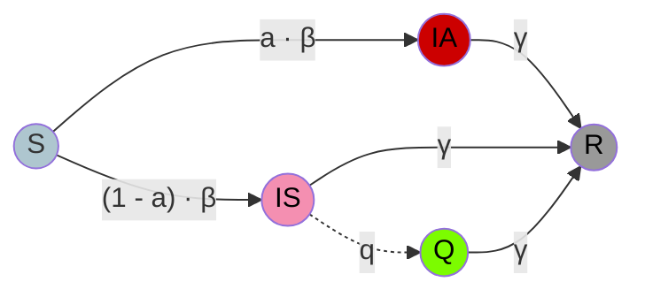

## 2. Compliance vs. Non-Compliance Models

*   **Compliant Individuals:** Fully isolated upon testing positive, severing all social connections.

*   **Non-Compliance Scenarios:**

    *   Model 1 ("Deep & Narrow"): A small group of individuals completely ignores quarantine, maintaining full social activity.

    *   Model 2 ("Shallow & Wide"): A large group partially ignores quarantine, keeping some social links but reducing overall activity.

## 3. Key Findings

### 3.1. Effectiveness of Testing Frequency

*   More frequent testing (4x/day vs. 1x/day) helps detect symptomatic cases faster but does not always reduce infections.

* When quarantine intensity is low or the fraction of asymptomatic cases is high, frequent testing becomes less effective.

## 3.2. Network Density and Disease Transmission

* More connected networks (higher average degree) lead to faster disease spread.

* Compliance is more crucial in denser networks, where interactions are frequent.

## 4. Implications for Public Health Policy

* Enforcing strict quarantine on highly symptomatic individuals is effective.

* Frequent testing is beneficial, but only under certain conditions (low asymptomatic fraction and strong quarantine measures).

* Policy should target reducing "shallow & wide" non-compliance rather than solely focusing on extreme violators.

* Public awareness campaigns should emphasize that even small violations collectively contribute significantly to outbreaks.

**<u>Terms in the Equations Affected by Human Behavior</u>**

**1. ODE model**

$$ \dot{S} = -\beta \cdot S \{ I_A + (I_S - \delta(t) \cdot q \cdot I_S) \} $$ (1.1)

$$ \dot{I}_A = \beta \cdot S \{ I_A + (I_S - \delta(t) \cdot q \cdot I_S) \} \cdot a - \gamma \cdot I_A $$ (1.2)

$$ \dot{I}_S = \beta \cdot S \{ I_A + (I_S - \delta(t) \cdot q \cdot I_S) \} \cdot (1 - a) - \gamma (I_S - \delta(t) \cdot q \cdot I_S) $$ (1.3)

$$ \dot{Q} = -\gamma (Q + \delta(t) \cdot q \cdot I_S) $$ (1.4)

$$ \dot{R} = \gamma \{ I_A + (I_S - \delta(t) \cdot q \cdot I_S) + (Q + \delta(t) \cdot q \cdot I_S) \} $$ (1.5)

$$ S + I_A + I_S + Q + R = 1 $$ (1.6)

$$ \delta(t) = \begin{cases} \text{if } t \bmod \tau = 0; 1 \\ \text{otherwise; } 0 \end{cases} $$ (1.7)

Where:

$\beta$ = Disease transmission rate per day

$\gamma$ = Recovery rate per day

$q$ = Quarantine detection rate

$a$ = Fraction of asymptomatic cases

$\delta(t)$ = Testing frequency function:

where $\tau$ is the testing interval (e.g., $\tau = 1$) day or $\tau = 1/4$ day).

## 1. Disease Transmission Rate ($\beta$)

$$ \frac{dS}{dt} = -\beta S (I_A + I_S) + \delta(t) q I_S $$

**Human Behavior Impact:**

* **Compliance with social distancing** reduces $\beta$ by decreasing the probability of susceptible individuals ($S$) coming into contact with infected individuals ($I_A, I_S$).

*   **Mask-wearing and hygiene measures** lower $\beta$ by reducing the likelihood of transmission per contact.

*   **Non-compliance with quarantine** (i.e., people violating restrictions) **increases** $\beta$ by maintaining social interactions.

## 2. Quarantine Detection Rate ($q$)

$$ \frac{dQ}{dt} = \delta(t)qI_S - \gamma Q $$

Human Behavior Impact:

*   **Frequent testing and willingness to get tested** increase $q$ by identifying symptomatic individuals more quickly.

*   **Reluctance to test** (due to stigma, misinformation, or inconvenience) decreases $q$, leading to more undetected infections.

*   **Government enforcement of quarantine** affects $q$ by ensuring detected cases are actually isolated.

## 3. Fraction of Asymptomatic Cases ($a$)

$$ \frac{dI_A}{dt} = \beta S(I_A + I_S)a - \gamma I_A $$

Human Behavior Impact:

*   Behavior does not directly change $a$, since it depends on biological factors.

*   However, behavior influences its effect:

    *   If asymptomatic individuals follow safety measures (e.g., wearing masks despite no symptoms), disease spread is lower.

    *   If asymptomatic individuals ignore precautions, they become silent spreaders, increasing infections.

## 4. Testing Frequency ($\delta(t)$)

$$ \delta(t) = \begin{cases} 1, & \text{if } t \mod \tau = 0 \\ 0, & \text{otherwise} \end{cases} $$

t is the current time (in days).

$\tau$ is the testing interval (e.g., 1 day, 0.25 days, etc.).
If testing occurs **once per day** ($\tau = 1$), then $\delta(t) = 1$ for t=1,2,3,...
If testing occurs **four times per day** ($\tau = 0.25$), then $\delta(t) = 1$ for
t=0.25,0.5,0.75,1,1.25,...

**Human Behavior Impact:**

* **Government policies on testing availability and affordability** affect $\delta(t)$.
* **People's willingness to get tested regularly** influences $\delta(t)$.
* **Fear of losing work/income** discourages testing, reducing $\delta(t)$.

## 5. Recovery Rate ($\gamma$)

$$ \frac{dR}{dt} = \gamma(I_A + I_S + Q) $$

**Human Behavior Impact:**

* Access to medical care and adherence to treatment influence $\gamma$.
* Ignoring health guidelines (e.g., rest, medication) prolongs illness, decreasing $\gamma$.
* Seeking early treatment and vaccination (if available) increases $\gamma$ by speeding up recovery.

## 6. Multi-Agent Simulation (MAS) Models for Disease Spread

### Model 1: "Deep & Narrow" Non-Compliance

In this scenario, a small fraction $f_i$ individuals completely ignore quarantine and continue their normal activity.

<u>**Key Features:**</u>

* A fraction q of symptomatic individuals is identified and requested to quarantine.
* A subset of these individuals, $f_i q I_S$, refuses to comply and maintains all social links.
* The remaining $(1 - f_i) q I_S$ individuals follow quarantine and sever their connections.
* The disease spreads more locally, but with higher intensity among non-compliant individuals.

Mathematically, the total non-compliant infected individuals $I_S^{NC}$ are given by:

$$ I_S^{NC} = f_i q I_S $$
$$ \frac{dI_S^{NC}}{dt} = \beta S I_S^{NC} - \gamma I_S^{NC} $$

**Model 2: "Shallow & Wide" Non-Compliance**

In this scenario, a larger number of individuals violate quarantine but only partially.

<u>Key Features:</u>

* All individuals requested to quarantine are labeled as Q .

* Instead of completely ignoring quarantine, each individual retains a fraction $f_i$ of their social links.

* The disease spreads more evenly across the network, affecting a larger number of people.

Mathematically, the total fraction of maintained links $L_{kept}$ is given by:

$$
L_{kept} = f_i \cdot k \cdot Q
$$
$$
\frac{dQ}{dt} = \delta(t)qI_S - \gamma Q
$$

# WofS 7 Optimal voluntary and mandatory insect repellent usage and emigration strategies to control the Chikungunya outbreak on Reunion Island

<u>**Key Point Analysis of Human Behavior in the Model:**</u>

1. **Compartmental Model Variables**: All human inhabitants of the island (N) are divided into 5 compartments: individuals susceptible to chikungunya (S); exposed individuals (E), who had been bitten by an infected mosquito and acquired the disease; symptomatic infectious individuals (I), who developed the symptoms of the disease and became infectious to biting mosquitoes; asymptomatic infectious individuals (Ia), who became infectious but did not develop symptoms; and recovered individuals (R), who recovered from chikungunya and acquired immunity. The mosquito population is divided into 3 compartments: susceptible mosquitoes (X); exposed mosquitoes (Y), who bit an infected human and were exposed to the pathogen; and infectious mosquitoes (Z).

Compartmental model diagram showing transitions between states S, E, Ia, I, R and X, Y, Z with associated rates and feedback loops.

**2. Voluntary vs. Mandatory Protective Measures**

* Individuals choose between using insect repellent or emigrating to avoid infection.

* Game theory is used to predict individual decisions based on perceived costs and benefits.

**3. Self-Interest vs. Public Good**

* Voluntary adoption of insect repellent falls short of herd immunity levels because individuals act in self-interest rather than for the collective benefit.

* Mandatory repellent usage may achieve eradication if costs are low enough.

**4. Tragedy of the Commons in Emigration**

* Individual emigration increases disease prevalence among those who remain, creating a paradox where personal safety increases collective risk.

**5. Economic Considerations in Behavior**

* Cost of infection vs. cost of prevention (repellent or emigration) influences decision-making.

* A threshold exists where individuals forgo protection due to high costs.

**6. Nash Equilibrium in Decision-Making**

* The model identifies equilibrium points where individuals stop changing their behavior.

* For repellent use, individuals either fully commit or avoid it based on cost-effectiveness.

**7. Impact of Perception and Awareness**

*   The model assumes individuals are fully informed, though in reality, misinformation or lack of awareness could alter decisions.

<u>**Terms in the Equations Affected by Human Behavior**</u>

### 1. ODE model

$$ \frac{dS}{dt} = \Lambda_1 - \frac{\beta_1 SZ}{N} - \mu_1 S $$
$$ \frac{dE}{dt} = \frac{\beta_1 SZ}{N} - \lambda_1 E - \mu_1 E $$
$$ \frac{dI}{dt} = \phi \lambda_1 E - \gamma I - \mu_1 I $$
$$ \frac{dI_a}{dt} = (1 - \phi) \lambda_1 E - \gamma I_a - \mu_1 I_a $$
$$ \frac{dR}{dt} = \gamma(I + I_a) - \mu_1 R $$
$$ \frac{dX}{dt} = \Lambda_2 - \frac{\beta_2 X(I + I_a)}{N} - \mu_2 X $$
$$ \frac{dY}{dt} = \frac{\beta_2 X(I + I_a)}{N} - \lambda_2 Y - \mu_2 Y $$
$$ \frac{dZ}{dt} = \lambda_2 Y - \mu_2 Z $$

<table>
  <thead>
    <tr>
        <th colspan="4">Table 1 Summary of the model parameters.</th>
    </tr>
    <tr>
        <th>Symbol</th>
        <th>Meaning</th>
        <th>Value</th>
        <th>Source</th>
    </tr>
  </thead>
  <tbody>
    <tr>
        <td>β<sub>1</sub><sup>0</sup></td>
        <td>Mosquito-to-human transmission</td>
        <td>0.37</td>
        <td>Dumont, Chiroleu &amp; Domerg (2008)</td>
    </tr>
    <tr>
        <td>β<sub>2</sub></td>
        <td>Human-to-mosquito transmission</td>
        <td>0.37</td>
        <td>Dumont, Chiroleu &amp; Domerg (2008)</td>
    </tr>
    <tr>
        <td>γ</td>
        <td>Human recovery rate</td>
        <td>0.14</td>
        <td>Yakob &amp; Clements (2013)</td>
    </tr>
    <tr>
        <td>Λ<sub>1</sub></td>
        <td>Human birth rate</td>
        <td>3.58</td>
        <td>Assumed</td>
    </tr>
    <tr>
        <td>Λ<sub>2</sub></td>
        <td>Mosquito birth rate</td>
        <td>4.76 × 10<sup>3</sup></td>
        <td>Assumed</td>
    </tr>
    <tr>
        <td>λ<sub>1</sub></td>
        <td>Rate of humans becoming infectious</td>
        <td>0.5</td>
        <td>Yakob &amp; Clements (2013)</td>
    </tr>
    <tr>
        <td>λ<sub>2</sub></td>
        <td>Rate of mosquitoes becoming infectious</td>
        <td>0.5</td>
        <td>Yakob &amp; Clements (2013)</td>
    </tr>
    <tr>
        <td>μ<sub>1</sub></td>
        <td>Human natural death rate</td>
        <td>3.58 × 10<sup>−5</sup></td>
        <td>Assumed</td>
    </tr>
    <tr>
        <td>μ<sub>2</sub></td>
        <td>Mosquito natural death rate</td>
        <td>0.05</td>
        <td>Yakob &amp; Clements (2013)</td>
    </tr>
    <tr>
        <td>φ</td>
        <td>Proportion of hosts that develop symptoms</td>
        <td>0.97</td>
        <td>Yakob &amp; Clements (2013)</td>
    </tr>
  </tbody>
</table>

### 2. Insect Repellent Usage Stratergy

*   **Term Affected:** $\beta_1$ (Mosquito-to-Human Transmission Rate)

$$\beta_1 = \beta_1^0(1 - r)$$

where:

*   $\beta_1^0$: is the base line transmission rate

*   r is the proportion of time an individual uses repellent.

*   **Affected Equations:**

$$f_1 = \beta_1 \frac{SZ}{N}$$

where $f_1$ (force of infection on humans) is reduced when $\beta_1$ decreases due to repellent use.

*   **Basic Reproduction Number $R_0$ under Repellent Usage**

$$R_0(r_{pop}) = \frac{1}{\mu_2} \sqrt{\frac{\Lambda_2 \beta_1^0(1 - r_{pop}) \beta_2 \lambda_1 \lambda_2 \mu_1}{\Lambda_1(\gamma + \mu_1)(\lambda_1 + \mu_1)(\lambda_2 + \mu_2)}}$$

*   The more repellent use, the lower $R_0$ so it benefits the whole population

# 3. Emigration Strategy

*   **Term Affected: S (Human susceptible)**

*   $$\frac{dS}{dt} = \Lambda - \beta_1 \frac{SZ}{N} - \mu_1 S - \omega S$$

Where: $\omega$ is the emigration rate of susceptible individuals.

*   **Basic Reproduction Number $R_0$ under Emigration**

$$R_0(\omega) = \frac{1}{\mu_2} \sqrt{\frac{\Lambda_2 \beta_1 \beta_2 \lambda_1 \lambda_2 (\mu_1 + \omega)}{\Lambda_1(\gamma + \mu_1)(\lambda_1 + \mu_1)(\lambda_2 + \mu_2)}}$$

*   The more portion of Susceptible leaving use benefits the higher $R_0$, meaning that the Emigration Strategy only helps emigrants but increases risk for those who remain

# Scholar 6: Perspectives on the role of mobility, behavior, and time scales in the spread of diseases

The paper applies two types of models: The Lagrangian models and the Economic Epidemiological modelling (EEM) to show how **mobility** (spatial behavior) and **individual decision-making** (control) can be incorporated into epidemiological modeling, depending on the chosen framework.

* The Lagrangian modeling approach is used to model individuals's patch residence times or by assigning their contacts according to the time spent on each environment.

* In the EEM individuals adjust their contact rates and activities based on costs and risk, affecting disease incidence through behavioral optimization

<u>**Key Point Analysis of Human Behavior in the Model:**</u>

1. **Compartmental Model Variables Langrangian Model:**

For the Lagrangian approach, a susceptible-infected-susceptible (SIS) model is used.

The model described the interactions of $n$ host groups, in $m$ patches. Where 

 $I_h = [I_{h1} + I_{h2},..., I_{hn}]^t, I_v = [I_{v1} + I_{v2},..., I_{vn}]^t, N_h = [N_{h1} + N_{h2},..., N_{hn}]^t$. 

 The infected hosts are denoted by the vector $I_h$ and the host population by $N_h$. The infected vectors are denoted by $I_v$ and the mosquito population by $N_v$.

The parameters $a_i, \delta_i, \mu_n$ correspond to the biting, death rate of control and natural death rate of mosquitoes in Patch $j$, for $j = 1,.., m$.

$\beta_{vh}$ is the infectiousness of human to mosquitoes

$\beta_{hv}$ is the infectiousness of mosquitoes to humans

Flow diagram of a Lagrangian model showing Patches (Sv, Iv) and Groups (Sh, Ih) with movement probabilities p_ij connecting them.

**Fig. 3.** Flow diagram of a Lagrangian model in which the host structure is decoupled from the vectors' structure. Figure courtesy of ref. 23.

## 2. SIS model

$$ \begin{cases} \dot{S}_i = b_i - d_i S_i + \gamma_i I_i - \sum_{j=1}^n (S_i \text{ infected in Patch } j) \\ \dot{I}_i = \sum_{j=1}^n (S_i \text{ infected in Patch } j) - \gamma_i I_i - d_i I_i, \end{cases} $$

## 3. Parameters related to movement

Movement determines the number of susceptible individuals from Patch $i$ who get infected while being physically present in Patch $j$

* Residence times matrix $P = p_{ij}, 1 < i,j < n$

in which $p_{ij}$ is the proportion of time residents of Patch $i$ spend in Patch $j$. This matrix describes human mobility. It affects the risk of infection in each patch.

$$ [S_i \text{ infected in Patch } j] = \underbrace{\beta_j}_{\text{the risk of infection in Patch } j} $$

$$ \times \underbrace{p_{ij} S_i}_{\text{Susceptible from Patch } i \text{ who are currently in Patch } j} $$

$$ \times \underbrace{\frac{\sum_{k=1}^n p_{kj} I_k}{\sum_{k=1}^n p_{kj} N_k}}_{\text{Proportion of infected in Patch } j} $$

In which the movement defined the number of susceptible individuals of Patch $i$ that get infected while being in the Path $j$.

● **Rate of infection in Patch $j$: $\beta_j$**

It is affected by movement because a susceptible individual of Patch $i$ get infected in the Patch $j$.

# 4. EEM model

The model lets individuals choose their behavior optimally by weighing:

* benefits of social activities

* cost of becoming infected

* probability of exposure

## a. Utility function

$$ U^h = U(h, C^h). $$

Where,

$h \in \{S, I, R\}$ and $C^h$ is the contact level chosen by individuals.

The utility function is assumed to be concave, decreasing in illness and increasing in contacts.

## b. Dynamic Optimization

If the probability of transitioning from susceptible to infected health status depends on the number of contacts, the optimal choice of contacts is the solution to a dynamic programing problem:

$$ V_t(h) = \max_{C^s} \left\{ U_t \left( h_t, C_t^h \right) + r \sum_j \rho^{hj} V_{t+1}(j) \right\} $$

where $r$ is the discount rate and $\rho^{hj}$ is the probability of transition from health state $h$ to health state $j$.

## 5. Behavioral parameters

* **Incidence rate:**

$$S(t)cP_{SI}(t)\rho,$$

Where each term can be influenced by behavior:

* $C_t$ = chosen contact rate (affected by costs, fear, risk)

* $P_{SI}(t)$ = probability of meeting an infected individual. This changes when people reduce contacts or avoid certain groups.

* $\rho$ = probability of transmission per contact

## 6. Assumptions of the model

* Individuals avoid or spend less time in areas of high prevalence.

* Human mobility across patches does not produce any "net" change on the patch population size.

* Individuals are rational decision-makers

* Individuals in different health states choose different optimal contact rates

# Scholar 13 Understanding Dengue Control for Short- and Long-Term Intervention with a Mathematical Model Approach

<u>Key Point Analysis of Human Behavior in the Model:</u>

## 1. Compartmental Model Variables

Human population is divided into four groups:

* Susceptible $S_h(t)$: can be infected with dengue;

* Vaccinated $V_h(t)$: vaccination do not provide perfect immunity;

* Infected $In_h(t)$: capable of transmitting the disease to mosquitoes;

* Recovered $R_h(t)$: recovered individuals and have acquired temporal immunity.

The mosquito population is divided into three compartments:

* Aquatic phase $A_V(t)$: includes the egg, larvae, and pupa stages;

* Susceptible $S_V(t)$;

* Infected $In_h(t)$: mosquitoes carrying dengue and capable of transmitting to humans.

Mathematical model diagram showing transitions between human (Vh, Sh, Inh, Rh) and mosquito (Av, Sv, Inv) compartments with control parameters u1 through u5.

FIGURE 1: Mathematical model using vaccination of adults and newborns, fumigation and larvicide treatment, and enforcement of mechanical control.

## 2. Protection strategies

*   **Vaccination**: The parameter $\xi$ implies a reduction of the average of successful transmission in human $\beta_h$. It includes newborn vaccination and adult vaccination.

*   **Use of larvicides**

*   **Use of insecticides**: insecticide is the best way of controlling dengue spread, followed by mechanical control and larvicide, respectively.

*   **Mechanical control**: remove breeding sites

**Optimal strategies:**

For long-term interventions, fumigation is the best strategy to reduce the infected population of both mosquitoes and humans.

For short-term interventions, vaccination of the adult population is the best way to reduce the number of infected people.

There is a slight difference between periodic intervention strategy and constant intervention in reducing the number of infected humans and mosquitoes. Therefore, if there is a limited budget, implementing a periodic intervention is a good option

# <u>Terms in the Equations Affected by Human Behavior</u>

.

## 3. ODEs model

$$ \frac{dS_h}{dt} = (1 - u_2) A_h - \frac{b \beta_h S_h I_{n_v}}{N_h} - u_1 S_h - \mu_h S_h + \delta_h R_h $$
$$ + \theta_h V_h, $$

$$ \frac{dV_h}{dt} = u_2 A_h + u_1 S_h - \frac{b \xi \beta_h V_h I_{n_v}}{N_h} - \mu_h V_h - \theta_h V_h, $$

$$ \frac{dI_{n_h}}{dt} = \frac{b \beta_h I_{n_v} (S_h + \xi V_h)}{N_h} - \gamma_h I_{n_h} - \mu_h I_{n_h}, $$

$$ \frac{dR_h}{dt} = \gamma_h I_{n_h} - \mu_h R_h - \delta_h R_h, $$

$$ \frac{dA_v}{dt} = \phi \left( 1 - \frac{A_v}{u_5 k N_h} \right) (S_v + I n_v) - u_3 A_v - \eta_v A_v $$

$$ - \mu_A A_v, $$

$$ \frac{dS_v}{dt} = \eta_v A_v - \frac{b \beta_v S_v I n_h}{N_h} - \mu_v S_v - u_4 S_v, $$

$$ \frac{d I n_v}{dt} = \frac{b \beta_v S_v I n_h}{N_h} - \mu_v I n_v - u_4 I n_v, $$

## 4. Assumptions of the model

* Vaccinated humans do not have perfect immunity, there will be a time when the vaccine does not work or when the effect of the vaccine has begun to subside.

* There is no migration in either human or mosquito population.

* Humans and mosquitoes are assumed to be born susceptible, there is no natural protection, and dengue is not passed onto the next generation (no vertical transmission)

* Infected humans cannot transmit the virus to other susceptible or vaccinated humans

* The death rate is considered to be a natural death rate in both populations.

* Vaccinated human status is considered temporary because of the ability of the vaccine to subside over time.

* There is no resistant (immune) effect in mosquitoes to the use of synthetic fumigation, such as insecticides and larvicides.

## 5. Human-action parameters

* $u_1$: Intensity of adult vaccination, reduce human susceptibility and decreases transmission from mosquitoes

* $u_2$: Intensity of newborns vaccination, strongly effects on long-term immunity, decreases transmission from mosquitoes

* $u_3$: Mosquito/larvae control, represents human actions against larvae, affects the transition from aquatic to adult mosquito stages.

* $u_4$: Fumigation (targeting adult mosquitoes): human fumigation effort affecting adult mosquito mortality.

* $u_5$: Mechanical control of removing breeding sites. Implies a reduction of the carrying capacity $K$.

## 6. Parameters

$N_h$: total of human population

$A_h$: human per capita birth rate

$b$: average number of bites of humans by mosquitoes

$\beta_h$: average of successful transmission in human

$\beta_v$: average of successful transmission in mosquitoes

$\mu_h$: human death rate

$\mu_v$: mosquito death rate

$\mu_A$: larval death rate

$\delta_h$: the rate of change from $R_h$ to $S_h$ because of the disappearance of the temporal natural immunity

$\theta_h$: the rate of change from $V_h$ to $S_h$ because of the disappearance of the temporal vaccine effect

$\xi$: reduction of $\beta_h$ because of vaccine

$\gamma_h$: human recovery rate

$\phi$: average number of eggs at each deposit

$k$: ratio for number of larvae per human

$\eta_v$: transition rate from $A_v$ to $S_v$

$u_1$: adult vaccination rate

$u_2$: newborn vaccine

$u_3$: larvicide rate

$u_4$: fumigation rate

$u_5$: enforcement of mechanical control proportion to reduce $k$

TABLE 1: Parameters values.

<table>
  <thead>
    <tr>
        <th>Parameters</th>
        <th>Value</th>
        <th>Description</th>
    </tr>
  </thead>
  <tbody>
    <tr>
        <td>$N_h$</td>
        <td>1000</td>
        <td>Total of human population is assumed to be 1000 people.</td>
    </tr>
    <tr>
        <td>$\mu_h$</td>
        <td>1/(65 × 365)</td>
        <td>Since human life expectation is approximately 65 years, we have $\mu_h = 1/(65 \times 365)$ [23].</td>
    </tr>
    <tr>
        <td>$A_h$</td>
        <td>1000/(65 × 365)</td>
        <td>Since in our model the total of the human population is constant, we have $A_h = N_h \mu_h = 1000/(65 \times 365)$.</td>
    </tr>
    <tr>
        <td>$\phi$</td>
        <td>300</td>
        <td>We assume that each female <em>Aedes aegypti</em> produces 300 eggs at each spawning.</td>
    </tr>
    <tr>
        <td>$\beta_h, \beta_v$</td>
        <td>0, 1</td>
        <td>It is assumed that it needs 10 successful contacts to infect a human/mosquito with dengue [23].</td>
    </tr>
    <tr>
        <td>$\theta_h$</td>
        <td>1/60</td>
        <td>We assume that the effect of vaccination will have disappeared in 60 days.</td>
    </tr>
    <tr>
        <td>$\gamma_h$</td>
        <td>1/14</td>
        <td>The natural recovery rate for the human population from dengue is 14 days [4].</td>
    </tr>
    <tr>
        <td>$\xi$</td>
        <td>0.1</td>
        <td>With vaccination, the infection rate from mosquito to human population will be reduced by 90%.</td>
    </tr>
    <tr>
        <td>$\mu_v$</td>
        <td>1/30</td>
        <td>Life expectation of the mosquito population is 30 days [4].</td>
    </tr>
    <tr>
        <td>$\mu_A$</td>
        <td>0.75/21</td>
        <td>We assume that there is only a 25% chance that larvae might grow and become adult mosquitoes, with time to transition being 21 days.</td>
    </tr>
    <tr>
        <td>$\eta_v$</td>
        <td>0.25/21</td>
        <td>Transition from aquatic phase to adult mosquito [4].</td>
    </tr>
    <tr>
        <td>$\delta_h$</td>
        <td>1/30</td>
        <td>Short-term immunity of humans to dengue after recovery is 30 days [23].</td>
    </tr>
    <tr>
        <td>$b$</td>
        <td>1</td>
        <td>Mosquitoes only bite once a day [23].</td>
    </tr>
    <tr>
        <td>$k$</td>
        <td>2</td>
        <td>We assume that the ratio between human and adult mosquitoes is 2; that is, each human related to 2 adult mosquitoes.</td>
    </tr>
  </tbody>
</table>

# Scholar 44: Global Dynamics and Optimal Control of Multi-Age Structured Vector Disease Model with Vaccination, Relapse and General Incidence

# <u>Key Point Analysis of Human Behavior in the Vaccine Model:</u>

**1. Compartmental Model Variables:**

Following the process of parasites/bacteria transmission between hosts and vectors, the host population is divided into susceptible individuals $S_h$, vaccinated immune individuals $V_h$, infected individuals $I_h$, and recovered individuals $R_h$. The vector population is divided into susceptible $S_v$ and infected $I_v$

**2. Vaccination and Immunity Loss**

* The model considers **age-dependent immunity decay**, meaning that **vaccinated individuals do not remain immune indefinitely**.

* **Human behavior plays a crucial role in deciding when and how frequently booster doses should be administered.**

* The vaccination rate (**$\psi_h$**) and immunity loss rate (**$\omega_h(a)$**) directly influence how long a population remains protected.

**3. Relapse and Disease Persistence**

* The study accounts for **relapse behavior**, where individuals who recover may become reinfected after a certain period.

* **Human activities, such as exposure to disease vectors (e.g., mosquito bites), influence the relapse rate (r_h(c)).**

* **Behavioral interventions**, such as **avoiding high-risk areas, using bed nets, and maintaining hygiene**, could significantly reduce relapse cases.

**4. Social Interaction and Infection Risk**

* The model includes a **general incidence function f(S_h, I_v)**, which reflects how humans interact and influence disease spread.

* **Social behaviors such as crowding, migration, and health-seeking actions impact the basic reproduction number (R0).**

* **Nonlinear transmission rates** indicate that infection likelihood depends not just on the number of infected individuals but also on **how they interact with susceptible individuals**.

# 5. Optimal Control Strategies and Human Decision-Making

* **Behavioral responses to disease outbreaks, such as increased vaccination rates or reduced interaction with infected individuals, are modeled as control variables.**

* **The paper investigates cost-effective strategies for vaccination campaigns, considering limited medical resources and public compliance.**

* **Human reluctance or willingness to get vaccinated significantly impacts the success of disease eradication efforts.**

# 6. Implications for Public Health Policy

* **Policymakers can use this model to predict how human behavior influences vaccine effectiveness and determine the optimal timing for booster doses.**

* **Public awareness campaigns should focus on increasing compliance with vaccination schedules and preventive practices.**

* **The study suggests that behavioral interventions should be combined with vaccination efforts to achieve long-term disease control.**

## <u>Terms in the Equations Affected by Human Behavior</u>

### 1. ODE/PDE model

$$
\begin{cases}
\frac{\mathrm{d} S_h(t)}{\mathrm{d} t} = \Lambda_h - \mu_h S_h(t) - f(S_h(t), I_v(t)) - \frac{1}{\alpha} \psi_h S_h(t) + \int_0^\infty \omega_h(a) V_h(t, a) \mathrm{d} a, \\
\left( \frac{\partial}{\partial t} + \alpha \frac{\partial}{\partial a} \right) V_h(t, a) = -(\mu_h + \omega_h(a)) V_h(t, a), \ V_h(t, 0) = \frac{1}{\alpha} \psi_h S_h(t), \\
\left( \frac{\partial}{\partial t} + \alpha \frac{\partial}{\partial b} \right) I_h(t, b) = -(\mu_h + k_h(b) + \nu_h(b)) I_h(t, b), \\
I_h(t, 0) = f(S_h(t), I_v(t)) + \int_0^\infty r_h(c) R_h(t, c) \mathrm{d} c, \\
\left( \frac{\partial}{\partial t} + \alpha \frac{\partial}{\partial c} \right) R_h(t, c) = -(\mu_h + r_h(c)) R_h(t, c), \ R_h(t, 0) = \int_0^\infty k_h(b) I_h(t, b) \mathrm{d} b, \\
\frac{\mathrm{d} S_v(t)}{\mathrm{d} t} = \Lambda_v - \int_0^\infty \beta_v(b) S_v(t) I_h(t, b) \mathrm{d} b - \mu_v S_v(t), \\
\frac{\mathrm{d} I_v(t)}{\mathrm{d} t} = \int_0^\infty \beta_v(b) S_v(t) I_h(t, b) \mathrm{d} b - \mu_v I_v(t),
\end{cases}
$$

Where:

a denotes the time-since-vaccination

b represents the time-since-infection

c denotes the time-since-recover

$\alpha$ is introduced to balance the difference in units of age and time. For example, if the units of age and time are week and day, respectively, then $\alpha = 1/7$. In this paper, in order to simplify the calculation, the units of age and time are both selected as *day*, so in this case, $\alpha = 1$.

Table 1 The means of model parameters

<table>
  <thead>
    <tr>
        <th>Param.</th>
        <th>The biological meanings</th>
        <th>Units</th>
    </tr>
  </thead>
  <tbody>
    <tr>
        <td>$\Lambda_h$</td>
        <td>The total birth/recruitment rate of host population</td>
        <td>$day^{-1}$</td>
    </tr>
    <tr>
        <td>$\Lambda_v$</td>
        <td>The total birth/recruitment rate of vector population</td>
        <td>$day^{-1}$</td>
    </tr>
    <tr>
        <td>$\mu_h, \mu_v$</td>
        <td>Natural mortality rate of hosts and vectors, respectively</td>
        <td>$day^{-1}$</td>
    </tr>
    <tr>
        <td>$\psi_h$</td>
        <td>Vaccination rate of susceptible individuals</td>
        <td>$day^{-1}$</td>
    </tr>
    <tr>
        <td>$k_h(b)$</td>
        <td>Age-dependent recovery rate of infected individuals</td>
        <td>$day^{-1}$</td>
    </tr>
    <tr>
        <td>$\nu_h(b)$</td>
        <td>Age-dependent death rate of infected individuals due to disease</td>
        <td>$day^{-1}$</td>
    </tr>
    <tr>
        <td>$\omega_h(a)$</td>
        <td>Immunity loss rate of vaccinated individuals</td>
        <td>$day^{-1}$</td>
    </tr>
    <tr>
        <td>$r_h(c)$</td>
        <td>From recovery class to infected class age-dependent relapse rate</td>
        <td>$day^{-1}$</td>
    </tr>
  </tbody>
</table>

## 2. Vaccination Rate ($\psi_h$) and "Nonlinear" Incidence Function ($f(S_h, I_v)$)

* **Term in the Equation:**

$$ \frac{dS_h(t)}{dt} = \Lambda_h - \mu_h S_h(t) - f(S_h, I_v) - \frac{1}{\alpha} \psi_h S_h(t) + \int_{0}^{\infty} \omega_h(a) V_h(t, a) \, da $$

* **Behavioral Influence: $f(S_h, I_v)$**
    

    - **Contact Rate Changes:** Social distancing, personal protection, and hygiene influence $f(S_h, I_v)$.
    

    - **Misinformation & Risk Perception:** If people believe the disease is "mild," $f(S_h, I_v)$ increases.
    

    - **Community Behavior:** Large gatherings or risky behavior amplify $f(S_h, I_v)$.

**Behavioral Influence: $\psi_h$**

*   **Vaccine Acceptance**: A higher $\psi_h$ means more susceptibles get vaccinated.
*   **Vaccine Hesitancy**: Social perception, misinformation, and trust in public health impact $\psi_h$.
*   **Policy & Awareness**: Government campaigns and incentives can increase $\psi_h$.

### 3. Immunity Loss Rate ($\omega_h(a)$)

*   **Term in the Equation**: $\int_0^\infty \omega_h(a)V_h(t, a) \, da$

*   **Behavioral Influence**:
    

    *   **Booster Compliance**: Willingness to take booster doses impacts $\omega_h(a)$.
    

    *   **Perceived Need for Immunity**: If people believe the disease is controlled, **immunity loss is ignored**.
    

    *   **Health Policies**: Longer vaccine mandates reduce the impact of $\omega_h(a)$.

### 4. Relapse Rate ($r_h(c)$)

*   **Term in the Equation**: $\int_0^\infty r_h(c)R_h(t, c) \, dc$

*   **Behavioral Influence**:
    

    *   **Post-Recovery Behavior**: If recovered individuals **ignore health warnings**, relapse risk **increases**.
    

    *   **Treatment Adherence**: Poor compliance with medical guidelines raises $r_h(c)$.
    

    *   **Public Perception**: Fear of reinfection may encourage **better post-recovery care**, reducing $r_h(c)$.

### 5. Infection Transmission from Vectors to Hosts ($\beta_v(b)$)

*   **Term in the Equation**: $\int_0^\infty \beta_v(b)S_v(t)I_h(t, b) \, db$

*   **Behavioral Influence**:

*   **Use of Protection**: Bed nets, insecticides, and personal protection reduce $\beta_v(b)$.

*   **Environmental Awareness**: Eliminating breeding sites lowers $\beta_v(b)$.

*   **Government Interventions**: Mosquito control programs and sanitation campaigns significantly decrease $\beta_v(b)$.

# WofS 5 A Game-Theoretic Model of Voluntary Yellow Fever Vaccination to Prevent Urban Outbreaks

1.  **Compartmental model**: The authors use a compartmental model of ordinary differential equations (ODE) that distinguishes between the human population ( H) and the mosquito or vector population ( V)

Scheme of the compartmental ODE model for yellow fever transmission showing transitions between compartments for humans (SH, EH, AH, IH, TH, RH) and vectors (IV, EV, SV) with associated rates.

**Figure 1.** Scheme of the compartmental ODE model for yellow fever transmission. Dotted lines represent the influence of a compartment over the transmission rates.

## <u>Terms in the Equations Affected by Human Behavior</u>

*   **Vaccination**: Vaccination is implemented in the human population through a compartment <mark>R_H</mark>, representing recovered and immune individuals. A fraction of the population <mark>p</mark> is vaccinated, and these individuals directly enter the immune compartment <mark>R_H</mark>, avoiding infection.

*   **Vaccinated population fraction**: The fraction of vaccinated individuals is <mark>p</mark>. These individuals cannot contract yellow fever and are assumed to be immune for life after receiving a single vaccine dose.

*   **Voluntary vaccination**: The model incorporates individual decision-making based on game theory. Individuals can choose to vaccinate or not, depending on the relative cost of vaccination (<mark>C_V</mark>) compared to the cost of contracting yellow fever (<mark>C_YF</mark>).

*   **Associated costs**: Vaccination is assumed to have a fixed cost, while not vaccinating entails a risk of infection, potentially leading to the cost associated with the disease. The vaccination strategy depends on the balance between these costs.

*   **Individual strategies**: Each individual’s strategy is determined by a pair of decisions (<mark>p_ind</mark>, <mark>e_ind</mark>), where <mark>p_ind</mark> specifies whether they vaccinate or not, and <mark>e_ind</mark> corresponds to measures for preventing mosquito bites.

*   **Nash Equilibrium (NE)**: A Nash Equilibrium is calculated, where individuals voluntarily choose to vaccinate based on disease prevalence and associated costs. At equilibrium, a proportion <mark>p_NE</mark> of the population gets vaccinated.

## 2. ODE model

$$ \frac{dS_H}{dt} = (1 - \overline{p})\Lambda_H - \left( \mu_H + (1 - \overline{e})ab\frac{I_V}{N_H} \right)S_H \tag{1} $$

$$ \frac{dE_H}{dt} = (1 - \overline{e})ab\frac{I_V}{N_H}S_H - (\mu_H + \sigma_H)E_H \tag{2} $$

$$ \frac{dA_H}{dt} = (1 - \delta)\sigma_H E_H - (\mu_H + \gamma_H)A_H \tag{3} $$

$$ \frac{dI_H}{dt} = \delta\sigma_H E_H - (\mu_H + \gamma_H)I_H \tag{4} $$

$$ \frac{dR_H}{dt} = p\Lambda_H + \gamma_H A_H + \kappa_H T_H - \mu_H R_H \tag{5} $$

$$ \frac{dT_H}{dt} = \gamma_H I_H - (\mu_H + \kappa_H)T_H \tag{6} $$

$$ \frac{dS_V}{dt} = \Lambda_V - \left( (1 - \overline{e})ac\frac{I_H + \Psi A_H}{N_H} + \mu_V \right)S_V \tag{7} $$

$$ \frac{dE_V}{dt} = (1 - \overline{e})ac\frac{I_H + \Psi A_H}{N_H}S_V - (\mu_V + \sigma_V)E_V \tag{8} $$

$$ \frac{dI_V}{dt} = \sigma_V E_V - \mu_V I_V \tag{9} $$

**Terms in the equations that include vaccination:**

1. **Vaccination term in the equation for human susceptibles ($S_H$):**

   $$ \frac{dS_H}{dt} = (1 - p)\Lambda_H - \left( \mu_H + (1 - e)ab\frac{I_V}{N_H} \right)S_H $$

   - The term $(1 - p)\Lambda_H$ represents the entry rate of susceptible individuals who are <u>not vaccinated</u>, where $p$ is the fraction of vaccinated individuals.

2. **Vaccination term in the equation for human recovered ($R_H$):**

$$ \frac{dR_H}{dt} = p\Lambda_H + \gamma_H A_H + \kappa_H T_H - \mu_H R_H $$

- The term $p\Lambda_H$ represents the direct entry into the recovered compartment due to <u>vaccination</u>, where $p$ is the proportion of vaccinated individuals.

3. **Equation for the effective reproductive number ($R_t$)**, including vaccination and protection against bites:

$$ R = (1 - p)^{1/2}(1 - e)R_0 $$

- The term $(1 - p)^{1/2}$ reduces the basic reproductive number ($R_0$) due to vaccination, decreasing the disease's spread in the vaccinated population.

# 3. Parameters

Table 1. Model parameters. The per capita rates are per day. The times are in days.

<table>
  <thead>
    <tr>
        <th>Symbol</th>
        <th>Description</th>
        <th>Value</th>
        <th>Source</th>
    </tr>
  </thead>
  <tbody>
    <tr>
        <td>$\Lambda_H$</td>
        <td>Human birth rate (per 1000)</td>
        <td>0.04/365</td>
        <td>[35]</td>
    </tr>
    <tr>
        <td>$\mu_H$</td>
        <td>Human natural death rate</td>
        <td>$(61 * 365)^{-1}$</td>
        <td>[36]</td>
    </tr>
    <tr>
        <td>$a$</td>
        <td>Mosquito biting rate</td>
        <td>0.5</td>
        <td>[37]</td>
    </tr>
    <tr>
        <td>$b$</td>
        <td>Transmission probability from vector to host (per bite)</td>
        <td>0.4</td>
        <td>[37]</td>
    </tr>
    <tr>
        <td>$c$</td>
        <td>Transmission probability from host to vector (per bite)</td>
        <td>0.5</td>
        <td>[38]</td>
    </tr>
    <tr>
        <td>$\sigma_H^{-1}$</td>
        <td>Duration of the latent period in host</td>
        <td>4</td>
        <td>[39]</td>
    </tr>
    <tr>
        <td>$\sigma_V^{-1}$</td>
        <td>Duration of the latent period in vector</td>
        <td>10</td>
        <td>[40]</td>
    </tr>
    <tr>
        <td>$\gamma_H^{-1}$</td>
        <td>Duration of the infectious period (host)</td>
        <td>4</td>
        <td>[41]</td>
    </tr>
    <tr>
        <td>$\kappa_H^{-1}$</td>
        <td>Duration of the toxic case</td>
        <td>8</td>
        <td>[41]</td>
    </tr>
    <tr>
        <td>$\mu_V^{-1}$</td>
        <td>Vector life span</td>
        <td>20</td>
        <td>[37]</td>
    </tr>
    <tr>
        <td>$\delta$</td>
        <td>Proportion of the severe cases</td>
        <td>0.15</td>
        <td>[1]</td>
    </tr>
    <tr>
        <td>$\psi$</td>
        <td>Non-severe case relative infectivity</td>
        <td>0.2</td>
        <td>estimated</td>
    </tr>
    <tr>
        <td>$p$</td>
        <td>Proportion of vaccinated individuals</td>
        <td>variable in [0, 1]</td>
        <td> </td>
    </tr>
    <tr>
        <td>$\bar{e}$</td>
        <td>Bite prevention strategy</td>
        <td>variable in [0, 1]</td>
        <td> </td>
    </tr>
    <tr>
        <td>$C_V/C_{YF}$</td>
        <td>Cost of vaccination relative to the cost of YF</td>
        <td>2/30</td>
        <td>[5,42]</td>
    </tr>
    <tr>
        <td>$C_B/C_{YF}$</td>
        <td>Cost of bite prevention</td>
        <td>3/30</td>
        <td>estimated</td>
    </tr>
    <tr>
        <td>$\Lambda_V$</td>
        <td>Vector birth rate</td>
        <td>$m \frac{\Lambda_H}{\mu_H} \mu_V$</td>
        <td> </td>
    </tr>
  </tbody>
</table>

# SCOPUS 12 Modeling and stability analysis of the transmission dynamics of Monkeypox with control intervention

## <u>Key Point Analysis of Human Behavior in the Model:</u>

1. **Compartmental Model Variables:**

Human population is divided into eight classes:

* Susceptible humans $S_h(t)$

* Exposed humans $E_h(t)$

* Infected humans $I_h(t)$

* Quarantine humans $Q_h(t)$

* Hospitalized humans $H(t)$

* Patients who experienced severe consequences after the infection $I_c(t)$

* Recovered humans $R_h(t)$

*   Vaccinated humans $V_h(t)$

Rodents are distinguished by susceptible rodents $S_r(t)$ and infected rodents $I_r(t)$

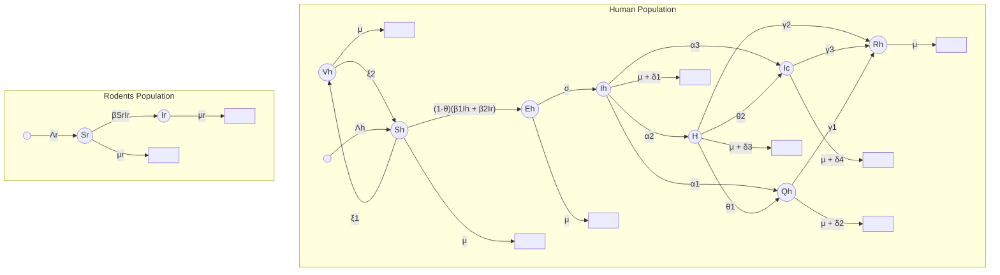

## 2. Control strategies

Numerical simulations were displayed to demonstrate the dynamical behaviour of the population.

*   **Vaccination**: increasing the vaccination rate, decreases the number of infected humans. Likely, as the vaccination failure rate increases, the number of infected humans and humans suffering severe complications also increases accordingly.

*   **Awareness**: infected individuals decrease accordingly as levels of awareness increase.

*   **Quarantine**: as the quarantine rate increases, the number of infected humans and humans suffering severe complications decreases.

*   **Treatment**

## 3. Analysis of the model

*   A comprehensive theoretical analysis of the model was presented.

*   It determined the existence and uniqueness of the solutions.

*   The basic reproduction number was calculated by the next-generation matrix approach.

*   The global stability of endemic equilibrium was calculated using Dulac’s function technique.

<u>**Terms in the Equations Affected by Human Behavior**</u>

# 4. ODE MODEL

$$ \frac{dS_h}{dt} = p_1 = \Lambda_h - (1 - \theta)(\beta_1 I_h + \beta_2 I_r)S_h - \hat{\chi}_1 S_h + \xi_2 V_h, $$
$$ \frac{dE_h}{dt} = p_2 = (1 - \theta)(\beta_1 I_h + \beta_2 I_r)S_h - \hat{\chi}_2 E_h, $$
$$ \frac{dI_h}{dt} = p_3 = \sigma E_h - \hat{\chi}_3 I_h, $$
$$ \frac{dQ_h}{dt} = p_4 = \alpha_1 I_h - \hat{\chi}_4 Q_h, $$
$$ \frac{dH}{dt} = p_5 = \alpha_2 I_h + \theta_1 Q_h - \hat{\chi}_5 H, $$
$$ \frac{dI_c}{dt} = p_6 = \alpha_3 I_h + \theta_2 H - \hat{\chi}_6 I_c, $$
$$ \frac{dR_h}{dt} = p_7 = \gamma_1 Q_h + \gamma_2 H + \gamma_3 I_c - \mu R_h, $$
$$ \frac{dV_h}{dt} = p_8 = \xi_1 S_h - \hat{\chi}_7 V_h, $$
$$ \frac{dS_r}{dt} = p_9 = \Lambda_r - \beta S_r I_r - \mu_r S_r, $$
$$ \frac{dI_r}{dt} = p_{10} = \beta S_r I_r - \mu_r I_r, $$

$$ \hat{\chi}_1 = \mu + \xi_1, $$
$$ \hat{\chi}_2 = \mu + \sigma, $$
$$ \hat{\chi}_3 = \alpha_1 + \alpha_2 + \alpha_3 + \delta_1 + \mu, $$
$$ \hat{\chi}_4 = \theta_1 + \gamma_1 + \mu + \delta_2, $$
$$ \hat{\chi}_5 = \theta_2 + \mu + \delta_3 + \gamma_2, $$
$$ \hat{\chi}_6 = \gamma_3 + \mu + \delta_4, $$
$$ \hat{\chi}_7 = \mu + \xi_2. $$

# 5. Parameters affected by human behavior

*   **Level of awareness** $\theta$ : reduces exposure to infection via behaviors such as hygiene, avoiding rodents, using protective measures, etc. If $\theta$ increases, humans become less infected.

*   **Vaccination rate** $\xi_1$ and **Vaccine failure** $\xi_2$ : increase or decrease, respectively, the level of protection

# 6. Assumptions of the model

*   Infected humans do not spread the infection to rodents

*   Infected rodents spread the infection to the human population

*   Vaccinated humans are assumed never to contract the disease for the rest of their lifetime

*   Some individuals with unsuccessful vaccinations return to susceptible

# 7. Parameters

**Table 1**
Description of parameters in model (1).

<table>
  <thead>
    <tr>
        <th>Parameters</th>
        <th>Description</th>
    </tr>
  </thead>
  <tbody>
    <tr>
        <td>$\Lambda_h$</td>
        <td>Recruitment rate of susceptible humans.</td>
    </tr>
    <tr>
        <td>$\theta$</td>
        <td>Level of awareness.</td>
    </tr>
    <tr>
        <td>$\theta_1$</td>
        <td>Rate of quarantine humans placed in the hospital.</td>
    </tr>
    <tr>
        <td>$\beta_1$</td>
        <td>Transmission rate of monkeypox from human to human.</td>
    </tr>
    <tr>
        <td>$\beta_2$</td>
        <td>Transmission rate of monkeypox from human to rodent.</td>
    </tr>
    <tr>
        <td>$\delta_1$</td>
        <td>Mortality rate of infected humans due to monkeypox.</td>
    </tr>
    <tr>
        <td>$\delta_2$</td>
        <td>Mortality rate of quarantine humans due to monkeypox.</td>
    </tr>
    <tr>
        <td>$\delta_3$</td>
        <td>Mortality rate of hospitalized humans due to monkeypox.</td>
    </tr>
    <tr>
        <td>$\delta_4$</td>
        <td>Mortality rate of people with health problems.</td>
    </tr>
    <tr>
        <td>$\alpha_1$</td>
        <td>Rate of infected humans placed in quarantine.</td>
    </tr>
    <tr>
        <td>$\alpha_2$</td>
        <td>Rate of infected humans placed in the hospital.</td>
    </tr>
    <tr>
        <td>$\alpha_3$</td>
        <td>Rate of humans suffering severe complications after.<br/>the virus has destroyed a large part of their lung.</td>
    </tr>
    <tr>
        <td>$\sigma$</td>
        <td>Rate of infected humans with the symptom.</td>
    </tr>
    <tr>
        <td>$\gamma_1$</td>
        <td>Rate of recovered humans from quarantine.</td>
    </tr>
    <tr>
        <td>$\gamma_2$</td>
        <td>Rate of recovered humans from hospital.</td>
    </tr>
    <tr>
        <td>$\gamma_3$</td>
        <td>Rate of infected individuals who recovered from the virus with complications.</td>
    </tr>
    <tr>
        <td>$\beta$</td>
        <td>Transmission rate of monkeypox from rodent to rodent.</td>
    </tr>
    <tr>
        <td>$\theta_2$</td>
        <td>The proportion of persons in the hospital who<br/>develop major difficulties after the infection has largely destroyed their lungs.</td>
    </tr>
    <tr>
        <td>$\xi_1$</td>
        <td>Vaccination rate .</td>
    </tr>
    <tr>
        <td>$\xi_2$</td>
        <td>Unsuccessful vaccine rate.</td>
    </tr>
    <tr>
        <td>$\mu$</td>
        <td>Natural mortality rate of humans.</td>
    </tr>
    <tr>
        <td>$\Lambda_r$</td>
        <td>Recruitment rate of rodents.</td>
    </tr>
    <tr>
        <td>$\mu_r$</td>
        <td>Natural mortality rate of rodents.</td>
    </tr>
  </tbody>
</table>

**Table 3**
Model parameters and their values.

<table>
  <thead>
    <tr><th>Parameter</th><th>Value</th><th>Source</th></tr>
  </thead>
  <tbody>
    <tr><td>$\Lambda_h$</td><td>321 204</td><td>Assumed</td></tr>
    <tr><td>$\theta_1$</td><td>0.02</td><td>Assumed</td></tr>
    <tr><td>$\beta_2$</td><td>0.0027</td><td>Ref. 44</td></tr>
    <tr><td>$\delta_2$</td><td>0.05</td><td>Ref. 49</td></tr>
    <tr><td>$\delta_4$</td><td>0.01</td><td>Assumed</td></tr>
    <tr><td>$\alpha_2$</td><td>0.5</td><td>Ref. 43</td></tr>
    <tr><td>$\sigma$</td><td>0.52</td><td>Ref. 14</td></tr>
    <tr><td>$\gamma_2$</td><td>0.036246</td><td>Ref. 14</td></tr>
    <tr><td>$\beta$</td><td>0.012</td><td>Ref. 43</td></tr>
    <tr><td>$\xi_1$</td><td>0.1</td><td>Estimated</td></tr>
    <tr><td>$\mu$</td><td>0.01794</td><td>Ref. 50</td></tr>
    <tr><td>$\mu_r$</td><td>0.002</td><td>Assumed</td></tr>
  </tbody>
</table>
<table>
  <thead>
    <tr><th>Parameter</th><th>Value</th><th>Source</th></tr>
  </thead>
  <tbody>
    <tr><td>$\theta$</td><td>0.2</td><td>Assumed</td></tr>
    <tr><td>$\beta_1$</td><td>0.00006</td><td>Ref. 44</td></tr>
    <tr><td>$\delta_1$</td><td>0.2</td><td>Ref. 48</td></tr>
    <tr><td>$\delta_3$</td><td>0.055487</td><td>Assumed</td></tr>
    <tr><td>$\alpha_1$</td><td>0.75</td><td>Ref. 14</td></tr>
    <tr><td>$\alpha_3$</td><td>0.3</td><td>Fitted</td></tr>
    <tr><td>$\gamma_1$</td><td>0.52</td><td>Ref. 24</td></tr>
    <tr><td>$\gamma_3$</td><td>0.004</td><td>Fitted</td></tr>
    <tr><td>$\theta_2$</td><td>0.4</td><td>Assumed</td></tr>
    <tr><td>$\xi_2$</td><td>0.2</td><td>Estimated</td></tr>
    <tr><td>$\Lambda_r$</td><td>0.05</td><td>Assumed</td></tr>
  </tbody>
</table>

# Scholar 1: Optimal bed net use for a dengue disease model with mosquito seasonal pattern

Key Point Analysis of Human Behavior in the Model:

1. **Compartmental Model Variables:**

We assume that the populations of host (humans) and vector (mosquitoes) at time t are represented by the following mutually exclusive compartments:

* $S_h(t)$ — susceptible humans (individuals who can contract the disease);

* $I_h(t)$ — infectious humans (infected individuals who can transmit the disease);

* $R_h(t)$ — resistant humans (individuals who have been infected and have recovered);

* $S_m(t)$ — susceptible female mosquitoes;

* $I_m(t)$ — infectious female mosquitoes;

2. **Assumptions of the model**

* immigration and emigration are not considered;

* humans and mosquitoes are born susceptible;

* the incubation period is not taken into account;

* the population is homogeneous, it is not distinguished by age, behavior, spatial position, and/or stage of disease;

* each vector has an equal probability to bite any host.

3. **Protection strategies**

* <mark>Insecticide Spraying $u_1(t)$</mark>

* <mark>Insecticide-Treated Bed Nets (ITNs) $u_2(t)$</mark>

o The control variable $u_1(t)$ effort in insecticide spraying campaigns, indicating decision-making by health authorities or communities regarding vector control strategies.

4. **Insecticide-Treated Bed Nets (ITNs):**

o The model incorporates the use of ITNs as a control strategy, reflecting human choices in adopting protective measures against mosquito bites.

o The effectiveness of ITNs is modeled as a variable $u_2(t)$, which captures the efforts in bed net adoption and maintenance.

5. **Contact Rates:**

* The force of infection on both humans and mosquitoes is adjusted based on the level of ITN use, illustrating how human protective behaviors can alter transmission dynamics.

* Lower biting rates due to bed net usage reduce the likelihood of dengue transmission.

6. **Seasonality and Climate Adaptation:**

    * Human behaviors are influenced by seasonal changes, such as variations in rainfall and temperature, affecting mosquito populations and, consequently, the incidence of dengue.

    * The model accounts for these environmental factors, highlighting how human adaptation to climate affects disease dynamics.

7. **Public Health Policies:**

    * The effectiveness of interventions like ITNs and insecticide spraying reflects human responses to public health policies, emphasizing the importance of community engagement and education in disease prevention.

8. **Behavioral Compliance:**

    * The model implicitly requires an understanding of human compliance with recommended preventive measures (e.g., using bed nets consistently), which affects the overall effectiveness of these strategies in reducing infections.

<u>**Terms in the Equations Affected by Human Behavior**</u>

**ODEs model**

$$ \begin{cases} \frac{dS_h(t)}{dt} = \mu_h N_h - \left( (1 - u_2(t)) B \beta_{mh} \frac{I_m(t)}{N_h} + \mu_h \right) S_h(t) \\ \frac{dI_h(t)}{dt} = (1 - u_2(t)) B \beta_{mh} \frac{I_m(t)}{N_h} S_h(t) - (\eta_h + \mu_h) I_h(t) \\ \frac{dR_h(t)}{dt} = \eta_h I_h(t) - \mu_h R_h(t) \\ \frac{dS_m(t)}{dt} = \mu_m \left( 1 + \alpha \cos \left( \frac{2\pi t}{365} + \varphi \right) \right) (S_m(t) + I_m(t)) - \left( (1 - u_2(t)) B \beta_{hm} \frac{I_h(t)}{N_h} + \mu_m + u_1(t) \mu_S \right) S_m(t) \\ \frac{dI_m(t)}{dt} = (1 - u_2(t)) B \beta_{hm} \frac{I_h(t)}{N_h} S_m(t) - (\mu_m + u_1(t) \mu_S) I_m(t) \end{cases} $$

**PDEs used for the optimal control system using Pontryagin principle**

9. **Parameters**

**TABLE 2** Parameters of model (2) varied according to different scenarios
<table>
  <thead>
    <tr>
        <th>Parameter</th>
        <th>Description</th>
        <th>Value Scenario 1<br/>(T = 14°C)</th>
        <th>Value Scenario 2<br/>(T = 26°C)</th>
        <th>Value Scenario 3<br/>(T ∈ [18°C, 24°C])</th>
    </tr>
  </thead>
  <tbody>
    <tr>
        <td>β<sub>mh</sub></td>
        <td>Transmission probability from mosquitoes (per bite)</td>
        <td>0.12</td>
        <td>0.99</td>
        <td>0.2</td>
    </tr>
    <tr>
        <td>β<sub>hm</sub></td>
        <td>Transmission probability from humans (per bite)</td>
        <td>0.11</td>
        <td>0.95</td>
        <td>0.2</td>
    </tr>
    <tr>
        <td>μ<sub>m</sub></td>
        <td>Mortality rate of adult mosquitoes (per day)</td>
        <td>0.04</td>
        <td>0.03</td>
        <td>1/15</td>
    </tr>
  </tbody>
</table>

# Scholar 2 Transmission and Control of Plasmodium knowlesi: A Mathematical Modelling Study

A multi-host model for *P.knowlesi* is proposed. The transmission between macaques, mosquitoes and humans is incorporated. It extended with three characteristic geographical sites, forest (J), farm (F), and village (V), in which infection can occur.

<u>**Key Point Analysis of Human Behavior in the Model:**</u>

**1. Compartmental Model Variables:**

Each host (human, macaque and vector) is divided into two stages: susceptible or infected:

*   Infected human: $I_H$
*   Infected macaque: $I_M$
*   Infected vector in the forest: $I_{VJ}$
*   Infected vector in the farm: $I_{VF}$
*   Infected vector in the village: $I_{VV}$

Diagram showing the transmission cycle of Plasmodium knowlesi between forest, farm, and village areas involving macaques, humans, and vectors, along with a map illustrating movement patterns.

**Figure 1. Distribution of forest, farm, villages, and the movement of macaques and humans between the 3 areas, and the hypothesised transmission cycle of *Plasmodium knowlesi* in Malaysia and Southeast Asia.** Adapted from the yellow fever transmission cycle observed in Africa [52]. For clarity in notation, the forest will be referred to as the jungle (*J*), to differentiate from the farm (*F*) in later equations and model descriptions.

doi:10.1371/journal.pntd.0002978.g001

# 2. ODEs model

$$ \frac{dI_H}{dt} = \lambda_H(1 - I_H) - r_H I_H - \mu_H I_H $$

$$ \frac{dI_M}{dt} = \lambda_M(1 - I_M) - r_M I_M - \mu_M I_M $$

$$ \frac{dI_{VJ}}{dt} = \lambda_{VJ}(e^{-\mu_{VJ}T} - I_{VJ}) - \mu_{VJ} I_{VJ} $$

$$ \frac{dI_{VF}}{dt} = \lambda_{VF}(e^{-\mu_{VF}T} - I_{VF}) - \mu_{VF} I_{VF} $$

$$ \frac{dI_{VV}}{dt} = \lambda_{VV}(e^{-\mu_{VV}T} - I_{VV}) - \mu_{VV} I_{VV} $$

**3. Terms in the equations that affect by human behavior and movement:**

The model does not include explicit human movement between regions, however it includes the average time spent in each zone:

**Humans:**

* Forest: 5%
* Farm: 30%
* Village: 65%

**Macaques:**

* Forest: 60%
* Finca: 40%
* Village: 0%

● **Forces of infection:**

The forces of infections in humans ($\lambda_H$) and macaques ($\lambda_M$) are given by

$$ \lambda_H = \left( \frac{N_{VJ}}{N_{HJ}} a_{HJ} C_{VH} I_{VJ} \right) + \left( \frac{N_{VF}}{N_{HF}} a_{HF} C_{VH} I_{VF} \right) + \left( \frac{N_{VV}}{N_{HV}} a_{HV} C_{VH} I_{VV} \right) $$

$$ \lambda_M = \left( \frac{N_{VJ}}{N_{MJ}} a_{MJ} C_{VM} I_{VJ} \right) + \left( \frac{N_{VF}}{N_{MF}} a_{MF} C_{VM} I_{VF} \right) $$

Where the force of infection depends on:

- The rate at which vector blood fee

- The probability of transmission from mosquito to human/macaque per bite

- The proportion of vectors infected in each location

The forces of infection on vectors in the forest ($\lambda_{VJ}$), farm ($\lambda_{VF}$) and village ($\lambda_{VV}$) are given by:

$$ \lambda_{VJ} = a_{HJ} C_{HV} I_H + a_{MJ} C_{MV} I_M \quad \text{forest} $$

$$ \lambda_{VF} = a_{HF} C_{HV} I_H + a_{MF} C_{MV} I_M \quad \text{farm} $$

$$ \lambda_{VV} = a_{HV} C_{HV} I_H \quad \text{village} $$

Where the force of infection depends on:

- Frequency of biting

- The proportion of bites in each location taken on humans versus macaques and the prevalence of infection in humans or macaques.

● **Biting rate:** movement determines where mosquitoes can bite humans or macaques and how often:

$$ a_{HJ} = f_J q_J $$ vectors on humans in the forest

$$ a_{MJ} = f_J (1 - q_J) $$ vectors on macaques in the forest

$$ a_{HF} = f_F q_F $$ vectors on humans in the farms

$$ a_{MF} = f_F (1 - q_F) $$ vectors on macaques in the farms

$$ a_{HV} = f_V q_V $$ vectors on humans in the village

$$ a_{MV} = f_V (1 - q_V) $$ vectors on macaques in the village

Where,

$$ f_J = f_F = f_V = f_0 $$ , is the frequency biting in the absence of ITNs

$q_J$ and $1 - q_J$ are the proportion of bites taken on humans and macaques respectively

Given the relative population sizes of humans and macaques the proportion of bites taken on humans can be calculated as:

$$ q_J = \frac{N_{HJ} Q_J}{N_{HJ} Q_J + (1 - Q_J) N_{MJ}} $$ in the forest

$$ q_F = \frac{N_{HF} Q_F}{N_{HF} Q_F + (1 - Q_F) N_{MF}} $$ in the farm

$$ q_V = \frac{N_{HV} Q_V}{N_{HV} Q_V + (1 - Q_V) N_{MV}} $$ in the village

The larger the human presence in a site, the higher the mosquito’s probability of biting humans.

# 4. Protection strategies:

a. ITNs/LLIHs usage:

* Reduced biting rate on protected humans

* Increased proportion of bites taken on macaques

* Increased mosquito mortality

* Increased gonotrophic cycle length due to additional time spent searching for blood meals

## 5. Assumptions of the model

* The recovered compartment is excluded for macaques since infection is chronic, and for humans since data on immunity against *P. knowlesi* are not available.

* Humans and macaques are immediately infected and infectious following a mosquito bite

* There is not vectorial migration between sites

* It is a steady-state model

## 6. Parameters

Table 1. Parameters describing interactions between humans, macaques and mosquitoes derived from the literature.

<table>
  <thead>
    <tr>
        <th>Description</th>
        <th>Symbol</th>
        <th>Range (Value)</th>
        <th>Ref</th>
    </tr>
  </thead>
  <tbody>
    <tr>
        <td rowspan="3">Human Density</td>
        <td>Forest: 5%</td>
        <td rowspan="3">Informed by census data chosen to equal average population density in the 3 areas as described in the methods.</td>
        <td rowspan="3">[24]</td>
    </tr>
    <tr>
        <td>Farm: 30%</td>
    </tr>
    <tr>
        <td>Village: 65%</td>
    </tr>
    <tr>
        <td rowspan="3">Macaque Density</td>
        <td>Forest: 60%</td>
        <td>16-60 macaques km<sup>-2</sup></td>
        <td>[53-55]</td>
    </tr>
    <tr>
        <td>Farm: 40%</td>
        <td>29-87 macaques km<sup>-2</sup></td>
        <td> </td>
    </tr>
    <tr>
        <td>Village: 0%</td>
        <td>0 macaques km<sup>-2</sup></td>
        <td> </td>
    </tr>
    <tr>
        <td rowspan="3">Human Biting Rate</td>
        <td>Forest</td>
        <td>0-7 (1.24) day<sup>-1</sup></td>
        <td>[19-23]</td>
    </tr>
    <tr>
        <td>Farm</td>
        <td>0-13.5 (1.11) day<sup>-1</sup></td>
        <td> </td>
    </tr>
    <tr>
        <td>Village</td>
        <td>0-4.5 (1.11) day<sup>-1</sup></td>
        <td> </td>
    </tr>
    <tr>
        <td rowspan="3">Vector Host Preference*</td>
        <td>Forest: Q<sub>f</sub></td>
        <td>0.5</td>
        <td>[53-55]</td>
    </tr>
    <tr>
        <td>Farm: Q<sub>y</sub></td>
        <td>0.5</td>
        <td> </td>
    </tr>
    <tr>
        <td>Village: Q<sub>v</sub></td>
        <td>1</td>
        <td> </td>
    </tr>
    <tr>
        <td rowspan="3">Recovery Rate</td>
        <td>r<sub>h</sub>: 1/14</td>
        <td>1/(11-16) days</td>
        <td>[17]</td>
    </tr>
    <tr>
        <td>r<sub>treated</sub>: 1/5</td>
        <td>-</td>
        <td>Assumption</td>
    </tr>
    <tr>
        <td>r<sub>M</sub>: 1/2132</td>
        <td>1/(368-3643) days</td>
        <td>[56]</td>
    </tr>
    <tr>
        <td rowspan="3">Mortality Rate</td>
        <td>Human: μ<sub>H</sub></td>
        <td>1/29200 days</td>
        <td>[24]</td>
    </tr>
    <tr>
        <td>Macaque: μ<sub>M</sub></td>
        <td>1/3650 days</td>
        <td>[53-55]</td>
    </tr>
    <tr>
        <td>Vector: μ<sub>Vf</sub>, μ<sub>Vy</sub>, μ<sub>Vv</sub></td>
        <td>0.15 days</td>
        <td>[15]</td>
    </tr>
    <tr>
        <td>Extrinsic Incubation Period</td>
        <td>T</td>
        <td>10</td>
        <td>[16,17]</td>
    </tr>
    <tr>
        <td rowspan="4">Transmission Co-efficient</td>
        <td>Vector-Human: C<sub>VH</sub></td>
        <td rowspan="4">No comprehensive data available. Sensitivity analysis to help inform plausible values.</td>
        <td rowspan="4">NA</td>
    </tr>
    <tr>
        <td>Vector-Macaque: C<sub>VM</sub></td>
    </tr>
    <tr>
        <td>Human-Vector: C<sub>HV</sub></td>
    </tr>
    <tr>
        <td>Macaque-Vector: C<sub>MV</sub></td>
    </tr>
    <tr>
        <td>Gonotrophic cycle (day)</td>
        <td>δ</td>
        <td>3</td>
        <td>[17,19]</td>
    </tr>
    <tr>
        <td>Frequency of biting in the absence of LLINs/LLIHs</td>
        <td>f<sub>0</sub></td>
        <td>1/δ</td>
        <td> </td>
    </tr>
    <tr>
        <td>Time spent by mosquito searching for a blood meal (days)</td>
        <td>T<sub>1</sub></td>
        <td>0.69</td>
        <td>[32]</td>
    </tr>
    <tr>
        <td>Time spent resting and ovipositing (days)</td>
        <td>T<sub>2</sub></td>
        <td>δ - T<sub>1</sub></td>
        <td> </td>
    </tr>
    <tr>
        <td rowspan="3">Proportion of encounters between mosquito and LLIN/LLIH protected human where net in use</td>
        <td>φ<sub>f</sub></td>
        <td>0.79</td>
        <td>[19]**</td>
    </tr>
    <tr>
        <td>φ<sub>y</sub></td>
        <td>0</td>
        <td> </td>
    </tr>
    <tr>
        <td>φ<sub>v</sub></td>
        <td>0.79</td>
        <td> </td>
    </tr>
  </tbody>
</table>

Table 2. The median value and ranges of parameter values for *P. knowlesi* transmission probability and the macaque infectious period that satisfy the criteria at each model validation step.

<table>
  <thead>
    <tr>
        <th>Number of Parameter Sets</th>
        <th>50, 000</th>
        <th>1, 046</th>
        <th>1</th>
    </tr>
    <tr>
        <th>Criteria</th>
        <th>-</th>
        <th>&lt;5% Human<em><br/>&gt;80% Macaque</em></th>
        <th>&lt;5% Human<em><br/>&gt;80% Macaque</em><br/>R<sub>OH</sub> &gt; 1</th>
    </tr>
    <tr>
        <th> </th>
        <th>Range</th>
        <th>Median (Range)</th>
        <th>Value</th>
    </tr>
  </thead>
  <tbody>
    <tr>
        <td>Mean duration of infection in macaques (days)</td>
        <td>1–3653</td>
        <td>2132 (368–3643)</td>
        <td>3378</td>
    </tr>
    <tr>
        <td colspan="4">Transmission Coefficient:</td>
    </tr>
    <tr>
        <td>Vector – Human (C<sub>VH</sub>)</td>
        <td>0–1</td>
        <td>0.01 (2×10<sup>-4</sup>–0.43)</td>
        <td>0.14</td>
    </tr>
    <tr>
        <td>Human – Vector (C<sub>HV</sub>)</td>
        <td>0–1</td>
        <td>0.45 (8×10<sup>-5</sup>–1.00)</td>
        <td>0.62</td>
    </tr>
    <tr>
        <td>Vector – Macaque (C<sub>VM</sub>)</td>
        <td>0–1</td>
        <td>0.53 (0.01–1.00)</td>
        <td>0.60</td>
    </tr>
    <tr>
        <td>Macaque – Vector (C<sub>MV</sub>)</td>
        <td>0–1</td>
        <td>0.27 (8.1×10<sup>-4</sup>–1.00)</td>
        <td>0.001</td>
    </tr>
    <tr>
        <td>R<sub>0</sub></td>
        <td>-</td>
        <td>1.65–2267</td>
        <td>2.0</td>
    </tr>
    <tr>
        <td>R<sub>OH</sub></td>
        <td>-</td>
        <td>1.0×10<sup>-5</sup>–1.04</td>
        <td>1.04</td>
    </tr>
  </tbody>
</table>

\*Infection prevalence.

### 1. High-Risk Activities:

Human infections predominantly occur among subsistence farmers who regularly enter forested areas for agriculture. This highlights the connection between occupational exposure and infection risk.

### 2. Demographic Trends:

Most cases are reported in men aged 20–29 years, indicating that specific demographics may be more engaged in high-risk activities, such as farming or forestry work, increasing their vulnerability to infection.

### 3. Familial Clustering:

The observation of familial clustering suggests that transmission may also occur in peri-domestic settings, reflecting the impact of living near areas where macaques forage and the potential for zoonotic transmission.

### 4. Seasonal Patterns:

The model accounts for seasonal variations, as increased rainfall and temperature can influence vector populations and macaque behavior, affecting human exposure risk.

### 5. Behavioral Adaptations:

Awareness and adoption of preventive measures (e.g., using LLINs and LLIHs) among at-risk populations are crucial for reducing infection rates. Encouraging these practices can significantly lower the incidence of *P. knowlesi* infections.

### 6. Treatment Seeking Behavior:

Prompt treatment of infected individuals is emphasized as a critical control measure. The model suggests that rapid intervention can dramatically reduce transmission, underscoring the importance of timely healthcare access.

7. Movement Patterns:

The model suggests that human movement patterns—specifically, the frequency and locations of interactions with macaques—are vital in understanding transmission dynamics, highlighting the need for targeted interventions in these areas.

8. Risk Awareness:

Education and awareness programs are essential for populations in high-risk areas to understand the risks associated with forest and agricultural work, promoting behavioral changes that can mitigate exposure.

# Scholar 19 Personal protective strategies for dengue disease: Simulations in two coexisting virus serotype scenarios

In this study a model is proposed to analyze how personal protection measures help to prevent dengue when two serotypes coexist. Furthermore, it adds a parameter that represents public awareness due to publicity campaigns on the importance of using personal protective equipment.

**<u>Key Point Analysis of Human Behavior in the Model</u>**

**1. Compartmental Model Variables:**

Human population is divided into two categories: protected and unprotected.

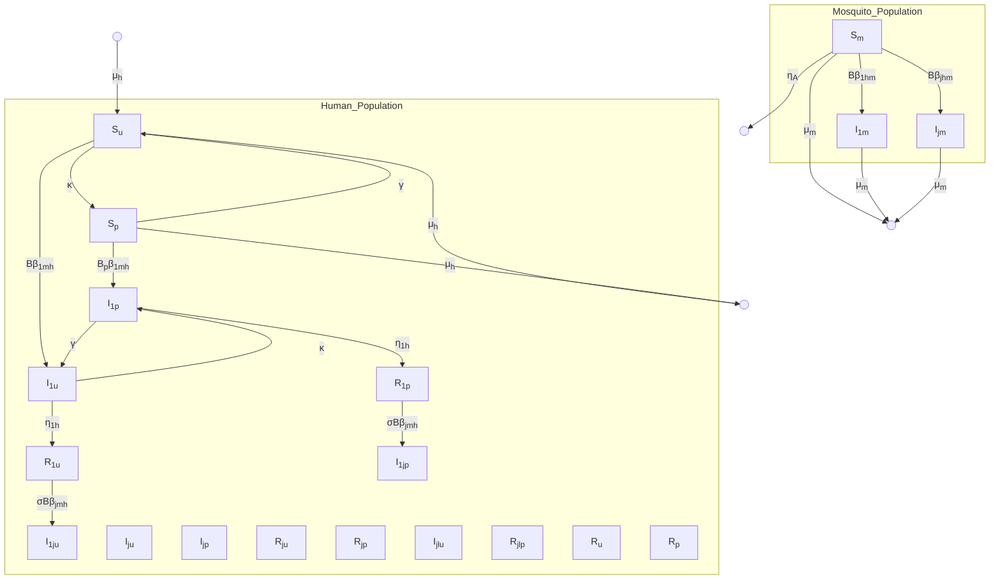

Fig. 1. Flow Diagram of Dengue model with two serotypes and personal protection control.

## 2. Terms in the equations that affect by human behavior:

* **Protection paratemer $\gamma$**: different numbers of $\gamma$ represents short, medium and long term protection.

* **Awareness parameter $k$**: describes the effort to lead people to use personal protection to prevent bite of the mosquitoes.

## 3. ODEs Model:

$$ \frac{dS_u}{dt} = -\kappa S_u + \gamma S_p + \mu_h N_h - \left( B\beta_{1mh} \frac{I_{1m}}{N_h} + B\beta_{jmh} \frac{I_{jm}}{N_h} + \mu_h \right) S_u $$

$$ \frac{dS_p}{dt} = \kappa S_u - \gamma S_p - \left( B_p\beta_{1mh} \frac{I_{1m}}{N_h} + B_p\beta_{jmh} \frac{I_{jm}}{N_h} + \mu_h \right) S_p $$

$$ \frac{dI_{1u}}{dt} = -\kappa I_{1u} + \gamma I_{1p} + B\beta_{1mh} \frac{I_{1m}}{N_h} S_u - (\eta_{1h} + \mu_h) I_{1u} $$

$$ \frac{dI_{1p}}{dt} = \kappa I_{1u} - \gamma I_{1p} + B_p \beta_1 m_h \frac{I_{1m}}{N_h} S_p - (\eta_{1h} + \mu_h) I_{1p} $$

$$ \frac{dI_{ju}}{dt} = -\kappa I_{ju} + \gamma I_{jp} + B \beta_j m_h \frac{I_{jm}}{N_h} S_u - (\eta_{jh} + \mu_h) I_{ju} $$

$$ \frac{dI_{jp}}{dt} = \kappa I_{ju} - \gamma I_{jp} + B_p \beta_j m_h \frac{I_{jm}}{N_h} S_p - (\eta_{jh} + \mu_h) I_{jp} $$

$$ \frac{dR_{1u}}{dt} = -\kappa R_{1u} + \gamma R_{1p} + \eta_{1h} I_{1u} - \left( \sigma B \beta_j m_h \frac{I_{jm}}{N_h} + \mu_h \right) R_{1u} $$

$$ \frac{dR_{1p}}{dt} = \kappa R_{1u} - \gamma R_{1p} + \eta_{1h} I_{1p} - \left( \sigma B_p \beta_j m_h \frac{I_{jm}}{N_h} + \mu_h \right) R_{1p} $$

$$ \frac{dR_{ju}}{dt} = -\kappa R_{ju} + \gamma R_{jp} + \eta_{jh} I_{ju} - \left( \sigma B \beta_1 m_h \frac{I_{1m}}{N_h} + \mu_h \right) R_{ju} $$

$$ \frac{dR_{jp}}{dt} = \kappa R_{ju} - \gamma R_{jp} + \eta_{jh} I_{jp} - \left( \sigma B_p \beta_1 m_h \frac{I_{1m}}{N_h} + \mu_h \right) R_{jp} $$

$$ \frac{dI_{1ju}}{dt} = -\kappa I_{1ju} + \gamma I_{1jp} + \sigma B \beta_j m_h \frac{I_{jm}}{N_h} R_{1u} - (\mu_h + \mu_{dh} f + \eta_{jh}) I_{1ju} $$

$$ \frac{dI_{1jp}}{dt} = \kappa I_{1ju} - \gamma I_{1jp} + \sigma B_p \beta_j m_h \frac{I_{jm}}{N_h} R_{1p} - (\mu_h + \mu_{dh} f + \eta_{jh}) I_{1jp} $$

$$ \frac{dI_{j1u}}{dt} = -\kappa I_{j1u} + \gamma I_{j1p} + \sigma B \beta_1 m_h \frac{I_{1m}}{N_h} R_{ju} - (\mu_h + \mu_{dh} f + \eta_{1h}) I_{j1u} $$

$$ \frac{dI_{j1p}}{dt} = \kappa I_{j1u} - \gamma I_{j1p} + \sigma B_p \beta_1 m_h \frac{I_{1m}}{N_h} R_{jp} - (\mu_h + \mu_{dh} f + \eta_{1h}) I_{j1p} $$

$$\frac{dR_u}{dt} = -\kappa R_u + \gamma R_p + \eta_{jh} I_{1ju} + \eta_{1h} I_{j1u} - \mu_h R_u$$

$$\frac{dR_p}{dt} = \kappa R_u - \gamma R_p + \eta_{jh} I_{1jp} + \eta_{1h} I_{j1p} - \mu_h R_p$$

$$\frac{dS_m}{dt} = \mu_m N_m - (B \beta_j hm (I_{ju} + I_{1ju}) + B_p \beta_j hm (I_{jp} + I_{1jp})) \frac{S_m}{N_h}$$

$$\frac{dI_{1m}}{dt} = \left( B \beta_1 hm \frac{I_{1u} + I_{j1u}}{N_h} + B_p \beta_1 hm \frac{I_{1p} + I_{j1p}}{N_h} \right) S_m - \mu_m I_{1m}$$

$$\frac{dI_{jm}}{dt} = \left( B \beta_j hm \frac{I_{ju} + I_{1ju}}{N_h} + B_p \beta_j hm \frac{I_{jp} + I_{1jp}}{N_h} \right) S_m - \mu_m I_{jm}$$

Where

$S_u$: Susceptible individuals in the uninfected human population

$S_p$: Susceptible individuals in the infected human population

$I_{1u}$: Infected individuals (type 1) in the uninfected human population

$I_{1p}$: Infected individuals (type 1) in the infected human population

$I_{ju}$: Infected individuals (type j) in the uninfected human population

$I_{jp}$: Infected individuals (type j) in the infected human population

$R_{1u}$: Recovered individuals (type 1) in the uninfected human population

$R_{1p}$: {Recovered individuals (type 1) in the infected human population

$R_{ju}$: Recovered individuals (type j) in the uninfected human population

$R_{jp}$: Recovered individuals (type j) in the infected human population

$I_{1ju}$: Infected individuals (type 1) that have interactions with recovered type 1 individuals

$I_{1jp}$ Infected individuals (type 1) that have interactions with recovered type j individuals

$I_{j1u}$ Infected individuals (type j) that have interactions with recovered type 1 individuals

$I_{j1p}$ Infected individuals (type j) that have interactions with recovered type j individuals

$R_u$ Total recovered individuals in the uninfected human population

$R_p$ Total recovered individuals in the infected human population

$S_m$ Susceptible mosquito population

$I_{1m}$ Infected mosquito population (type 1)

$I_{jm}$ Infected mosquito population (type j)

**Parameters:**

**Table 3**
Parameters of the epidemiological model.

<table>
  <thead>
    <tr>
        <th>Parameter</th>
        <th>Description</th>
        <th>Range</th>
        <th>Used values</th>
        <th>Source</th>
    </tr>
  </thead>
  <tbody>
    <tr>
        <td>$N_h$</td>
        <td>Human population</td>
        <td> </td>
        <td>112 000</td>
        <td>[17]</td>
    </tr>
    <tr>
        <td>$\frac{1}{\kappa}$</td>
        <td>Average time an unprotected individual remains unprotected (efficacy of an awareness campaign) (per day)</td>
        <td>[0, 365]</td>
        <td>15, 30, 90</td>
        <td> </td>
    </tr>
    <tr>
        <td>$\frac{1}{\gamma}$</td>
        <td>Average time that a person remains protected for a specific product (per day)</td>
        <td>[0, 365]</td>
        <td>15, 30, 90</td>
        <td>[9]</td>
    </tr>
    <tr>
        <td>$\frac{1}{\mu_h}$</td>
        <td>Average lifespan of humans (in days)</td>
        <td> </td>
        <td>$79 \times 365$</td>
        <td>[17]</td>
    </tr>
    <tr>
        <td>$B$</td>
        <td>Average number of bites on an unprotected person (per day)</td>
        <td>$\frac{1}{3}$</td>
        <td>$\frac{1}{3}$</td>
        <td>[25, 27]</td>
    </tr>
    <tr>
        <td>$B_p$</td>
        <td>Average number of bites on a protected person (per day)</td>
        <td>$\frac{1}{27}$</td>
        <td>$\frac{1}{27}$</td>
        <td> </td>
    </tr>
    <tr>
        <td>$\beta_{1mh}, \beta_{jmh}$</td>
        <td>Transmission probability from $I_{1m}, I_{jm}$ (per bite)</td>
        <td>[0.25, 0.33]</td>
        <td>0.25</td>
        <td>[13]</td>
    </tr>
    <tr>
        <td>$\frac{1}{\eta_{1h}}, \frac{1}{\eta_{jh}}$</td>
        <td>Average infection period on humans (per day)</td>
        <td>[4, 15]</td>
        <td>7</td>
        <td>[8]</td>
    </tr>
    <tr>
        <td>$\sigma$</td>
        <td>ADF phenomenon index</td>
        <td>[0, 5]</td>
        <td>1.1</td>
        <td>[22]</td>
    </tr>
    <tr>
        <td>$\mu_{dhf}$</td>
        <td>DHF probability of death</td>
        <td>[0.001, 0.1]</td>
        <td>0.02</td>
        <td>[7, 33]</td>
    </tr>
    <tr>
        <td>$\frac{1}{\mu_m}$</td>
        <td>Average lifespan of adult mosquitoes (in days)</td>
        <td>[8, 45]</td>
        <td>15</td>
        <td>[14, 16, 19]</td>
    </tr>
    <tr>
        <td>$N_m$</td>
        <td>Mosquito population</td>
        <td>$6 \times N_h$</td>
        <td>672 000</td>
        <td>[28]</td>
    </tr>
    <tr>
        <td>$\beta_{1hm}, \beta_{jhm}$</td>
        <td>Transmission probability from $I_1, I_j$ (per bite)</td>
        <td>[0.25, 0.33]</td>
        <td>0.25</td>
        <td>[13]</td>
    </tr>
  </tbody>
</table>

1. **Adoption of Protective Measures:**

    * **Initial Response:** The model highlights the critical importance of how quickly individuals adopt protective measures after the onset of an outbreak. Early adoption (within the first 15 days) can significantly reduce infection rates.

    * **Percentages of Adoption:** The varying percentages (0%, 5%, 25%, 50%) illustrate that higher adoption rates correlate with lower infection and mortality rates, emphasizing collective behavior in public health responses.

2. **Impact of Awareness Campaigns:**

    * **Efficacy of Education:** The model demonstrates that awareness campaigns can effectively change behavior, leading to greater adoption of protective measures. The timing and intensity of these campaigns are crucial—longer campaigns result in delayed behavior change, which may not be effective during peak outbreak periods.

    * **Behavioral Sensitization:** Individuals previously infected (e.g., with DEN-1) showed a higher propensity to adopt protective measures, indicating that past experiences can influence future health-related behaviors.

3. **Personal Protection Strategies:**

    * **Variability in Protection Duration:** The model explores different protective strategies (e.g., short-term repellents vs. long-term treated clothing). This variability affects decision-making about which protective measures to adopt and highlights the importance of sustainable options.

    * **Behavioral Trade-offs:** Individuals may weigh the immediate discomfort or inconvenience of using protective measures against the potential risk of infection, affecting their willingness to adopt these measures.

4. **Collective vs. Individual Action:**

    * **Community Dynamics:** The model suggests that individual decisions to protect oneself can have far-reaching effects on community health outcomes. This reflects the concept of herd immunity, where enough individuals adopting protective measures can slow down the spread of the disease.

    * **Social Influence:** The behavior of peers and social norms can influence individual decisions to adopt protective measures, indicating that community engagement is crucial for effective public health interventions.

5. **Temporal Factors:**

    * **Timing of Behavior Change:** The simulations reveal that timing is a critical factor—delayed action in adopting protective measures correlates with higher infection rates and mortality, underscoring the need for prompt behavioral responses during outbreaks.

# Scholar 31 The influence of gender and temephos exposure on community participation in dengue prevention: a compartmental mathematical model

## <u>Key Point Analysis of Human Behavior in the Model</u>

1. **Compartmental Model Variables:**

    The Human population is divided into 3 compartments: Susceptible $S_h(t)$, Infected $I_h(t)$, and Recovered $R_h(t)$). Vector population with 2 compartments: Susceptible, $S_v(t)$, and Infected $I_v(t)$). Vector developmental stages: Egg $E(t)$, Larvae $L(t)$, Pupae $P(t)$)

2. **Community Participation Dynamics**

* **Initial Engagement:** Community participation starts slowly, with limited effectiveness as individuals are not fully aware of the impact of their actions.

* **Learning Curve:** As community members gain experience and knowledge about vector control strategies, their effectiveness in participation increases, demonstrating a non-linear growth pattern in engagement.

3. Gender Differences in Participation

*   **Higher Female Engagement:** Studies indicate that women tend to be more involved in community dengue control efforts compared to men, affecting overall participation effectiveness.

*   **Impact of Male Participation:** Increasing male participation, though initially low, shows a positive correlation with reduced dengue transmission rates, especially as the percentage of men involved rises beyond 10%.

4. Effectiveness Over Time

*   **Incremental Improvement:** The model captures how the effectiveness of community participation grows over time, reaching a peak after about 1.5 years, highlighting the importance of sustained engagement.

*   **Psychological Factors:** Experiencing positive outcomes from participation reinforces confidence and motivation, leading to increased commitment to control efforts.

5. Interaction with Chemical Interventions

*   **Complementary Role:** While temephos can provide immediate short-term effects, the long-term control of dengue is significantly enhanced through community participation. Over-reliance on chemical interventions may foster complacency and a false sense of security among community members.

6. Social and Environmental Influences

*   **Cultural Context:** Community norms and values can affect participation levels. Engaging communities in ways that resonate culturally is crucial for sustained involvement.

*   **Environmental Awareness:** Understanding local environmental factors (like seasonality and climate) may influence community behavior and effectiveness in vector control.

7. Sustainability and Resilience

*   **Long-term Engagement:** The model suggests that as community members become more adept at vector control, their resilience to future outbreaks increases. This underscores the importance of ongoing education and empowerment in public health initiatives.

<u>**Terms in the Equations Affected by Human Behavior**</u>

# 1. ODE Model

$$\frac{dS_h}{dt} = \mu_h N_h - S_h - \tau_h S_h$$

$$\frac{dI_h}{dt} = \tau_h S_h - (\rho + \mu_h) I_h$$

$$\frac{dR_h}{dt} = \rho I_h - \mu_h R_h$$

$$\frac{dS_v}{dt} = \gamma_{thc}(t) P_{thc} + \gamma_{nthc}(t) P_{nthc} - \tau_v S_v - (\mu_v + C(t)) S_v$$

$$\frac{dI_v}{dt} = \tau_v S_v - (\mu_v + C(t)) I_v$$

$$\frac{dE_{thc}}{dt} = \theta_{thc} \left( 1 - \frac{E_{thc}}{E_{max,thc}} \right) (S_v + I_v) - \epsilon_{thc} E_{thc} - (\mu_E + C(t)) E_{thc}$$

$$\frac{dE_{nthc}}{dt} = \theta_{nthc} \left( 1 - \frac{E_{nthc}}{E_{max,nthc}} \right) (S_v + I_v) - \epsilon_{nthc} E_{nthc} - (\mu_E + C(t)) E_{nthc}$$

$$\frac{dL_{thc}}{dt} = \epsilon_{thc} \left( 1 - \frac{L_{thc}}{L_{max,thc}} \right) E_{thc} - \lambda_{thc} L_{thc} - (\mu_L + A + C(t)) L_{thc}$$

$$\frac{dL_{nthc}}{dt} = \epsilon_{nthc} \left( 1 - \frac{L_{nthc}}{L_{max,nthc}} \right) E_{nthc} - \lambda_{nthc} L_{nthc} - (\mu_L + C(t)) L_{nthc}$$

$$\frac{dP_{thc}}{dt} = \lambda_{thc} L_{thc} - \gamma_{thc}(t) P_{thc} - (\mu_P + C(t)) P_{thc}$$

$$\frac{dP_{nthc}}{dt} = \lambda_{nthc} L_{nthc} - \gamma_{nthc}(t) P_{nthc} - (\mu_P + C(t)) P_{nthc}$$

Where

- $\beta_p, \beta_s$ = **Transmission rates**

- $e_p, e_s$ = **Vaccine effectiveness**

- $\eta_p, \eta_s$ = **Self-protection effectiveness**

- $\gamma_p, \gamma_s$ = Recovery rates

- $\vdash$ = Mutation rate

- $C(t)$ = Community participation effect

**2. Community Participation (C(t))**

* Affected by awareness, gender roles, and social engagement.

* Appears in: (1 - C(t)) in **transmission rates** ($\iota_h, \iota_v$), **mosquito mortality rates**, and **vector life cycle equations**.

**3. Temephos Effect (A)**

* Influenced by temephos coverage, resistance, and community perception of protection.

* Appears in: $(\mu_L + A + C(t))L_{thc}$ affecting **larvae mortality in targeted containers**.

**4. Biting Rate ($\iota$)**

* Impacted by human behavior such as net use, repellents, and indoor activity.

* Appears in: $\tau_h = \alpha \beta_{vh} (1 - C(t)) \frac{I_v}{N_h}$, affecting **human infection risk**.

**5. Human Susceptibility ($S_h$)**

* Influenced by personal protection measures and early treatment-seeking behavior.

* Appears in: $S_h$ in the **force of infection equations**.

**6. Gender-Based Participation ($p_F, p_M$)**

* Determines the effectiveness of community interventions based on male vs. female contributions.

* Appears in: $C(t) = p_F C_F(t) + p_M C_M(t)$, affecting **vector control effectiveness**.

# An integrated human behavioral model for mosquito-borne disease control: A scoping review of behavior change theories used to identify key behavioral determinants

<u>Key Point Analysis of Human Behavior in the Model:</u>

**1. Perceived Susceptibility**

* Describes how vulnerable people feel to contracting an MBD.

* A high perception of personal risk (e.g., “I am likely to get malaria if I don’t use a bed net”) increased the likelihood of preventive behaviors.

* This factor was particularly strong in studies using risk-related behavior change theories.

**2. Perceived Efficacy**

* Measures confidence in one’s ability to perform preventive actions.

* Higher self-efficacy (e.g., believing that one can effectively prevent mosquito bites by using repellent) led to greater adherence to protective behaviors.

* However, two studies found negative impacts, indicating that some individuals felt incapable of controlling mosquito exposure despite knowing the risks.

**3. Perceived Severity**

* Relates to how serious people believe the disease consequences are.

* Those who saw diseases like malaria or dengue as life-threatening were more likely to take precautions.

* One study showed a negative effect, suggesting that some individuals may underestimate the disease severity.

**4. Social Norms**

* Examines the influence of community and peer expectations.

* Positive social norms (e.g., widespread use of bed nets in a village) encouraged behavior adoption.

* However, in some cases, mixed effects were seen—certain communities might discourage or fail to reinforce preventive behaviors.

**5. Benefits**

* Captures perceived advantages of adopting protective behaviors.

* Studies found that people were more likely to engage in prevention if they saw clear benefits, such as reduced mosquito bites or better health outcomes.

**6. Cue to Action**

* Represents external triggers that prompt behavioral change.

* Examples include government campaigns, media messages, or community outreach.

* One study found a negative impact when the information was poorly received or misunderstood.

**7. Behavioral Intention**

* Defined as the motivation to perform a preventive behavior.

* A strong predictor of whether someone would actually take action (e.g., planning to use insect repellent regularly).

**8. Affective Risk Perception**

* Looks at the emotional response to disease risk.

* Fear or concern about mosquito-borne illnesses sometimes increased preventive behaviors.

**9. Barriers**

* Refers to perceived obstacles preventing protective actions.

* Barriers included cost, inconvenience, discomfort, and lack of access to prevention tools (e.g., insecticide-treated nets).

* This was the only factor with a negative total impact score, showing that significant barriers hinder behavior change.

**10. Context**

* Includes external factors like wealth, education, type of housing, and region.

* For example, people in wealthier households were more likely to adopt preventive measures.

* Context was difficult to quantify because it varied greatly across studies.

**11. Personal Characteristics**

* Includes individual demographics (e.g., education level, religion, media habits).

* Trust in government recommendations and early adoption of new interventions were also influential.

# Scopus 17 :A Population Dynamics Model of Mosquito-Borne Disease Transmission, Focusing on Mosquitoes’ Biased Distribution and Mosquito Repellent Use

<u>Key Point Analysis of Human Behavior in the Model:</u>

**1.Compartmental Model Variables**: Human population is divided into three classes: susceptible S(t), infected I(t), and recovered R(t), while the adult mosquito population is divided into two classes: namely non-carrier susceptible U(t) and carrier infected V(t) mosquitoes.

**2.Mosquito Repellent Use and Its Effectiveness**

* The model incorporates the use of mosquito repellent as a human behavior that reduces mosquito-human contact.

* The repellent's efficacy ($$\xi$$) determines how well it reduces the probability of mosquito bites, influencing infection rates.

* The utilization rate ($$u$$) represents the proportion of the human population using mosquito repellent, affecting overall transmission dynamics.

* A higher utilization rate of an effective repellent can lead to a reduction in the basic reproduction number ($$R_0$$), potentially eliminating the disease from the population.

**3. Human Contribution to Mosquito Distribution**

* The model accounts for mosquito preference toward infected humans ($$\alpha$$), affecting how mosquitoes distribute themselves among susceptible, infected, and recovered individuals.

* Human behavior, such as movement patterns, hygiene practices, and use of protective measures, influences this distribution, indirectly shaping disease transmission dynamics.

**4. Decision-Making on Repellent Use and Disease Control**

* The model suggests that achieving a disease-free equilibrium (DFE) depends on a critical threshold of mosquito repellent utilization and efficacy.

* If repellent efficacy ($\xi$) is below a certain threshold ($\xi_c$), no level of usage ($\omega$) can eliminate the disease, emphasizing the need for both effective repellents and high adoption rates.

* The decision to use repellents is likely influenced by factors such as perceived risk, social awareness, economic affordability, and public health campaigns.

**5. Influence of Population-Level Behavior on Mosquito Population Dynamics**

* The total mosquito population is affected by the extent of repellent use, as reduced human-mosquito interactions limit the mosquitoes' ability to obtain blood meals necessary for reproduction.

* Widespread repellent use can lead to a decline in mosquito populations over time, indirectly controlling the disease by reducing vector abundance.

<u>**Terms in the Equations Affected by Human Behavior**</u>

**1. ODE model**

$$
\begin{aligned}
\frac{dS}{dt} &= B(N) - \Lambda_h S - \mu_h S + \nu R \\
\frac{dI}{dt} &= \Lambda_h(S, I, R, V) S - \rho I - \mu_h I \\
\frac{dR}{dt} &= \rho I - \mu_h R - \nu R \\
\frac{dL}{dt} &= \chi(L) r m(U, V) - \gamma L \\
\frac{dU}{dt} &= \gamma L - \Lambda_m U - \mu_m U \\
\frac{dV}{dt} &= \Lambda_m(S, I, R) U - \mu_m V
\end{aligned}
$$

**2. Force of Infection from Mosquitoes to Humans ($\Lambda_h$)**

$$ \Lambda_h = (1 - \xi \omega) \beta_h b \theta \frac{V}{S + (1 + \alpha)I + R} $$

* **Affected by:**

    * **Mosquito repellent utilization rate ($\omega$):** Reduces mosquito-human contact.

    * **Mosquito repellent efficacy ($\xi$):** Determines effectiveness in repelling mosquitoes.

    * **Mosquito attraction bias ($\upsilon$):** Affects mosquito distribution among human subpopulations.

### 3. Force of Infection from Humans to Mosquitoes ($\Lambda_m$)

$$ \Lambda_m = (1 - \xi \omega) \beta_m b \theta \frac{(1 + \alpha)I}{S + (1 + \alpha)I + R} $$

* **Affected by:**

    * $\omega$ and $\xi$: Reduce transmission by lowering mosquito exposure to infected humans.

    * $\alpha \backslash \text{alpha} \alpha$: Increases infection probability by concentrating mosquitoes around

### 4. Mosquito Reproduction Rate ($r_m$)

$$ r_m = (1 - \xi \omega) c \theta b M $$

* **Affected by:**

    * $\omega$ and $\xi$: Reduce mosquito population growth by limiting successful blood meals.

### 5. Human Population Dynamics

Human Birth and Death Rate

$$ \frac{dN}{dt} = B(N) - \mu_h N $$

* **Affected by:** Human behavior, such as healthcare access, affects birth B(N) and mortality ($\mu_h$) rates.

# Scopus 15 IMPACT OF HUMAN BEHAVIOR ON ITNS CONTROL STRATEGIES TO PREVENT THE SPREAD OF VECTOR BORNE DISEASES

**Key Point Analysis of Human Behavior in the Model:**

## 1. Compartmental Model Variables:

The population is divided into 4 compartments: Susceptible host (human) $S_h$, Infected host (Human) $I_h$, Susceptible vector $S_v$, Infected vector $I_v$

## 2. Behavioral Change Model (BCM) Influence

The **BCM** was introduced to assess how human behavior affects ITN use. This aligns with behavioral epidemiology, which examines how behavior impacts disease spread.

## 3. Reasons for Not Using ITNs

Several behavioral factors discourage ITN use, including:

* Hot weather and discomfort.

* Fear or disturbance during sleep.

* Misinformation about ITNs' safety, including concerns over chemical exposure.

## 4. Imitation Game Dynamics in Behavioral Shifts

* The model applies an **imitation-game approach**, where individuals switch ITN usage habits based on persuasion from pro-ITN and anti-ITN groups.

* Persuasion strength from either group impacts disease control efforts.

## 5. Public Health (PH) Interventions as External Influence

* PH efforts act as an external force influencing ITN adoption. The model suggests that when anti-ITN persuasion is strong, increased PH intervention is necessary to maintain disease control.

## 6. Mathematical Analysis of Human Behavior in Disease Spread

* Stability analysis shows that a **disease-free equilibrium is stable if R0<1R_0 < 1R0<1**, but persuasion dynamics can lead to a **transcritical bifurcation**, where disease persistence depends on human behavior.

## 7. Optimal Control Strategies for Behavior Modification

* Public health interventions need to be **time-sensitive**:

* Early, strong interventions are more effective.

* Delayed or weak interventions lead to **higher disease prevalence and increased costs**.

## <u>Terms in the Equations Affected by Human Behavior</u>

**ODEs model**

$$
\begin{aligned}
\frac{dS_h}{dt} &= \Lambda_h - \lambda_h(w)S_h - \mu S_h + \delta I_h \\
\frac{dI_h}{dt} &= \lambda_h(w)S_h - (\alpha_d + \mu + \delta)I_h \\
\frac{dS_v}{dt} &= \Lambda_v - \lambda_v(w)S_v - \eta S_v \\
\frac{dI_v}{dt} &= \lambda_v(w)S_v - \eta I_v
\end{aligned}
$$

<table>
  <thead>
    <tr>
        <th>Parameter</th>
        <th>Description</th>
        <th>Baseline value</th>
    </tr>
  </thead>
  <tbody>
    <tr>
        <td>$\Lambda_h$</td>
        <td>Immigration rate in humans</td>
        <td>$10^3 / (70 \times 365)$</td>
    </tr>
    <tr>
        <td>$\Lambda_v$</td>
        <td>Immigration rate in mosquitoes</td>
        <td>$10^4 / 21$</td>
    </tr>
    <tr>
        <td>$\mu$</td>
        <td>Natural mortality rate in humans</td>
        <td>$1 / (70 \times 365)$</td>
    </tr>
    <tr>
        <td>$\eta$</td>
        <td>Natural mortality rate in mosquitoes</td>
        <td>$1 / 21$</td>
    </tr>
    <tr>
        <td>$\eta_{bn}$</td>
        <td>Maximum ITN-induced death rate in mosquitoes</td>
        <td>$1 / 21$</td>
    </tr>
    <tr>
        <td>$\alpha_d$</td>
        <td>Disease-induced death rate in humans</td>
        <td>$10^{-3}$</td>
    </tr>
    <tr>
        <td>$p_1$</td>
        <td>Prob. of disease transm. from mosquito to human</td>
        <td>variable</td>
    </tr>
    <tr>
        <td>$p_2$</td>
        <td>Prob. of disease transm. from human to mosquito</td>
        <td>variable</td>
    </tr>
    <tr>
        <td>$\beta_{\text{max}}$</td>
        <td>Maximum host-vector contact rate</td>
        <td>0.6</td>
    </tr>
    <tr>
        <td>$\beta_{\text{min}}$</td>
        <td>Minimum host-vector contact rate</td>
        <td>0.005</td>
    </tr>
    <tr>
        <td>$\delta$</td>
        <td>Recovery rate of infectious humans to be susceptible</td>
        <td>1/4</td>
    </tr>
    <tr>
        <td>$\alpha$</td>
        <td>Rate of persuasion by the anti-ITNs groups</td>
        <td>variable</td>
    </tr>
    <tr>
        <td>$\theta$</td>
        <td>Rate of persuasion by the pro-ITNs groups</td>
        <td>variable</td>
    </tr>
  </tbody>
</table>

2. Contact Rate ($\underline{\beta(w)}$) – Affected by ITN Usage

The human-mosquito contact rate affected by ITN usage:

$$ \beta(w) = \beta_{\max} - w(\beta_{\max} - \beta_{\min}) $$

Where:

*   $\beta_{\max}$: Maximum contact rate (without ITN use).

*   $\beta_{\min}$: Minimum contact rate (if everyone uses ITNs).

*   w: Fraction of the population using ITNs.

**Higher w** (more people using ITNs) **decreases the human-mosquito contact rate** $\beta(w)$, because ITNs act as a barrier between humans and mosquitoes, reducing the likelihood of bites.

3. Human and Mosquito Force of Infection ($\underline{\lambda_h(w), \lambda_v(w)}$)

The human force of infection is:

$$ \lambda_h(w) = p_1 \beta(w) \frac{I_v}{N_h} $$

The mosquito force of infection is:

$$ \lambda_v(w) = p_2 \beta(w) \frac{I_h}{N_h} $$

Where:

*   $p_1$: Probability of transmission from mosquito to human.

*   $I_v$: Number of infectious mosquitoes.

*   $N_h$: Total human population.

*   $p_2$: Probability of transmission from human to mosquito.

*   $I_h$: Number of infectious humans.

*   $N_h$: Total human population.

So, **Increased ITN usage** (higher w) **reduces** the human-mosquito contact rate $\beta(w)$, thus decreasing the force of infection $\lambda_h(w)$ and $\lambda_v(w)$.

4. Mosquito Death Rate ($\underline{\eta(w)}$) – Affected by ITN Usage

The mosquito death rate with ITN usage is:

$$ \eta(w) = \eta + \eta_{bn}w $$

Where:

*   $\eta$: Natural mosquito death rate.

*   $\eta_{bn}$: Additional mosquito death rate due to Insecticide(ITNs) on treated net bed which can control by human

**So, Higher w** (more people using ITNs) **increases the mosquito death rate**, as more mosquitoes come into contact with insecticide-treated nets, causing them to die more frequently.

## 5. ITN Usage Rate

$$ \frac{dw}{dt} = (\theta - \alpha)w(1 - w) + \gamma(1 - w) $$

Where:

*   $\theta$: Persuasion rate of the **pro-ITN** group.

*   $\alpha$: Persuasion rate of the **anti-ITN** group.

*   $\gamma$: External **public health intervention** efforts.

**Pro-ITN group influence** ($\theta$) increases ITN adoption, encouraging people to use ITNs.

**Anti-ITN group influence** ($\alpha$) decreases ITN adoption, discouraging the use of ITNs.

**Public health interventions** ($\gamma$) can promote ITN usage by providing information, education, and access to ITNs, which can shift the population's behavior towards greater adoption of ITNs.

## 6. Basic Reproduction Number

$$ R_0(w) = \frac{p_1 p_2 \left[ \beta^*(w) \right]^2 \Lambda_v \mu}{\eta^2 \Lambda_h \alpha_o} $$

**ITN Usage and Contact Rate** ($\beta^*(w)$):

*   The **human-mosquito contact rate** $\beta^*(w)$ is **decreased** as more people use ITNs. This reduces the frequency of mosquito bites, lowering the probability of transmission. Therefore, **higher ITN usage (higher w) leads to a lower** $R_0(w)$.

# WofS 7 Optimal voluntary and mandatory insect repellent usage and emigration strategies to control the Chikungunya outbreak on Reunion Island

<u>Key Point Analysis of Human Behavior in the Model:</u>

1. **Compartmental Model Variables**: All human inhabitants of the island (N) are divided into 5 compartments: individuals susceptible to chikungunya (S); exposed individuals (E), who had been bitten by an infected mosquito and acquired the disease; symptomatic infectious individuals (I), who developed the symptoms of the disease and became infectious to biting mosquitoes; asymptomatic infectious individuals (I<sub>a</sub>), who became infectious but did not develop symptoms; and recovered individuals (R), who recovered from chikungunya and acquired immunity. The mosquito population is divided into 3 compartments: susceptible mosquitoes (X); exposed mosquitoes (Y), who bite an infected human and were exposed to the pathogen; and infectious mosquitoes (Z).

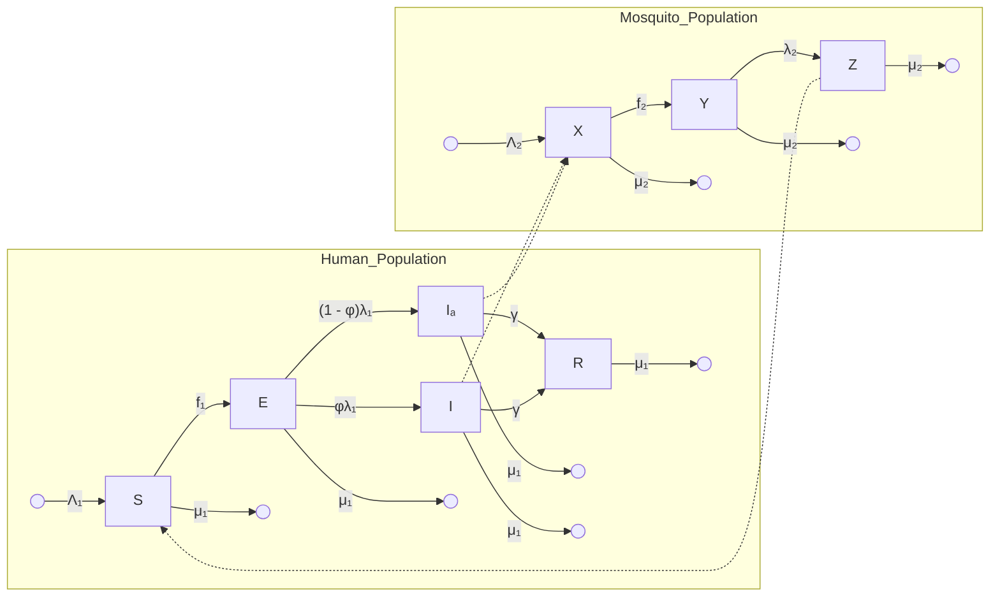

Flowchart of the compartmental model for Chikungunya transmission between humans (S, E, Ia, I, R) and mosquitoes (X, Y, Z) with transition rates.

**2. Voluntary vs. Mandatory Protective Measures**

* Individuals choose between using insect repellent or emigrating to avoid infection.

* Game theory is used to predict individual decisions based on perceived costs and benefits.

**3. Self-Interest vs. Public Good**

* Voluntary adoption of insect repellent falls short of herd immunity levels because individuals act in self-interest rather than for the collective benefit.

* Mandatory repellent usage may achieve eradication if costs are low enough.

**4. Tragedy of the Commons in Emigration**

* Individual emigration increases disease prevalence among those who remain, creating a paradox where personal safety increases collective risk.

**5. Economic Considerations in Behavior**

* Cost of infection vs. cost of prevention (repellent or emigration) influences decision-making.

* A threshold exists where individuals forgo protection due to high costs.

**6. Nash Equilibrium in Decision-Making**

* The model identifies equilibrium points where individuals stop changing their behavior.

* For repellent use, individuals either fully commit or avoid it based on cost-effectiveness.

**7. Impact of Perception and Awareness**

* The model assumes individuals are fully informed, though in reality, misinformation or lack of awareness could alter decisions.

<u>Terms in the Equations Affected by Human Behavior</u>

1. ODE model

$$ \frac{dS}{dt} = \Lambda_1 - \frac{\beta_1 SZ}{N} - \mu_1 S $$
$$ \frac{dE}{dt} = \frac{\beta_1 SZ}{N} - \lambda_1 E - \mu_1 E $$
$$ \frac{dI}{dt} = \phi \lambda_1 E - \gamma I - \mu_1 I $$
$$ \frac{dI_a}{dt} = (1 - \phi) \lambda_1 E - \gamma I_a - \mu_1 I_a $$

$$
\begin{aligned}
\frac{dR}{dt} &= \gamma(I + I_a) - \mu_1 R \\
\frac{dX}{dt} &= \Lambda_2 - \frac{\beta_2 X(I + I_a)}{N} - \mu_2 X \\
\frac{dY}{dt} &= \frac{\beta_2 X(I + I_a)}{N} - \lambda_2 Y - \mu_2 Y \\
\frac{dZ}{dt} &= \lambda_2 Y - \mu_2 Z
\end{aligned}
$$

<table>
  <thead>
    <tr>
        <th colspan="4">Table 1 Summary of the model parameters.</th>
    </tr>
    <tr>
        <th>Symbol</th>
        <th>Meaning</th>
        <th>Value</th>
        <th>Source</th>
    </tr>
  </thead>
  <tbody>
    <tr>
        <td>$\beta_1^0$</td>
        <td>Mosquito-to-human transmission</td>
        <td>0.37</td>
        <td>Dumont, Chiroleu &amp; Domerg (2008)</td>
    </tr>
    <tr>
        <td>$\beta_2$</td>
        <td>Human-to-mosquito transmission</td>
        <td>0.37</td>
        <td>Dumont, Chiroleu &amp; Domerg (2008)</td>
    </tr>
    <tr>
        <td>$\gamma$</td>
        <td>Human recovery rate</td>
        <td>0.14</td>
        <td>Yakob &amp; Clements (2013)</td>
    </tr>
    <tr>
        <td>$\Lambda_1$</td>
        <td>Human birth rate</td>
        <td>3.58</td>
        <td>Assumed</td>
    </tr>
    <tr>
        <td>$\Lambda_2$</td>
        <td>Mosquito birth rate</td>
        <td>$4.76 \times 10^3$</td>
        <td>Assumed</td>
    </tr>
    <tr>
        <td>$\lambda_1$</td>
        <td>Rate of humans becoming infectious</td>
        <td>0.5</td>
        <td>Yakob &amp; Clements (2013)</td>
    </tr>
    <tr>
        <td>$\lambda_2$</td>
        <td>Rate of mosquitoes becoming infectious</td>
        <td>0.5</td>
        <td>Yakob &amp; Clements (2013)</td>
    </tr>
    <tr>
        <td>$\mu_1$</td>
        <td>Human natural death rate</td>
        <td>$3.58 \times 10^{-5}$</td>
        <td>Assumed</td>
    </tr>
    <tr>
        <td>$\mu_2$</td>
        <td>Mosquito natural death rate</td>
        <td>0.05</td>
        <td>Yakob &amp; Clements (2013)</td>
    </tr>
    <tr>
        <td>$\phi$</td>
        <td>Proportion of hosts that develop symptoms</td>
        <td>0.97</td>
        <td>Yakob &amp; Clements (2013)</td>
    </tr>
  </tbody>
</table>

## 2. Insect Repellent Usage Stratergy

* **Term Affected:** $\beta_1$ (Mosquito-to-Human Transmission Rate)

$$ \beta_1 = \beta_1^0(1 - r) $$

where:

- $\beta_1^0$: is the base line transmission rate

- r is the proportion of time an individual uses repellent.

* **Affected Equations:**

$$ f_1 = \beta_1 \frac{SZ}{N} $$

where $f_1$ (force of infection on humans) is reduced when $\beta_1$ decreases due to repellent use.

* **Basic Reproduction Number $R_0$ under Repellent Usage**

$$ R_0(r_{pop}) = \frac{1}{\mu_2} \sqrt{\frac{\Lambda_2 \beta_1^0(1 - r_{pop}) \beta_2 \lambda_1 \lambda_2 \mu_1}{\Lambda_1(\gamma + \mu_1)(\lambda_1 + \mu_1)(\lambda_2 + \mu_2)}} $$

* The more repellent use, the lower $R_0$ so it benefits the whole population

## 3. Emigration Strategy

* **Term Affected: S** (Human susceptible)

* $$\frac{dS}{dt} = \Lambda - \beta_1 \frac{SZ}{N} - \mu_1 S - \omega S$$

Where: $\omega$ is the emigration rate of susceptible individuals.

* **Basic Reproduction Number $R_0$ under Emigration**

$$R_0(\omega) = \frac{1}{\mu_2} \sqrt{\frac{\Lambda_2 \beta_1 \beta_2 \lambda_1 \lambda_2 (\mu_1 + \omega)}{\Lambda_1 (\gamma + \mu_1) (\lambda_1 + \mu_1) (\lambda_2 + \mu_2)}}$$

* The more portion of Susceptible leaving use benefits the higher $R_0$, meaning that the Emigration Strategy only helps emigrants but increases risk for those who remain

# WofS 8 Game-Theoretical Model of the Voluntary Use of Insect Repellents to Prevent Zika Fever

## <u>Key Point Analysis of Human Behavior in the Model:</u>

### 1. Compartmental Model Variables:

The total human population at time t, $N_h(t)$, is divided into susceptible, $S_h(t)$, infectious $I_h(t)$, and recovered $R_h(t)$. The mosquito population, $N_v(t)$, is divided into susceptible $S_v(t)$, and infectious $I_v(t)$.

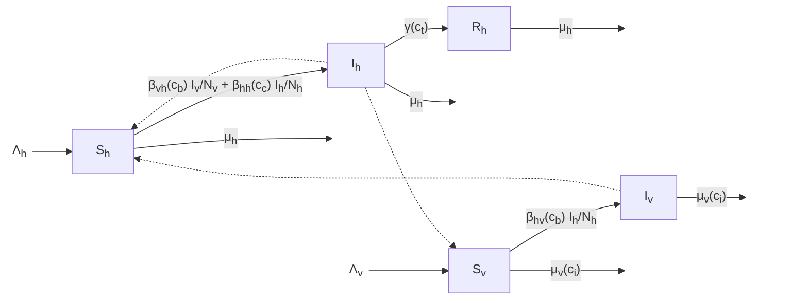

**Decision-Making Based on Costs and Benefits**

Individuals choose whether to use DEET (mosquito repellent) based on its cost and the **risk of Zika infection**.

**Impact of Risk Perception**

* The model assumes that people **rationally assess** infection risks and costs.

* If Zika’s perceived threat is high (e.g., due to severe birth defects or personal health risks), voluntary use of DEET increases.

**Free-Riding & Self-Interest**

* People might avoid using DEET if they believe **others are using it**, benefiting from reduced transmission without bearing the cost.

* However, due to **high personal costs of infection**, free-riding is minimized compared to other diseases like polio.

**Threshold for Disease Elimination**

* The model calculates the **minimum proportion of DEET users** needed to eliminate Zika.

* Interestingly, the voluntary equilibrium use (Nash Equilibrium) is **very close** to this required level, meaning human behavior **almost naturally** leads to disease control.

**Minimal Dependence on Cost**

* Unlike vaccines or other preventive measures, the cost of DEET has **little effect** on voluntary usage.

* This contrasts with diseases like **typhoid** or **Hepatitis B**, where prevention costs significantly impact participation.

## Influence of External Factors

* **Higher mosquito mortality** (due to insecticides) or **faster human recovery** (due to treatment) reduces DEET use.

* **Greater transmission rates** increase the likelihood of people using DEET voluntarily.

## <u>Terms in the Equations Affected by Human Behavior</u>

1. ODE model

$$ \frac{dS_h}{dt} = \Lambda_h - \left( \tilde{\beta}_{vh}(c_b) \frac{I_v}{N_v} + \tilde{\beta}_{hh}(c_c) \frac{I_h}{N_h} + \mu_h \right) S_h \tag{1} $$

$$ \frac{dI_h}{dt} = \left( \tilde{\beta}_{vh}(c_b) \frac{I_v}{N_v} + \tilde{\beta}_{hh}(c_c) \frac{I_h}{N_h} \right) S_h - (\mu_h + \tilde{\gamma}(c_t)) I_h \tag{2} $$

$$ \frac{dR_h}{dt} = \tilde{\gamma}(c_t) I_h - \mu_h R_h \tag{3} $$

$$ \frac{dS_v}{dt} = \Lambda_v - \left( \tilde{\beta}_{hv}(c_b) \frac{I_h}{N_h} + \tilde{\mu}_v(c_i) \right) S_v \tag{4} $$

$$ \frac{dI_v}{dt} = \tilde{\beta}_{hv}(c_b) \frac{I_h}{N_h} S_v - \tilde{\mu}_v(c_i) I_v \tag{5} $$

1. Transmission Rates ($\tilde{\beta}$)

* **Human-to-Human Transmission Rate ($\beta_{hh}$)**

$\tilde{\beta}_{hh}(c_c) = (1 - c_c) \beta_{hh}$

**Affected by: Contact control ($c_c$), such as condom use.**

**Human behavior influence:** Higher awareness or risk perception can increase $c_b$, reducing $\beta_{hh}$.

* **Mosquito-to-Human Transmission Rate ($\tilde{\beta}_{vh}$)**

$$\tilde{\beta}_{vh}(c_b) = (1 - c_b)\beta_{vh}$$

**Affected by: Bite control ($c_b$), such as DEET usage.**

**Human behavior influence:** More people using DEET reduces the chance of getting bitten, lowering $\tilde{\beta}_{vh}$.

* **Human-to-Mosquito Transmission Rate ($\tilde{\beta}_{hv}$)**

$$\tilde{\beta}_{hv}(c_b) = (1 - c_b)\beta_{hv}$$

**Affected by: Bite control ($c_b$).**

**Human behavior influence:** If more individuals use DEET, mosquitoes have fewer chances to bite infected humans, reducing transmission.

## 2. Infection Probability (Risk Perception)

* **Probability of Getting Infected (Without DEET Use)**

    * **Affected by: Perceived risk of Zika infection.**

    * **Human behavior influence:** If individuals perceive a high infection risk, they are more likely to use DEET.

* **Expected Cost of Not Using DEET $C_N$**

$$C_N(c_b) = C_{Zika} \times \frac{\frac{\beta_{vh}I_v}{N_v} + \frac{\tilde{\beta}_{hh}(c_c)I_h}{N_h}}{\frac{\beta_{vh}I_v}{N_v} + \frac{\tilde{\beta}_{hh}(c_c)I_h}{N_h} + \mu_h}$$

=(Cost of Zika Infection) x (Probability getting Infected without using DEET)

* **Affected by: Perceived severity of Zika, medical expenses, productivity loss, or long-term health complication,..**

* **Human behavior influence:** If the perceived cost of infection ($C_{Zika}$) is high, individuals are more likely to use DEET.

## 3. Nash Equilibrium Condition

* **Equation for Nash Equilibrium (Voluntary DEET Usage)** $C_N(c_b) = C_U(c_b)$

* Where $C_N$ **(cost of not using DEET) equals** $C_U$ **(cost of using DEET):**

$$C_U(c_b) = C_{\text{DEET}} + C_{\text{Zika}} \times \frac{\tilde{\beta}_{hh}(c_c)I_h}{N_h + \mu_h}$$

=Cost to by DEET +(Cost of Zika Infection) x (Probability getting Infected without using DEET)

* **Human behavior influence:**
    

    * If **DEET is expensive**, fewer people use it, shifting the equilibrium.
    

    * If **Zika is perceived as dangerous**, DEET use increases voluntarily.
    

    * If people believe others will use DEET, they might "free-ride" and not use it themselves.

Table 1 Model parameters and notation

<table>
  <thead>
    <tr>
        <th>Notation</th>
        <th>Meaning</th>
        <th>Base value</th>
        <th>References</th>
    </tr>
  </thead>
  <tbody>
    <tr>
        <td>$\Lambda_h$</td>
        <td>Human recruitment rate</td>
        <td>$\frac{0.01392}{365}$</td>
        <td>[77]</td>
    </tr>
    <tr>
        <td>$\Lambda_v$</td>
        <td>Mosquito recruitment rate</td>
        <td>3000</td>
        <td>[4]</td>
    </tr>
    <tr>
        <td>$\mu_h$</td>
        <td>Human natural death rate</td>
        <td>$\frac{1}{74.365}$</td>
        <td>[23]</td>
    </tr>
    <tr>
        <td>$\mu_v$</td>
        <td>Mosquito natural death rate</td>
        <td>$\frac{1}{11}$</td>
        <td>[60]</td>
    </tr>
    <tr>
        <td>$\gamma$</td>
        <td>Natural recovery rate</td>
        <td>$\frac{1}{7.9}$</td>
        <td>[30,46]</td>
    </tr>
    <tr>
        <td>$\gamma_{h,t}$</td>
        <td>Treatment recovery rate</td>
        <td>$\frac{1}{5}$</td>
        <td>[33]</td>
    </tr>
    <tr>
        <td>$\mu_{v,i}$</td>
        <td>Insecticide related death rate</td>
        <td>1</td>
        <td>[56]</td>
    </tr>
    <tr>
        <td>$\beta_{vh}$</td>
        <td>Mosquito-to-human transmission rate (without control)</td>
        <td>$\frac{1}{11.3}$</td>
        <td>[25,30]</td>
    </tr>
    <tr>
        <td>$\beta_{hv}$</td>
        <td>Human-to-mosquito transmission rate (without control)</td>
        <td>$\frac{1}{8.6}$</td>
        <td>[25,30]</td>
    </tr>
    <tr>
        <td>$\beta_{hh}$</td>
        <td>Human-to-human transmission rate (without control)</td>
        <td>$\frac{1}{20}$</td>
        <td>[33]</td>
    </tr>
    <tr>
        <td>$c_b$</td>
        <td>Mosquito bite control</td>
        <td>Variable</td>
        <td> </td>
    </tr>
    <tr>
        <td>$c_c$</td>
        <td>Contact control</td>
        <td>0.05</td>
        <td>Our estimate</td>
    </tr>
    <tr>
        <td>$c_t$</td>
        <td>Treatment control</td>
        <td>0.05</td>
        <td>Our estimate</td>
    </tr>
    <tr>
        <td>$c_i$</td>
        <td>Insecticide control</td>
        <td>0.005</td>
        <td>Our estimate</td>
    </tr>
    <tr>
        <td>$\tilde{\beta}_{vh}(c_b)$</td>
        <td>Mosquito-to-human transmission rate with control</td>
        <td>$(1 - c_b)\beta_{vh}$</td>
        <td> </td>
    </tr>
    <tr>
        <td>$\tilde{\beta}_{hv}(c_b)$</td>
        <td>Human-to-mosquito transmission rate with control</td>
        <td>$(1 - c_b)\beta_{hv}$</td>
        <td> </td>
    </tr>
    <tr>
        <td>$\tilde{\beta}_{hh}(c_c)$</td>
        <td>Human-to-human transmission rate with control</td>
        <td>$(1 - c_c)\beta_{hh}$</td>
        <td> </td>
    </tr>
    <tr>
        <td>$\tilde{\gamma}(c_t)$</td>
        <td>Recovery rate with treatment control</td>
        <td>$\gamma + c_t\gamma_{h,t}$</td>
        <td> </td>
    </tr>
    <tr>
        <td>$\tilde{\mu}_v(c_i)$</td>
        <td>Mosquito death rate with insecticide control</td>
        <td>$\mu_v + c_i\mu_{v,i}$</td>
        <td> </td>
    </tr>
  </tbody>
</table>

All rates are per capita per day

# Scopus 7 Atangana-Baleanu fractional dynamics of dengue fever with optimal control strategies

<u>**Key Point Analysis of Human Behavior in the Model:**</u>

## 1. Compartmental Model Variables:

The compartmental model for dengue fever divides the human population into six groups: **susceptible ($S_h$)**, who are at risk of infection; **exposed ($E_h$)**, who have been bitten by an

infected mosquito but are not yet infectious; **infected ($I_h$)**, who can transmit the disease; **treated ($T_h$)**, those receiving medical care; **recovered ($R_h$)**, individuals who have gained immunity after infection; and **protected travelers ($P_h$)**, recovered individuals who move freely without reinfection risk. The vector (mosquito) population consists of **susceptible mosquitoes ($S_v$)**, which can acquire the virus from infected humans, and **infected mosquitoes ($I_v$)**, which spread the disease to susceptible humans.

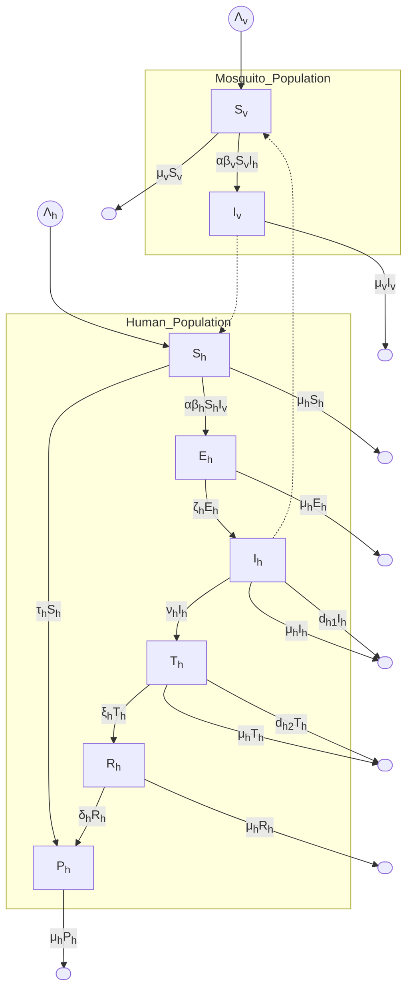

## Influence of Human Compliance on Disease Control

* The model incorporates compartments for treatment ($T_h$) and protected travelers ($P_h$), reflecting human decisions regarding healthcare access and preventive measures.

* Behavioral aspects such as adherence to treatment and protection strategies impact the transition between compartments.

## Role of Human Movement and Interaction

* The addition of a protected travelers class ($P_h$) captures the movement of individuals who have recovered and are immune, impacting disease spread across regions.

* Social behaviors, such as traveling and interaction rates, influence transmission dynamics.

**Effect of Treatment-Seeking Behavior**

* The model considers how individuals transition from infection ($I_h$) to treatment ($T_h$), highlighting the impact of healthcare accessibility and personal health-seeking choices.

* Recovery rates depend on how many individuals actively seek and complete treatment.

**Impact of Preventive Measures**

* The model includes human intervention strategies like vector control and personal protection (e.g., insect repellents, bed nets).

* Compliance with these measures influences the reproduction number ($R_0$), affecting the persistence or eradication of the disease.

<u>**Terms in the Equations Affected by Human Behavior**</u>

**1. ODE/ FDE Model**

$$
\begin{aligned}
\frac{dS_h}{dt} &= \lambda_h - \alpha \beta_h S_h I_v - (\tau_h + \mu_h) S_h \\
\frac{dE_h}{dt} &= \alpha \beta_h S_h I_v - (\zeta_h + \mu_h) E_h \\
\frac{dI_h}{dt} &= \zeta_h E_h - (v_h + \mu_h + d_{h1}) I_h \\
\frac{dT_h}{dt} &= v_h I_h - (\xi_h + \mu_h + d_{h2}) T_h \\
\frac{dR_h}{dt} &= \xi_h T_h - (\delta_h + \mu_h) R_h \\
\frac{dP_h}{dt} &= \tau_h S_h + \delta_h R_h - \mu_h P_h \\
\frac{dS_v}{dt} &= \lambda_v - \alpha \beta_v S_v I_h - \mu_v S_v \\
\frac{dI_v}{dt} &= \alpha \beta_v S_v I_h - \mu_v I_v
\end{aligned}
$$

Table 1. Model parameters along with their numerical values.

<table>
  <thead>
    <tr>
        <th>Parameter</th>
        <th>Description</th>
        <th>Values</th>
        <th>Source</th>
    </tr>
  </thead>
  <tbody>
    <tr>
        <td>$\lambda_h$</td>
        <td>Human population recruitment rate</td>
        <td>0.05</td>
        <td>[44]</td>
    </tr>
    <tr>
        <td>$\lambda_v$</td>
        <td>Vector population recruitment rate</td>
        <td>0.071</td>
        <td>[44]</td>
    </tr>
    <tr>
        <td>$\mu_h$</td>
        <td>Natural death rate of human population</td>
        <td>0.05</td>
        <td>Assumed</td>
    </tr>
    <tr>
        <td>$\beta_h$</td>
        <td>Probability for a susceptible human to be<br/>bitten by an infectious mosquito</td>
        <td>0.5</td>
        <td>[44]</td>
    </tr>
    <tr>
        <td>$\beta_v$</td>
        <td>Probability for an infectious human to be<br/>bitten by a susceptible mosquito</td>
        <td>0.57</td>
        <td>Assumed</td>
    </tr>
    <tr>
        <td>$\alpha$</td>
        <td>Rate at which susceptible humans are bitten<br/>by the mosquitoes</td>
        <td>0.4</td>
        <td>[44]</td>
    </tr>
    <tr>
        <td>$\zeta_h$</td>
        <td>Rate at which humans become infectious</td>
        <td>0.03</td>
        <td>[44]</td>
    </tr>
    <tr>
        <td>$\xi_h$</td>
        <td>Rate of becoming recovered</td>
        <td>0.02</td>
        <td>[44]</td>
    </tr>
    <tr>
        <td>$\tau_h$</td>
        <td>Rate of becoming protected from susceptible</td>
        <td>0.01</td>
        <td>Assumed</td>
    </tr>
    <tr>
        <td>$\delta_h$</td>
        <td>Rate of becoming protected from recovered</td>
        <td>0.06</td>
        <td>[44]</td>
    </tr>
    <tr>
        <td>$v_h$</td>
        <td>Rate of getting treatment</td>
        <td>0.03</td>
        <td>Assumed</td>
    </tr>
    <tr>
        <td>$d_{h1}$</td>
        <td>Disease-induced death rate of infectious humans</td>
        <td>0.01</td>
        <td>Assumed</td>
    </tr>
    <tr>
        <td>$d_{h2}$</td>
        <td>Disease-induced death rate of humans under treatment</td>
        <td>0.01</td>
        <td>Assumed</td>
    </tr>
    <tr>
        <td>$\mu_v$</td>
        <td>Natural death rate of vector population</td>
        <td>0.05</td>
        <td>Assumed</td>
    </tr>
  </tbody>
</table>

## 2. Human Compliance with Preventive Measures ($\beta_h, \beta_v, \iota$)

* $\iota$: Rate at which human are bitten by mosquitoes

* $\beta_h$: Probability of a susceptible human getting infected by a mosquito.

* $\beta_v$: Probability of a mosquito getting infected from an infected human.

All affected by human actions such as using mosquito repellents, bed nets, and wearing protective clothing.

## 3. Treatment-Seeking Behavior ($v_h$)

* $v_h$: Rate at which infected individuals seek treatment.

Higher treatment-seeking behavior increases recovery rates and reduces transmission.

## 4. Reproduction Number $R_0$

$$ R_0 = \frac{\alpha \beta_v \lambda_v \zeta_h}{\mu_v (\zeta_h + \mu_h)(v_h + \mu_h + d_{h1})} $$

**Human Behavior Impact:**

* Increased use of mosquito repellents, bed nets, and insecticides reduces $\beta_h$ and $\beta_v$, lowering $R_0$. Poor sanitation and increased human-mosquito interaction raise $\beta_h$ and $\beta_v$, increasing $R_0$.

* Increase treatment rate will increase $\upsilon_h$, lowering $R_0$

# Scholar 13 Understanding Dengue Control for Short- and Long-Term Intervention with a Mathematical Model Approach

<u>Key Point Analysis of Human Behavior in the Model:</u>

## 1. Compartmental Model Variables

Human population is divided into four groups:

- Susceptible $S_h(t)$: can be infected with dengue;

- Vaccinated $V_h(t)$: vaccination do not provide perfect immunity;

- Infected $In_h(t)$: capable of transmitting the disease to mosquitoes;

- Recovered $R_h(t)$: recovered individuals and have acquired temporal immunity.

The mosquito population is divided into three compartments:

- Aquatic phase $A_v(t)$: includes the egg, larvae, and pupa stages;

- Susceptible $S_v(t)$;

- Infected $In_h(t)$: mosquitoes carrying dengue and capable of transmitting to humans.

Mathematical model diagram showing compartments for humans (Sh, Vh, Inh, Rh) and mosquitoes (Av, Sv, Inv) with transition rates and control parameters.

FIGURE 1: Mathematical model using vaccination of adults and newborns, fumigation and larvicide treatment, and enforcement of mechanical control.

## 2. Protection strategies

* ○ **Vaccination**: The parameter $\xi$ implies a reduction of the average of successful transmission in human $\beta_h$. It includes newborn vaccination and adult vaccination.

* ○ **Use of larvicides**

* ○ **Use of insecticides**: insecticide is the best way of controlling dengue spread, followed by mechanical control and larvicide, respectively.

* ○ **Mechanical control**: remove breeding sites

**Optimal strategies:**

For long-term interventions, fumigation is the best strategy to reduce the infected population of both mosquitoes and humans.

For short-term interventions, vaccination of the adult population is the best way to reduce the number of infected people.

There is a slight difference between periodic intervention strategy and constant intervention in reducing the number of infected humans and mosquitoes. Therefore, if there is a limited budget, implementing a periodic intervention is a good option

<u>**Terms in the Equations Affected by Human Behavior**</u>

.

# 3. ODEs model

$$ \frac{dS_h}{dt} = (1 - u_2) A_h - \frac{b \beta_h S_h I_{n_v}}{N_h} - u_1 S_h - \mu_h S_h + \delta_h R_h $$

$$ + \theta_h V_h, $$

$$ \frac{dV_h}{dt} = u_2 A_h + u_1 S_h - \frac{b \xi \beta_h V_h I_{n_v}}{N_h} - \mu_h V_h - \theta_h V_h, $$

$$ \frac{dI_{n_h}}{dt} = \frac{b \beta_h I_{n_v} (S_h + \xi V_h)}{N_h} - \gamma_h I_{n_h} - \mu_h I_{n_h}, $$

$$ \frac{dR_h}{dt} = \gamma_h I_{n_h} - \mu_h R_h - \delta_h R_h, $$

$$ \frac{dA_v}{dt} = \phi \left( 1 - \frac{A_v}{u_5 k N_h} \right) (S_v + I_{n_v}) - u_3 A_v - \eta_v A_v $$

$$ - \mu_A A_v, $$

$$ \frac{dS_v}{dt} = \eta_v A_v - \frac{b \beta_v S_v I_{n_h}}{N_h} - \mu_v S_v - u_4 S_v, $$

$$ \frac{dI_{n_v}}{dt} = \frac{b \beta_v S_v I_{n_h}}{N_h} - \mu_v I_{n_v} - u_4 I_{n_v}, $$

# 4. Assumptions of the model

* Vaccinated humans do not have perfect immunity, there will be a time when the vaccine does not work or when the effect of the vaccine has begun to subside.

* There is no migration in either human or mosquito population.

* Humans and mosquitoes are assumed to be born susceptible, there is no natural protection, and dengue is not passed onto the next generation (no vertical transmission)

* Infected humans cannot transmit the virus to other susceptible or vaccinated humans

* The death rate is considered to be a natural death rate in both populations.

* Vaccinated human status is considered temporary because of the ability of the vaccine to subside over time.

○ There is no resistant (immune) effect in mosquitoes to the use of synthetic fumigation, such as insecticides and larvicides.

## 5. Human-action parameters

* $u_1$: Intensity of adult vaccination, reduce human susceptibility and decreases transmission from mosquitoes

* $u_2$: Intensity of newborns vaccination, strongly effects on long-term immunity, decreases transmission from mosquitoes

* $u_3$: Mosquito/larvae control, represents human actions against larvae, affects the transition from aquatic to adult mosquito stages.

* $u_4$: Fumigation (targeting adult mosquitoes): human fumigation effort affecting adult mosquito mortality.

* $u_5$: Mechanical control of removing breeding sites. Implies a reduction of the carrying capacity $K$.

## 6. Parameters

$N_h$: total of human population

$A_h$: human per capita birth rate

$b$: average number of bites of humans by mosquitoes

$\beta_h$: average of successful transmission in human

$\beta_v$: average of successful transmission in mosquitoes

$\mu_h$: human death rate

$\mu_v$: mosquito death rate

$\mu_A$: larval death rate

$\delta_h$: the rate of change from $R_h$ to $S_h$ because of the disappearance of the temporal natural immunity

$\theta_h$: the rate of change from $V_h$ to $S_h$ because of the disappearance of the temporal vaccine effect

$\xi$: reduction of $\beta_h$ because of vaccine

$\gamma_h$: human recovery rate

$\phi$: average number of eggs at each deposit

$k$: ratio for number of larvae per human

$\eta_v$: transition rate from $A_v$ to $S_v$

$u_1$: adult vaccination rate

$u_2$: newborn vaccine

$u_3$: larvicide rate
$u_4$: fumigation rate
$u_5$: enforcement of mechanical control proportion to reduce $k$

TABLE 1: Parameters values.

<table>
  <thead>
    <tr>
        <th>Parameters</th>
        <th>Value</th>
        <th>Description</th>
    </tr>
  </thead>
  <tbody>
    <tr>
        <td>$N_h$</td>
        <td>1000</td>
        <td>Total of human population is assumed to be 1000 people.</td>
    </tr>
    <tr>
        <td>$\mu_h$</td>
        <td>$1/(65 \times 365)$</td>
        <td>Since human life expectation is approximately 65 years, we have $\mu_h = 1/(65 \times 365)$ [23].</td>
    </tr>
    <tr>
        <td>$A_h$</td>
        <td>$1000/(65 \times 365)$</td>
        <td>Since in our model the total of the human population is constant, we have $A_h = N_h \mu_h = 1000/(65 \times 365)$.</td>
    </tr>
    <tr>
        <td>$\phi$</td>
        <td>300</td>
        <td>We assume that each female <em>Aedes aegypti</em> produces 300 eggs at each spawning.</td>
    </tr>
    <tr>
        <td>$\beta_h, \beta_v$</td>
        <td>0, 1</td>
        <td>It is assumed that it needs 10 successful contacts to infect a human/mosquito with dengue [23].</td>
    </tr>
    <tr>
        <td>$\theta_h$</td>
        <td>1/60</td>
        <td>We assume that the effect of vaccination will have disappeared in 60 days.</td>
    </tr>
    <tr>
        <td>$\gamma_h$</td>
        <td>1/14</td>
        <td>The natural recovery rate for the human population from dengue is 14 days [4].</td>
    </tr>
    <tr>
        <td>$\xi$</td>
        <td>0.1</td>
        <td>With vaccination, the infection rate from mosquito to human population will be reduced by 90%.</td>
    </tr>
    <tr>
        <td>$\mu_v$</td>
        <td>1/30</td>
        <td>Life expectation of the mosquito population is 30 days [4].</td>
    </tr>
    <tr>
        <td>$\mu_A$</td>
        <td>0.75/21</td>
        <td>We assume that there is only a 25% chance that larvae might grow and become adult mosquitoes, with time to transition being 21 days.</td>
    </tr>
    <tr>
        <td>$\eta_v$</td>
        <td>0.25/21</td>
        <td>Transition from aquatic phase to adult mosquito [4].</td>
    </tr>
    <tr>
        <td>$\delta_h$</td>
        <td>1/30</td>
        <td>Short-term immunity of humans to dengue after recovery is 30 days [23].</td>
    </tr>
    <tr>
        <td>$b$</td>
        <td>1</td>
        <td>Mosquitoes only bite once a day [23].</td>
    </tr>
    <tr>
        <td>$k$</td>
        <td>2</td>
        <td>We assume that the ratio between human and adult mosquitoes is 2; that is, each human related to 2 adult mosquitoes.</td>
    </tr>
  </tbody>
</table>

# Scholar 20 Potential causes and consequences of behavioural resilience and resistance in malaria vector populations: a mathematical modelling analysis

<u>**Key Point Analysis of Human Behavior in the Model:**</u>

The presented model focused on mosquito behaviour and lifetime feeding history to compare the impact of alternative feeding behaviour strategies upon overall feeding success, as well as the temporal distributions of successful feeds across entire communities and **biting activity upon unprotected humans, in the presence and absence of LLINs.**

## 1. Compartmental Model Variables

The model was adapted from Killeen (2011). The model is discreet by hours, and divided the mosquito population by three stages:

- Unfed ($U(a)$): Mosquitoes that have survived and are unfed

- Fed ($F(a)$): Mosquitos that are neither diverted nor killed and therefore successfully feed

- Dead ($D(a)$): Mosquitoes that died during the preceding hour

It assumes a 48h cycle between feeding.

A schematic representation of the model structure, processes and equations.

**Figure 1** A schematic representation of the model structure, processes and equations. Solid arrows represent processes occurring within a single age interval of one hour (a) while dashed arrows represent processes linking one age interval to a later one. See Table 1 for detailed description of the basic input parameter definitions and values, as well as table 2 for the definitions and equations for derived process, state and life history parameters.

## 2. Interaction between humans and mosquitoes

Nocturnal fluctuations of the interaction between humans and mosquitoes were simulated, in which the rate of encounter of all hosts was distributed across hours of the night.:

$$ E_t = E_{max}S_t $$

Where $E_{max}$ represents the maximum hourly host encounter rate under optimal conditions and $E_t$ represents the hourly host encounter rate during a specific hour. To estimate $E_{max}$, it was assumed that almost all mosquitoes encountering unprotected hosts attacked them.

## Suitability profiles for vectors:

1. **Strictly nocturnal profile preferred**: activity which fits within the peak of preferred hours for humans to sleep indoors and may be protected by an LLIN.

2. **Wider nocturnal profile**: includes two extra hours at dusk and down , during which most humans are awake outdoors and therefore unprotected by LLINs.

3. **Crepuscular profile**: same early activation and late deactivation trajectories at dusk and dawn but suppressed feeding preference during nocturnal hours when most humans are asleep indoors and may be protected by an LLIN.

**Recruitment times:**

1. **Emergence at dusk** when active mosquitoes may feed freely because humans are also active and unprotected by LLINs.

2. **Emergence at midnight** when feeding opportunities decrease because humans are inactive and protected by LLINs.

# 3. ODEs model - Discreet

**Mosquitoes that have survived and are unfed:**

$$ U_a = U_{a-1}P \ ((1-E_t) + E_t \Delta_t), \text{ where } a \leq 48 $$

$$ U_a = U_{a-1}P \ ((1-E_t) + E_t \ \Delta_t) + F_{a-48}P^{48} $$

$$ \text{where } a > 48 $$

**Mosquitos that are neither diverted nor killed and therefore successfully feed:**

$$ F_a = U_{a-1}P \ E_t \phi_t $$

**Mosquitoes that died during the preceding hour:**

$$ D_a = U_{a-1} \Big( (1-P) + P \ E_t \Big( C_h I_t y_p \mu_p + (1-C_h I_t) y_u \mu_u \Big) \Big) $$

$\gamma_t$: Probability that a mosquito attacks an encountered host at a given time

$$ \begin{aligned} \gamma_t &= 1-\Delta_t = C_h I_t \gamma_p + (1-C_h I_t) \gamma_u \\ &= C_h I_t (1-\Delta_p) + (1-C_h I_t) (1-\Delta_u) \end{aligned} $$

Where the probabilities of attacking a protected $\gamma_p$ and unprotected $\gamma_u$ human host are:

$\gamma_u = (1-\Delta_u)$

$\gamma_p = (1-\Delta_p)$

$\phi_t$: Probability that a mosquito attacks an encountered host and successfully feeds on it at a given time

$$ \phi_t = C_h I_t \phi_p + (1-C_h I_t) \phi_u $$

Where the probabilities of feeding upon a protected ($\phi_p$) and unprotected ($\phi_u$) human host are respectively defined as the products of the probabilities of attacking and surviving that attack:

$$ \phi_u = \gamma_u (1-\mu_u) = (1-\Delta_u) (1-\mu_u) \qquad (6) $$

$$ \phi_p = \gamma_p (1-\mu_p) = (1-\Delta_p) (1-\mu_p) \qquad (7) $$

$F_a$: proportion of all recruited mosquitoes which survived and successfully fed since the preceding age

$$ F_a = U_{a-1} P E_t \phi_t $$

# 4. Assumptions of the model

* Being indoors means using and being protected by an LLIN.
* The mosquito population utilize only humans hosts
* Equations represents proportions or probabilities

# 5. Parameters

<table>
  <thead>
    <tr>
        <th>Symbol</th>
        <th>Definition</th>
        <th>Equation</th>
    </tr>
    <tr>
        <th colspan="3"><em>Process parameters</em></th>
    </tr>
  </thead>
  <tbody>
    <tr>
        <td>$E_t$</td>
        <td>Hourly rate at which an unfed host-seeking mosquito encounters a human host during a given hour-long time interval (t) during the 24-hour day</td>
        <td>1</td>
    </tr>
    <tr>
        <td>$Y_t$</td>
        <td>Mean probability of a mosquito attacking an average encountered human host during a given hour-long time interval (t) during the 24-hour day</td>
        <td>2</td>
    </tr>
    <tr>
        <td>$Y_u$</td>
        <td>Mean probability of a mosquito attacking an encountered unprotected human host during a given hour-long time interval (t) during the 24-hour day</td>
        <td>3</td>
    </tr>
    <tr>
        <td>$Y_p$</td>
        <td>Mean probability of a mosquito attacking an encountered human host who is protected by using a long-lasting insecticidal net during a given hour-long time interval (t) during the 24-hour day</td>
        <td>4</td>
    </tr>
    <tr>
        <td>$\Phi_t$</td>
        <td>Mean probability of a mosquito attacking and successfully feeding upon an average encountered human host during a given hour-long time interval (t) during the 24-hour day</td>
        <td>5</td>
    </tr>
    <tr>
        <td>$\Phi_u$</td>
        <td>Mean probability of a mosquito attacking and successfully feeding upon an encountered unprotected human host during a given hour-long time interval (t) during the 24-hour day</td>
        <td>6</td>
    </tr>
    <tr>
        <td>$\Phi_p$</td>
        <td>Mean probability of a mosquito attacking and successfully feeding upon an encountered human host who is protected by using a long-lasting insecticidal net during a given hour-long time interval (t) during the 24-hour day</td>
        <td>7</td>
    </tr>
    <tr>
        <th colspan="3"><em>State parameters</em></th>
    </tr>
    <tr>
        <td>$B_a$</td>
        <td>Probability that a recruited mosquito bites a single unprotected human during a given age interval (a)</td>
        <td>12</td>
    </tr>
    <tr>
        <td>$D_a$</td>
        <td>Probability that a recruited mosquito dies during a given age interval (a)</td>
        <td>9,11</td>
    </tr>
    <tr>
        <td>$F_a$</td>
        <td>Probability that a recruited mosquito feeds successfully during a given age interval (a)</td>
        <td>8,11</td>
    </tr>
    <tr>
        <td>$U_a$</td>
        <td>Probability that a recruited mosquito remains unfed at the end of a given age interval (a)</td>
        <td>10,11</td>
    </tr>
    <tr>
        <th colspan="3"><em>Life history parameters</em></th>
    </tr>
    <tr>
        <td>$B$</td>
        <td>Mean lifetime measurable bites upon unprotected humans, expressed as total lifetime probability of feeding upon a single unprotected human, or the sum of the probabilities of feeding on a single unprotected person at each age</td>
        <td>16</td>
    </tr>
    <tr>
        <td>$B_t$</td>
        <td>Mean lifetime measurable bites upon unprotected humans, expressed as total lifetime probability of feeding upon a single unprotected human or the sum of the probabilities of feeding on a single unprotected person at each interval of mosquito age (a), that occurs at that time interval (a = 24d + t, where t = 0 corresponds to the hour of emergence; 18:00 for mosquitoes emerging at dusk and 24:00 for mosquitoes emerging at midnight).</td>
        <td>17</td>
    </tr>
    <tr>
        <td>$F$</td>
        <td>Mean lifetime feeding success upon all protected and unprotected humans, expressed as the total number of successful feeds per mosquito lifetime or the sum of the probabilities of feeding at each age</td>
        <td>13</td>
    </tr>
    <tr>
        <td>$F_t$</td>
        <td>Mean lifetime feeding success all protected and unprotected at a specific time interval (t), expressed as the total number of successful feeds per mosquito lifetime or the sum of the probabilities of feeding at each interval of mosquito age that occurs at that time interval (a = 24d + t where t = 0 corresponds to the hour of emergence; 18:00 for mosquitoes emerging at dusk and 24:00 for mosquitoes emerging at midnight).</td>
        <td>14</td>
    </tr>
    <tr>
        <td>$\pi_{F,i}$</td>
        <td>Proportion of successful feeds upon all protected and unprotected humans occurring indoors</td>
        <td>15</td>
    </tr>
    <tr>
        <td>$\pi_{B,i}$</td>
        <td>Proportion of measurable bites upon unprotected humans occurring indoors</td>
        <td>18</td>
    </tr>
  </tbody>
</table>

# Scholar 41 The Game-Theoretical Model of Using Insecticide-Treated Bed-Nets to Fight Malaria

<u>Key Point Analysis of Human Behavior in the Model:</u>

**1. Compartmental Model Variables**

The model is taken from Folashade, et al., 2013. Human population is divided into two groups: Susceptible ($S_h$) and infectious ($I_h$). The vector population is divided into two compartments as well: Susceptible ($S_v$) and infectious ($I_v$).

```mermaid
graph TD
    subgraph Humans
        Sh[S_h]
        Ih[I_h]
    end
    subgraph Mosquitoes
        Sv[S_v]
        Iv[I_v]
    end

    Lambda_h((&Lambda;_h)) --> Sh
    Sh -- "&lambda;_h(b)" --> Ih
    Ih -- "&gamma;_h" --> Sh
    Ih -- "&delta;_h" --> Out_h[ ]
    Sh -- "&mu;_h" --> Death_Sh[ ]
    Ih -- "&mu;_h" --> Death_Ih[ ]

    Lambda_v((&Lambda;_v)) --> Sv
    Sv -- "&lambda;_v(b)" --> Iv
    Sv -- "&mu;_v" --> Death_Sv[ ]
    Iv -- "&mu;_v(b)" --> Death_Iv[ ]

    Sh -.-> Iv
    Sv -.-> Ih
```

**Fig. 1.** Flow-chart showing movements of humans and mosquitoes between the susceptible and infectious compartments and the flow of the malaria disease from humans to mosquitoes and from mosquitoes to humans. At time, $t$, the total human population is $N_h(t) = S_h(t) + I_h(t)$ and the total mosquito population is $N_v(t) = S_v(t) + I_v(t)$.

## 2. Game-theoretical model:

In the game-theoretical model $E(b, \bar{b})$ is the payoff for a focal individual using $b = 1$ or not using $b = 0$, the ITN.

$$E(b, \bar{b}) = -cb - \pi(b, \bar{b})$$

Where,

*   $\pi(b, \bar{b})$ is the probability of the focal individual getting infected in a population with average ITN usage $\bar{b}$.

$$\pi(b, \bar{b}) = \frac{\lambda_h(b, \bar{b})}{\lambda_h(b, \bar{b}) + \mu_h}$$

*   $c$ is the relative cost of the ITN and the cost of getting infected by malaria.

$$c = \frac{C_{ITN}}{C_{MAL}}$$

# <u>Terms in the Equations Affected by Human Behavior</u>

## 3. Behavior parameters:

- **Individual ITN usage** $b$: If the focal individual uses net $b = 1$, if the focal individual does not use net $b = 0$.

- **Average population ITN usage** $\bar{b}$ : This parameter affects the behavior of the mosquito biting rate, the force of infection and the individual incentive to use ITN.

- **Cost of infection** $C_{MAL}$: it determines the cost of malaria for the individual. If it is high, the individual has more incentive to use ITN.

- **Cost of net usage** $C_{ITN}$: it determines the costs of using ITNs

## 4. Parameters

<table>
  <thead>
    <tr>
        <th> </th>
        <th>Description</th>
        <th>Value</th>
        <th>Reference</th>
    </tr>
  </thead>
  <tbody>
    <tr>
        <td>$\mu_h$</td>
        <td>Natural mortality for hosts</td>
        <td>in $[\frac{1}{70 \times 365}, \frac{1}{55 \times 365}]$</td>
        <td>[10] [24]</td>
    </tr>
    <tr>
        <td>$\delta_h$</td>
        <td>Diseased induced mortality in hosts</td>
        <td>in $[0, 4.1 \times 10^{-4}]$</td>
        <td>[24]</td>
    </tr>
    <tr>
        <td>$\gamma_h$</td>
        <td>Hosts recovery rate</td>
        <td>1/14</td>
        <td>[24] [25]</td>
    </tr>
    <tr>
        <td>$\mu_v$</td>
        <td>Natural mortality rate for vectors</td>
        <td>$[28^{-1}, 21^{-1}]$</td>
        <td>[10] [24]</td>
    </tr>
    <tr>
        <td>$\Lambda_h$</td>
        <td>Recruitment rate in hosts</td>
        <td>in $[10^3 \mu_h, 10^4 \mu_h]$</td>
        <td>[8] [10]</td>
    </tr>
    <tr>
        <td>$\Lambda_v$</td>
        <td>Recruitment rate in vectors</td>
        <td>in $[10^4 \mu_v, 25000]$</td>
        <td>[9] [10]</td>
    </tr>
    <tr>
        <td>$\beta_{min}$</td>
        <td>Minimal possible contact rate</td>
        <td>0</td>
        <td>[10]</td>
    </tr>
    <tr>
        <td>$\beta_{max}$</td>
        <td>Maximal possible contact rate</td>
        <td>in $[0.9, 1]$</td>
        <td>[10] [25]</td>
    </tr>
    <tr>
        <td>$\mu_{max}$</td>
        <td>Net related vector mortality rate</td>
        <td>$\mu_v$</td>
        <td>[10]</td>
    </tr>
    <tr>
        <td>$p_1$</td>
        <td>Prob. of vector to host transmission</td>
        <td>1</td>
        <td>[10]</td>
    </tr>
    <tr>
        <td>$p_2$</td>
        <td>Prob. of host to vector transmission</td>
        <td>1</td>
        <td>[10]</td>
    </tr>
    <tr>
        <td>$C_{MAL}$</td>
        <td>Cost of malaria infection</td>
        <td>&gt;$5 per case</td>
        <td>See caption</td>
    </tr>
    <tr>
        <td>$C_{ITN}$</td>
        <td>Cost of net usage</td>
        <td>&lt;$10 per 3 - 5 years</td>
        <td>[26] [27]</td>
    </tr>
    <tr>
        <td>$b$</td>
        <td>Individual ITN usage</td>
        <td>in $\{0, 1\}$</td>
        <td> </td>
    </tr>
    <tr>
        <td>$\bar{b}$</td>
        <td>Average ITN usage</td>
        <td>in $[0, 1]$</td>
        <td> </td>
    </tr>
  </tbody>
</table>

**WofS 12 Collateral Effects of Insecticide-Treated Nets on Human and Environmental Safety in an Epidemiological Model for Malaria with Human Risk Perception**

An ODEs model is proposed, to describe the interplay between malaria dynamics, human intoxication, and ecosystem damage, which are affected by human awareness of these risks and levels of net usage.

The ecosystem damage is proposed due to the repurposing and misuse of ITNs, for instance, for fishing. This may lead to overfishing and the loss of ecosystem functioning.

<u>Key Point Analysis of Human Behavior in the Model:</u>

The total human population ($N_h$) is divided into susceptible ($S_h$), exposed ($E_h$), infectious ($I_h$), and recovered ($R_h$).

The model includes two types of intoxication in humans produced by ITNs exposure (acute and chronic) and two states representing the environment and its damage due to misuse of ITNs.

The acute intoxication is represented by $p$ and the chronic intoxication is represented by $w$.

Transition from the $X_h^p$ states to the $X_h^w$ states at a rate $g$, with $X \in \{S, E, I, R\}$. Detoxification from both intoxication states occurs at rates $f$ and $\phi$, respectively.

Schematics showing the flow between malaria disease states and intoxication levels

Figure 1. $I^v = I_v + I_v^r$. Schematics showing the flow between malaria disease states: Susceptible ($S_h^x$), exposed ($E_h^x$), infectious ($I_h^x$), and recovered ($R_h^x$); the flow between intoxication levels due to insecticide exposure, where the superscript $x \in \{\{\}, p, w\}$ represents poison states in humans: no toxicity, acute intoxication, and toxicity with possible health effects (chronic intoxication), respectively. The dashed lines represent discrete moments in time when individuals are exposed to the toxicity, and the solid lines represent continuous rates. A description of the variables and parameters used can be found in Tables 1 and 2, respectively.

The vector population($I_h$) is divided into susceptible, $S_v$ and $S_v^r$, and infectious $I_v$ and $I_v^r$, in which $r$ represents insecticide-resistant mosquitos. A fraction of the mosquitoes ($\sigma\eta$) can acquire some level of resistance to the toxic substance, transitioning from the $Y_v$ states to the $Y_v^r$ states, $Y \in \{S, I\}$.

```mermaid
graph LR
    subgraph Resistant
        Sr[S<sub>v</sub><sup>r</sup>]
        Ir[I<sub>v</sub><sup>r</sup>]
    end
    subgraph NonResistant
        Sv[S<sub>v</sub>]
        Iv[I<sub>v</sub>]
    end

    Start(( )) -- Λ<sub>v</sub> --> Sv
    Sv -- "β<sub>v,a</sub>(I<sub>h</sub>+I<sub>h</sub><sup>P</sup>+I<sub>h</sub><sup>W</sup>)/N<sub>h</sub>" --> Iv
    Sr -- "β<sub>v,a</sub>(I<sub>h</sub>+I<sub>h</sub><sup>P</sup>+I<sub>h</sub><sup>W</sup>)/N<sub>h</sub>" --> Ir
    
    Sv -. "ση" .-> Sr
    Iv -. "ση" .-> Ir
    
    Sv -- "θ" --> d1((d<sub>v</sub>))
    Sv -- "d<sub>v</sub>" --> d2(( ))
    Iv -- "θ" --> d3((d<sub>v</sub>))
    Iv -- "d<sub>v</sub>" --> d4(( ))
    Sr -- "d<sub>v</sub>" --> d5(( ))
    Ir -- "d<sub>v</sub>" --> d6(( ))
    
    style Start fill:none,stroke:none
    style d1 fill:none,stroke:none
    style d2 fill:none,stroke:none
    style d3 fill:none,stroke:none
    style d4 fill:none,stroke:none
    style d5 fill:none,stroke:none
    style d6 fill:none,stroke:none
```

**Figure 2.** Schematics showing the flow between malaria disease states for mosquitoes: susceptible, $S_v^r$ and $S_v$, and infectious, $I_v^r$ and $I_v$, representing insecticide-resistant and non-resistant mosquitoes, respectively. The dashed-dotted lines represent discrete moments in time when mosquitoes are exposed to the insecticide, and the solid lines represent continuous rates. A description of the variables and parameters shown can be found in Tables 1 and 2, respectively.

The ecosystem damage is modeled considering two stages: Susceptible to damage ($S_c$) and damaged ($D_c$) $N_c = S_c + D_c$

```mermaid
graph LR
    Start(( )) -- Λ<sub>c</sub> --> Sc[S<sub>c</sub>]
    Sc -. "Ωκη" .-> Dc[D<sub>c</sub>]
    Dc -- "ψ" --> Sc
    Sc -- "d<sub>c</sub>" --> d1(( ))
    Dc -- "d̂<sub>c</sub>" --> d2(( ))
    
    style Start fill:none,stroke:none
    style d1 fill:none,stroke:none
    style d2 fill:none,stroke:none
```

<u>**Terms in the Equations Affected by Human Behavior**</u>

**1. SEIR model malaria transmission and intoxication**

$$ \dot{S}_h(t) = \Lambda_h - \beta_{h,a}(t)S_h(I_v + I_v^r)/N_h + fS_h^p + \omega_h R_h + \phi S_h^w - d_h S_h $$

$$ \dot{E}_h(t) = \beta_{h,a}(t)(I_v + I_v^r)/N_h + fE_h^p + \phi E_h^w - (\delta_h + d_h)E_h $$

$$ \dot{I}_h(t) = \delta_h E_h + fI_h^p + \phi I_h^w - (\gamma_h + d_h + \widehat{d}_h)I_h $$

$$ \dot{R}_h(t) = \gamma_h I_h + fR_h^p + \phi R_h^w - (\omega_h + d_h)R_h $$

$$ \dot{S}_h^p(t) = -\beta_{h,a}(t)S_h^p(I_v + I_v^r)/N_h + \omega_h R_h^p - (f + g + d_h)S_h^p $$

$$ \dot{E}_h^p(t) = \beta_{h,a}(t)S_h^p(I_v + I_v^r)/N_h - (\delta_h + f + g + d_h)E_h^p $$

$$ \dot{I}_h^p(t) = \delta_h E_h^p - (\gamma_h + f + g + d_h + \widehat{d}_h)I_h^p $$

$$ \dot{R}_h^p(t) = \gamma_h I_h^p - (f + g + \omega_h + d_h)R_h^p $$

$$ \dot{S}_h^w(t) = -\beta_{h,a}(t)S_h^w(I_v + I_v^r)/N_h + gS_h^p + \omega_h R_h^w - (\phi + d_h)S_h^w $$

$$ \dot{E}_h^w(t) = \beta_{h,a}(t)S_h^w(I_v + I_v^r)/N_h + gE_h^p - (\delta_h + \phi + d_h)E_h^w $$

$$ \dot{I}_h^w(t) = \delta_h E_h^w + gI_h^p - (\gamma_h + \phi + d_h + \widehat{d}_h)I_h^w $$

$$ \dot{R}_h^w(t) = \gamma_h I_h^w + gR_h^p - (\phi + \omega_h + d_h)R_h^w $$

## 2. ODEs model for mosquitoes

$$ \dot{S}_v(t) = \Lambda_v - \beta_{v,a}(t)S_v(I_h + I_h^p + I_h^w)/N_h - d_v S_v $$

$$ \dot{S}_v^r(t) = -\beta_{v,a}(t)S_v^r(I_h + I_h^p + I_h^w)/N_h - d_v S_v^r $$

$$ \dot{I}_v(t) = \beta_{v,a}(t)S_v(I_h + I_h^p + I_h^w)/N_h - d_v I_v $$

$$ \dot{I}_v^r(t) = \beta_{v,a}(t)S_v^r(I_h + I_h^p + I_h^w)/N_h - d_v I_v^r $$

## 3. ODEs model for ecosystem damage

$$ \dot{S}_c(t) = \Lambda_c + \psi D_c - d_c S_c $$

$$ \dot{D}_c(t) = -\psi D_c - \widehat{d}_c D_c $$

## 4. ODEs for risks perception

$$ \dot{K}_p(t) = -\lambda_1^p(K_p - K_p^*) + \lambda_2^p \sum_X (X_h^p + X_h^w) / N_h $$
$$ \dot{K}_d(t) = -\lambda_1^d(K_d - K_d^*) + \lambda_2^d (I_h + I_h^p + I_h^w) / N_h $$
$$ \dot{K}_c(t) = -\lambda_1^c(K_c - K_c^*) + \lambda_2^c (\hat{d}_c D_c) / N_c $$

## 5. ODEs for human intoxication stages

$$ \left. \begin{aligned} X_h(t^+) &= [1 - \mu(K_p^*/K_p)\eta]X_h \\ X_h^p(t^+) &= X_h^p + \mu(K_p^*/K_p)\eta X_h \end{aligned} \right\} t = t_i, \quad X \in \{S, E, I, R\} $$

## 6. ODEs for vector resistance to insecticides

$$ \left. \begin{aligned} Y_v(t^+) &= (1 - \sigma\eta)Y_v \\ Y_v^r(t^+) &= Y_v^r + \sigma\eta Y_v^m \\ d_v(t^+) &= (1 + \theta)d_v \end{aligned} \right\} t = t_j, \quad Y \in \{S, I\} $$

## 7. Parameters related to human actions

*   **Transmission rate mosquito-human:**

$$ \beta_{h,a}(t) = \beta_{h,a}^*(1 - \eta)K_d^*/K_d(t), $$

Where,

$\eta$ is the mosquito net coverage;

$\beta_{h,a}^*(t)$ is the natural transmission rate;

$\eta$ is the ITN coverage;

$k_d(t)$ is a variable that represents the risk perception of humans to malaria disease;

$k_d^*(t)$ is the natural risk perception of malaria and,

$a$ represents four transmission rates that depend on the season and location.

*   **Transmission rate human-mosquito:**

$$ \beta_{v,a}(t) = \beta_{v,a}^*(1 - \eta)K_d^*/K_d(t), $$

Where,

$\eta$ is the mosquito net coverage;

$\beta_{v,a}^*(t)$ is the natural transmission rate from humans to mosquitoes;

$\eta$ is the ITN coverage;

$k_d(t)$ represents the risk perception of humans to malaria disease and;

$k_d^*(t)$ is the natural risk perception of malaria and;

$a$ represents four transmission rates that depend on the season and location.

## 8. Variables related to human actions

* $k_d(t)$: risk perception of humans to malaria disease

$$\dot{K}_d(t) = -\lambda_1^d(K_d - K_d^*) + \lambda_2^d(I_h + I_h^p + I_h^w)/N_h,$$

Where,

$\lambda_1^d$ is the resistance to change,

$\lambda_2^d$ is the velocity of reaction to the presence of malaria.

$k_d^*(t)$ is the natural risk perception of malaria

Individuals tend to increase their risk perception of malaria when there is an increase in the number of infectious individuals.

* $k_p(t)$: perception of risk regarding health effects from exposure to insecticides in ITNs.

$$\dot{K}_p(t) = -\lambda_1^p(K_p - K_p^*) + \lambda_2^p \sum_X (X_h^p + X_h^w)/N_h, \quad X \in \{S, E, I, R\},$$

Where,

$k_p^*(t)$ is the natural risk perception to health damage due to insecticide exposure.

Individuals increase their risk perception when there is a presence of intoxicated individuals.

* $k_c(t)$: is the risk perception of humans to the collateral damage produced by ITN fishing.

$$\dot{K}_c(t) = -\lambda_1^c(K_c - K_c^*) + \lambda_2^c(\widehat{d}_c D_c)/N_c,$$

Where,

$K_c^*$ represents the natural risk perception of collateral damage to individuals and $N_c = S_c + D_c$;

The damaged ecosystem has a higher mortality; rate ($\hat{d}_c > d_c$).

The higher the risk perception, the less damage that occurs.

## 9. Assumptions of the model

- There is a constant nondamaged recruitment into the ecosystem at a rate $\Delta_c$.

- All individuals are born disease-free and intoxication-free at a rate $\Delta_h$

- Acute intoxications occur in discrete time $\Delta t_i = 5\ days$

- $t_i$ and $t_j$ correspond to instants at which humans and mosquitoes are exposed to the toxicity emitted by the mosquito net.

- $t_n$ corresponds to instances at which humans create damage to aquatic ecosystems due to the misuse of ITNs.

- Incubation time, loss of immunity, and disease-induced death for mosquitoes are not included due to their short lifespan.

## 10. Parameters

<table>
  <thead>
    <tr>
        <th>Parameter</th>
        <th>Definition</th>
        <th>Baseline</th>
        <th>Units *</th>
        <th>Reference</th>
    </tr>
  </thead>
  <tbody>
    <tr>
        <td colspan="5">Humans</td>
    </tr>
    <tr>
        <td>$\beta_{h,a}$</td>
        <td>Malaria transmission rate to human</td>
        <td>[0.015, 0.22]</td>
        <td>D<sup>-1</sup></td>
        <td>[54-58]</td>
    </tr>
    <tr>
        <td>$1/\delta_h$</td>
        <td>Average incubation time</td>
        <td>[12, 30]</td>
        <td>D</td>
        <td>[55,58]</td>
    </tr>
    <tr>
        <td>$1/\gamma_h$</td>
        <td>Mean infectious period</td>
        <td>[180, 720]</td>
        <td>D</td>
        <td>[54-58]</td>
    </tr>
    <tr>
        <td>$\omega_h$</td>
        <td>Loss of immunity rate</td>
        <td>$[5.5, 1100] * 10^{-5}$</td>
        <td>D<sup>-1</sup></td>
        <td>[54]</td>
    </tr>
    <tr>
        <td>$\mu$</td>
        <td>Intoxication proportion</td>
        <td>[0, 0.3]</td>
        <td>U</td>
        <td>[26,30]</td>
    </tr>
    <tr>
        <td>$1/f$</td>
        <td>Mean detoxification period</td>
        <td>[1/6, 2]</td>
        <td>D</td>
        <td>[59,60]</td>
    </tr>
    <tr>
        <td>$g$</td>
        <td>Health effects after prolonged exposure</td>
        <td>0.00289</td>
        <td>D<sup>-1</sup></td>
        <td>[25,26]</td>
    </tr>
    <tr>
        <td>$\phi$</td>
        <td>Recovery rate from chronic toxicity</td>
        <td>[0, 0.5]</td>
        <td>D<sup>-1</sup></td>
        <td>Author chosen</td>
    </tr>
    <tr>
        <td>$\Lambda_h$</td>
        <td>Recruitment rate</td>
        <td>$N_h * d_h$</td>
        <td>HD<sup>-1</sup></td>
        <td>Author chosen</td>
    </tr>
    <tr>
        <td>$d_h$</td>
        <td>Natural mortality rate</td>
        <td>$[3.3, 5.5] * 10^{-5}$</td>
        <td>D<sup>-1</sup></td>
        <td>[61,62]</td>
    </tr>
    <tr>
        <td>$\hat{d}_h$</td>
        <td>Disease-induced mortality rate</td>
        <td>$[0, 4.1] * 10^{-4}$</td>
        <td>D<sup>-1</sup></td>
        <td>[54]</td>
    </tr>
    <tr>
        <td>$\lambda_1^{d,p,c}$</td>
        <td>Rate of resistance to change risk perception</td>
        <td>[0, 1]</td>
        <td>D<sup>-1</sup></td>
        <td>[25,51-53]</td>
    </tr>
    <tr>
        <td>$\lambda_2^{d,p}, \lambda_2^c$</td>
        <td>Per capita reaction to change risk perception</td>
        <td>[0, 1]</td>
        <td>RD<sup>-1</sup>, R</td>
        <td>[25,51-53]</td>
    </tr>
    <tr>
        <td>$\eta$</td>
        <td>Mosquito net coverage</td>
        <td>[0, 1]</td>
        <td>U</td>
        <td>[7]</td>
    </tr>
    <tr>
        <td colspan="5">Vector</td>
    </tr>
    <tr>
        <td>$\beta_{v,a}$</td>
        <td>Malaria transmission rate to mosquito</td>
        <td>[0.015, 0.24]</td>
        <td>D<sup>-1</sup></td>
        <td>[54-58]</td>
    </tr>
    <tr>
        <td>$\sigma$</td>
        <td>Proportion of mosquitoes becoming resistant</td>
        <td>[0, 1]</td>
        <td>U</td>
        <td>[1,7,63]</td>
    </tr>
    <tr>
        <td>$\Lambda_v$</td>
        <td>Recruitment rate</td>
        <td>$N_v * d_v$</td>
        <td>MD<sup>-1</sup></td>
        <td>Author chosen</td>
    </tr>
    <tr>
        <td>$d_v$</td>
        <td>Natural mortality rate</td>
        <td>[1/30, 1]</td>
        <td>D<sup>-1</sup></td>
        <td>[57,64]</td>
    </tr>
    <tr>
        <td>$\theta$</td>
        <td>Increase in the mortality rate</td>
        <td>[4.4, 48.9]%</td>
        <td>U</td>
        <td>[65]</td>
    </tr>
    <tr>
        <td colspan="5">Collateral effect—aquatic ecosystem</td>
    </tr>
    <tr>
        <td>$\Omega$</td>
        <td>Percentage of species susceptible to ITN fishing</td>
        <td>0.75</td>
        <td>U</td>
        <td>[66]</td>
    </tr>
    <tr>
        <td>$\Lambda_c$</td>
        <td>Recruitment rate</td>
        <td>$d_c * N_c$</td>
        <td>CD<sup>-1</sup></td>
        <td>Author chosen</td>
    </tr>
    <tr>
        <td>$d_c$</td>
        <td>Natural mortality rate</td>
        <td>$[8.4, 11.5] * 10^{-4}$</td>
        <td>D<sup>-1</sup></td>
        <td>[67,68]</td>
    </tr>
  </tbody>
</table>
<table>
  <thead>
    <tr>
        <th>Parameter</th>
        <th>Definition</th>
        <th>Baseline</th>
        <th>Units *</th>
        <th>Reference</th>
    </tr>
  </thead>
  <tbody>
    <tr>
        <td>$\hat{d}_c$</td>
        <td>Damage-induced mortality rate</td>
        <td>$d_c + [14.7, 21] * 10^{-4}$</td>
        <td>D<sup>-1</sup></td>
        <td>[67,68]</td>
    </tr>
    <tr>
        <td>$\psi$</td>
        <td>Loss of damage rate</td>
        <td>$4.2 * 10^{-3}$</td>
        <td>D<sup>-1</sup></td>
        <td>[67,68]</td>
    </tr>
  </tbody>
</table>

\* D = days, U = unitless, H = humans, M = mosquitoes, C = ecosystem species, R = risk perception.

# Scholar 28: Mathematical modeling of malaria transmission dynamics in humans with mobility and control states

<u>**Key Point Analysis of Human Behavior in the Model:**</u>

**1. Compartmental Model Variables:**

The compartmental model for malaria transmission consists of several key variables: **T (Traveller Population)** representing incoming individuals, **S (Susceptible Population)**, **E (Exposed Population)**, **I (Infected Population)**, **R (Recovered Population)**, and **D (Death Population)** comprising individuals who have died due to malaria. Additionally, **V (Vigilant Population)** represents individuals using malaria control measures. The mosquito population is divided into **A (Susceptible Mosquitoes)** capable of carrying malaria and **B (Infected Mosquitoes)** transmitting the disease.

```mermaid
graph TD
    T[T] -- α1 --> S[S]
    T -- α2 --> E[E]
    T -- α3 --> I[I]
    S -- c1 --> E
    E -- λ --> I
    I -- r --> R[R]
    I -- d --> D[D]
    S -- r1 --> V[V]
    S -- r2 --> V
    S -- r3 --> V
    V -- r4 --> S
    Y(( )) -- γ --> A[A]
    A -- βA --> I
    I -.-> A
    A -- c2 + c3 --> B[B]
    B -- βB --> I
    B --> Z(( ))
    B -.-> S
```

## 2. Influence of Travellers on Malaria Transmission

* The model incorporates **Traveller Population (T)** as a key factor in malaria transmission.

* The influx of infected or exposed travellers into a population can significantly affect malaria spread, especially in regions with low endemicity.

## 3. Vigilance and Malaria Control Strategies

* Human behavior regarding **adherence to malaria control measures** (e.g., insecticide-treated nets, indoor residual spraying, protective clothing) is explicitly modeled.

* The study found that an **80% vigilance rate** led to a notable reduction in malaria transmission, while **98% vigilance** provided the best model-fit scenario.

## 4. Behavioral Influence on Model Predictions

* The model was evaluated using **real-world data** from a controlled university setting, where student travel and control behaviors were tracked.

* Despite high vigilance, **imported malaria cases continued to influence transmission dynamics**, demonstrating the need for **border control interventions**.

## <u>Terms in the Equations Affected by Human Behavior</u>

### 1. ODE model

$$
\begin{aligned}
\frac{dT}{dt} &= -a_1T - a_2T - a_3T \\
\frac{dS}{dt} &= -r_1S - r_2S - r_3S + a_1T + r_4V - c_1SB \\
\frac{dE}{dt} &= c_1SB + a_2T - \lambda E \\
\frac{dI}{dt} &= \lambda E - rI - dI + a_3T \\
\frac{dR}{dt} &= rI
\end{aligned}
$$

$$
\begin{aligned}
\frac{dD}{dt} &= dI \\
\frac{dV}{dt} &= r_1S + r_2S + r_3S - r_4V \\
\frac{dA}{dt} &= \gamma - b_AA - c_2AE - c_3AI \\
\frac{dB}{dt} &= c_2AE + c_3AI - b_BB.
\end{aligned}
$$

## 2. Traveller Population (T)

$$ \frac{dT}{dt} = -a_1T - a_2T - a_3T $$

7. **Human Mobility**: The parameters $a_1, a_2, a_3$ represent the rate at which travelers move between compartments (Susceptible, Exposed, and Infected).

8. Affected by **travel patterns**, compliance with screening, and border control measures.

## 3. Susceptible Population (S)

$$ \frac{dS}{dt} = -r_1S - r_2S - r_3S + a_1T + r_4V - c_1SB $$

* **Control Strategies**:

    - $r_1S, r_2S, r_3S$ represent the rates of adherence to **Long-Lasting Insecticide Nets (LLINs), Indoor Residual Spraying (IRS), and traditional malaria control (lotions, protective clothing, house nets, air conditioning).**

    - **Higher adherence (higher $r_1, r_2, r_3$) reduces susceptibility.**

* **Non-Adherence**: $r_4V$ represents non-adherence to control strategies.

* **Exposure to Infected Mosquitoes**: $c_1SB$ increases susceptibility based on contact with infected mosquitoes.

## 4. Exposed Population (E)

$$ \frac{dE}{dt} = c_1SB + a_2T - \lambda E $$

* **Infection Behavior**: $c_1SB$ depends on exposure due to **failure to use preventive measures.**

* **Travel Influence**: $a_2T$ accounts for exposure among incoming travelers.

**5. Infected Population (I)**

$$ \frac{dI}{dt} = \lambda E - rI - dI + a_3T $$

* **Treatment Seeking Behavior:**

    - $rI$ represents **recovery rate**, influenced by **early treatment adherence** and **medical access**.

* **Mortality Rate ($dI$):**

    - Influenced by **delayed treatment-seeking behavior** and **access to healthcare**.

**6. Vigilant Population (V)**

$$ \frac{dV}{dt} = r_1S + r_2S + r_3S - r_4V $$

* **Protective Behaviors:**

    - $r_1, r_2, r_3$ reflect the effectiveness of **preventive measures**.

    - Higher vigilance **reduces infection risk**.

* **Non-Adherence:**

    - $r_4V$ accounts for **individuals discontinuing protection**, increasing risk.

# ODEs

# Scopus 14: Modeling the spread of the Zika virus by sexual and mosquito transmission

<u>Key Point Analysis of Human Behavior in the Model:</u>

1. **Compartmental Model Variables:**

The human population is divided into susceptible men ($S_m$), susceptible women ($S_w$), exposed men ($E_m$), exposed women ($E_w$), symptomatically infectious men ($I_{ms}$), symptomatically infectious women ($I_{ws}$), asymptomatically infectious men ($I_{ma}$), asymptomatically infectious women ($I_{wa}$). After $\frac{1}{\gamma_1}$ days the viral load is cleared from their blood, but can remain in their genital fluids before recovering ($I_m$, $I_w$) and recovered men ($R_m$) and women ($R_w$). The vector population is split into susceptible mosquitoes ($S_v$), exposed ($E_v$) and, infectious ($I_v$).

```mermaid
graph LR
    subgraph Men
    Sm[Sm] -- "βvh" --> Em[Em]
    Em -- "(1-φ)λh" --> Ima[Ima]
    Em -- "φλh" --> Ims[Ims]
    Ima -- "γ1" --> Im[Im]
    Ims -- "γ1" --> Im
    Im -- "γ2" --> Rm[Rm]
    end

    subgraph Women
    Sw[Sw] -- "βvh" --> Ew[Ew]
    Ew -- "(1-φ)λh" --> Iwa[Iwa]
    Ew -- "φλh" --> Iws[Iws]
    Iwa -- "γ1" --> Iw[Iw]
    Iws -- "γ1" --> Iw
    Iw -- "γ3" --> Rw[Rw]
    end

    subgraph Mosquitoes
    Sv[Sv] -- "βhv" --> Ev[Ev]
    Ev -- "λv" --> Iv[Iv]
    end

    %% Sexual Transmission
    Sm -. "ρ·βwm" .-> Ew
    Sw -. "ρ·βmw" .-> Em
    
    %% Mosquito Transmission
    Iv -.-> Em
    Iv -.-> Ew
    Ims -.-> Ev
    Iws -.-> Ev
    Ima -.-> Ev
    Iwa -.-> Ev
```

**Fig 1. Mosquito and sexual transmission model for the Zika Virus.** Susceptible men ($S_m$) and susceptible women ($S_w$) are exposed ($E_m$, $E_w$) to the virus. After the latent period, they become symptomatically infectious ($I_{ms}$, $I_{ws}$) or asymptomatically infectious ($I_{ma}$, $I_{wa}$). After $1/\gamma_1$ days the viral load is cleared from their blood, but can remain in their genital fluids ($I_m$, $I_w$), before recovering. Susceptible mosquitoes ($S_v$) become exposed ($E_v$) and, after the latent period, infectious ($I_v$). Interactions between men, women and mosquitoes are depicted by broken lines.

2. **Sexual behavior**

* In order to assess the impact of the sexual transmission pathway the model has compartments and associated parameters to represent the virus persistence in the genital fluids and the interactions between women and men.

* The model proposed allows sexual transmission between humans regardless of whether infectious individuals have symptoms or not.

# 3. Assumptions of the model

* $\frac{1}{\lambda_v}$ is the number of days before an infected mosquito becomes infectious and $\lambda_v$ is assumed to be 10.

* Constant mosquito life span of $v = 14\ days$

* 20 days was used as the maximum duration of viral shedding in the genital secretions of symptomatic and asymptomatic women.

* Human latent period is equivalent to the intrinsic incubation period.

<u>**Terms in the Equations Affected by Human Behavior**</u>

**ODE model**

$$ \frac{dS_w}{dt} = -\beta_{vh}S_wI_v - \beta_{mw}\rho S_w(I_{ma} + I_{ms} + I_m) $$

$$ \frac{dE_w}{dt} = \beta_{vh}S_wI_v + \beta_{mw}\rho S_w(I_{ma} + I_{ms} + I_m) - \lambda_hE_w $$

$$ \frac{dI_{ws}}{dt} = \phi\lambda_hE_w - \gamma_1I_{ws} $$

$$ \frac{dI_{wa}}{dt} = (1 - \phi)\lambda_hE_w - \gamma_1I_{wa} $$

$$ \frac{dI_w}{dt} = \gamma_1(I_{ws} + I_{wa}) - \gamma_3I_w $$

$$ \frac{dR_w}{dt} = \gamma_3I_w $$

$$ \frac{dS_m}{dt} = -\beta_{vh} S_m I_v - \beta_{wm} \rho S_m (I_{wa} + I_{ws} + I_w) $$

$$ \frac{dE_m}{dt} = \beta_{vh} S_m I_v + \beta_{wm} \rho S_m (I_{wa} + I_{ws} + I_w) - \lambda_h E_m $$

$$ \frac{dI_{ms}}{dt} = \phi \lambda_h E_m - \gamma_1 I_{ms} $$

$$ \frac{dI_{ma}}{dt} = (1 - \phi) \lambda_h E_m - \gamma_1 I_{ma} $$

$$ \frac{dI_m}{dt} = \gamma_1 (I_{ms} + I_{ma}) - \gamma_2 I_m $$

$$ \frac{dR_m}{dt} = \gamma_2 I_m $$

$$ \frac{dS_v}{dt} = vN_v - \beta_{hv} S_v (I_{ms} + I_{ma} + I_{ws} + I_{wa}) - vS_v $$

$$ \frac{dE_v}{dt} = \beta_{hv} S_v (I_{ms} + I_{ma} + I_{ws} + I_{wa}) - \lambda_v E_v - vE_v $$

$$ \frac{dI_v}{dt} = \lambda_v E_v - vI_v $$

$$ \frac{dC}{dt} = \lambda_h \phi (E_m + E_w) $$

$$ \frac{dS_w}{dt} = -\beta_{vh} S_w I_v - \beta_{mw} \rho S_w (I_{ma} + I_{ms} + I_m) $$

$$ \frac{dE_w}{dt} = \beta_{vh} S_w I_v + \beta_{mw} \rho S_w (I_{ma} + I_{ms} + I_m) - \lambda_h E_w $$

$$ \frac{dI_{ws}}{dt} = \phi \lambda_h E_w - \gamma_1 I_{ws} $$

$$ \frac{dI_{wa}}{dt} = (1 - \phi) \lambda_h E_w - \gamma_1 I_{wa} $$

$$ \frac{dI_w}{dt} = \gamma_1 (I_{ws} + I_{wa}) - \gamma_3 I_w $$

$$ \frac{dR_w}{dt} = \gamma_3 I_w $$

$$ \frac{dS_m}{dt} = -\beta_{vh} S_m I_v - \beta_{wm} \rho S_m (I_{wa} + I_{ws} + I_w) $$

$$ \frac{dE_m}{dt} = \beta_{vh} S_m I_v + \beta_{wm} \rho S_m (I_{wa} + I_{ws} + I_w) - \lambda_h E_m $$

$$ \frac{dI_{ms}}{dt} = \phi \lambda_h E_m - \gamma_1 I_{ms} $$

$$ \frac{dI_{ma}}{dt} = (1 - \phi) \lambda_h E_m - \gamma_1 I_{ma} $$

$$ \frac{dI_m}{dt} = \gamma_1 (I_{ms} + I_{ma}) - \gamma_2 I_m $$

$$ \frac{dR_m}{dt} = \gamma_2 I_m $$

$$ \frac{dS_v}{dt} = v N_v - \beta_{hv} S_v (I_{ms} + I_{ma} + I_{ws} + I_{wa}) - v S_v $$

$$ \frac{dE_v}{dt} = \beta_{hv} S_v (I_{ms} + I_{ma} + I_{ws} + I_{wa}) - \lambda_v E_v - v E_v $$

$$ \frac{dI_v}{dt} = \lambda_v E_v - v I_v $$

$$ \frac{dC}{dt} = \lambda_h \phi (E_m - E_w) $$

Where:

$$ \beta_{hv} = a \cdot c $$

$a$ is the blood feeding rate

$c$ is the virus transmissibility to mosquitoes

$$ \beta_{vh} = m \cdot a \cdot b $$

$b$ is the virus transmissibility to humans

$m$ is the ratio of mosquitoes to humans

Table 1. Model parameters and their estimated realistic range.

<table>
  <thead>
    <tr>
        <th>Symbol</th>
        <th>Definition</th>
        <th>Range</th>
        <th>Reference</th>
    </tr>
  </thead>
  <tbody>
    <tr>
        <td>β<sub>vh</sub></td>
        <td>Mosquito to human transmission rate</td>
        <td>0.01–0.4</td>
        <td>[59, 74, 77]</td>
    </tr>
    <tr>
        <td>β<sub>hv</sub></td>
        <td>Human to mosquito transmission rate</td>
        <td>0.09–0.5</td>
        <td>[59]</td>
    </tr>
    <tr>
        <td>β<sub>wm</sub></td>
        <td>Women to men transmission rate</td>
        <td>0.001–0.1</td>
        <td>[59]</td>
    </tr>
    <tr>
        <td>β<sub>mw</sub></td>
        <td>Men to women transmission rate</td>
        <td>0.01–0.1</td>
        <td>[59]</td>
    </tr>
    <tr>
        <td>ϕ</td>
        <td>Proportion of symptomatic infections</td>
        <td>0.10–0.27</td>
        <td>[7]</td>
    </tr>
    <tr>
        <td>1/λ<sub>h</sub></td>
        <td>Intrinsic latent period (days)</td>
        <td>3–14</td>
        <td>[81]</td>
    </tr>
    <tr>
        <td>1/λ<sub>v</sub></td>
        <td>Extrinsic latent period (days)</td>
        <td>8–12</td>
        <td>[83]</td>
    </tr>
    <tr>
        <td>1/γ<sub>1</sub></td>
        <td>Mean time to viral clearance from blood (days)</td>
        <td>10–20</td>
        <td>[88, 89]</td>
    </tr>
    <tr>
        <td>1/γ<sub>2</sub></td>
        <td>Mean time to viral clearance from semen (days)</td>
        <td>10–30</td>
        <td>[89]</td>
    </tr>
    <tr>
        <td>1/γ<sub>3</sub></td>
        <td>Mean time to viral clearance from vaginal fluids (days)</td>
        <td>1–20</td>
        <td>[61]</td>
    </tr>
    <tr>
        <td>1/v</td>
        <td>Mosquito life span (days)</td>
        <td>4–50</td>
        <td>[83]</td>
    </tr>
  </tbody>
</table>

https://doi.org/10.1371/journal.pone.0270127.t001

### A. Susceptible women ($S_w$)

$$ \frac{dS_w}{dt} = -\beta_{vh}S_wI_v - \beta_{mw}\rho S_w(I_{ma} + I_{ms} + I_m) $$

* **Sexual behavior:**

The susceptible women population decreases by $\beta_{mw}\rho S_w(I_{ma} + I_{ms} + I_m)$ and $\beta_{mw}$ represents the men to women transmission rate.

### B. Exposed women ($E_w$)

$$ \frac{dE_w}{dt} = \beta_{vh}S_wI_v + \beta_{mw}\rho S_w(I_{ma} + I_{ms} + I_m) - \lambda_hE_w $$

* **Sexual behavior:**

The exposed women population increases by $\beta_{mw}\rho S_w(I_{ma} + I_{ms} + I_m)$ and $\beta_{mw}$ represents the men to women transmission rate.

### C. Infectious women through their vaginal fluids ($I_w$)

$$\frac{dI_w}{dt} = \gamma_1(I_{ws} + I_{wa}) - \gamma_3 I_w$$

*   **Sexual behavior:**

The population decreases by $\gamma_3 I_w$ and $\gamma_3$ represents the time it takes for the virus to be cleared from vaginal fluids.

## D. Recovered women ($R_w$)

$$\frac{dR_w}{dt} = \gamma_3 I_w$$

*   **Sexual behavior:**

The population increases by $\gamma_3 I_w$ and $\gamma_3$ represents the time it takes for the virus to be cleared from vaginal fluids.

## E. Susceptible men ($S_m$)

$$\frac{dS_m}{dt} = -\beta_{vh} S_m I_v - \beta_{wm} \rho S_m (I_{wa} + I_{ws} + I_w)$$

*   **Sexual behavior:**

The susceptible men population decreases by $\beta_{wm} \rho S_m (I_{wa} + I_{ws} + I_w)$ and $\beta_{wm}$ represents the women to men transmission rate.

## F. Exposed men ($E_m$)

$$\frac{dE_m}{dt} = \beta_{vh} S_m I_v + \beta_{wm} \rho S_m (I_{wa} + I_{ws} + I_w) - \lambda_h E_m$$

*   **Sexual behavior:**

The exposed men population increases by $\beta_{wm} \rho S_m (I_{wa} + I_{ws} + I_w)$ and $\beta_{wm}$ represents the women to men transmission rate.

## G. Infectious men through semen ($I_m$)

$$\frac{dI_m}{dt} = \gamma_1(I_{ms} + I_{ma}) - \gamma_2 I_m$$

* **Sexual behavior:**

The population decreases by $\gamma_2 I_m$ and $\gamma_2$ represents the time it takes for the virus to be cleared from semen.

**H. Recovered men ($R_m$)**

$$\frac{dR_m}{dt} = \gamma_2 I_m$$

* **Sexual behavior:**

The population increases by $\gamma_2 I_m$ and $\gamma_2$ represents the time it takes for the virus to be cleared from semen.

# Scopus 4: Modeling the Spread of Zika Virus in a Stage-Structured Population: Effect of Sexual Transmission

The paper proposed an ODE model for Zika transmission, including vector-borne and sexual transmission.

<u>**Key Point Analysis of Human Behavior in the Model:**</u>

### 1. Compartmental Model Variables:

$N_h$ represents the total human population and is divided into susceptible males ($S_m$), susceptible females ($S_f$), infectious males ($I_m$), infectious non-pregnant females ($I_{np}$), infected pregnant females ($I_p$) and recovered ($R$). The mosquito population $N_v$ is split into susceptible ($S_v$) and infectious ($I_v$).

```mermaid
graph TD
    subgraph Human_Population
        Sm[S<sub>m</sub>]
        Sf[S<sub>f</sub>]
        Im[I<sub>m</sub>]
        Inp[I<sub>np</sub>]
        Ip[I<sub>p</sub>]
        R[R]
    end

    subgraph Vector_Population
        Sv[S<sub>v</sub>]
        Iv[I<sub>v</sub>]
    end

    %% Conversion rates (solid blue lines)
    Sm --> Im
    Sf --> Inp
    Sf --> Ip
    Im --> R
    Inp --> R
    Ip --> R
    Sv --> Iv

    %% Infection rates (dashed black lines)
    Im -.-> Sf
    Inp -.-> Sm
    Ip -.-> Sm
    Iv -.-> Sm
    Iv -.-> Sf
    Im -.-> Sv
    Inp -.-> Sv
    Ip -.-> Sv
```

**Fig. 1** Flow diagram for the Zika virus model involving sexual and vector transmission. Blue nodes are human, and red nodes are vector populations. Blue solid lines represent the conversion rate, and black dashed lines represent the infection rate. S<sub>m</sub>—susceptible male, S<sub>f</sub>—susceptible female, I<sub>m</sub>—infected male, I<sub>np</sub>—infected non-pregnant female, I<sub>p</sub>—infected pregnant female, R—recovered human, S<sub>v</sub>—susceptible vector, I<sub>v</sub>—infected vector (Color figure online)

## 2. Sexual behavior

* It is considered the homogeneous mixing of human population (sexual contact rate is identical for the entire human population); thus, the forces of infection through sexual contact follow the simple mass action principle, normalized by the total human population.

* For sexual transmission it is considered a fraction of the total population reported by census to be involved in the transmission.

## 3. Assumptions of the model

* No vertical transmission of Zika (i.e., all the newborns are susceptible) and the offspring are equally distributed between the genders.

* During the time scale of the outbreak, the total human population ($N_h$) and the total mosquito population ($N_v$) remain constant; thus, birth and death rates are equal for both the populations ($\mu_h$ for humans and $\mu_v$ for mosquitoes).

* For vector transmission, it is assumed the standard uniform mixing between the human and the mosquito population.

# <u>Terms in the Equations Affected by Human Behavior</u>

**ODE model**

$$ \frac{\mathrm{d} S_{\mathrm{m}}}{\mathrm{d} t} = \mu_{\mathrm{h}} \left( \frac{N_{\mathrm{h}}}{2} - S_{\mathrm{m}} \right) - \beta_{1} \theta_{1} I_{\mathrm{v}} \frac{S_{\mathrm{m}}}{N_{\mathrm{h}}} - \beta_{2} \frac{S_{\mathrm{m}} \left( I_{\mathrm{np}} + I_{\mathrm{p}} \right)}{\rho N_{\mathrm{h}}}, $$
$$ \frac{\mathrm{d} S_{\mathrm{f}}}{\mathrm{d} t} = \mu_{\mathrm{h}} \left( \frac{N_{\mathrm{h}}}{2} - S_{\mathrm{f}} \right) - \beta_{1} \theta_{1} I_{\mathrm{v}} \frac{S_{\mathrm{f}}}{N_{\mathrm{h}}} - \beta_{3} \frac{S_{\mathrm{f}} I_{\mathrm{m}}}{\rho N_{\mathrm{h}}}, $$
$$ \frac{\mathrm{d} I_{\mathrm{m}}}{\mathrm{d} t} = \beta_{1} \theta_{1} I_{\mathrm{v}} \frac{S_{\mathrm{m}}}{N_{\mathrm{h}}} + \beta_{2} \frac{S_{\mathrm{m}} \left( I_{\mathrm{np}} + I_{\mathrm{p}} \right)}{\rho N_{\mathrm{h}}} - \left( \mu_{\mathrm{h}} + \gamma \right) I_{\mathrm{m}}, $$
$$ \frac{\mathrm{d} I_{\mathrm{np}}}{\mathrm{d} t} = (1 - p) \beta_{1} \theta_{1} I_{\mathrm{v}} \frac{S_{\mathrm{f}}}{N_{\mathrm{h}}} + (1 - p) \beta_{3} \frac{S_{\mathrm{f}} I_{\mathrm{m}}}{\rho N_{\mathrm{h}}} - \left( \mu_{\mathrm{h}} + \gamma \right) I_{\mathrm{np}}, $$
$$ \frac{\mathrm{d} I_{\mathrm{p}}}{\mathrm{d} t} = p \beta_{1} \theta_{1} I_{\mathrm{v}} \frac{S_{\mathrm{f}}}{N_{\mathrm{h}}} + p \beta_{3} \frac{S_{\mathrm{f}} I_{\mathrm{m}}}{\rho N_{\mathrm{h}}} - \left( \mu_{\mathrm{h}} + \gamma \right) I_{\mathrm{p}}, $$
$$ \frac{\mathrm{d} R}{\mathrm{d} t} = \gamma \left( I_{\mathrm{m}} + I_{\mathrm{np}} + I_{\mathrm{p}} \right) - \mu_{\mathrm{h}} R, $$
$$ \frac{\mathrm{d} S_{\mathrm{v}}}{\mathrm{d} t} = \mu_{\mathrm{v}} N_{\mathrm{v}} - \beta_{1} \theta_{2} \frac{I_{\mathrm{m}} + I_{\mathrm{np}} + I_{\mathrm{p}}}{N_{\mathrm{h}}} S_{\mathrm{v}} - \mu_{\mathrm{v}} S_{\mathrm{v}}, $$
$$ \frac{\mathrm{d} I_{\mathrm{v}}}{\mathrm{d} t} = \beta_{1} \theta_{2} \frac{I_{\mathrm{m}} + I_{\mathrm{np}} + I_{\mathrm{p}}}{N_{\mathrm{h}}} S_{\mathrm{v}} - \mu_{\mathrm{v}} I_{\mathrm{v}}. $$

Where:

<table>
  <thead>
    <tr>
        <th>Variables</th>
        <th>Biological meaning</th>
        <th>Range</th>
        <th>Value</th>
        <th>Reference</th>
    </tr>
  </thead>
  <tbody>
    <tr>
        <td>$S_{m0}$</td>
        <td>number of initial susceptible male</td>
        <td>18000000 - 24480000</td>
        <td>Estimated</td>
        <td> </td>
    </tr>
    <tr>
        <td>$S_{f0}$</td>
        <td>number of initial susceptible female</td>
        <td>18000000 - 24480000</td>
        <td>Estimated</td>
        <td> </td>
    </tr>
    <tr>
        <td>$I_{m0}$</td>
        <td>number of initial infected male</td>
        <td>1 - 49</td>
        <td>Estimated</td>
        <td> </td>
    </tr>
    <tr>
        <td>$I_{np0}$</td>
        <td>number of initial infected female not pregnant</td>
        <td>0 - 48</td>
        <td>Estimated</td>
        <td> </td>
    </tr>
    <tr>
        <td>$I_{p0}$</td>
        <td>number of initial infected female pregnant</td>
        <td> </td>
        <td>1</td>
        <td> </td>
    </tr>
    <tr>
        <td>$N_{h0}$</td>
        <td>total human population ($S_m + S_f + I_m + I_{np} + I_p + R$)</td>
        <td> </td>
        <td>4,88,76,014</td>
        <td> </td>
    </tr>
    <tr>
        <td>$\mu_h$</td>
        <td>birth/death rate of human</td>
        <td> </td>
        <td>$2.578 \times 10^{-4}$</td>
        <td>(22)</td>
    </tr>
    <tr>
        <td>$\beta_1$</td>
        <td>biting rate of mosquito</td>
        <td>2.1 - 7</td>
        <td>Estimated</td>
        <td>(30)</td>
    </tr>
    <tr>
        <td>$\theta_1$</td>
        <td>transmission probability from mosquito to human</td>
        <td>0.1 - 0.75</td>
        <td>Estimated</td>
        <td>(30)</td>
    </tr>
    <tr>
        <td>$\beta_2$</td>
        <td>sexual transmission coefficient from female to male</td>
        <td>0 - 1</td>
        <td>Estimated</td>
        <td> </td>
    </tr>
    <tr>
        <td>$\beta_3$</td>
        <td>sexual transmission coefficient from male to female</td>
        <td>0 - 1</td>
        <td>Estimated</td>
        <td> </td>
    </tr>
    <tr>
        <td>$\rho$</td>
        <td>Fraction of population involved in sexual activity</td>
        <td>$0 &lt; \rho &lt; 1$</td>
        <td>Estimated</td>
        <td> </td>
    </tr>
    <tr>
        <td>$\gamma$</td>
        <td>recovery rate</td>
        <td>0.23 - 0.5</td>
        <td>0.35</td>
        <td>(30; 39)</td>
    </tr>
    <tr>
        <td>$p$</td>
        <td>portion of the newly infected females those who are pregnant</td>
        <td>$0 &lt; p &lt; 1$</td>
        <td>Estimated</td>
        <td> </td>
    </tr>
    <tr>
        <td>$\mu_v$</td>
        <td>birth/death rate of vector</td>
        <td>0.2 - 1.75</td>
        <td>0.8974</td>
        <td>(30; 39)</td>
    </tr>
    <tr>
        <td>$\theta_2$</td>
        <td>transmission probability from infected human to vector</td>
        <td>0.3 - 0.75</td>
        <td>0.5</td>
        <td>(30)</td>
    </tr>
    <tr>
        <td>$k_1$</td>
        <td>initial ratio of infected mosquito to humans</td>
        <td>0 - 2</td>
        <td>Estimated</td>
        <td> </td>
    </tr>
    <tr>
        <td>$k_2$</td>
        <td>Average ratio of mosquito to human</td>
        <td>1 - 10</td>
        <td>Estimated</td>
        <td>(23)</td>
    </tr>
  </tbody>
</table>

Table 1: Description of variables and parameters for the Model (1). The numbers represents the number of humans in the corresponding classes.

## A. Susceptible males ($S_m$)

$$ \frac{d S_m}{dt} = \mu_h \left( \frac{N_h}{2} - S_m \right) - \beta_1 \theta_1 I_v \frac{S_m}{N_h} - \beta_2 \frac{S_m (I_{np} + I_p)}{\rho N_h} $$

* **Sexual behavior:**

The susceptible male population is reduced by $\beta_2 \frac{S_m(I_{np} + I_p)}{\rho N_h}$ where,

* $\beta_2$ represents the sexual transmission coefficient from infected female (both pregnant and non-pregnant) to susceptible male

* $\rho$ is the fraction of the total human population involved in sexual activity.

**B. Susceptible females ($S_f$)**

$$\frac{dS_f}{dt} = \mu_h(\frac{N_h}{2} - S_f) - \beta_1 \theta_1 I_v \frac{S_f}{N_h} - \beta_3 \frac{S_f I_m}{\rho N_h}$$

* **Sexual behavior:**

The susceptible female population is reduced by $\beta_3 \frac{S_f I_m}{\rho N_h}$ where

* $\beta_3$ represents the sexual transmission coefficient from infected male to susceptible female

* $\rho$ is the fraction of the total human population involved in sexual activity.

**C. Infected males ($I_m$)**

$$\frac{dI_m}{dt} = \beta_1 \theta_1 I_v \frac{S_m}{N_h} + \beta_2 \frac{S_m(I_{np} + I_p)}{\rho N_h} - (\mu_h + \gamma) I_m$$

* **Sexual behavior:**

The infected male population is increased by $\beta_2 \frac{S_m(I_{np} + I_p)}{\rho N_h}$ where,

* $\beta_2$ represents the sexual transmission coefficient from infected female (both pregnant and non-pregnant) to susceptible male

* $\rho$ is the fraction of the total human population involved in sexual activity.

**D. Infected non-pregnant females ($I_{np}$)**

$$\frac{dI_{np}}{dt} = (1 - p) \beta_1 \theta_1 I_v \frac{S_f}{N_h} + (1 - p) \beta_3 \frac{S_f I_m}{\rho N_h} - (\mu_h + \gamma) I_{np}$$

* **Sexual behavior:**

The infected non-pregnant female population increases by $(1 - p)\beta_3 \frac{S_f I_m}{\rho N_h}$ where

* $\beta_3$ represents the sexual transmission coefficient from infected male to susceptible female

* $\rho$ is the fraction of the total human population involved in sexual activity

* $(1 - p)$ is the portion of newly infected females transported to the non-pregnant infected women class.

## E. Infected pregnant females ($I_p$)

$$\frac{dI_p}{dt} = p\beta_1 \theta_1 I_v \frac{S_f}{N_h} + p\beta_3 \frac{S_f I_m}{\rho N_h} - (\mu_h + \gamma)I_p$$

* **Sexual behavior:**

The infected pregnant female population increases by $p\beta_3 \frac{S_f I_m}{\rho N_h}$ where,

* $\beta_3$ represents the sexual transmission coefficient from infected male to susceptible female

* $\rho$ is the fraction of the total human population involved in sexual activity

* $p$ is the combination of the rate at which pregnant women become infected, and the rate at which infected women become pregnant.

# WofS 2: The effect of sexual transmission on Zika virus dynamics

<u>**Key Point Analysis of Human Behavior in the Model:**</u>

### 1. Compartmental Model Variables:

$N_H$ represents the total human population and is divided into sexually active females $N_F$, sexually active males $N_M$ and the sexually inactive population consisting of the young and the elderly $N_N$. The sexually active male population is further divided into susceptible males $S_M$, infectious males $I_M$, only sexually infectious males $J_M$, and recovered males $R_M$.

The sexually active female population is split into susceptible females $S_F$, infectious females $I_F$ and recovered females $R_F$. The sexually inactive population is split into susceptible young individuals $S_{NY}$ (half female and half male), susceptible elderly individuals $S_{NE}$, infectious individuals $I_N$, and recovered individuals $R_N$. Lastly, the

female mosquito population is split into susceptible mosquitoes $S_V$ and infectious mosquitoes $I_V$.

```mermaid
graph TD
    AH((A_H)) --> SNY((S_NY))
    SNY -- "d_H S_NY" --> dHSNY[/ /]
    SNY -- "m_Y/2 S_NY" --> SM((S_M))
    SNY -- "m_Y/2 S_NY" --> SF((S_F))
    SNY -- "σ_1 β_V H_I V S_NY" --> IN((I_N))
    
    SM -- "d_H S_M" --> dHSM[/ /]
    SM -- "β_V H_I V S_M" --> IM((I_M))
    IM -- "d_H I_M" --> dHIM[/ /]
    IM -- "γ_B I_M" --> JM((J_M))
    JM -- "d_H J_M" --> dHJM[/ /]
    JM -- "γ_S J_M" --> RM((R_M))
    RM -- "d_H R_M" --> dHRM[/ /]
    
    IN -- "d_H I_N" --> dHIN[/ /]
    IN -- "σ_2 β_V H_I V S_NE" --> SNE((S_NE))
    IN -- "γ_B I_N" --> RN((R_N))
    RN -- "d_H R_N" --> dHRN[/ /]
    
    SNE -- "d_H S_NE" --> dHSNE[/ /]
    SNE -- "m_E S_M" --> SM
    SNE -- "m_E S_F" --> SF
    
    SF -- "d_H S_F" --> dHSF[/ /]
    SF -- "β_V H_I V S_F + Λ(.)S_F" --> IF((I_F))
    IF -- "d_H I_F" --> dHIF[/ /]
    IF -- "γ_B I_F" --> RF((R_F))
    RF -- "d_H R_F" --> dHRF[/ /]
    
    AV((A_V)) --> SV((S_V))
    SV -- "d_V S_V" --> dVSV[/ /]
    SV -- "β_HV(I_M + I_F + σ_3 I_N)S_V" --> IV((I_V))
    IV -- "d_V I_V" --> dVIV[/ /]
```

**Fig. 1** Flowchart of Zika virus model transmission (1), where $\Lambda(.)$ is a function of $I_M + J_M$

## 2. Sexual behavior

* It has been shown that ZIKV persists in semen for a far longer time period than it does in blood ($\sim$100 days vs. $\sim$7 days). Thus, sexual transmission from males to females represents a greater issue than female to male sexual transmission.

## 3. Assumptions of the model

* For vector transmission, it is assumed mass action incidence, whereas for sexual transmission, there are considered various forces of infection.

* There is homogeneous mixing between humans and vectors and thus consider only mass action incidence for transmission of ZIKV between humans and vectors.

* The human and mosquito populations approach a unique equilibrium: $N_H = \frac{A_H}{d_H}$, $N_V = \frac{A_V}{d_V}$.

<u>**Terms in the Equations Affected by Human Behavior**</u>

**ODE model**

$$\frac{dS_M}{dt} = \frac{m_Y}{2} S_{N_Y} - \beta_{VH} I_V S_M - m_E S_M - d_H S_M$$

$$\frac{dI_M}{dt} = \beta_{VH} I_V S_M - \gamma_B I_M - d_H I_M$$

$$\frac{dJ_M}{dt} = \gamma_B I_M - \gamma_S J_M - d_H J_M$$

$$\frac{dR_M}{dt} = \gamma_S J_M - d_H R_M$$

$$\frac{dS_F}{dt} = \frac{m_Y}{2} S_{N_Y} - \beta_{VH} I_V S_F - \Lambda(.) S_F - m_E S_F - d_H S_F$$

$$\frac{dI_F}{dt} = \beta_{VH} I_V S_F + \Lambda(.) S_F - \gamma_B I_F - d_H I_F$$

$$\frac{dR_F}{dt} = \gamma_B I_F - d_H R_F$$

$$\frac{dS_{N_Y}}{dt} = A_H - \sigma_1 \beta_{VH} I_V S_{N_Y} - m_Y S_{N_Y} - d_H S_{N_Y}$$

$$\frac{dS_{N_E}}{dt} = m_E S_M + m_E S_F - \sigma_2 \beta_{VH} I_V S_{N_E} - d_H S_{N_E}$$

$$\frac{dI_N}{dt} = \sigma_1 \beta_{VH} I_V S_{N_Y} + \sigma_2 \beta_{VH} I_V S_{N_E} - \gamma_B I_N - d_H I_N$$

$$\frac{dR_N}{dt} = \gamma_B I_N - d_H R_N$$

$$\frac{dS_V}{dt} = A_V - \beta_{HV} I_M S_V - \beta_{HV} I_F S_V - \beta_{HV} I_N S_V - d_V S_V$$

$$\frac{dI_V}{dt} = \beta_{HV} I_M S_V + \beta_{HV} I_F S_V + \sigma_3 \beta_{HV} I_N S_V - d_V I_V$$

$$\frac{dN_H}{dt} = A_H - d_H N_H$$

$$\frac{dN_V}{dt} = A_V - d_V N_V$$

Where:

$\Lambda(.)$ is the rate of sexual transmission between active males and females

$\Lambda(.)$ is a function of $x = I_M + J_M$ with $\Lambda(x) \geq 0, \Lambda'(x) \geq 0, \forall x \geq 0$ and $\Lambda(0) = 0$

### A. Susceptible females ($S_F$)

$$\frac{dS_F}{dt} = \frac{m_Y}{2} S_{NY} - \beta_{VH} I_V S_F - \Lambda(.) S_F - m_E S_F - d_H S_F$$

**Parameters depending on sexual behavior**

* Force of infection $\Lambda(.)$: The sexual transmission between active males and females occurs at a rate $\Lambda(.)$, which follows a mass action incidence:

$$\Lambda(x) = \lambda_S x$$

Where

$x = I_M + J_M$ (number of sexually active male infected with ZIKV)
$\lambda$ is the sexual transmission rate. Meaning the number of sexual contacts between male and female per unit time, times the probability of viral transmission at each contact.

### B. Infectious females ($I_F$)

$$\frac{dI_F}{dt} = \beta_{VH} I_V S_F + \Lambda(.) S_F - \gamma_B I_F - d_H I_F$$

## 4. Parameters

**Table 1** Definitions of parameters present in ZIKV Model

<table>
  <thead>
    <tr>
        <th>Parameter</th>
        <th>Definition</th>
    </tr>
  </thead>
  <tbody>
    <tr>
        <td>$A_H$</td>
        <td>Human recruitment rate (humans day<sup>−1</sup>)</td>
    </tr>
    <tr>
        <td>$d_H$</td>
        <td>Human death rate (day<sup>−1</sup>)</td>
    </tr>
    <tr>
        <td>$m_Y$</td>
        <td>Maturation rate from young to adult (day<sup>−1</sup>)</td>
    </tr>
    <tr>
        <td>$m_E$</td>
        <td>Maturation rate from adult to elderly (day<sup>−1</sup>)</td>
    </tr>
    <tr>
        <td>$\gamma_B$</td>
        <td>Rate of disappearance of ZIKV from blood while ZIKV is present<br/>in blood and semen (day<sup>−1</sup>)</td>
    </tr>
    <tr>
        <td>$\gamma_S$</td>
        <td>Rate of disappearance of ZIKV from semen when ZIKV is no<br/>longer present in blood (day<sup>−1</sup>)</td>
    </tr>
    <tr>
        <td>$\beta_{VH}$</td>
        <td>Transmission rate, vectors to adults (mosquito<sup>−1</sup> day<sup>−1</sup>)</td>
    </tr>
    <tr>
        <td>$\sigma_1 \beta_{VH}$</td>
        <td>Transmission rate, vectors to young (mosquito<sup>−1</sup> day<sup>−1</sup>)</td>
    </tr>
    <tr>
        <td>$\sigma_2 \beta_{VH}$</td>
        <td>Transmission rate, vectors to elderly (mosquito<sup>−1</sup> day<sup>−1</sup>)</td>
    </tr>
    <tr>
        <td>$\beta_{HV}$</td>
        <td>Transmission rate, adults to vectors (human<sup>−1</sup> day<sup>−1</sup>)</td>
    </tr>
    <tr>
        <td>$\sigma_3 \beta_{HV}$</td>
        <td>Transmission rate, young and elderly to vectors (human<sup>−1</sup> day<sup>−1</sup>)</td>
    </tr>
    <tr>
        <td>$A_V$</td>
        <td>Mosquito recruitment rate (mosquito day<sup>−1</sup>)</td>
    </tr>
    <tr>
        <td>$d_V$</td>
        <td>Mosquito death rate (day<sup>−1</sup>)</td>
    </tr>
  </tbody>
</table>

**MODEL 2: Simple model;** It includes just the sexual transmission between humans, it does not take into account vector transmission

# 1. Compartmental Model Variables MODEL 2:

**Males:**

* Susceptible males $S_M$

* Infected males with virus present in blood and semen $I_M$

* Infected males with virus present just in semen $J_M$

* Recuperated males $R_M$

**Females:**

* Susceptible $S_F$

* Infected $I_F$

* Recuperated $R_F$

$$ \frac{dS_M}{dt} = \frac{A_H}{2} - \beta_{VH} I_V S_M - d_H S_M $$
$$ \frac{dI_M}{dt} = \beta_{VH} I_V S_M - \gamma_B I_M - d_H I_M $$
$$ \frac{dJ_M}{dt} = \gamma_B I_M - \gamma_S J_M - d_H J_M $$
$$ \frac{dS_F}{dt} = \frac{A_H}{2} - \beta_{VH} I_V S_F - \Lambda(.) S_F - d_H S_F $$
$$ \frac{dI_F}{dt} = \beta_{VH} I_V S_F + \Lambda(.) S_F - \gamma_B I_F - d_H I_F $$
$$ \frac{dS_V}{dt} = A_V - \beta_{HV} I_M S_V + \beta_{HV} I_F S_V - d_V S_V $$
$$ \frac{dI_V}{dt} = \beta_{HV} I_M S_V + \beta_{HV} I_F S_V - d_V I_V $$
